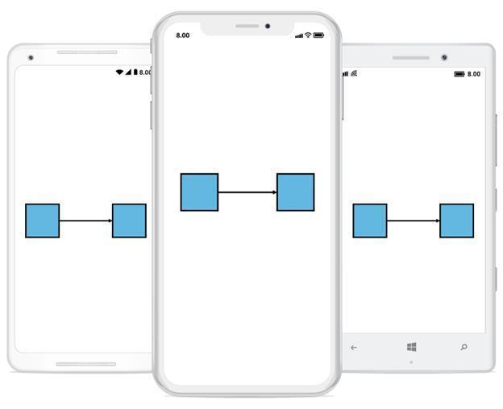
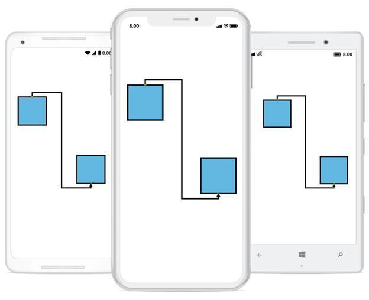
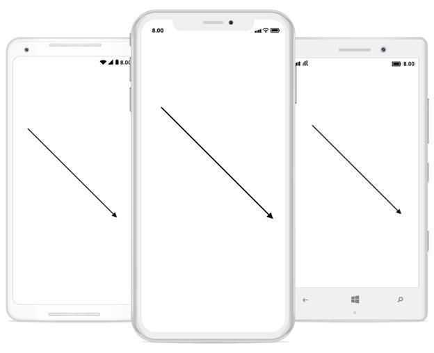
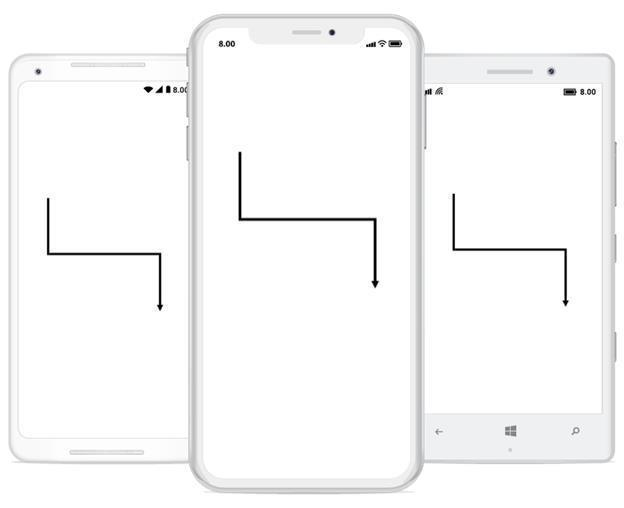
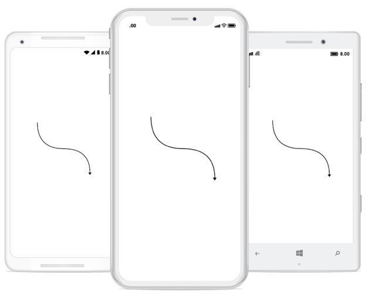
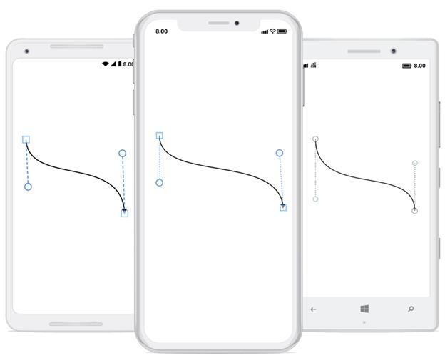
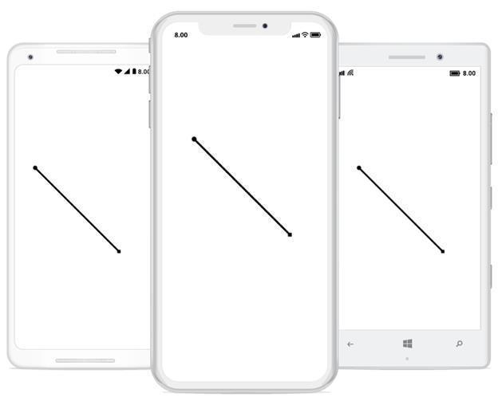
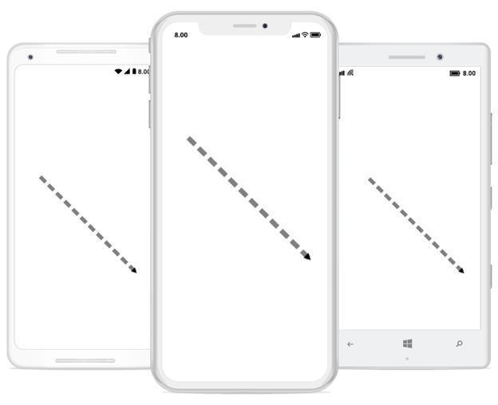

# Connector
Connectors are objects used to create link between two Points, Nodes or ports to represent the relationships between them.

## Create Connector
Connector can be created by defining the start and end points.


<!--creating connector instance-->
<control:SfDiagram.Connectors>
    <control:ConnectorCollection>
      <control:Connector SourcePoint="100,100" TargetPoint="300,300">
      </control:Connector>
    </control:ConnectorCollection>
 </control:SfDiagram.Connectors>


// creating connector instance
var connector1 = new Connector() 
{ 
SourcePoint=new Point(100,100),
TargetPoint=new Point(300,300) 
};
diagram.AddConnector(connector1);



## Connections with Nodes
The SourceNode and TargetNode properties allow to define the Nodes to be connected. The following code example illustrates how to connect two Nodes.


// creating node  instance
var node1 = new Node(100, 300, 100, 100);
diagram.AddNode(node1);
var node2 = new Node(300, 300, 100, 100);
diagram.AddNode(node2);
// creating connector instance and connecting nodes with it
var connector1 = new Connector()
{ 
SourceNode = node1,
TargetNode = node2
};
diagram.AddConnector(connector1);



## Connections with Ports
The SourcePort and TargetPort properties allow to create connections between some specific points of Source/Target Nodes. The following code examples illustrates how to use Port to Port connection.

## Using Port
The following code example illustrates how to create Port and connect using that ports.


// creating node instance
var node1 = new Node(100, 100, 100, 100);
//adding port instance to the node
node1.Ports.Add(new Port() { NodeOffsetX = 0.5, NodeOffsetY = 0 });
//adding node to the diagram 
diagram.AddNode(node1);
// creating node instance
var node2 = new Node(300, 300, 100, 100);
//adding port instance to the node
node2.Ports.Add(new Port() { NodeOffsetX = 0.5, NodeOffsetY = 1 });
//adding node to the diagram 
diagram.AddNode(node2);
//creating and connecting the ports with connector
var connector1 = new Connector() 
{ 
SourceNode = node1, 
TargetNode = node2,
SourcePort=node1.Ports[0], 
TargetPort=node2.Ports[0],
SegmentType = SegmentType.OrthoSegment
};
diagram.AddConnector(connector1);



## Segments
The path of the Connector is defined with a collection of segments.

## Straight
Straight segment allows to create a straight line. To create a straight line, you should specify the segment as StraightSegment.The following code example illustrates how to create a default straight segment.


<!--creating connector instance with define its segment type-->
<control:SfDiagram.Connectors>
    <control:ConnectorCollection>
      <control:Connector SourcePoint="100,100" TargetPoint="300,300" SegmentType="StraightSegment">
      </control:Connector>
    </control:ConnectorCollection>
 </control:SfDiagram.Connectors>


// creating connector instance with define its segment type
var connector1 = new Connector() 
{ 
SourcePoint=new Point(100,100),
TargetPoint=new Point(300,300), 
SegmentType= SegmentType.StraightSegment
};
diagram.AddConnector(connector1);



## Orthogonal
Orthogonal segments are used to create segments that are perpendicular to each other.
Set the segment as OrthogonalSegment to create the default orthogonal segment. The following code example illustrates how to create a default orthogonal segment.


<!--creating connector instance with define its segment type-->
<control:SfDiagram.Connectors>
    <control:ConnectorCollection>
      <control:Connector SourcePoint="100,100" TargetPoint="300,300" SegmentType="OrthoSegment">
      </control:Connector>
    </control:ConnectorCollection>
 </control:SfDiagram.Connectors>


// creating connector instance with define its segment type
var connector1 = new Connector() 
{ 
SourcePoint=new Point(100,100),
TargetPoint=new Point(300,300), 
SegmentType= SegmentType.OrthoSegment
};
diagram.AddConnector(connector1);



## Curve
Curve segments are used to create curve connector type. Set the segment as CurveSegment to create the default curve segment. The following code example illustrates how to create a default curve segment.


<!--creating connector instance with define its segment type-->
 <control:SfDiagram.Connectors>
    <control:ConnectorCollection>
      <control:Connector SourcePoint="100,100" TargetPoint="300,300" SegmentType="CurveSegment">
      </control:Connector>
    </control:ConnectorCollection>
 </control:SfDiagram.Connectors>


// creating connector instance with define its segment type
var connector1 = new Connector()
{
SourcePoint=new Point(100,100),
TargetPoint=new Point(300,300),
SegmentType= SegmentType.CurveSegment
};
diagram.AddConnector(connector1);



## Decorator
Start and end points of a Connector can be decorated with some customizable shapes like arrows, circles, diamond and square. You can decorate the connection end points with the SourceDecorator and TargetDecorator properties of Connector.
The SourceDecoratorStyle and TargetDecoratorStyle properties allows to define the shape of the decorators. The following code example illustrates how to create decorators of various shapes.


<!--creating connector instance with decorator-->
<control:SfDiagram.Connectors>
    <control:ConnectorCollection>
      <control:Connector SourcePoint="100,100" TargetPoint="300,300" SegmentType="StraightSegment"  TargetDecoratorType="Diamond" SourceDecoratorType="Circle">
     </control:Connector>
   </control:ConnectorCollection>
  </control:SfDiagram.Connectors>


//creating connector instance with decorator-->
var connector1 = new Connector()
{ 
SourcePoint = new Point(100,100),
TargetPoint = new Point(300,300),
SourceDecoratorType = DecoratorType.Circle,
TargetDecoratorType = DecoratorType.Diamond,
SegmentType= SegmentType.StraightSegment
};
diagram.AddConnector(connector1);



## Remove Connector
Connector can be removed or detached from connection in two ways.
1.Directing passing the connector as parameter to Remove connector method in diagram
The following code example illustrates how to remove a connector from connection


//creating connector instance
var connector1 = new Connector()
{ 
SourcePoint=new Point(100,100),
TargetPoint=new Point(300,300)
};
//adding connector to the diagram
diagram.AddConnector(connector1);
//removing connector from the diagram using object.
diagram.RemoveConnector(connector1);


2.By passing the index value of the connector to connector collection (using RemoveAt method)
The following code example illustrates how to remove a connector from connection


//creating connector instance
var connector1 = new Connector()
{
SourcePoint=new Point(100,100),
TargetPoint=new Point(300,300)
};
//adding connector to the diagram
diagram.AddConnector(connector1);
//removing connector from the diagram using index.
diagram.Connectors.RemoveAt(0);



## Appearance
StrokeThickness, Stroke and style of the LineConnector and Decorators can be customized with a set of defined properties.

## Connector Appearance
The following code example illustrates how to customize the Connector appearance.


<!--creating connector instance-->
<control:SfDiagram.Connectors>
    <control:ConnectorCollection>
      <control:Connector SourcePoint="100,100" TargetPoint="300,300">
        <!--defining connector styles-->
       <control:Connector.Style>
         <control:Style StrokeStyle="Dashed" StrokeWidth="4"/>
       </control:Connector.Style>
      </control:Connector>
    </control:ConnectorCollection>
  </control:SfDiagram.Connectors>


// creating connector instance
var connector1 = new Connector()
{
SourcePoint=new Point(100,100),
TargetPoint= new Point(300,300),
SegmentType= SegmentType.StraightSegment
};
//defining connector styles
connector1.Style = new Syncfusion.SfDiagram.XForms.Style()
{ 
StrokeBrush = new SolidBrush(Color.Gray),
StrokeStyle = StrokeStyle.Dashed,
StrokeWidth = 4
};
diagram.AddConnector(connector1);



## Decorator Appearance
The following code example illustrates how to customize the appearance of the decorator.


<!--creating connector instance with decorator-->
<control:SfDiagram.Connectors>
    <control:ConnectorCollection>
      <control:Connector SourcePoint="100,100" TargetPoint="300,300" TargetDecoratorType="Diamond" SourceDecoratorType="Circle">
       <!--defining decorator style for a connector-->
       <control:Connector.SourceDecoratorStyle>
         <control:DecoratorStyle  Fill="Green" Stroke="Grey" StrokeThickness="5" Width="12"/>
      </control:Connector.SourceDecoratorStyle>
      <!--defining decorator style for a connector-->
     <control:Connector.TargetDecoratorStyle>
         <control:DecoratorStyle Fill="Yellow" Stroke="Brown" StrokeThickness="4" Width="10"/>
       </control:Connector.TargetDecoratorStyle>
      </control:Connector>
    </control:ConnectorCollection>
  </control:SfDiagram.Connectors>


// creating connector instance with decorator
var connector1 = new Connector()
{
SourcePoint=new Point(100,100),
TargetPoint= new Point(300,300),
SegmentType= SegmentType.StraightSegment,
SourceDecoratorType = DecoratorType.Circle,
TargetDecoratorType = DecoratorType.Diamond
};
//defining decorator style for a connector
connector1.TargetDecoratorStyle = new DecoratorStyle()
{ 
Fill = Color.Yellow,
Stroke = Color.Brown,
StrokeThickness = 4,
Width = 12
};
// defining decorator style for a connector
connector1.SourceDecoratorStyle = new DecoratorStyle()
{
Fill = Color.Green,
Stroke = Color.Gray,
StrokeThickness = 5,
Width = 12
};
diagram.AddConnector(connector1);



