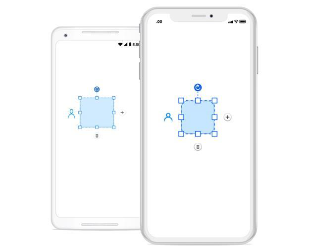
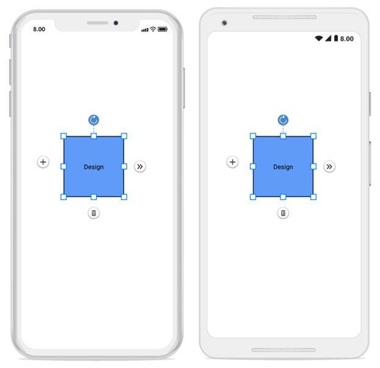

# User handles

User handles are customizable handles which can be used to perform custom actions and also default clipboard actions. You can able to customize the user handles using:
* SfGraphicPath
* Template
The following code illustrates how to add custom user handle in diagram:


//Add graphic path into an user handle collection
SfGraphics graph = new SfGraphics();
Pen stroke = new Pen();
stroke.Brush = new SolidBrush(Color.Transparent);
stroke.StrokeWidth = 3;
stroke.StrokeBrush = new SolidBrush(Color.FromRgb(24, 161, 237));
graph.DrawEllipse(stroke, new Rectangle(10, 0, 20, 20));
graph.DrawArc(stroke, 0, 20, 40, 40, 180, 180);

//Add template into an user handles collection
var deleteTemplate = new DataTemplate(() =>
{
  var root = new StackLayout()
  {
   Orientation = StackOrientation.Horizontal,
   BackgroundColor = Color.Transparent
  };
Image image = new Image();
image.WidthRequest = 25;
image.HeightRequest = 25;
if (Device.RuntimePlatform == Device.iOS)
image.Source = "Images/delete.png";
else 
image.Source = "delete.png";
root.Children.Add(image);
return root;
});

var plusTemplate = new DataTemplate(() =>
{
  var root = new StackLayout()
  {
   Orientation = StackOrientation.Horizontal,
   BackgroundColor = Color.Transparent
  };
Image image = new Image();
image.WidthRequest = 25;
image.HeightRequest = 25;
if (Device.RuntimePlatform == Device.iOS)
image.Source = "Images/plus.png";
else 
image.Source = "plus.png";
root.Children.Add(image);
return root;
});

//Add user handle into an user handles collection 
diagram.UserHandles.Add(new Syncfusion.SfDiagram.XForms.UserHandle("delete", UserHandlePosition.Bottom, deleteTemplate) { });
diagram.UserHandles.Add(new Syncfusion.SfDiagram.XForms.UserHandle("graphic path", UserHandlePosition.Left, graph) { });
diagram.UserHandles.Add(new Syncfusion.SfDiagram.XForms.UserHandle("plus", UserHandlePosition.Right, plusTemplate) { });




## User handles clicked event
The following code illustrate how to define use handles clicked event and its action.


//User handles clicked event

diagram.UserHandleClicked+=HandleUserHandleClickedEventHandler;

void HandleUserHandleClickedEventHandler(object sender, UserHandleClickedEventArgs args)
{
     //delete user handle click event action
     if (args.Item.Name == "delete")
     {
         diagram.Delete();
     }
}




## Customizing user handle position
User handle position can be moved or adjusted from its default position. The following code shows how to adjust the position using the “MoveBy” method.



     //Define the user handle 

            UserHandleCollection userHandles = new UserHandleCollection();
            UserHandle left = new UserHandle("Left", UserHandlePosition.Left, plusTemplate) { Visible = true };
     //Customize the user handle position using move by method
            left.MoveBy(-10, -10);
            userHandles.Add(left);
            userHandles.Add(new UserHandle("Right", UserHandlePosition.Right, m_expandTemplate) { Visible = true });
            userHandles.Add(new UserHandle("Delete", UserHandlePosition.Bottom, deleteTemplate) { Visible = true });
            diagram.UserHandles = userHandles;



N> User handle support not provided in Xamarin.Forms.UWP
