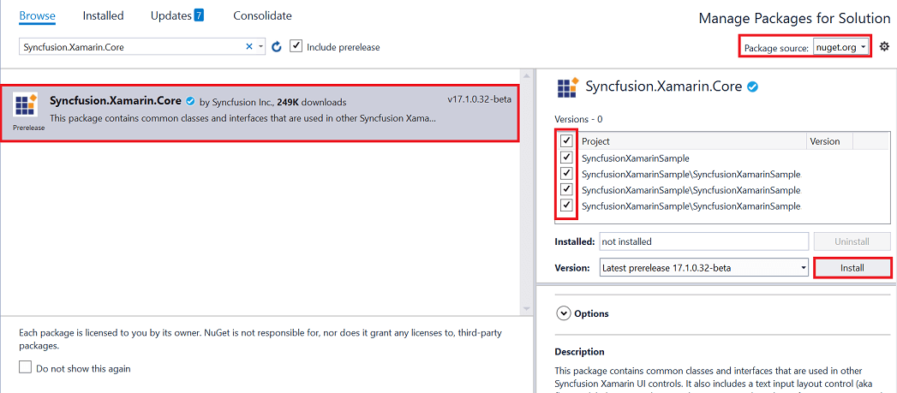

# Getting Started

This section explains the steps required to work with the gradient view control for Xamarin.Forms.

## Adding SfGradientView reference

You can add SfGradientView reference using one of the following methods:

**Method 1: Adding SfGradientView reference from nuget.org**

Syncfusion Xamarin components are available in [nuget.org](https://www.nuget.org/). To add SfGradientView to your project, open the NuGet package manager in Visual Studio, search for [Syncfusion.Xamarin.Core](https://www.nuget.org/packages/Syncfusion.Xamarin.Core), and then install it.

N> Install the same version of Syncfusion.Core.XForms NuGet in all the projects.

**Method 2: Adding SfGradientView reference from toolbox**

Syncfusion also provides Xamarin Toolbox. Using this toolbox, you can drag the SfGradientView control to the XAML page. It will automatically install the required NuGet packages and add the namespace to the page. To install Syncfusion Xamarin Toolbox, refer to [Toolbox](https://help.syncfusion.com/xamarin/utility#toolbox).

**Method 3: Adding SfGradientView assemblies manually from the installed location**

If you prefer to manually reference the assemblies instead referencing from NuGet, add the following assemblies in respective projects.

Location: {Installed location}/{version}/Xamarin/lib

<table>
<tr>
<td>PCL</td>
<td>Syncfusion.Core.XForms.dll Syncfusion.Licensing.dll </td>
</tr>
<tr>
<td>Android</td>
<td>Syncfusion.Core.XForms.dll Syncfusion.Core.XForms.Android.dll Syncfusion.Licensing.dll </td>
</tr>
<tr>
<td>iOS</td>
<td>Syncfusion.Core.XForms.dll Syncfusion.Core.XForms.iOS.dll Syncfusion.Licensing.dll </td>
</tr>
<tr>
<td>UWP</td>
<td>Syncfusion.Core.XForms.dll Syncfusion.Core.XForms.UWP.dll Syncfusion.Licensing.dll </td>
</tr>
</table>

N> To know more about obtaining our components, refer to these links for [Mac](https://help.syncfusion.com/xamarin/introduction/download-and-installation/mac/) and [Windows](https://help.syncfusion.com/xamarin/introduction/download-and-installation/windows/).

I> Starting with v17.1.0.x, if you reference Syncfusion assemblies from the trial setup or from the NuGet feed, you also have to include a license key in your projects. Please refer to [Syncfusion license key](https://help.syncfusion.com/common/essential-studio/licensing/license-key/) to know about registering Syncfusion license key in your Xamarin application to use our components.

## Launching an application on each platform with SfGradientView.

To use the SfGradientView control inside an application, each platform requires some additional configurations. The configurations vary from platform to platform and is discussed in the following sections:

N> If you are adding the references from toolbox, this step is not needed.

### iOS

To launch the SfGradientView in iOS, call the `SfGradientViewRenderer.Init()` in the `FinishedLaunching` overridden method of the AppDelegate class after the Xamarin.Forms Framework has been initialized and before the LoadApplication is called, as demonstrated in the following code example.


public override bool FinishedLaunching(UIApplication app, NSDictionary options)
{
    …
    global::Xamarin.Forms.Forms.Init ();
    Syncfusion.XForms.iOS.Graphics.SfGradientViewRenderer.Init();
    LoadApplication (new App ());
    …
}
 

### Universal Windows Platform (UWP)

You need to initialize the gradient view assemblies in App.xaml.cs in UWP project as demonstrated in the following code samples. This is required to deploy the application with gradient view in Release mode in UWP platform.


// In App.xaml.cs

protected override void OnLaunched(LaunchActivatedEventArgs e)
    {
        …
    	    rootFrame.NavigationFailed += OnNavigationFailed;
    
        // Add `using System.Reflection;`
        List<Assembly> assembliesToInclude = new List<Assembly>();
    
        // Now, add all the assemblies your app uses                 
        assembliesToInclude.Add(typeof(Syncfusion.XForms.UWP.Graphics.SfGradientViewRenderer).GetTypeInfo().Assembly);
		
        // Replaces Xamarin.Forms.Forms.Init(e);        
        Xamarin.Forms.Forms.Init(e, assembliesToInclude);	
        …     
    }



### Android

The Android platform does not require any additional configuration to render the gradient view.

## Adding Gradient View 

The `SfGradientView` control is configured entirely in C# code or in XAML markup. The `SfGradientView` supports linear gradient and radial gradient. Each gradient is a collection of gradient stops which used to set colors with different offsets. The following steps explain how to create a `SfGradientView` and configure its elements.

### Adding namespace for referred assemblies

 

 

xmlns:gradient ="clr-namespace:Syncfusion.XForms.Graphics;assembly=Syncfusion.Core.XForms" 



 

using Syncfusion.XForms.Graphics; 





#### Adding Linear Gradient Brush

`SfLinearGradientBrush` is used to create linear gradient effects. 




<Grid>    
    <gradient:SfGradientView>
        <gradient:SfGradientView.BackgroundBrush>           
            <gradient:SfLinearGradientBrush>                
                <gradient:SfLinearGradientBrush.GradientStops>
                    <gradient:SfGradientStop Color="#2d265b" Offset="0.0" />
                    <gradient:SfGradientStop Color="#b8495c" Offset="1.0" />
                </gradient:SfLinearGradientBrush.GradientStops>                
            </gradient:SfLinearGradientBrush>            
        </gradient:SfGradientView.BackgroundBrush>
    </gradient:SfGradientView>  
</Grid>




using Xamarin.Forms;
using Syncfusion.XForms.Graphics;
using System;

namespace GradientViewGettingStarted
{
    public partial class MainPage : ContentPage
    { 
        Public MainPage()
        {
            InitializeComponent();

            Grid grid = new Grid();
            SfGradientView gradientView = new SfGradientView();
            SfLinearGradientBrush linearGradientBrush = new SfLinearGradientBrush();
            linearGradientBrush.GradientStops = new GradientStopCollection()
            {
                new SfGradientStop(){Color = Color.FromHex("#2d265b"), Offset=0.0},
                new SfGradientStop(){Color = Color.FromHex("#b8495c"), Offset=1.0},
            };
            gradientView.BackgroundBrush = linearGradientBrush;
            grid.Children.Add(gradientView);
            this.Content = grid;
        }
    }
}
 



#### Adding Radial Gradient Brush

`SfRadialGradientBrush` is used to create radial gradient effects.




<Grid>    
    <gradient:SfGradientView>
        <gradient:SfGradientView.BackgroundBrush>           
            <gradient:SfRadialGradientBrush>                
                <gradient:SfRadialGradientBrush.GradientStops>
                    <gradient:SfGradientStop Color="Red" Offset="0.0" />
                    <gradient:SfGradientStop Color="Yellow" Offset="0.5" />
                    <gradient:SfGradientStop Color="LightGreen" Offset="1.0" />
                </gradient:SfRadialGradientBrush.GradientStops>                
            </gradient:SfRadialGradientBrush>            
        </gradient:SfGradientView.BackgroundBrush>
    </gradient:SfGradientView>  
</Grid>




using Xamarin.Forms;
using Syncfusion.XForms.Graphics;
using System;

namespace GradientViewGettingStarted
{
    public partial class MainPage : ContentPage
    { 
        Public MainPage()
        {
            InitializeComponent();

            Grid grid = new Grid();
            SfGradientView gradientView = new SfGradientView();
            SfRadialGradientBrush radialGradientBrush = new SfRadialGradientBrush();
            radialGradientBrush.GradientStops = new GradientStopCollection()
            {
                new SfGradientStop(){Color = Color.Red, Offset=0.0},
                new SfGradientStop(){Color = Color.Yellow, Offset=0.5},
                new SfGradientStop(){Color = Color.LightGreen, Offset=1.0},
            };
            gradientView.BackgroundBrush = radialGradientBrush;
            grid.Children.Add(gradientView);
            this.Content = grid;
        }
    }
}

 



You can find the complete getting started sample from [this](https://github.com/SyncfusionExamples/GradientView_GettingStarted_Xamarin.Forms) link.