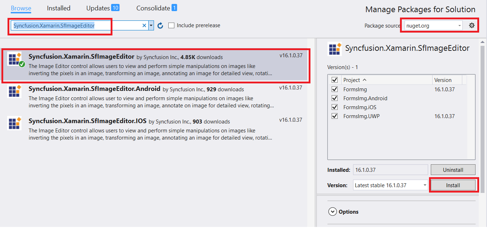

# Getting Started

This section explains the steps required to load an image to the image editor control.

## Adding image editor reference

Syncfusion components for Xamarin.Forms are available in [nuget.org](https://www.nuget.org/). To add image editor to your project, open the NuGet package manager in Visual Studio, search for [Syncfusion.Xamarin.SfImageEditor](https://www.nuget.org/packages/Syncfusion.Xamarin.SfImageEditor/), and then install it. 

To know more about obtaining Syncfusion components, refer to these links: [Mac](https://help.syncfusion.com/xamarin/introduction/download-and-installation/mac) and [Windows](https://help.syncfusion.com/xamarin/introduction/download-and-installation/windows). If you prefer to manually reference the assemblies instead of NuGet, refer to this [link](https://help.syncfusion.com/xamarin/introduction/control-dependencies#sfimageeditor) to know about the dependent assemblies for image editor. 

N> Install the same version of the image editor in all the projects.

I> Starting with v16.2.0.x, if you reference Syncfusion assemblies from trial setup or from the NuGet feed, you also have to include a license key in your projects. Please refer to this [link](https://help.syncfusion.com/common/essential-studio/licensing/license-key) to know about registering Syncfusion license key in your Xamarin application to use our components.

## Launching the application in iOS

To launch the image editor in iOS, call the `SfImageEditorRenderer.Init()` method in the FinishedLaunching overridden method of the AppDelegate class after the Xamarin.Forms framework has been initialized and before the LoadApplication method is called as shown in the following code sample.

 

 public override bool FinishedLaunching(UIApplication app, NSDictionary options) 

 { 
     … 

     global::Xamarin.Forms.Forms.Init();

     Syncfusion.SfImageEditor.XForms.iOS.SfImageEditorRenderer.Init();

     LoadApplication(new App()); 
     …
 }



## Initializing image editor

1. Import SfImageEditor control namespace as `xmlns:syncfusion="clr-namespace:Syncfusion.SfImageEditor.XForms;assembly=Syncfusion.SfImageEditor.XForms` in XAML page.

2. Set the SfImageEditor control as content to the ContentPage.





            <?xml version="1.0" encoding="UTF-8"?>
            <ContentPage xmlns="http://xamarin.com/schemas/2014/forms"
                xmlns:x="http://schemas.microsoft.com/winfx/2009/xaml" x:Class="ImageEditor_GettingStarted.ImageEditor_GettingStartedPage"
                xmlns:imageeditor="clr-namespace:Syncfusion.SfImageEditor.XForms;assembly=Syncfusion.SfImageEditor.XForms">
                <ContentPage.Content>
                    <imageeditor:SfImageEditor />
                 </ContentPage.Content>
            </ContentPage> 





    using Syncfusion.SfImageEditor.XForms;
    using Xamarin.Forms;

    public class App : Application
        {
            public App()
            {
                MainPage = new ImageEditor_GettingStartedPage();
            }

        }
    Public class ImageEditor_GettingStartedPage : ContentPage
    {
        public ImageEditor_GettingStartedPage()
        {
            InitializeComponent();
            SfImageEditor editor = new SfImageEditor();
            this.Content = editor;
        }
    }



* If image is not set to the `Source` property, the appearance of the image will be shown as white canvas. You can perform editing action using built-in toolbar.

## Loading an image to image editor

Refer to the following steps to add an image to the pcl project:

1. Right-click your pcl project. 
2. Select **Add Files** submenu from **Add** menu, and a dialog box will appear.
3. Choose and import the desired image to the pcl project.
4. After the image has been imported, ensure whether the image Build Action has been set to `EmbeddedResource`.

N> Image formats such as JPEG and PNG can be loaded to the image editor.

The following code shows adding an image to the image editor control with the format as "JPEG" and name as "image".





    <?xml version="1.0" encoding="UTF-8"?>
      <ContentPage xmlns="http://xamarin.com/schemas/2014/forms"
            xmlns:x="http://schemas.microsoft.com/winfx/2009/xaml" x:Class="ImageEditor_GettingStarted.ImageEditor_GettingStartedPage"
            xmlns:imageeditor="clr-namespace:Syncfusion.SfImageEditor.XForms;assembly=Syncfusion.SfImageEditor.XForms">
            <ContentPage.Content>
                <imageeditor:SfImageEditor Source="{Binding Image}" />
             </ContentPage.Content>
      </ContentPage> 





    using Syncfusion.SfImageEditor.XForms;
    using Xamarin.Forms;

    public class App : Application
        {
            public App()
            {
                MainPage = new ImageEditor_GettingStartedPage();
            }

        }
    Public class ImageEditor_GettingStartedPage : ContentPage
    {
        public ImageEditor_GettingStartedPage()
        {
            InitializeComponent();
            BindingContext = new ImageModel();
            SfImageEditor editor = new SfImageEditor();
            this.Content = editor;
        }
    }

    class ImageModel
    {
        public ImageSource Image { get; set; }

        public ImageModel()
        {
            Image = ImageSource.FromResource("ImageEditor_GettingStarted.Image.jpg");
        }
    }




N> Refer to this [link](https://docs.microsoft.com/en-us/xamarin/xamarin-forms/user-interface/images?tabs=vswin#displaying-images) to know more about loading an image to the image editor source property in different formats.

* The following screenshot depicts loading an image to the image editor. You can edit the image using built-in toolbar.

You can find the complete getting started sample from this [link.](http://www.syncfusion.com/downloads/support/directtrac/general/ze/IESample-621789615)