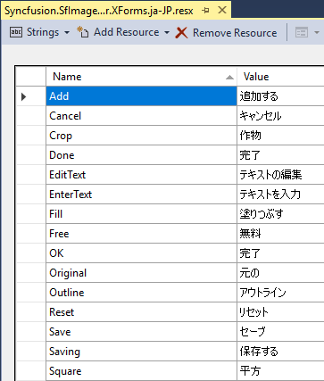
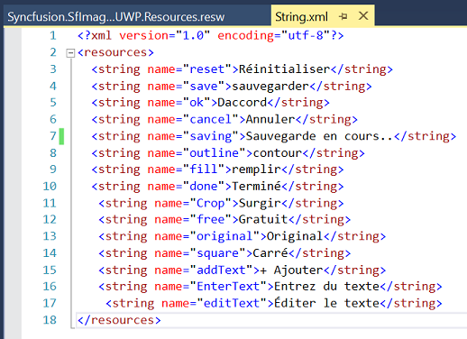
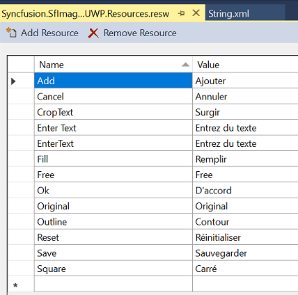
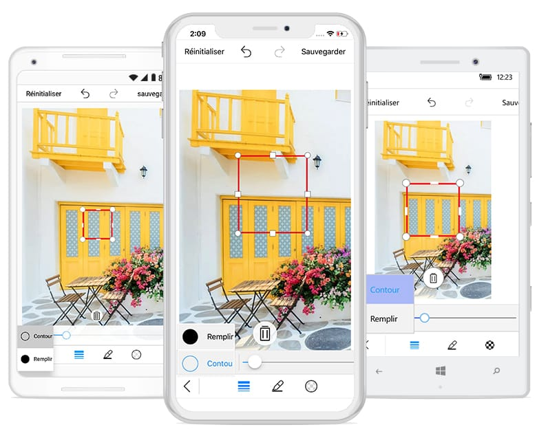

# Localization

The image editor control provides support for localization.You can localize ImageEditor contents by adding equivalent localized string.

## Change default control language

Based on the resource strings in the project the contents are localized accordingly.

By default,ImageEditor control is available in English.

We can Localize ImageEditor contents in two ways,

* Using Resx file from PCL

* From Platform Specific Projects

## Using Resx file from PCL

You can localize the text from PCL by adding equivalent localized string in the resource file.

Add the required resx files under the Resources folder. 

For Japanese, filename should be Syncfusion.SfImageEditor.XForms.ja-JP.resx

Now set Build Action -> EmbeddedResource.

CurrentCulture must be set in the platform projects.

Converting  the platform specific format to a .NET format and set it to Thread.CurrentThread.CurrentUICulture.

We will use the value set to this static property from our source to read the values in PCL project’s Syncfusion.SfImageEditor.XForms.ja-JP.resx files.





    public void SetLocale(CultureInfo culture)
    {
        Thread.CurrentThread.CurrentCulture = culture;
        Thread.CurrentThread.CurrentUICulture = culture;
    }
    
    public CultureInfo GetCurrentCultureInfo()
    {
        var netLanguage = "en";
        var androidLocale = Java.Util.Locale.Default;
        netLanguage =                                     
        AndroidToLanguage(androidLocale.ToString().Replace("_", "-"));
            CultureInfo culture = null;
            try
            {
                culture = new CultureInfo(netLanguage);
            }
            catch
            {
                try
                {
                    var fallback = ToFallbackLanguage(new                
                                   PlatformCulture(netLanguage));
                    culture = new CultureInfo(fallback); 
                }
                catch
                {
                    culture = new CultureInfo("en");
                }
            }
        return culture;
    }
 



here Japanese language is converted to CultureInfo equivalent





          var netLanguage = platCulture.LanguageCode; 

          case "ja":
                netLanguage = "ja-JP"; //equivalent to Japanese for this app
                break;

 



Change the language preference in device.

In below screenshot we have localized the text to Japanese language.

## From Platform Specific Projects

You can localize the text from different platforms by adding equivalent localized string in the resource file.For that you need to configure it for each platform separately.

* Localizing the text in Android renderer.

* Localizing the text in iOS renderer.

* Localizing the text in UWP renderer.

### Android

You can localize the text available in the control by adding equivalent localized string in the resource file.

Create String.xml in resource file in Android

Location- ProjectName.Android/Resources/values/Strings.Xml

In below screenshot we have localized the text  to French language.

### iOS 

You can localize custom text available in the control by adding equivalent localized string in the resource file.

Create Localizable.strings in resource file in iOS.

Location- ProjectName.iOS/Resources/Localizable.strings

In below screenshot we have localized the text to French language.

### UWP 

You can localize custom text available in the control by adding equivalent localized string in the resource file.

Create Syncfusion.SfImageEditor.UWP.Resources file in UWP.

Location- ProjectName.UWP/Resources/Syncfusion.SfImageEditor.UWP.Resources 

In below screenshot we have localized the text to French language.

Please find the screenshot in which we have localized the text in ImageEditor to French language.

 

