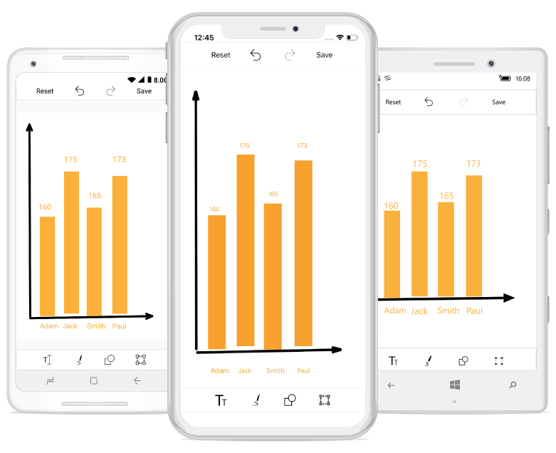

# Serialization And Deserialization
 ImageEditor provides support to serialize and deserialize the shapes(Circle, Arrow, Rectangle), free hand drawing, Text and Toolbar settings. Save the current state of the Image Editor and Load it back when its needed.

## Serialization
  To serialize the shapes  by calling SaveEdits() method. Serialized object will be return in the form of JSON stream.




    
	SfImageEditor editor;
        public MainPage()
        {
            InitializeComponent();
            Grid grid = new Grid();
            editor = new SfImageEditor();
            Button saveEdits = new Button();
            saveEdits.Text = "Serialize";
            saveEdits.Clicked += SaveEdits_Clicked;
            grid.RowDefinitions.Add(new RowDefinition() { Height = 100 });
            grid.RowDefinitions.Add(new RowDefinition() { Height = GridLength.Star });
            grid.Children.Add(saveEdits, 0, 0);
            grid.Children.Add(editor, 0, 1);
            this.Content = grid;

        }
        void SaveEdits_Clicked(object sender, EventArgs e)
        {
            Stream stream = editor.SaveEdits();
        }
    
	




 you can save stream into .txt format file.if you saved as .txt format file to deserialize the shapes then set as Embedded resource in project.
  
   Sample text format file like this
  
  [Chart.txt](http://www.syncfusion.com/downloads/support/directtrac/general/txt/Chart677841499.txt)
       
## Deserialization
   To deserialize serialized objects by calling LoadEdits(stream) method. 




       
	  SfImageEditor editor;
        public MainPage()
        {
            InitializeComponent();
            Grid grid = new Grid();
            editor = new SfImageEditor();
            Button LoadEdits = new Button();
            LoadEdits.Text = "Deserialize";
            LoadEdits.Clicked += LoadEdits_Clicked;
            grid.RowDefinitions.Add(new RowDefinition() { Height = 100 });
            grid.RowDefinitions.Add(new RowDefinition() { Height = GridLength.Star });
            grid.Children.Add(LoadEdits, 0, 0);
            grid.Children.Add(editor, 0, 1);
            this.Content = grid;

        }
        void LoadEdits_Clicked(object sender, EventArgs e)
        {
            var assembly = typeof(App).GetTypeInfo().Assembly;
            Stream stream = new MemoryStream();
            var fileName = "namespace_name.Chart.txt";
            stream = assembly.GetManifestResourceStream(fileName);
            if (stream != null)
                editor.LoadEdits(stream);
        }





