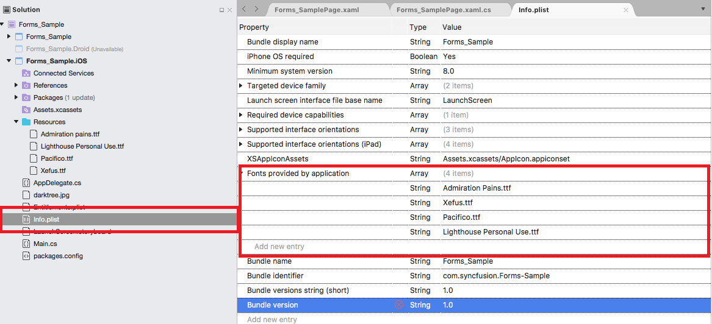

# Text

To add the desired text elements over the image, use the following two ways:

* From Toolbar
* Using Code

### From Toolbar

To add text from the toolbar, click the Text icon in the toolbar. When the Text is tapped, a pop-up window will appear. To add the text over the image, type the desired text, and click OK. To close the pop-up window, click CANCEL button. By dragging, the text can be moved to the desired place, and Text can be resized with the help of handle.

#### Change Color of the selected Text

To change the color of the selected text, select the desired text, and click the color buttons available in the sub menu.

### Using Code

You can also add the desired text elements over the image programmatically. The `AddText` method in the SfImageEditor control is used to add the text based on the string value and `TextSettings`.

#### TextSettings

TextSettings is defined to set the values for `Color` and `FontSize`.





    editor.AddText("New Text", new TextSettings(){Color = Color.Green, FontSize = 16d});





# Custom Font Family

We can able to change the fontfamily of selected text from default fontfamily into custom fontfamily.

   * From Toolbar
   * Using Code

### From Toolbar

After adding text we can able to change the font family of the selected text from toolbar, Select the desired text and click the font family buttons available in the sub menu.
   
Now the font family of the selected text has been changed.

### Using Code

Download the custom fonts file in ttf file format and add these fonts into required folder in particular project file.

#### Changes in Forms Android Project

Add the custom fonts into Assets folder in sample.Droid project. Refer the below screen shot.

6
   
Right click the font file and open properties, in that Change the "Build Action" property of every font file as "AndroidAsset" and "Copy to output directory" to "Copy Always".
    

    
Finally use the below code snippet to apply custom fontfamily for forms Android. In Android you just give the font file name.





    editor.AddText("New Text", new TextSettings(){FontFamily="Xefus"});





#### Changes in Forms Universal Windows Platform Project

Add the custom fonts into Assets folder in sample.UWP project.
    

Right click the font file and open properties, in that change the  "Build Action" property of every font file as "Content" and "Copy to output directory" to "Copy Always".
    

Finally use the below code snippet to apply custom fontfamily in forms UWP. While you give the path, You should mention font file name with .ttf extension and "#" symbol
with fontfamily name.





    editor.AddText("New Text", new TextSettings(){FontFamily="Assets/Xefus.ttf#Xefus"});





#### Changes in Forms iOS Project

Add the custom fonts into Resource file in sample.iOS project.

    
Change the "Build Action" property of every font file as "BundleResource" and "Copy to output directory" to "Copy Always".

    
Open the "info.plist" file and select "Source" at the bottom of the file.
After open the source file you should need to add "Fonts provided by application" into the source file and add the downloaded custom fonts name with .ttf extension.

Finally follow the below code snippet to apply custom fontfamily in Forms iOS.





    editor.AddText("New Text", new TextSettings(){FontFamily="Xefus"});





