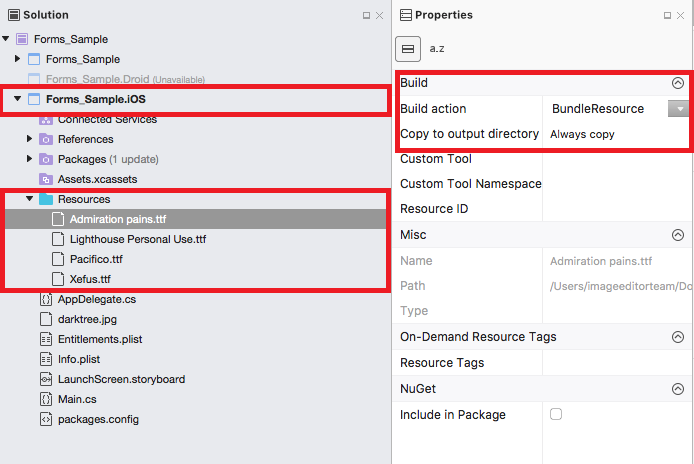

# Text

To add the desired text elements over the image, use the following two ways:

* From Toolbar
* Using Code

### From Toolbar

To add text from the toolbar, click the Text icon in the toolbar. When the Text is tapped, a pop-up window will appear. To add the text over the image, type the desired text, and click OK. To close the pop-up window, click CANCEL button. By dragging, the text can be moved to the desired place, and Text can be resized with the help of handle.

#### Change Color of the selected Text

To change the color of the selected text, select the desired text, and click the color buttons available in the sub menu.

### Using Code

You can also add the desired text elements over the image programmatically. The `AddText` method in the SfImageEditor control is used to add the text based on the string value and `TextSettings`.

#### TextSettings

TextSettings is defined to set the values for `Color`, `FontSize` and `FontFamily`. By default there are six types of font family has been given in toolbar that are 
`Arial`, `Noteworthy`, `Marker Felt`, `SignPainter`,`Bradley Hand`, `Snell Round hand`.





    editor.AddText("New Text", new TextSettings(){Color = Color.Black, FontSize = 16d, FontFamily="Arial"});





#### Bounds

`Bounds` property allows you to set frame for the newly added `Text` and you can position the text wherever you want on the image. The value of the text frame should be in percentage(maximum - 100 & minimum - 0).



  edit.AddText("New Text", new TextSettings() { Bounds = new Rectangle(20, 20, 35, 35) });



# Custom Font Family

Using a font other than the built-in typefaces requires some platform-specific coding. The steps required for each platform are outlined below.
Download the custom fonts file in ttf file format and add these fonts into required folder in particular project file.

#### Android

Add the custom fonts into Assets folder in sample.Droid project.
   
Right click the font file and open properties, in that Change the "Build Action" property of every font file as "AndroidAsset" and "Copy to output directory" to "Copy Always".
    

    
#### iOS

Add the custom fonts into Resource file in sample.iOS project.
    
Change the "Build Action" property of every font file as "BundleResource" and "Copy to output directory" to "Copy Always".

    
Open the "info.plist" file and select "Source" at the bottom of the file.
After open the source file you should need to add "Fonts provided by application" into the source file and add the downloaded custom fonts name with .ttf extension.

#### UWP

Add the custom fonts into Assets folder in sample.UWP project.

Right click the font file and open properties, in that change the  "Build Action" property of every font file as "Content" and "Copy to output directory" to "Copy Always".
    

Use the below code snippet to apply custom font family. In forms Android and iOS you just give the font family name, But in UWP You should mention font file name with .ttf extension and "#" symbol
with font family name.





    if((Device.OS == TargetPlatform.Android)||(Device.OS == TargetPlatform.iOS))
        editor.AddText("New Text", new TextSettings(){FontFamily="Pacifico"});
    else
        editor.AddText("New Text", new TextSettings(){FontFamily="Assets/Pacifico.ttf#Pacifico"});




