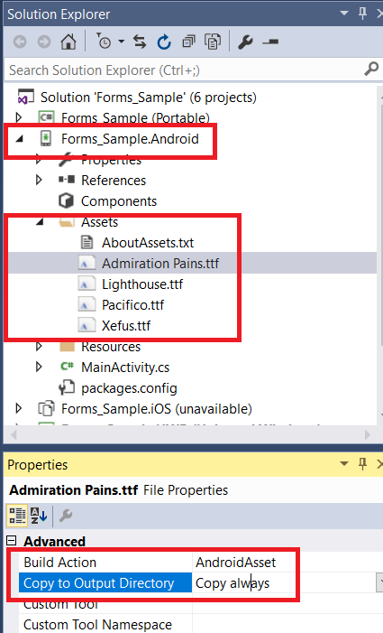
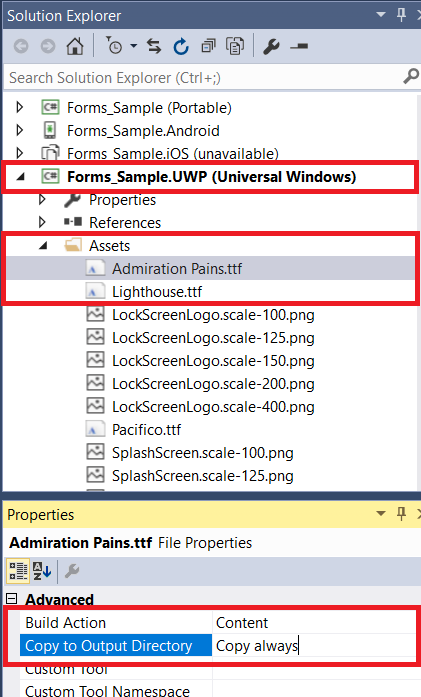

## Text

You can annotate desired text elements over an image by using `AddText` method with customization options. 



    editor.AddText("New Text");



## Customize text with TextSettings

You can customize the text appearance with the help of `TextSettings` properties.

TextSettings consist of the following properties,

 [`Color`](https://help.syncfusion.com/cr/cref_files/xamarin/Syncfusion.SfImageEditor.XForms~Syncfusion.SfImageEditor.XForms.TextSettings~Color.html) - It helps to define the color of the desired text.
 
 [`FontSize`](https://help.syncfusion.com/cr/cref_files/xamarin/Syncfusion.SfImageEditor.XForms~Syncfusion.SfImageEditor.XForms.TextSettings~FontSize.html) - You can specify the desired font size of the text under text settings.

 [`FontFamily`](https://help.syncfusion.com/cr/cref_files/xamarin/Syncfusion.SfImageEditor.XForms~Syncfusion.SfImageEditor.XForms.TextSettings~FontFamily.html) - By default there are six types of font family available in toolbar such as,
                   `Arial`, `Noteworthy`, `Marker Felt`, `SignPainter`,`Bradley Hand`, `Snell Round hand`.
 
 [`Bounds`](https://help.syncfusion.com/cr/cref_files/xamarin/Syncfusion.SfImageEditor.XForms~Syncfusion.SfImageEditor.XForms.TextSettings~Bounds.html) - This property allows you to set frame for the newly added `Text` and you can position the text wherever you want on the image. The value of the text frame should be in percentage(maximum - 100 & minimum - 0).
 
 [`Opacity`](https://help.syncfusion.com/cr/cref_files/xamarin/Syncfusion.SfImageEditor.XForms~Syncfusion.SfImageEditor.XForms.TextSettings~Opacity.html) - You can change the opacity of text.





    editor.AddText("New Text", new TextSettings(){Color = Color.Black, FontSize = 16d, FontFamily="Arial", Bounds = new Rectangle(20, 20, 35, 35), Opacity=0.5f});





## Custom Font Family

Using a font other than the built-in typefaces requires some platform-specific coding. The steps required for each platform are outlined below.
Download the custom fonts file in ttf file format and add these fonts into required folder in particular project file.

### Android

Add the custom fonts into Assets folder in sample.Droid project.
   
Right click the font file and open properties, in that Change the "Build Action" property of every font file as `AndroidAsset` and "Copy to output directory" to `Copy Always`.
    

    
### iOS

Add the custom fonts into Resource file in sample.iOS project.
    
Change the "Build Action" property of every font file as `BundleResource` and "Copy to output directory" to `Copy Always`.

    
Open the `info.plist` file and select "Source" at the bottom of the file.
After open the source file you should need to add "Fonts provided by application" into the source file and add the downloaded custom fonts name with .ttf extension.

### UWP

Add the custom fonts into Assets folder in sample.UWP project.

Right click the font file and open properties, in that change the  "Build Action" property of every font file as `Content` and "Copy to output directory" to `Copy Always`.
    

Use the below code snippet to apply custom font family. In forms Android and iOS you just give the font family name, But in UWP You should mention font file name with .ttf extension and "#" symbol
with font family name.





    if((Device.OS == TargetPlatform.Android)||(Device.OS == TargetPlatform.iOS))
        editor.AddText("New Text", new TextSettings(){FontFamily="Pacifico"});
    else
        editor.AddText("New Text", new TextSettings(){FontFamily="Assets/Pacifico.ttf#Pacifico"});




## Multiline text and text alignment

### Multiline text
You can annotate multiple line text over an image with the help of text preview window.

### Text alignment
`TextAlignment` is an enum type and text can be aligned with the help of text alignment enum values such as left, right and center. 

N> The default text alignment is `Left` and text alignment is not applicable for single line text.



    editor.AddText("Hello\nGood morning\nHave a nice day", new TextSettings() {TextAlignment = TextAlignment.Right });



