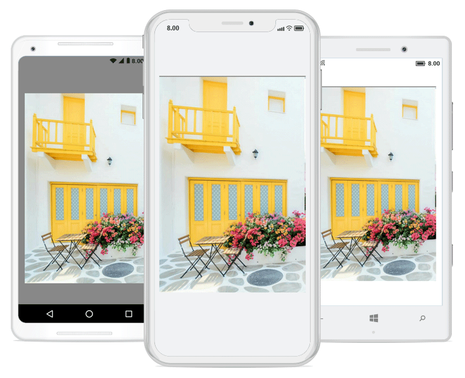

# ToolbarCustomization

You can customize color palette, toolbar visibility and appearance of each toolbar item.

## Customize toolbar items

SfImageEditor control supports to customize and configure the appearance of toolbar menu. You can customize image editor toolbar by adding respective FooterToolbarItem and HeaderToolbarItem 

#### ToolbarItem

You can customize each toolbar item with the help of `Text` and `Icon` properties. ImageEditor Toolbar menu contains set of header and footer menu items which helps to perform image editor actions
and this can be categorized into the following types,

1.HeaderToolbarItem
2.FooterToolbarItem
3.SubItems

 
### Adding HeaderToolbarItem

`HeaderToolbarItem` will be arranged on top of the image editor and you can customize header toolbar item with the help of Icon and Text as like below,



            editor.ToolbarSettings.ToolbarItems.Add(new HeaderToolbarItem() { Icon = ImageSource.FromResource("ImageEditor.share.png"), Text="Share" });



### Adding FooterToolbarItem   

 `FooterToolbarItem` will be arranged on bottom of the image editor and you can customize footer toolbar item with the help of Icon and Text along with sub items.

Refer to the below code snippet to customize footer toolbar item,



            editor.ToolbarSettings.ToolbarItems.Add(new FooterToolbarItem() { Icon = ImageSource.FromResource("ImageEditor.delete.png"), Text="Delete" });
            editor.ToolbarSettings.ToolbarItems.Add(new FooterToolbarItem() { Icon = ImageSource.FromResource("ImageEditor.more.png"), Text="More" });



### Adding SubItems to the FooterToolbarItem

`SubItems` only applicable for `FooterToolbarItem` and it represents grouped action of respective footer toolbar item. SubItems will be arranged above the footer toolbar item layout and you can also customize sub items appearance as like main toolbar items. 

Refer to the below code snippet to customize sub items of footer toolbar item,



 	editor.ToolbarSettings.ToolbarItems.Add(new FooterToolbarItem()
            {
                Text = "More",
                Icon = ImageSource.FromResource("ImageEditor.Image.more.png"),
                SubItems = new ObservableCollection<Syncfusion.SfImageEditor.XForms.ToolbarItem>()
                {
                   new ToolbarItem() {
                Icon = ImageSource.FromResource("ImageEditor.Image.download.png")
                },
                   new ToolbarItem() {
                Icon = ImageSource.FromResource("ImageEditor.Image.share.png")
                } }
            });



N> You can remove existing toolbar items(Text,Path,Shape,Transform,Reset,Undo,Redo and Save) from the image editor toolbarItems collection based on the index value. 

You can change icon and text value dynamically for any of already added toolbar item based on the index as like below,



editor.ToolbarSettings.ToolbarItems[5].Text = "new item";
editor.ToolbarSettings.ToolbarItems[3].Icon = ImageSource.FromResource("ImageEditor.Image.jpg");



### ToolbarItemSelected event 

Whenever you tap the toolbar menu item, the `ToolbarItemSelected` event will be triggered and you can get the respective tapped toolbar item as an argument as shown below,



        public MainPage()
        {
            editor.ToolbarSettings.ToolbarItemSelected += ToolbarSettings_ToolbarItemSelected;
        }

        private void ToolbarSettings_ToolbarItemSelected(object sender, ToolbarItemSelectedEventArgs e)
        {
           DisplayAlert("Selected ToolbarItem is  " + e.ToolbarItem.Text, "Ok", "Cancel");
        }



## To hide/show toolbar

To show or hide the toolbar, set `IsVisible` property of toolbar to either true or false. By default, toolbar IsVisible property is true.




  
     <imageeditor:SfImageEditor.ToolbarSettings>
			<imageeditor:ToolbarSettings IsVisible="false" />
		</imageeditor:SfImageEditor.ToolbarSettings>
      




      editor.ToolbarSettings.IsVisible = false;
     





## To hide/visible the toolbar item

You can hide or show the toolbar items by specifying its icon name and setting the boolean value to true or false. 

N> You can customize the icon by specifying its names namely, text, path, shapes, transform, rectangle, circle, arrow, flip, crop, rotate, reset, undo, Redo and save.





    editor.SetToolbarItemVisibility("text,save", false);





## To customize the ColorPalette

You can change the default colors of the ColorPalette in toolbar.




  
    <imageeditor:SfImageEditor.ColorPalette>
			<Color>Yellow</Color>
			<Color>Pink</Color>
			<Color>Violet</Color>
		</imageeditor:SfImageEditor.ColorPalette>  
      




    ObservableCollection<Color> CustomColorPalette = new ObservableCollection<Color>()
	{
				Color.Yellow,
				Color.Pink,
				Color.Violet
	};

			editor.ColorPalette = CustomColorPalette;





## ToolbarHeight Customization

You can customize `height of the toolbar` and also toolbar items `icon` and `text`.

### Customize Toolbar Height 

SfImageEditor control supports to customize the default height of `Header`, `Footer` and `Sub item` Toolbar by using following properties,
1.	HeaderToolbarHeight
2.	FooterToolbarHeight 
3.	SubItemToolbarHeight

Header toolbar items will be resize based on the header toolbar height. To change Height of the Header Toolbar by using property HeaderToolbarHeight as like below,





        <imageeditor:SfImageEditor.ToolbarSettings>
                    <imageeditor:ToolbarSettings HeaderToolbarHeight="70"/>
                </imageeditor:SfImageEditor.ToolbarSettings>





    editor.ToolbarSettings.HeaderToolbarHeight = 70;





Footer toolbar items will be resized based on the footer toolbar height. To change Height of the Footer Toolbar by using property FooterToolbarHeight as like below,





        <imageeditor:SfImageEditor.ToolbarSettings>
                    <imageeditor:ToolbarSettings FooterToolbarHeight="70"/>
                </imageeditor:SfImageEditor.ToolbarSettings>





    editor.ToolbarSettings.FooterToolbarHeight = 70;





Sub toolbar items will be resized based on the SubItem toolbar height. To change Height of the sub toolbar by using property SubItemToolbarHeight as like below,





        <imageeditor:SfImageEditor.ToolbarSettings>
                    <imageeditor:ToolbarSettings SubItemToolbarHeight="70"/>
                </imageeditor:SfImageEditor.ToolbarSettings>





    editor.ToolbarSettings.SubItemToolbarHeight = 70;





### Individual Toolbar Item Height Customization

To arrange toolbar items aspect fit based on the toolbar height by using following properties  

1.  TextHeight
2.  IconHeight

To change the toolbar item Text and Icon height as like below,





    editor.ToolbarSettings.ToolbarItems.Add(new FooterToolbarItem() {Icon= ImageSource.FromResource("ImageEditor.share.png"),Text="Share",IconHeight=40,TextHeight=20 });
    




