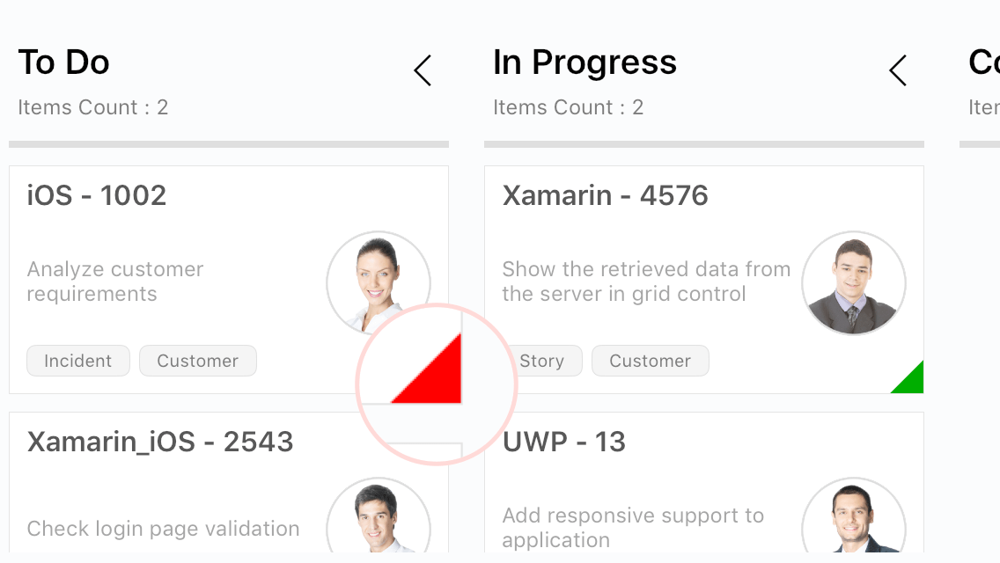
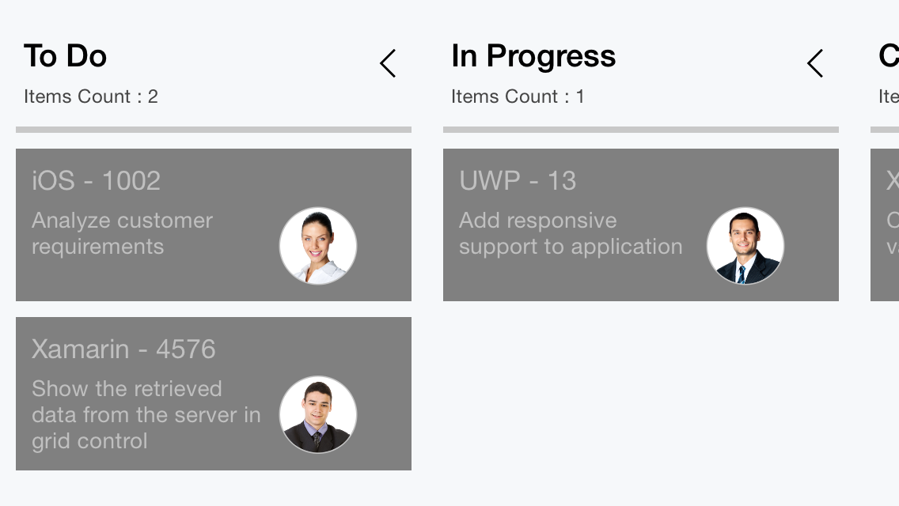

#Cards

The default elements of a card can be customized using the below properties of [KanbanModel](http://help.syncfusion.com/cr/cref_files/xamarin/sfkanban/Syncfusion.SfKanban.XForms~Syncfusion.SfKanban.XForms.KanbanModel.html).

[Title](http://help.syncfusion.com/cr/cref_files/xamarin/sfkanban/Syncfusion.SfKanban.XForms~Syncfusion.SfKanban.XForms.KanbanModel~Title.html)         - Used to set the title of a card.
[ImageURL](http://help.syncfusion.com/cr/cref_files/xamarin/sfkanban/Syncfusion.SfKanban.XForms~Syncfusion.SfKanban.XForms.KanbanModel~ImageURL.html)      - Used to set the image URL of a card. The image will be displayed at right side in default card template.
[Category](http://help.syncfusion.com/cr/cref_files/xamarin/sfkanban/Syncfusion.SfKanban.XForms~Syncfusion.SfKanban.XForms.KanbanModel~Category.html)      - Used to set the category of a card. Based on the category the cards will be added to the respective columns. 
[Description](http://help.syncfusion.com/cr/cref_files/xamarin/sfkanban/Syncfusion.SfKanban.XForms~Syncfusion.SfKanban.XForms.KanbanModel~Description.html)   - Used to set the description text of a card.
[ColorKey](http://help.syncfusion.com/cr/cref_files/xamarin/sfkanban/Syncfusion.SfKanban.XForms~Syncfusion.SfKanban.XForms.KanbanModel~ColorKey.html)      - Used to specify the indicator color key. The color value of the corresponding key should be added in ColorModel collection of SfKanban.
[Tags](http://help.syncfusion.com/cr/cref_files/xamarin/sfkanban/Syncfusion.SfKanban.XForms~Syncfusion.SfKanban.XForms.KanbanModel~Tags.html)          - Used to specify the tags of a card. The tags will be displayed at bottom in default card template.
[ID](http://help.syncfusion.com/cr/cref_files/xamarin/sfkanban/Syncfusion.SfKanban.XForms~Syncfusion.SfKanban.XForms.KanbanModel~ID.html)            - Used to set the ID of a card.



new KanbanModel()
{
    ID = 1,
    Title = "iOS - 1002",
    ImageURL = "Image1.png",
    Category = "Open",
    Description = "Analyze customer requirements",
    ColorKey = "Red",
    Tags = new string[] { "Incident", "Customer" }
});



Following code snippet is used to define the colors for each key.



List<KanbanColorMapping> colormodels = new List<KanbanColorMapping>();
colormodels.Add(new KanbanColorMapping("Green", Color.Green));
colormodels.Add(new KanbanColorMapping("Red", Color.Red));
colormodels.Add(new KanbanColorMapping("Aqua", Color.Aqua));
colormodels.Add(new KanbanColorMapping("Blue", Color.Blue));
kanban.ColorModel = colormodels;



## Template

You can replace the entire card template with your own design using [CardTemplate](http://help.syncfusion.com/cr/cref_files/xamarin/sfkanban/Syncfusion.SfKanban.XForms~Syncfusion.SfKanban.XForms.SfKanban~CardTemplate.html) property of [SfKanban](http://help.syncfusion.com/cr/cref_files/xamarin/sfkanban/Syncfusion.SfKanban.XForms~Syncfusion.SfKanban.XForms.SfKanban.html). The following code snippet and screenshot illustrates this.





<kanban:SfKanban.CardTemplate >

<DataTemplate>
    <StackLayout WidthRequest="250" Orientation="Vertical" BackgroundColor="Gray" Padding="10,10,10,10"> 
        
        <StackLayout  Orientation="Horizontal"> 

            <Label Text="{Binding Path=Title}" TextColor="Silver" HorizontalOptions="StartAndExpand" >
            </Label>

        </StackLayout>      

        <StackLayout  Orientation="Horizontal"> 

            <Label Text="{Binding Description}" WidthRequest="150" FontSize="14" TextColor="Silver" LineBreakMode="WordWrap" ></Label>                    
            <Image Source="{Binding ImageURL}" HeightRequest="50" WidthRequest="50"  ></Image>

        </StackLayout>
        
    </StackLayout>
</DataTemplate>

</kanban:SfKanban.CardTemplate>





var cardTemplate = new DataTemplate(() =>
{

    StackLayout root = new StackLayout()
    {
        WidthRequest = 250,
        Orientation = StackOrientation.Vertical,
        Padding = new Thickness(10),
        BackgroundColor = Color.Silver
    };

    StackLayout titleLayout = new StackLayout();
    Label title = new Label()
    {
        TextColor = Color.Blue,
        HorizontalOptions = LayoutOptions.StartAndExpand
    };
    title.SetBinding(Label.TextProperty, new Binding("Title"));
    titleLayout.Children.Add(title);
    
    StackLayout contentLayout = new StackLayout()
    {
        Orientation = StackOrientation.Horizontal
    };
    Label desc = new Label()
    {
        WidthRequest = 150,
        HeightRequest = 50,
        TextColor = Color.Teal,
        LineBreakMode = LineBreakMode.WordWrap
    };
    desc.SetBinding(Label.TextProperty, new Binding("Description"));
    Image image = new Image()
    {
        HeightRequest = 50,
        WidthRequest = 50
    };
    image.SetBinding(Image.SourceProperty, new Binding("ImageURL"));
    contentLayout.Children.Add(desc);
    contentLayout.Children.Add(image);

    root.Children.Add(titleLayout);
    root.Children.Add(contentLayout);

    return root;

});

kanban.CardTemplate = cardTemplate;





