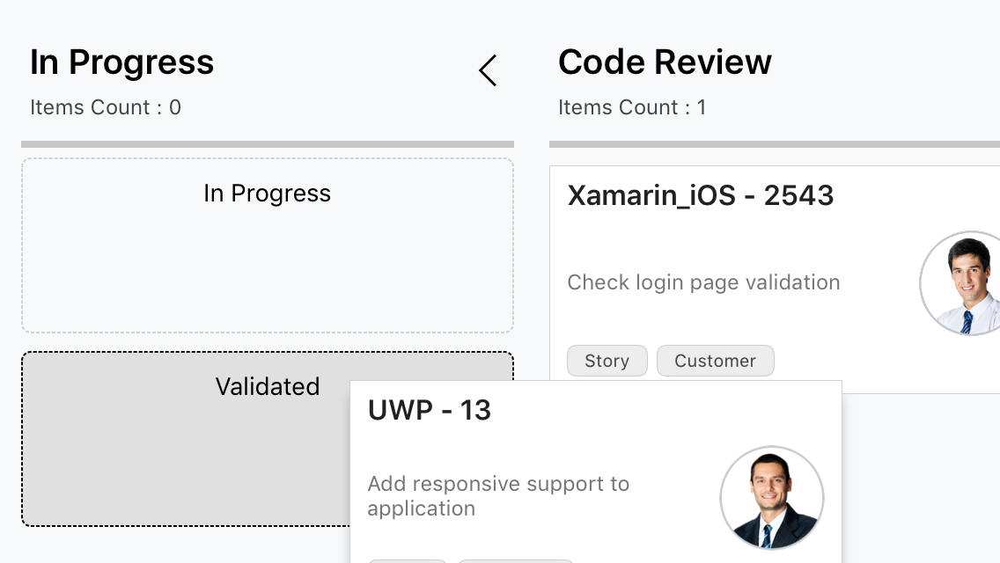
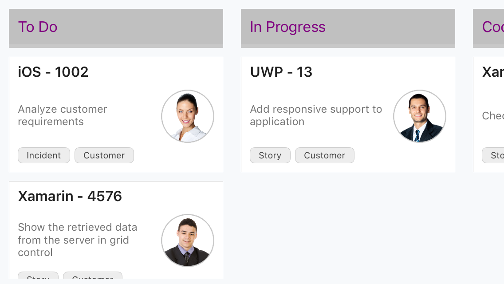
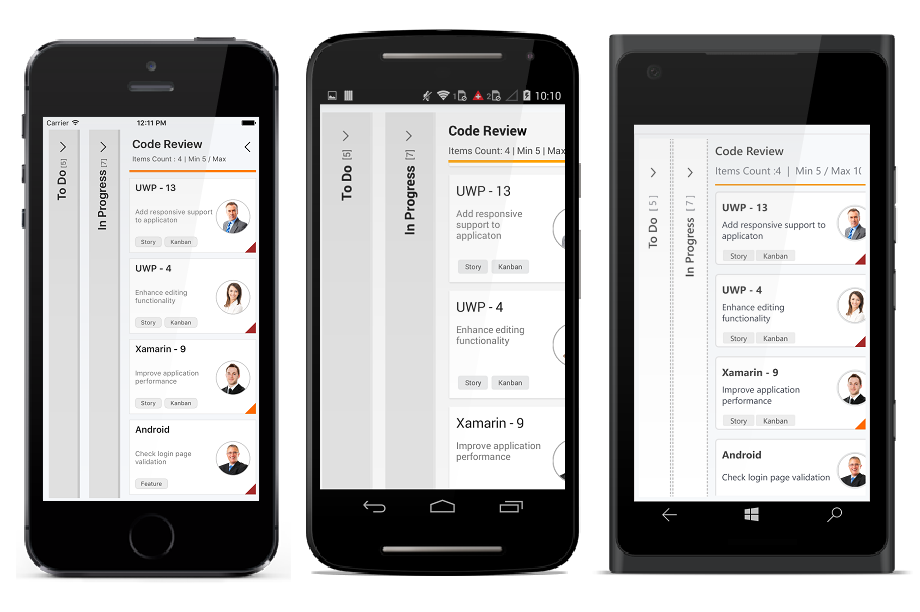
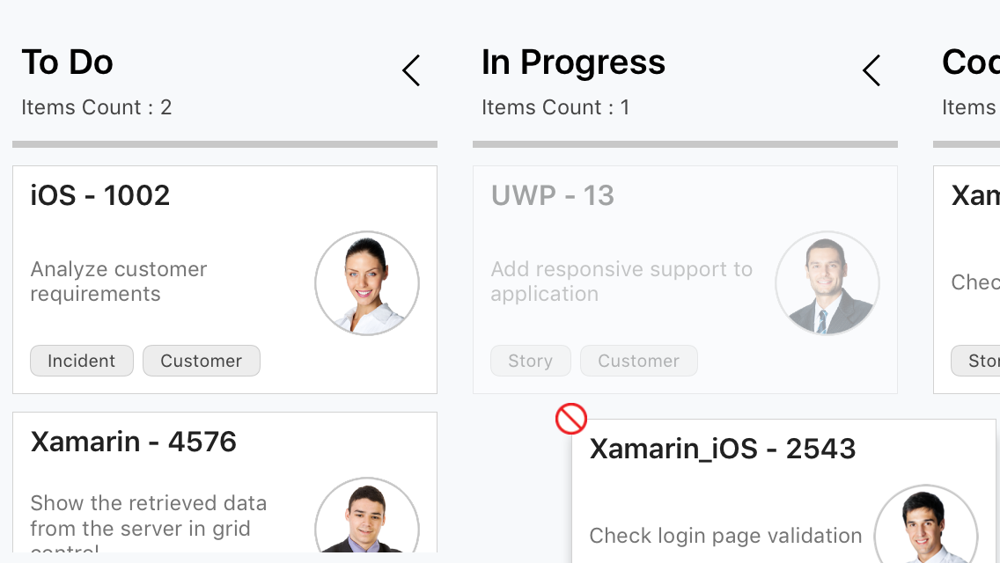
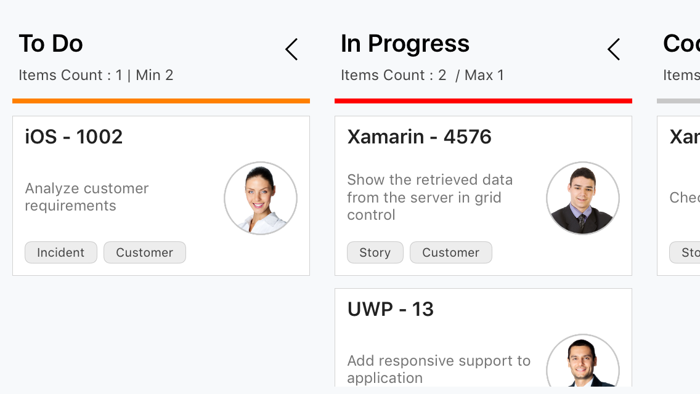

# Column

## Customizing Column Size

By default, columns are sized smartly to arrange the default elements of the cards with better readability. However, you can define the minimum and maximum width for the columns in [`SfKanban`](http://help.syncfusion.com/cr/cref_files/xamarin/sfkanban/Syncfusion.SfKanban.XForms~Syncfusion.SfKanban.XForms.SfKanban.html) using [`SfKanban.MinimumColumnWidth`](http://help.syncfusion.com/cr/cref_files/xamarin/sfkanban/Syncfusion.SfKanban.XForms~Syncfusion.SfKanban.XForms.SfKanban~MinimumColumnWidth.html) and [`SfKanban.MaximumColumnWidth`](http://help.syncfusion.com/cr/cref_files/xamarin/sfkanban/Syncfusion.SfKanban.XForms~Syncfusion.SfKanban.XForms.SfKanban~MaximumColumnWidth.html) properties respectively. 





<kanban:SfKanban MinimumColumnWidth ="300" MaximumColumnWidth ="340">
</kanban:SfKanban>



 

kanban. MinimumColumnWidth = 300;
kanban. MaximumColumnWidth = 340;





You can also define the exact column width using [`SfKanban.ColumnWidth`](http://help.syncfusion.com/cr/cref_files/xamarin/sfkanban/Syncfusion.SfKanban.XForms~Syncfusion.SfKanban.XForms.SfKanban~ColumnWidth.html) property.





<kanban:SfKanban ColumnWidth ="250">
</kanban:SfKanban>



 

kanban.ColumnWidth = 250;





## Categorizing Columns

If [`ItemsSource`](http://help.syncfusion.com/cr/cref_files/xamarin/sfkanban/Syncfusion.SfKanban.XForms~Syncfusion.SfKanban.XForms.SfKanban~ItemsSource.html) contains custom objects, the path of the property which can be used to categorize the card should be explicitly defined using [`ColumnMappingPath`](http://help.syncfusion.com/cr/cref_files/xamarin/sfkanban/Syncfusion.SfKanban.XForms~Syncfusion.SfKanban.XForms.SfKanban~ColumnMappingPath.html) property. By default, [`SfKanban`](http://help.syncfusion.com/cr/cref_files/xamarin/sfkanban/Syncfusion.SfKanban.XForms~Syncfusion.SfKanban.XForms.SfKanban.html) will automatically categorize the items using [`KanbanModel.Category`](http://help.syncfusion.com/cr/cref_files/xamarin/sfkanban/Syncfusion.SfKanban.XForms~Syncfusion.SfKanban.XForms.KanbanModel~Category.html) property.





<kanban:SfKanban ColumnMappingPath="Group">
</kanban:SfKanban>



 

kanban.ColumnMappingPath = "Group";





### Multiple category for a column

More than one category can be mapped to a column by assigning multiple values to Categories collection of [`KanbanColumn`](http://help.syncfusion.com/cr/cref_files/xamarin/sfkanban/Syncfusion.SfKanban.XForms~Syncfusion.SfKanban.XForms.KanbanColumn.html). For e.g., you can map “In progress, Validate types under “In progress” column.

 

progressColumn.Categories = new List<object>() { "In Progress", "Validated" };



## Headers

Header shows the category, items count, min and max informations of a column. The UI of the header can be replaced entirely using [`SfKanban.HeaderTemplate`](http://help.syncfusion.com/cr/cref_files/xamarin/sfkanban/Syncfusion.SfKanban.XForms~Syncfusion.SfKanban.XForms.SfKanban~HeaderTemplate.html) property. The following code snippet and screenshot illustrates this.





     <kanban:SfKanban.HeaderTemplate >
         <DataTemplate>
             <StackLayout WidthRequest="300" HeightRequest="40"  BackgroundColor="Silver">
                 <Label Margin="10" Text="{Binding Path=Title}" TextColor="Purple" HorizontalOptions="Start" />
             </StackLayout>
         </DataTemplate>
     </kanban:SfKanban.HeaderTemplate>



 

var headerTemplate = new DataTemplate(() => {
    StackLayout root = new StackLayout() { 
        WidthRequest = 300, 
        HeightRequest = 40, 
        BackgroundColor = Color.Silver 
    };
    Label label = new Label();
    label.Margin = new Thickness(10); 
    label.SetBinding(Label.TextProperty, new Binding("Title") );
    label.TextColor = Color.Purple;
    label.HorizontalOptions = LayoutOptions.Start; 
    root.Children.Add(label);
    return root;
    });
kanban.HeaderTemplate = headerTemplate;





The following output is displayed as a result of the above code example.

## Expand/Collapse Column

Columns can be expanded/collapsed by tapping the toggle button which is placed at top right corner of the Kanban header. [`KanbanColumn.IsExpanded`](http://help.syncfusion.com/cr/cref_files/xamarin/sfkanban/Syncfusion.SfKanban.XForms~Syncfusion.SfKanban.XForms.KanbanColumn~IsExpanded.html) ‘ property is used to programmatically expand/collapse the Kanban column. The following code example describes the above behavior.   





<kanban:SfKanban.Columns>
    <kanban:KanbanColumn x:Name="column1" Title="To Do" IsExpanded="false" />
    <kanban:KanbanColumn x:Name="column2" Title="In Progress" IsExpanded="false" />
</kanban:SfKanban.Columns>





KanbanColumn column1 = new KanbanColumn();
column1.IsExpanded = false; 
KanbanColumn column2 = new KanbanColumn();
column2.IsExpanded = false;

kanban.Columns.Add(column1);
kanban.Columns.Add(column2);





The following output is displayed as a result of the above code example.

## Enable/Disable Drag & Drop 

You can enable and disable the drag and drop operation of the cards for particular column using [`KanbanColumn.AllowDrag`](http://help.syncfusion.com/cr/cref_files/xamarin/sfkanban/Syncfusion.SfKanban.XForms~Syncfusion.SfKanban.XForms.KanbanColumn~AllowDrag.html) and [`KanbanColumn.AllowDrop`](http://help.syncfusion.com/cr/cref_files/xamarin/sfkanban/Syncfusion.SfKanban.XForms~Syncfusion.SfKanban.XForms.KanbanColumn~AllowDrop.html) properties.

The following code is used to disable the drag operation from progress column.





<kanban:SfKanban.Columns>
    <kanban:KanbanColumn AllowDrag="false"/>
</kanban:SfKanban.Columns>





KanbanColumn progressColumn = new KanbanColumn();
progressColumn.AllowDrag = false;





The following code is used to disable the drop operation of the cards into the progress column.





<kanban:SfKanban.Columns>
    <kanban:KanbanColumn AllowDrop="false"/>
</kanban:SfKanban.Columns>





KanbanColumn progressColumn = new KanbanColumn();
progressColumn.AllowDrop = false; 





The following output demonstrates the above example code.
 

## Items Count
[`ItemsCount`](http://help.syncfusion.com/cr/cref_files/xamarin/sfkanban/Syncfusion.SfKanban.XForms~Syncfusion.SfKanban.XForms.KanbanColumn~ItemsCount.html) property is used to get the total cards count in each column.



int count = todoColumn.ItemsCount;         



## Work In-Progress Limit

[`MinimumLimit`](http://help.syncfusion.com/cr/cref_files/xamarin/sfkanban/Syncfusion.SfKanban.XForms~Syncfusion.SfKanban.XForms.KanbanColumn~MinimumLimit.html) and [`MaximumLimit`](http://help.syncfusion.com/cr/cref_files/xamarin/sfkanban/Syncfusion.SfKanban.XForms~Syncfusion.SfKanban.XForms.KanbanColumn~MaximumLimit.html) properties are used to define the minimum and maximum number of items in a column. If the actual items count is exceeded or lesser than the specified limits, the error bars are used to indicate this violation. Following properties are used to customize the appearance of error bar.

* [`Color`](http://help.syncfusion.com/cr/cref_files/xamarin/sfkanban/Syncfusion.SfKanban.XForms~Syncfusion.SfKanban.XForms.KanbanErrorBarSettings~Color.html) - used to change the default color of the error bar.
* [`MaxValidationColor`](http://help.syncfusion.com/cr/cref_files/xamarin/sfkanban/Syncfusion.SfKanban.XForms~Syncfusion.SfKanban.XForms.KanbanErrorBarSettings~MaxValidationColor.html) - used to change the maximum validation color of the error bar.
* [`MinValidationColor`](http://help.syncfusion.com/cr/cref_files/xamarin/sfkanban/Syncfusion.SfKanban.XForms~Syncfusion.SfKanban.XForms.KanbanErrorBarSettings~MinValidationColor.html) - used to change the minimum validation color of the error bar.
* [`Height`](http://help.syncfusion.com/cr/cref_files/xamarin/sfkanban/Syncfusion.SfKanban.XForms~Syncfusion.SfKanban.XForms.KanbanErrorBarSettings~Height.html) - used to change the height of the error bar.





<kanban:KanbanColumn x:Name="todoColumn" Title="To Do" MinimumLimit="2" MaximumLimit="1">
</kanban:KanbanColumn>





todoColumn.MinimumLimit = 2; 
todoColumn.MaximumLimit = 1;   









<kanban:KanbanColumn x:Name="todoColumn" Title="To Do" MinimumLimit="3" MaximumLimit="5">
    <kanban:KanbanColumn.ErrorbarSettings>
        <kanban:KanbanErrorBarSettings Color="Green" MinValidationColor="Orange" MaxValidationColor="Red" Height="4"/>
    </kanban:KanbanColumn.ErrorbarSettings>
</kanban:KanbanColumn>





todoColumn.ErrorbarSettings.Color = Color.Green;
todoColumn.ErrorbarSettings.MinValidationColor = Color.Orange;
todoColumn.ErrorbarSettings.MaxValidationColor = Color.Red;
todoColumn.ErrorbarSettings.Height = 4;





