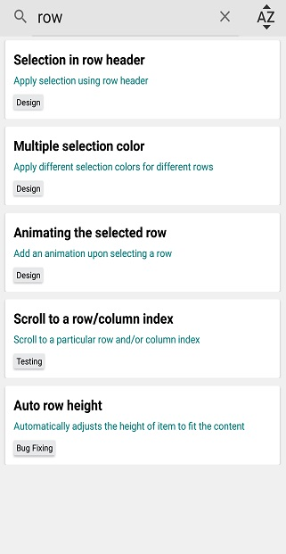

# Filtering

This section explains about how to filter the data and its related operations in SfListView.

## Programmatic Filtering

[SfListView](https://help.syncfusion.com/cr/cref_files/xamarin/sflistview/Syncfusion.SfListView.XForms~Syncfusion.ListView.XForms.SfListView.html) provides support to filter the data by setting the [SfListView.DataSource.Filter](https://help.syncfusion.com/cr/cref_files/xamarin/datasource/Syncfusion.DataSource.Portable~Syncfusion.DataSource.DataSource~Filter.html) property. You have to call the [SfListView.DataSource.RefreshFilter()](https://help.syncfusion.com/cr/cref_files/xamarin/datasource/Syncfusion.DataSource.Portable~Syncfusion.DataSource.DataSource~RefreshFilter.html) method after assigning the `Filter` property for refreshing the view.

[FilterChanged](https://help.syncfusion.com/cr/cref_files/xamarin/datasource/Syncfusion.DataSource.Portable~Syncfusion.DataSource.DataSource~FilterChanged_EV.html) event is raised once filtering is applied in SfListView.

The following code example illustrates how to apply filtering in SfListView. `FilterContacts` method filters the data that contains the filter text value. Assign `FilterContacts` method to `SfListView.DataSource.Filter` predicate to filter the `ContactName`.


var grid = new Grid();

var searchbar = new SearchBar() { Placeholder = "Search here to filter" };
searchbar.TextChanged += OnFilterTextChanged;

var listView = new SfListView();
listView.ItemsSource = viewmodel.customerDetails;
listView.ItemSize = 60;

grid.Children.Add(searchbar);
grid.Children.Add(listView, 0, 1);



The following code example illustrates the code for filtering the data using `FilterContacts` method in the ViewModel.


SearchBar searchBar = null;
private void OnFilterTextChanged(object sender, TextChangedEventArgs e)
{
  searchBar = (sender as SearchBar);
  if (listView.DataSource != null)
  {
    this.listView.DataSource.Filter = FilterContacts;
    this.listView.DataSource.RefreshFilter();
  }
}
 
private bool FilterContacts(object obj)
{
  if (searchBar == null || searchBar.Text == null)
     return true;

  var contacts = obj as Contacts;
  if (contacts.ContactName.ToLower().Contains(searchBar.Text.ToLower())
       || contacts.ContactName.ToLower().Contains(searchBar.Text.ToLower()))
      return true;
  else
      return false;
}


The following screenshot shows the output rendered when the items are filtered.

### Filter based on multiple criteria

[SfListView](https://help.syncfusion.com/cr/cref_files/xamarin/sflistview/Syncfusion.SfListView.XForms~Syncfusion.ListView.XForms.SfListView.html) allows you to filter the items based on the multiple criteria. The following example illustrates how to filter the data using multiple properties.


private bool FilterContacts(object obj)
{
  if (searchBar == null || searchBar.Text == null)
     return true;

  var contacts = obj as Contacts;
  if (contacts.ContactName.ToLower().Contains(searchBar.Text.ToLower())
      || contacts.ContactNumber.ToLower().Contains(searchBar.Text.ToLower()))
      return true;
  else
      return false;
}


## Getting the filtered data

You can get the filtered items from the view and modify it in [SfListView.DataSource.FilterChanged](https://help.syncfusion.com/cr/cref_files/xamarin/datasource/Syncfusion.DataSource.Portable~Syncfusion.DataSource.DataSource~FilterChanged_EV.html) event. When filter is applied, the filtered items are available in [SfListView.DataSource.DisplayItems](https://help.syncfusion.com/cr/cref_files/xamarin/datasource/Syncfusion.DataSource.Portable~Syncfusion.DataSource.DataSource~DisplayItems.html).


listView.DataSource.FilterChanged += DataSource_FilterChanged;
...
private void DataSource_FilterChanged(object sender, NotifyCollectionChangedEventArgs e)
{
  //Contacts is model class 
  ObservableCollection<Contacts> contacts = new ObservableCollection<Contacts>();
  // Get the filtered items
  var items = (sender as DataSource).DisplayItems;
  foreach (var item in items)
      contacts.Add(item as Contacts);
}


## Clear Filtering

SfListView allows you to clear the filters by setting null to the [DataSource.Filter](https://help.syncfusion.com/cr/cref_files/xamarin/datasource/Syncfusion.DataSource.Portable~Syncfusion.DataSource.DataSource~Filter.html) and call the [DataSource.RefreshFilter](https://help.syncfusion.com/cr/cref_files/xamarin/datasource/Syncfusion.DataSource.Portable~Syncfusion.DataSource.DataSource~RefreshFilter.html) method.


listView.DataSource.Filter = null;
listView.DataSource.RefreshFilter();


## Sort the Filtered Items

You can rearrange the order of the filtered items in [FilterChanged](https://help.syncfusion.com/cr/cref_files/xamarin/datasource/Syncfusion.DataSource.Portable~Syncfusion.DataSource.DataSource~FilterChanged_EV.html) event by adding [SortDescriptor](https://help.syncfusion.com/cr/cref_files/xamarin/datasource/Syncfusion.DataSource.Portable~Syncfusion.DataSource.SortDescriptor.html). The following example illustrates how to sort the filtered items.


private void DataSource_FilterChanged(object sender, NotifyCollectionChangedEventArgs e)
{
  listView.DataSource.SortDescriptors.Add(new SortDescriptor { PropertyName = "ContactName", 
                                                               Direction = ListSortDirection.Ascending });
  listView.RefreshView();
}
