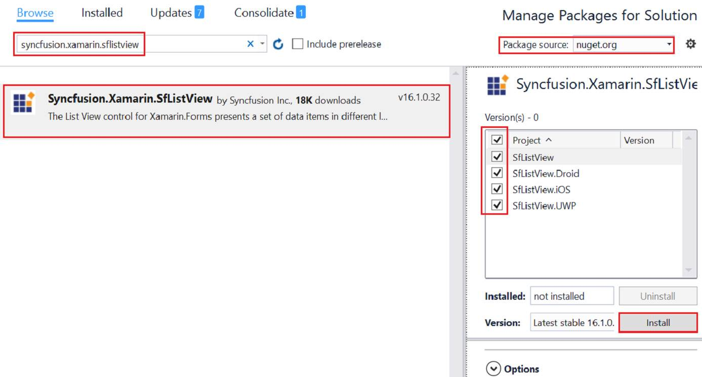
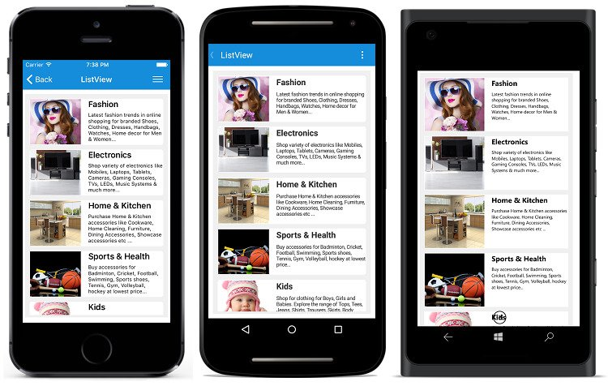
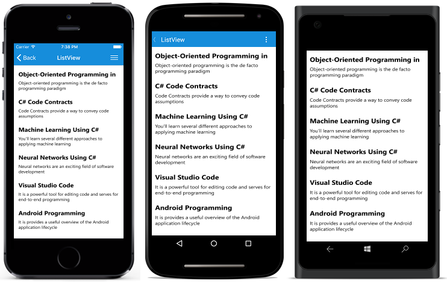

# Getting Started

This section provides a quick overview for getting started with the SfListView for Xamarin.Forms. Walk through the entire process of creating the real world SfListView.

## Assembly Deployment

After installing Essential Studio for Xamarin, you can find all the required assemblies in the {Syncfusion Essential Studio Installed location}\Essential Studio\{{ site.releaseversion }}\Xamarin\lib installation folder.

Eg: C:\Program Files (x86)\Syncfusion\Essential Studio\{{ site.releaseversion }}\Xamarin\lib

Refer [control dependencies](https://help.syncfusion.com/xamarin/introduction/control-dependencies#sflistview) section to get the list of assemblies or NuGet package needs to be added as reference to use the SfListView control in any application.

N> Assemblies can be found in an unzipped package location in Mac.

### Adding ListView Reference

Syncfusion Xamarin components are available in [nuget.org](https://www.nuget.org/). To add SfListView to your project, open the NuGet package manager in Visual Studio, and search for [syncfusion.xamarin.SfListView](https://www.nuget.org/packages/Syncfusion.Xamarin.SfListView/), and then install it. 

To know more about obtaining our components, refer to these links: [Mac](https://help.syncfusion.com/xamarin/introduction/download-and-installation/mac) and [Windows](https://help.syncfusion.com/xamarin/introduction/download-and-installation/windows). Also, if you prefer to manually refer the assemblies instead of NuGet, refer to this [link](https://help.syncfusion.com/xamarin/introduction/control-dependencies#sflistview) to know about the dependent assemblies for SfListView. 

I> After adding the reference, an additionally need to initialize the renderer for [iOS](https://help.syncfusion.com/xamarin/sflistview/getting-started#ios) and [UWP](https://help.syncfusion.com/xamarin/sflistview/getting-started#universal-windows-platform-uwp) projects.  

I> For UWP alone, one more additional step is required if the project is built in release mode with .NET Native tool chain enabled. You can refer to the [KB article](https://www.syncfusion.com/kb/8476/how-to-overcome-the-crash-system-reflection-missingmetadataexception-when-usedotnetnativetoolchain-is) for more details.

I> Starting with v16.2.0.x, if you reference Syncfusion assemblies from trial setup or from the NuGet feed, you also have to include a license key in your projects. Please refer to this [link](https://help.syncfusion.com/common/essential-studio/licensing/license-key) to know about registering Syncfusion license key in your Xamarin application to use our components.

## System Requirements

In the SfListView, current supported Xamarin.Forms version is `2.4.0.280` and later.

The following table lists the platforms supported versions:

<table>
    <tr>
        <td>
            Platform
             
             
        </td>
        <td>
            Supported versions
             
             
        </td>
    </tr>
    <tr>
        <td>
            Android
             
             
        </td>       
         <td>
            API level 19 and later versions
             
             
        </td>
    </tr>
    <tr>
        <td>
            iOS
             
             
        </td>
        <td>
            iOS 9.0 and later versions
             
             
        </td>
    </tr>
    <tr>
        <td>
            UWP
             
             
        </td>
        <td>
            Windows 10 devices
             
             
        </td>
    </tr>   
    <tr>
        <td>
            macOS
             
             
        </td>
        <td>
            10.11
             
             
        </td>
    </tr>
</table>

## Launching the SfListView on Each Platform

To use this control inside an application, each platform application must initialize the SfListView renderer. This initialization step varies from platform to platform, and is discussed in the following sections:

### Android

The Android launches the SfListView without any initialization, and is enough to only initialize the Xamarin.Forms Framework to launch the application.

### iOS

To launch the SfListView in iOS, call the `SfListViewRenderer.Init()` in the `FinishedLaunching` overridden method of the AppDelegate class after the Xamarin.Forms Framework initialization, and before the LoadApplication is called as demonstrated in the following code example:



public override bool FinishedLaunching(UIApplication app, NSDictionary options)
{
    …
    global::Xamarin.Forms.Forms.Init ();
    SfListViewRenderer.Init();
    LoadApplication (new App ());
    …
}
 


### Universal Windows Platform (UWP)

To launch the SfListView in UWP, call the `SfListViewRenderer.Init()` in the `MainPage` constructor before the LoadApplication is called as demonstrated in the following code example:



public MainPage()
{
    …
    SfListViewRenderer.Init();
    LoadApplication (new App ());
    …
}
 


### macOS

To launch SfListView in macOS, call the `SfListViewRenderer.Init()` in the `DidFinishLaunching` override method of AppDelegate class, after calling the Xamarin.Forms Framework and LoadApplication initialization.



public override void DidFinishLaunching(NSNotification notification)
{
    Forms.Init();
    LoadApplication(new App());
    SfListViewRenderer.Init();
    …
}
 


### ReleaseMode Issue in UWP Platform

The known Framework issue in UWP platform is the custom controls will not render when deployed the application in `Release Mode`.

The above problem can be resolved by initializing the SfListView assemblies in `App.xaml.cs` in UWP project as in the following code snippet:



// In App.xaml.cs

protected override void OnLaunched(LaunchActivatedEventArgs e)
{
    …

    rootFrame.NavigationFailed += OnNavigationFailed;
        
    // you'll need to add `using System.Reflection;`
    List<Assembly> assembliesToInclude = new List<Assembly>();

    //Now, add all the assemblies your app uses
    assembliesToInclude.Add(typeof(SfListViewRenderer).GetTypeInfo().Assembly);

    // replaces Xamarin.Forms.Forms.Init(e);        
    Xamarin.Forms.Forms.Init(e, assembliesToInclude);
        
    …     
}



## Create a Simple SfListView 

This section explains how to create a SfListView, and configure it. The SfListView control can be configured entirely in C# code, or by using XAML markup. This is how the control will look like on iOS, Android, and Windows devices.
 

In this walk through, you will create a new application with the SfListView that includes the following topics:

* [Creating the project](#creating-the-project) 
* [Adding SfListView in Xamarin.Forms](#adding-sflistview-in-xamarin.forms)     
* [Creating Data Model](#creating-data-model-for-the-sflistview)  
* [Binding data](#binding-data-to-sflistview) 
* [Defining an ItemTemplate](#defining-an-itemtemplate)
* [Layouts](#layouts)
* [Sorting](#sorting) 
* [Filtering](#filtering) 
* [Grouping](#grouping) 
* [Selection](#selection)
* [Header and Footer](#header-and-footer)

## Creating the Project

Create a new blank (Xamarin.Forms.Portable) application in Xamarin Studio or Visual Studio for Xamarin.Forms.

## Adding the SfListView in Xamarin.Forms 

 1. Add the required assembly references to the PCL, and renderer projects as discussed in the [Assembly deployment](#assembly-deployment) section.
 2. Import the SfListView control namespace Syncfusion.ListView.XForms.
 3. Set the SfListView control to the ContentPage.



<?xml version="1.0" encoding="utf-8" ?>
<ContentPage xmlns="http://xamarin.com/schemas/2014/forms"
             xmlns:x="http://schemas.microsoft.com/winfx/2009/xaml"
             xmlns:syncfusion="clr-namespace:Syncfusion.ListView.XForms;assembly=Syncfusion.SfListView.XForms"
             xmlns:local="clr-namespace:GettingStarted;assembly=GettingStarted"
             x:Class="GettingStarted.MainPage">
  <syncfusion:SfListView x:Name="listView" />
</ContentPage>


using Syncfusion.ListView.XForms;
using Xamarin.Forms;

namespace GettingStarted
{
    public class App : Application
    {
        SfListView listView;
        public App()
        {
            listView = new SfListView();
            MainPage = new ContentPage { Content = listView };
        }
    }
} 



## Creating Data Model for the SfListView

Create a data model to bind it to the control. 

Create a simple data source as shown in the following code example in a new class file, and save it as BookInfo.cs file: 



public class BookInfo : INotifyPropertyChanged
{
    private string bookName;
    private string bookDesc;

    public string BookName
    {
        get { return bookName; }
        set
        {
            bookName = value;
            OnPropertyChanged("BookName");
        }
    }

    public string BookDescription
    {
        get { return bookDesc; }
        set
        {
            bookDesc = value;
            OnPropertyChanged("BookDescription");
        }
    }

    public event PropertyChangedEventHandler PropertyChanged;

    public void OnPropertyChanged(string name)
    {
        if (this.PropertyChanged != null)
           this.PropertyChanged(this, new PropertyChangedEventArgs(name));
    }
}
 



N> If you want your data model to respond to property changes, then implement `INotifyPropertyChanged` interface in your model class.

Create a model repository class with BookInfo collection property initialized with required number of data objects in a new class file as shown in the following code example, and save it as BookInfoRepository.cs file:



public class BookInfoRepository
{
    private ObservableCollection<BookInfo> bookInfo;

    public ObservableCollection<BookInfo> BookInfo
    {
        get { return bookInfo; }
        set { this.bookInfo = value; }
    }

    public BookInfoRepository()
    {
        GenerateBookInfo();
    }

    internal void GenerateBookInfo()
    {
        bookInfo = new ObservableCollection<BookInfo>();
        bookInfo.Add(new BookInfo() { BookName = "Object-Oriented Programming in C#", BookDescription = "Object-oriented programming is a programming paradigm based on the concept of objects" });
        bookInfo.Add(new BookInfo() { BookName = "C# Code Contracts", BookDescription = "Code Contracts provide a way to convey code assumptions" });
        bookInfo.Add(new BookInfo() { BookName = "Machine Learning Using C#", BookDescription = "You’ll learn several different approaches to applying machine learning" });
        bookInfo.Add(new BookInfo() { BookName = "Neural Networks Using C#", BookDescription = "Neural networks are an exciting field of software development" });
        bookInfo.Add(new BookInfo() { BookName = "Visual Studio Code", BookDescription = "It is a powerful tool for editing code and serves for end-to-end programming" });
        bookInfo.Add(new BookInfo() { BookName = "Android Programming", BookDescription = "It is provides a useful overview of the Android application life cycle" });
        bookInfo.Add(new BookInfo() { BookName = "iOS Succinctly", BookDescription = "It is for developers looking to step into frightening world of iPhone" });
        bookInfo.Add(new BookInfo() { BookName = "Visual Studio 2015", BookDescription = "The new version of the widely-used integrated development environment" });
        bookInfo.Add(new BookInfo() { BookName = "Xamarin.Forms", BookDescription = "Its creates mappings from its C# classes and controls directly" });
        bookInfo.Add(new BookInfo() { BookName = "Windows Store Apps", BookDescription = "Windows Store apps present a radical shift in Windows development" });
    }
}




## Binding Data to the SfListView

To bind the data source of the SfListView, set the [SfListView.ItemsSource](https://help.syncfusion.com/cr/cref_files/xamarin/Syncfusion.SfListView.XForms~Syncfusion.ListView.XForms.SfListView~ItemsSource.html) property as shown as follows. You can bind the data source of the SfListView either from XAML or in code. 

The following code example binds the collection created in previous step to the `SfListView.ItemsSource` property:



<?xml version="1.0" encoding="utf-8" ?>
<ContentPage xmlns="http://xamarin.com/schemas/2014/forms"
             xmlns:x="http://schemas.microsoft.com/winfx/2009/xaml"
             xmlns:syncfusion="clr-namespace:Syncfusion.ListView.XForms;assembly=Syncfusion.SfListView.XForms"
             xmlns:local="clr-namespace:GettingStarted;assembly=GettingStarted"
             x:Class="GettingStarted.MainPage">
  <ContentPage.BindingContext>
    <local:BookInfoRepository />
  </ContentPage.BindingContext>
   <syncfusion:SfListView x:Name="listView" 
                   ItemsSource="{Binding BookInfo}" />
</ContentPage>


BookInfoRepository viewModel = new BookInfoRepository ();
listView.ItemsSource = viewModel.BookInfo; 



## Defining an ItemTemplate
 
 By defining the [SfListView.ItemTemplate](https://help.syncfusion.com/cr/cref_files/xamarin/Syncfusion.SfListView.XForms~Syncfusion.ListView.XForms.SfListView~ItemTemplate.html) of the SfListView, a custom user interface(UI) can be achieved to display the data items. 
 


<ContentPage xmlns:syncfusion="clr-namespace:Syncfusion.ListView.XForms;assembly=Syncfusion.SfListView.XForms">
  <syncfusion:SfListView x:Name="listView" 
                   ItemsSource="{Binding BookInfo}"
                   ItemSize="100">
    <syncfusion:SfListView.ItemTemplate>
        <DataTemplate>
        <Grid Padding="10">
            <Grid.RowDefinitions>
            <RowDefinition Height="0.4*" />
            <RowDefinition Height="0.6*" />
            </Grid.RowDefinitions>
            <Label Text="{Binding BookName}" FontAttributes="Bold" TextColor="Teal" FontSize="21" />
            <Label Grid.Row="1" Text="{Binding BookDescription}" TextColor="Teal" FontSize="15"/>
        </Grid>
        </DataTemplate>
    </syncfusion:SfListView.ItemTemplate>
  </syncfusion:SfListView>
</ContentPage>


using Syncfusion.ListView.XForms;
using Xamarin.Forms;

namespace GettingStarted
{
    public class App : Application
    {
        SfListView listView;
        public App()
        {
            BookInfoRepository viewModel = new BookInfoRepository ();
            listView = new SfListView();
            listView.ItemSize = 100;
            listView.ItemsSource = viewModel.BookInfo;
            listView.ItemTemplate = new DataTemplate(() => {
                var grid = new Grid();
                var bookName = new Label { FontAttributes = FontAttributes.Bold, BackgroundColor = Color.Teal, FontSize = 21 };
                bookName.SetBinding(Label.TextProperty, new Binding("BookName"));
                var bookDescription = new Label { BackgroundColor = Color.Teal, FontSize = 15 };
                bookDescription.SetBinding(Label.TextProperty, new Binding("BookDescription"));

                grid.Children.Add(bookName);
                grid.Children.Add(bookDescription, 1, 0);

                return grid;
            });
            MainPage = new ContentPage { Content = listView };
        }
    }
} 



Now, run the application to render the below output:

You can also download the entire source code of this demo [here](http://www.syncfusion.com/downloads/support/directtrac/general/ze/GettingStarted-2080788157).

## Layouts

SfListView supports different layouts such as linear layout and grid layout. The linear layout arranges the items in a single column, whereas the grid layout arranges the items in a predefined number of columns defined by the [SpanCount](https://help.syncfusion.com/cr/cref_files/xamarin/Syncfusion.SfListView.XForms~Syncfusion.ListView.XForms.GridLayout~SpanCount.html) property of [GridLayout](https://help.syncfusion.com/cr/cref_files/xamarin/Syncfusion.SfListView.XForms~Syncfusion.ListView.XForms.GridLayout.html). 

The [SfListView.LayoutManager](https://help.syncfusion.com/cr/cref_files/xamarin/Syncfusion.SfListView.XForms~Syncfusion.ListView.XForms.SfListView~LayoutManager.html) property is used to define the layout of the SfListView. [LinearLayout](https://help.syncfusion.com/cr/cref_files/xamarin/Syncfusion.SfListView.XForms~Syncfusion.ListView.XForms.LinearLayout.html) is default layout of this control.



<ContentPage xmlns:syncfusion="clr-namespace:Syncfusion.ListView.XForms;assembly=Syncfusion.SfListView.XForms">
 <syncfusion:SfListView x:Name="listView" 
                   ItemsSource="{Binding BookInfo}"
                   ItemSize="100">
    <syncfusion:SfListView.LayoutManager>
      <syncfusion:GridLayout SpanCount="3" />
    </syncfusion:SfListView.LayoutManager>
  </syncfusion:SfListView>
</ContentPage>


listView.LayoutManager = new GridLayout() { SpanCount = 3 };



## Sorting

The SfListView allows sorting on its data by using the [SfListView.DataSource.SortDescriptors](https://help.syncfusion.com/cr/cref_files/xamarin/Syncfusion.DataSource.Portable~Syncfusion.DataSource.DataSource~SortDescriptors.html) property. Create [SortDescriptor](https://help.syncfusion.com/cr/cref_files/xamarin/Syncfusion.DataSource.Portable~Syncfusion.DataSource.SortDescriptor.html) for the property to be sorted, and add it into the `DataSource.SortDescriptors` collection.

Refresh the view by calling [SfListView.RefreshView](https://help.syncfusion.com/cr/cref_files/xamarin/Syncfusion.SfListView.XForms~Syncfusion.ListView.XForms.SfListView~RefreshView.html) method. 

SortDescriptor object holds the following three properties:

 * [PropertyName](https://help.syncfusion.com/cr/cref_files/xamarin/Syncfusion.DataSource.Portable~Syncfusion.DataSource.SortDescriptor~PropertyName.html): Describes name of the sorted property.
 * [Direction](https://help.syncfusion.com/cr/cref_files/xamarin/Syncfusion.DataSource.Portable~Syncfusion.DataSource.SortDescriptor~Direction.html): Describes an object of type [ListSortDirection](https://help.syncfusion.com/cr/cref_files/xamarin/Syncfusion.DataSource.Portable~Syncfusion.DataSource.ListSortDirection.html) defines the sorting direction.
 * [Comparer](https://help.syncfusion.com/cr/cref_files/xamarin/Syncfusion.DataSource.Portable~Syncfusion.DataSource.SortDescriptor~Comparer.html): Describes a comparer to be applied when sorting takes place.
 


<?xml version="1.0" encoding="utf-8" ?>
<ContentPage xmlns="http://xamarin.com/schemas/2014/forms"
             xmlns:x="http://schemas.microsoft.com/winfx/2009/xaml"
             xmlns:syncfusion="clr-namespace:Syncfusion.ListView.XForms;assembly=Syncfusion.SfListView.XForms"
             xmlns:data="clr-namespace:Syncfusion.DataSource;assembly=Syncfusion.DataSource.Portable"             
             xmlns:local="clr-namespace:GettingStarted;assembly=GettingStarted"
             x:Class="GettingStarted.MainPage">             
             
  <syncfusion:SfListView x:Name="listView">
    <syncfusion:SfListView.DataSource>
      <data:DataSource>
        <data:DataSource.SortDescriptors>
          <data:SortDescriptor PropertyName="BookName" Direction="Ascending"/>
        </data:DataSource.SortDescriptors>
      </data:DataSource>
    </syncfusion:SfListView.DataSource>
  </syncfusion:SfListView>
</ContentPage>


 listView.DataSource.SortDescriptors.Add(new SortDescriptor()
 {
   PropertyName = "BookName",
   Direction = ListSortDirection.Ascending,
 }); 
 listView.RefreshView();



## Filtering

The SfListView supports to filter the records in view by setting predicate to the [SfListView.DataSource.Filter](https://help.syncfusion.com/cr/cref_files/xamarin/Syncfusion.DataSource.Portable~Syncfusion.DataSource.DataSource~Filter.html) property. Call the [DataSource.RefreshFilter](https://help.syncfusion.com/cr/cref_files/xamarin/Syncfusion.DataSource.Portable~Syncfusion.DataSource.DataSource~RefreshFilter.html) method after assigning the Filter property for refreshing the view.

To filter the items based on the Title property of the underlying data by using `FilterContacts` method, follow the code example:
 


<ContentPage xmlns:syncfusion="clr-namespace:Syncfusion.ListView.XForms;assembly=Syncfusion.SfListView.XForms">
    <Grid>
	 <Grid.RowDefinitions>
           <RowDefinition Height="Auto"/>
           <RowDefinition Height="Auto"/>
     </Grid.RowDefinitions>
      <SearchBar x:Name="filterText" HeightRequest="40"
           Placeholder="Search here to filter"
           TextChanged="OnFilterTextChanged" Grid.Row="0"/>
      <syncfusion:SfListView x:Name="listView" Grid.Row="1" ItemsSource="{Binding BookInfo}"/>
    </Grid>
  </ContentPage>


var grid = new Grid();
var viewModel = new BookInfoRepository ();

var searchBar = new SearchBar() { Placeholder = "Search here to filter" };
searchBar.TextChanged += OnFilterTextChanged;

listView = new SfListView();
listView.ItemsSource = viewModel.BookInfo;

grid.Children.Add(searchBar);
grid.Children.Add(listView, 0, 1);
...
private void OnFilterTextChanged(object sender, TextChangedEventArgs e)
{
  searchBar = (sender as SearchBar);
  if (listView.DataSource != null)
  {
     this.listView.DataSource.Filter = FilterContacts;
     this.listView.DataSource.RefreshFilter();
  }
}

private bool FilterContacts(object obj)
{
  if (searchBar == null || searchBar.Text == null)
    return true;

  var bookInfo = obj as BookInfo;
  if (bookInfo.BookName.ToLower().Contains(searchBar.Text.ToLower())
      || bookInfo.BookDescription.ToLower().Contains(searchBar.Text.ToLower()))
      return true;
  else
      return false;
}



## Grouping

The SfListView allows displaying the items in a group using the [SfListView.DataSource.GroupDescriptors](https://help.syncfusion.com/cr/cref_files/xamarin/Syncfusion.DataSource.Portable~Syncfusion.DataSource.DataSource~GroupDescriptors.html) property. Create [GroupDescriptor](https://help.syncfusion.com/cr/cref_files/xamarin/Syncfusion.DataSource.Portable~Syncfusion.DataSource.GroupDescriptor.html) for the property to be grouped, and add it in the `DataSource.GroupDescriptors` collection. 

`GroupDescriptor` object holds the following properties:

 * [PropertyName](https://help.syncfusion.com/cr/cref_files/xamarin/Syncfusion.DataSource.Portable~Syncfusion.DataSource.GroupDescriptor~PropertyName.html): Describes name of the property to be grouped.
 * [KeySelector](https://help.syncfusion.com/cr/cref_files/xamarin/Syncfusion.DataSource.Portable~Syncfusion.DataSource.GroupDescriptor~KeySelector.html): Describes selector to return the group key.
 * [Comparer](https://help.syncfusion.com/cr/cref_files/xamarin/Syncfusion.DataSource.Portable~Syncfusion.DataSource.GroupDescriptor~Comparer.html): Describes comparer to be applied when sorting takes place.

It also supports to stick the group header by enabling the [SfListView.IsStickyGroupHeader](https://help.syncfusion.com/cr/cref_files/xamarin/Syncfusion.SfListView.XForms~Syncfusion.ListView.XForms.SfListView~IsStickyGroupHeader.html) property.



<ContentPage xmlns:syncfusion="clr-namespace:Syncfusion.ListView.XForms;assembly=Syncfusion.SfListView.XForms"
             xmlns:data="clr-namespace:Syncfusion.DataSource;assembly=Syncfusion.DataSource.Portable"">
  <syncfusion:SfListView x:Name="listView">
    <syncfusion:SfListView.DataSource>
      <data:DataSource>
        <data:DataSource.GroupDescriptors>
          <data:SortDescriptor PropertyName="BookName"/>
        </data:DataSource.GroupDescriptors>
      </data:DataSource>
    </syncfusion:SfListView.DataSource>
  </syncfusion:SfListView>
</ContentPage>


 listView.DataSource.GroupDescriptors.Add(new GroupDescriptor()
 {
   PropertyName = "BookName",
 });



## Selection

The SfListView allows selecting the item by setting the [SfListView.SelectionMode](https://help.syncfusion.com/cr/cref_files/xamarin/Syncfusion.SfListView.XForms~Syncfusion.ListView.XForms.SfListView~SelectionMode.html) property. Set the `SfListView.SelectionMode` property to single, multiple, and none based on the requirements. Informations about the selected item can be tracked using the [SfListView.SelectedItem](https://help.syncfusion.com/cr/cref_files/xamarin/Syncfusion.SfListView.XForms~Syncfusion.ListView.XForms.SfListView~SelectedItem.html) and [SfListView.SelectedItems](https://help.syncfusion.com/cr/cref_files/xamarin/Syncfusion.SfListView.XForms~Syncfusion.ListView.XForms.SfListView~SelectedItems.html) properties. It also allows changing the selection highlight color by using the [SfListView.SelectionBackgroundColor](https://help.syncfusion.com/cr/cref_files/xamarin/Syncfusion.SfListView.XForms~Syncfusion.ListView.XForms.SfListView~SelectionBackgroundColor.html).

The gesture type can be changed to select the item by setting the [SfListView.SelectionGesture](https://help.syncfusion.com/cr/cref_files/xamarin/Syncfusion.SfListView.XForms~Syncfusion.ListView.XForms.SfListView~SelectionGesture.html) property. Set the `SfListView.SelectionGesture` property to Tap, DoubleTap, and Hold based on the requirements.

The selection operations can be handled with the help of [SelectionChanging](https://help.syncfusion.com/cr/cref_files/xamarin/Syncfusion.SfListView.XForms~Syncfusion.ListView.XForms.SfListView~SelectionChanging_EV.html) and [SelectionChanged](https://help.syncfusion.com/cr/cref_files/xamarin/Syncfusion.SfListView.XForms~Syncfusion.ListView.XForms.SfListView~SelectionChanged_EV.html) events of the SfListView.
 


<ContentPage xmlns:syncfusion="clr-namespace:Syncfusion.ListView.XForms;assembly=Syncfusion.SfListView.XForms">
  <syncfusion:SfListView x:Name="listView" 
                 SelectionMode="Single"
                 SelectionGesture="Tap"
                 SelectionBackgroundColor="#E4E4E4"/>}
</ContentPage>


listView.SelectionMode = SelectionMode.Single;
listView.SelectionGesture = TouchGesture.Tap;
listView.SelectionBackgroundColor = Color.FromHex("#E4E4E4");



## Header and Footer

The SfListView allows setting the header and footer to the user interface(UI) view by setting the DataTemplate to the [HeaderTemplate](https://help.syncfusion.com/cr/cref_files/xamarin/Syncfusion.SfListView.XForms~Syncfusion.ListView.XForms.SfListView~HeaderTemplate.html) and [FooterTemplate](https://help.syncfusion.com/cr/cref_files/xamarin/Syncfusion.SfListView.XForms~Syncfusion.ListView.XForms.SfListView~FooterTemplate.html).

The header and footer can be handled either by scrollable, or sticky to the view by enabling or disabling the [IsStickyHeader](https://help.syncfusion.com/cr/cref_files/xamarin/Syncfusion.SfListView.XForms~Syncfusion.ListView.XForms.SfListView~IsStickyHeader.html) and [IsStickyFooter](https://help.syncfusion.com/cr/cref_files/xamarin/Syncfusion.SfListView.XForms~Syncfusion.ListView.XForms.SfListView~IsStickyFooter.html) properties.
 


<ContentPage xmlns:syncfusion="clr-namespace:Syncfusion.ListView.XForms;assembly=Syncfusion.SfListView.XForms">
<syncfusion:SfListView x:Name="listView"
                 ItemsSource="{Binding InboxInfo}"
                 IsStickyHeader="true"
                 IsStickyFooter="true">
  <syncfusion:SfListView.HeaderTemplate>
    <DataTemplate>
      <Grid BackgroundColor="#4CA1FE" HeightRequest="45">
        <Label Text="Inbox" FontAttributes="Bold" FontSize="18" TextColor="White" />
      </Grid>
    </DataTemplate>
  </syncfusion:SfListView.HeaderTemplate>
  <syncfusion:SfListView.FooterTemplate>
    <DataTemplate>
      <Grid BackgroundColor="#DC595F">
        <Grid.ColumnDefinitions>
          <ColumnDefinition />
          <ColumnDefinition />
        </Grid.ColumnDefinitions>
        <Image Grid.Column="0" Source="Edit.png" />
        <Image Grid.Column="1" Source="Delete.png" />
      </Grid>
    </DataTemplate>
  </syncfusion:SfListView.FooterTemplate>
  </syncfusion:SfListView>
</ContentPage>


ViewModel viewModel = new ViewModel ();
listView.ItemsSource = viewModel.InboxInfo; 
listView.IsStickyHeader = true;
listView.IsStickyFooter = true;
listView.HeaderTemplate = new DataTemplate(() =>
{
  var grid = new Grid();
  grid.BackgroundColor = Color.FromHex("#4CA1FE");
  var headerLabel = new Label { BackgroundColor = Color.White, FontSize = 18,
                                FontAttributes = FontAttributes.Bold };
  headerLabel.Text = "Inbox";
  grid.Children.Add(headerLabel);
  return grid;
});
listView.FooterTemplate = new DataTemplate(() =>
{
  var grid = new Grid();
  grid.BackgroundColor = Color.FromHex("#DC595F");
  var editImage = new Image();
  editImage.Source = "Edit.png";
  var deleteImage = new Image();
  deleteImage.Source = "Delete.png";
  grid.Children.Add(editImage);
  grid.Children.Add(deleteImage, 0, 1);
  return grid;
});

