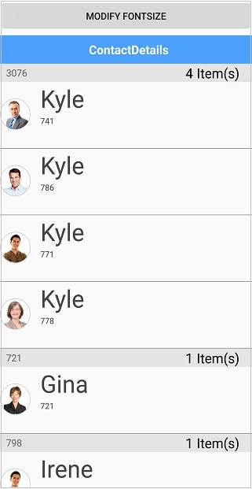
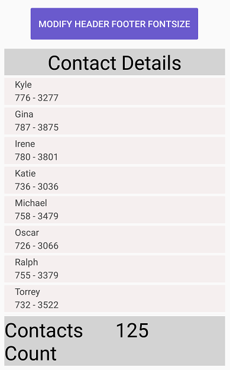

# Item Size Customization

This section explains how to customize the item size in the SfListView.

## Customize item size of a particular item on-demand

The SfListView allows customizing the size of the item on-demand by the [SfListView.QueryItemSize](https://help.syncfusion.com/cr/cref_files/xamarin/Syncfusion.SfListView.XForms~Syncfusion.ListView.XForms.SfListView~QueryItemSize_EV.html) event using the item index. This event is raised whenever items come to view and triggered with [QueryItemSizeEventArgs](https://help.syncfusion.com/cr/cref_files/xamarin/Syncfusion.SfListView.XForms~Syncfusion.ListView.XForms.QueryItemSizeEventArgs.html).

The `SfListView.QueryItemSize` event provides the following properties in their arguments:

 * [ItemIndex](https://help.syncfusion.com/cr/cref_files/xamarin/Syncfusion.SfListView.XForms~Syncfusion.ListView.XForms.QueryItemSizeEventArgs~ItemIndex.html): Identifies a particular item in the SfListView. 
 * [ItemData](https://help.syncfusion.com/cr/cref_files/xamarin/Syncfusion.SfListView.XForms~Syncfusion.ListView.XForms.QueryItemSizeEventArgs~ItemData.html): Identifies the underlying data bound to that item.
 * [ItemSize](https://help.syncfusion.com/cr/cref_files/xamarin/Syncfusion.SfListView.XForms~Syncfusion.ListView.XForms.QueryItemSizeEventArgs~ItemSize.html): Identifies size of the queried item. For vertical orientation, it will be considered as the item height. For horizontal orientation, it will be considered as the item width.
 * [ItemType](https://help.syncfusion.com/cr/cref_files/xamarin/Syncfusion.SfListView.XForms~Syncfusion.ListView.XForms.QueryItemSizeEventArgs~ItemType.html): Identifies the item type of the queried item.
 * [Handled](https://help.syncfusion.com/cr/cref_files/xamarin/Syncfusion.SfListView.XForms~Syncfusion.ListView.XForms.QueryItemSizeEventArgs~Handled.html): Decides whether the specified size can be set to the item or not. The default value is false. When this property is not set, the decided size will not set to the item.



this.listView.QueryItemSize += ListView_QueryItemSize;

private void ListView_QueryItemSize(object sender, Syncfusion.ListView.XForms.QueryItemSizeEventArgs e)
{
    if(e.ItemIndex == 1)
    {
        e.ItemSize = 300;
        e.Handled = true;
    }
}



You can download the entire source code of this demo [here](http://www.syncfusion.com/downloads/support/directtrac/general/ze/CustomizeItems171985138).

## AutoFit the items based on the content

The SfListView allows dynamically adjusting size of items based on the content loaded in the [SfListView.ItemTemplate](https://help.syncfusion.com/cr/cref_files/xamarin/Syncfusion.SfListView.XForms~Syncfusion.ListView.XForms.SfListView~ItemTemplate.html) by defining the [SfListView.AutoFitMode](https://help.syncfusion.com/cr/cref_files/xamarin/Syncfusion.SfListView.XForms~Syncfusion.ListView.XForms.SfListView~AutoFitMode.html) property.

You need to call the [ForceUpdateItemSize](https://help.syncfusion.com/cr/cref_files/xamarin/Syncfusion.SfListView.XForms~Syncfusion.ListView.XForms.SfListView~ForceUpdateItemSize.html) method to force the update for [ListViewItem](https://help.syncfusion.com/cr/cref_files/xamarin/Syncfusion.SfListView.XForms~Syncfusion.ListView.XForms.ListViewItem.html) size if it is changed at runtime when `SfListView.AutoFitMode` is `AutoFitMode.Height`. This operation is expensive. so need to avoid repeated/unwanted usage. Here, `ItemIndex` is used as optional parameter. If needs to update particular item, then pass that item's index.




listview.ForceUpdateItemSize();



The control has two types of AutoFitMode as listed as follows:

 * Height: AutoFit the items based on the content. It considers height of the item when the orientation is vertical [SfListView.Orientation](https://help.syncfusion.com/cr/cref_files/xamarin/Syncfusion.SfListView.XForms~Syncfusion.ListView.XForms.SfListView~Orientation.html). When the orientation is horizontal, considers width of the item. The [SfListView.GridLayout](https://help.syncfusion.com/cr/cref_files/xamarin/Syncfusion.SfListView.XForms~Syncfusion.ListView.XForms.GridLayout.html) AutoFit all the items in a row and takes the maximum item height of the row and applies to all other items in that row.
 * None: The SfListView items are layout by [SfListView.ItemSize](https://help.syncfusion.com/cr/cref_files/xamarin/Syncfusion.SfListView.XForms~Syncfusion.ListView.XForms.SfListView~ItemSize.html).



<ContentPage xmlns:syncfusion="clr-namespace:Syncfusion.ListView.XForms;assembly=Syncfusion.SfListView.XForms">
  <syncfusion:SfListView x:Name="listView" 
                    ItemSize="200"
                    AutoFitMode="Height"
                    ItemsSource="{Binding BookInfo}" />
</ContentPage>


listView.AutoFitMode = AutoFitMode.Height; 



N> If you define any size manually to the view loaded in [SfListView.ItemTemplate](https://help.syncfusion.com/cr/cref_files/xamarin/Syncfusion.SfListView.XForms~Syncfusion.ListView.XForms.SfListView~ItemTemplate.html), the SfListView will return that size as the item size for each item. 

You can download the entire source code of this demo [here](http://www.syncfusion.com/downloads/support/directtrac/general/ze/AutoFitItems-252477562).

## Updating the listviewitem size based on font at runtime

ListView allows you to resize the item size based on the change in font size of the label element at runtime by calling [RefreshListViewItem](https://help.syncfusion.com/cr/cref_files/xamarin/Syncfusion.SfListView.XForms~Syncfusion.ListView.XForms.SfListView~RefreshListViewItem.html) method asynchronously when [SfListView.AutoFitMode](https://help.syncfusion.com/cr/cref_files/xamarin/Syncfusion.SfListView.XForms~Syncfusion.ListView.XForms.SfListView~AutoFitMode.html) is Height.



<ContentPage xmlns:syncfusion="clr-namespace:Syncfusion.ListView.XForms;assembly=Syncfusion.SfListView.XForms">       
 <Grid>
    <Grid.RowDefinitions>
        <RowDefinition Height="50"/>
        <RowDefinition Height="*"/>
    </Grid.RowDefinitions>
    <Button Text="Modify FontSize" Clicked="Button_Clicked" />
    <syncfusion:SfListView x:Name="listView" 
                ItemsSource="{Binding Items}"
                BackgroundColor="#FFE8E8EC"
                AutoFitMode="Height"
                ItemSize="60">
        <syncfusion:SfListView.ItemTemplate>
            <DataTemplate>
                <Grid x:Name="grid" RowSpacing="1">
                    <Label LineBreakMode="NoWrap"
                    TextColor="#474747" FontSize="{Binding BindingContext.FontSize, Source={x:Reference Name=listView}}"
                    Text="{Binding ContactName}">
                    </Label>
                </Grid>
            </DataTemplate>
        </syncfusion:SfListView.ItemTemplate>
    </syncfusion:SfListView>                
</ContentPage>


private void Button_Clicked(object sender, EventArgs e)
{
    ViewModel.FontSize += 25;
    Device.BeginInvokeOnMainThread(() => { listView.RefreshListViewItem(0, 22, false); });
}



## Updating the Header and Footer height based on font at runtime

ListView allows you to resize the header and footer item size based on the change in font size of the label element at runtime by calling [RefreshListViewItem](https://help.syncfusion.com/cr/cref_files/xamarin/Syncfusion.SfListView.XForms~Syncfusion.ListView.XForms.SfListView~RefreshListViewItem.html) method asynchronously when [SfListView.AutoFitMode](https://help.syncfusion.com/cr/cref_files/xamarin/Syncfusion.SfListView.XForms~Syncfusion.ListView.XForms.SfListView~AutoFitMode.html) is Height.



<ContentPage xmlns:syncfusion="clr-namespace:Syncfusion.ListView.XForms;assembly=Syncfusion.SfListView.XForms">       
 <Grid>
    <Grid.RowDefinitions>
        <RowDefinition Height="50"/>
        <RowDefinition Height="*"/>
    </Grid.RowDefinitions>
    <Button Text="Change FontSize" Command="{Binding Resize}" CommandParameter="{x:Reference listView}"/>
    <syncfusion:SfListView x:Name="listView" 
                ItemsSource="{Binding contactsinfo}"
                BackgroundColor="#FFE8E8EC"
                AutoFitMode="Height">
                <syncfusion:SfListView.HeaderTemplate>
                    <DataTemplate>
                        <ViewCell>
                            <Grid>
                                <Label Text="Contact Details"
                                       FontSize="{Binding BindingContext.FontSize, Source={x:Reference listView}}"/>
                            </Grid>
                        </ViewCell>
                    </DataTemplate>
                </syncfusion:SfListView.HeaderTemplate>
                <syncfusion:SfListView.FooterTemplate>
                    <DataTemplate>
                        <ViewCell>
                            <Grid >
                                <Label Text="Contacts Count" FontSize="{Binding BindingContext.FontSize, Source={x:Reference listView}}"/>
                                <Label Text="{Binding contactsinfo.Count}" FontSize="{Binding BindingContext.FontSize, Source={x:Reference listView}}"/>
                            </Grid>
                        </ViewCell>
                    </DataTemplate>
                </syncfusion:SfListView.FooterTemplate>
    </syncfusion:SfListView>                
</ContentPage>


namespace SfListViewSample
{
    public class ContactsViewModel : INotifyPropertyChanged
    {
        public Command Resize { get; set; }
        private double MaxPhone = 70;
        private double MinPhone = 20;
        private double MaxTablet = 100;
        private double MinTablet = 30;
        public ContactsViewModel()
        {
           Resize = new Command(ResizeHeaderFooter);
        }
        private void ResizeHeaderFooter(object obj)
        {
            list = obj as SfListView;
            var maxFont = Device.Idiom == TargetIdiom.Phone ? MaxPhone : MaxTablet;
            var minFont = (Device.Idiom == TargetIdiom.Phone) ? MinPhone : MinTablet;
            if (FontSize >= maxFont)
            {
                FontSize = minFont;
                list.RefreshListViewItem(-1, -1, true);
            }
            else
            {
                FontSize += 10;
                list.RefreshListViewItem(-1, -1, true);
            }
        }
    }
}       



You can download entire source code [here](http://www.syncfusion.com/downloads/support/directtrac/general/ze/HeaderFooterFontSize-1315751035).

## Load images with autofit mode

By default, the image is not loaded with the actual size in autofit mode, as it measures the size before the layout. So, the size of the child view changes cannot be found from the parent view. It is a known issue in listview, but this can be overcome by calling the `RefreshListViewItem` method in the loaded event of listview.



<ContentPage xmlns:syncfusion="clr-namespace:Syncfusion.ListView.XForms;assembly=Syncfusion.SfListView.XForms">
    <ContentPage.Content>
        <Grid>
            <syncfusion:SfListView x:Name="listView" 
                                   AutoFitMode="Height"
                                   ItemsSource="{Binding ContactsInfo}"
                                   Loaded="ListView_Loaded">
                <syncfusion:SfListView.ItemTemplate>
                    <DataTemplate>
                        <StackLayout>
                            <StackLayout>
                                <Label Text="{Binding ContactName}" />
                                <Label Text="{Binding ContactNumber}"  />
                            </StackLayout>
                            <Image Source="{Binding ContactImage}"  />
                        </StackLayout>
                    </DataTemplate>
                </syncfusion:SfListView.ItemTemplate>
            </syncfusion:SfListView>
        </Grid>
    </ContentPage.Content>
</ContentPage>


private void ListView_Loaded(object sender, Syncfusion.ListView.XForms.ListViewLoadedEventArgs e)
{
    Device.BeginInvokeOnMainThread(async() =>
    {
        await Task.Delay(100);
        listView.RefreshListViewItem();
    });
}



## Limitations

 * Defines the size of the image when loading image in the [SfListView.ItemTemplate](https://help.syncfusion.com/cr/cref_files/xamarin/Syncfusion.SfListView.XForms~Syncfusion.ListView.XForms.SfListView~ItemTemplate.html). Because, it does not return actual measured size when measuring before layout the item.
 * Avoid SfListView inside the SfListView if [SfListView.AutoFitMode](https://help.syncfusion.com/cr/cref_files/xamarin/Syncfusion.SfListView.XForms~Syncfusion.ListView.XForms.SfListView~AutoFitMode.html) is height. Because, the inner SfListView does not return actual measured size when measuring before layout the item.
