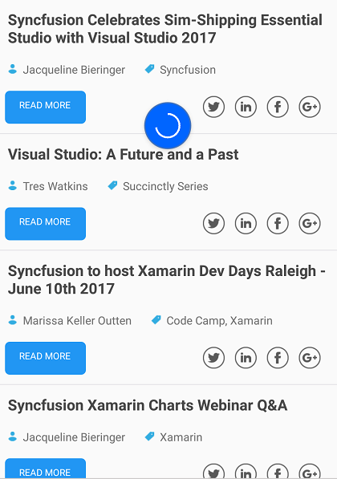

# Pull To Refresh 

SfListView allows enabling the `PullToRefresh` support by loading it directly into the [PullableContent](https://help.syncfusion.com/cr/cref_files/xamarin/sfpulltorefresh/Syncfusion.SfPullToRefresh.XForms~Syncfusion.SfPullToRefresh.XForms.SfPullToRefresh~PullableContent.html). The control supports refreshing the data in view while performing the `PullToRefresh` action at runtime.

N> Load the SfListView as first children of `PullableContent` for the `PullToRefresh`.



<pullToRefresh:SfPullToRefresh x:Name="pullToRefresh"
                               ProgressBackgroundColor="#428BCA" RefreshContentHeight="50" 
                               RefreshContentWidth="50" TransitionMode="Push" IsRefreshing="False">
  <pullToRefresh:SfPullToRefresh.PullableContent>
    <syncfusion:SfListView x:Name="listView" ItemSize="120"
                           SelectionMode="None">
    </syncfusion:SfListView>
  </pullToRefresh:SfPullToRefresh.PullableContent>
</pullToRefresh:SfPullToRefresh>


public ListViewPullToRefresh()
{
   InitializeComponent();
   //Initializing the PullToRefresh control.
   SfPullToRefresh pullToRefresh = new SfPullToRefresh();
   pullToRefresh.RefreshContentHeight = 50;
   pullToRefresh.RefreshContentWidth = 50;
   pullToRefresh.TransitionMode = TransitionType.Push;
   pullToRefresh.IsRefreshing = false;
   
   //Initializing the SfListView control.
   var listView = new SfListView();
   listView.ItemSize = 120;
   listView.SelectionMode = SelectionMode.None;
   
   //loading listview into pulltorefresh
   pullToRefresh.PullableContent = listView;
}



### Load the data into SfListView on pull-to-refresh

The SfListView allows refreshing the data in view at runtime by using the [Refreshing](https://help.syncfusion.com/cr/cref_files/xamarin/sfpulltorefresh/Syncfusion.SfPullToRefresh.XForms~Syncfusion.SfPullToRefresh.XForms.SfPullToRefresh~Refreshing_EV.html) event. The `Refreshing` event gets triggered once the progress bar meets 100 %. The data can be added into the underlying collection, and the data gets updated in view once the `Refreshing` event gets completed.



pullToRefresh.Refreshing += PullToRefresh_Refreshing;

private async void PullToRefresh_Refreshing(object sender, EventArgs args)
{
   pullToRefresh.IsRefreshing = true;
   await Task.Delay(2000);
 
   for (int i = 0; i < 3; i++)
   {
      var blogsCount = pullToRefreshViewModel.BlogsInfo.Count;
      var item = new ListViewBlogsInfo()
      {
         BlogTitle = pullToRefreshViewModel.BlogsTitle[blogsTitleCount - blogsCount],
         BlogAuthor = pullToRefreshViewModel.BlogsAuthors[blogsAuthorCount - blogsCount],
         BlogCategory = pullToRefreshViewModel.BlogsCategory[blogsCategoryCount - blogsCount],
         ReadMoreContent = pullToRefreshViewModel.BlogsReadMoreInfo[blogsReadMoreCount - blogsCount],
      };
      pullToRefreshViewModel.BlogsInfo.Insert(0, item);
   }
   pullToRefresh.IsRefreshing = false;
}



Now run the application to render the following output. You can also download the entire source code of this demo from [here](http://www.syncfusion.com/downloads/support/directtrac/general/ze/Listview_Sfpulltorefresh1602348765).

## Limitation

The SfListView does not supports for `PullToRefresh` when [Orientation](https://help.syncfusion.com/cr/cref_files/xamarin/sflistview/Syncfusion.SfListView.XForms~Syncfusion.ListView.XForms.SfListView~Orientation.html) is `Horizontal`.
