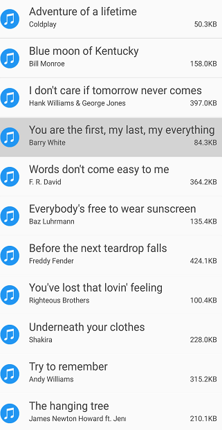

# Selection

This section explains about how to perform selection in SfListView and its related operations in SfListView.

## UI Selection

SfListView lets you to select the items either programmatically or by touch interactions. To enable selection in SfListView, you need to set the [SelectionMode](https://help.syncfusion.com/cr/cref_files/xamarin/sflistview/Syncfusion.SfListView.XForms~Syncfusion.ListView.XForms.SfListView~SelectionMode.html) property value to other than `None`. SfListView has different selection modes to perform selection operation as listed below.

* None: Disables the selection.
* Single: Allows you to select a single item only. When you click on the selected item, selection gets cleared. This is the default value for `SelectionMode`.
* Multiple: Allows you to select more than one item. Selection is not cleared when selecting more than one items. When you click on the selected item, selection gets cleared.

SfListView allows you to select the items on different gestures such as tap, double tap and hold. This can be achieved by setting the [SelectionGesture](https://help.syncfusion.com/cr/cref_files/xamarin/sflistview/Syncfusion.SfListView.XForms~Syncfusion.ListView.XForms.SfListView~SelectionGesture.html). The default value for the `SelectionGesture` is [TouchGesture.Tap](https://help.syncfusion.com/cr/cref_files/xamarin/sflistview/Syncfusion.SfListView.XForms~Syncfusion.ListView.XForms.TouchGesture.html).


listView.SelectionMode = SelectionMode.Multiple;
listView.SelectionGesture = TouchGesture.Hold;


The following screenshot shows the output rendered when the selection is performed on the items.

## Programmatic Selection

When [SelectionMode](https://help.syncfusion.com/cr/cref_files/xamarin/sflistview/Syncfusion.SfListView.XForms~Syncfusion.ListView.XForms.SfListView~SelectionMode.html) is other than `None`, you can select the item / items in SfListView from the code by setting the [SelectedItem](https://help.syncfusion.com/cr/cref_files/xamarin/sflistview/Syncfusion.SfListView.XForms~Syncfusion.ListView.XForms.SfListView~SelectedItem.html) or adding items to the [SelectedItems](https://help.syncfusion.com/cr/cref_files/xamarin/sflistview/Syncfusion.SfListView.XForms~Syncfusion.ListView.XForms.SfListView~SelectedItems.html) property based on the `SelectionMode`.

When the selection mode is `Single` you can programmatically select an item by setting the underlying object to the `SelectedItem` property. 



//Perform selection using selected item
listView.SelectedItem = viewModel.Items[5];


When the selection mode is `Multiple` you can programmatically select more than one item by adding the underlying object to the `SelectedItems` property. 

 
//Perform multiple selection using selected items
listView.SelectedItems.Add (viewModel.Items [4]);
listView.SelectedItems.Add (viewModel.Items[5]);


You can select all the items of SfListView by using [SelectAll](https://help.syncfusion.com/cr/cref_files/xamarin/sflistview/Syncfusion.SfListView.XForms~Syncfusion.ListView.XForms.SfListView~SelectAll.html) method.

 
listView.SelectAll();


## Get Selected Items

SfListView allows you to get all the selected items through [SelectedItems](https://help.syncfusion.com/cr/cref_files/xamarin/sflistview/Syncfusion.SfListView.XForms~Syncfusion.ListView.XForms.SfListView~SelectedItems.html) property.

N>  You cannot set or bind the value to the `SelectedItems` property, you can only add, remove or reset the items to the predefined value of `SelectedItems` property to update the selection.

### CurrentItem vs SelectedItem

SfListView allows you to get the selected item by using [SelectedItem](https://help.syncfusion.com/cr/cref_files/xamarin/sflistview/Syncfusion.SfListView.XForms~Syncfusion.ListView.XForms.SfListView~SelectedItem.html) and [CurrentItem](https://help.syncfusion.com/cr/cref_files/xamarin/sflistview/Syncfusion.SfListView.XForms~Syncfusion.ListView.XForms.SfListView~CurrentItem.html) properties. Both `SelectedItem` and `CurrentItem` returns the same data object when single item is selected. When more than one items are selected, then `SelectedItem` property returns the first selected item and `CurrentItem` property returns the last selected item.

N> `SelectedItem` and `CurrentItem` properties will be based on `ItemsSource` value. so, you need to define the value which contains in underlying collection to `SelectedItem` or `CurrentItem` property to update the selection.

## Clear Selected Items
You can clear the selected items by calling the [SelectedItems.Clear()](https://help.syncfusion.com/cr/cref_files/xamarin/sflistview/Syncfusion.SfListView.XForms~Syncfusion.ListView.XForms.SfListView~SelectedItems.html) method.


listView.SelectedItems.Clear();


## Selection Background Color

SfListView allows you change the selection background color for the selected items by using [SelectionBackgroundColor](https://help.syncfusion.com/cr/cref_files/xamarin/sflistview/Syncfusion.SfListView.XForms~Syncfusion.ListView.XForms.SfListView~SelectionBackgroundColor.html) property. You can also able to change the selection background color at run time.


listView.SelectionBackgroundColor = Color.Blue;


## Selection Events

### SelectionChanging Event

[SelectionChanging](https://help.syncfusion.com/cr/cref_files/xamarin/sflistview/Syncfusion.SfListView.XForms~Syncfusion.ListView.XForms.SfListView~SelectionChanging_EV.html) event is raised while selecting an item at the execution time before the item is selected. [ItemSelectionChangingEventArgs](https://help.syncfusion.com/cr/cref_files/xamarin/sflistview/Syncfusion.SfListView.XForms~Syncfusion.ListView.XForms.ItemSelectionChangingEventArgs.html) has the following members which provides the information for `SelectionChanging` event.

* AddedItems – Gets the collection of underlying data objects where the selection going to process.
* RemovedItems – Gets the collection of underlying data objects where the selection going to remove.

You can cancel the selection process within this event by setting `ItemSelectionChangingEventArgs.Cancel` property as true.

The following code example illustrates how to hook the `SelectionChanging` event and cancel the selection of an item.


listView.SelectionChanging += ListView_SelectionChanging;  

private void ListView_SelectionChanging(object sender, ItemSelectionChangingEventArgs e)
{
  if (e.AddedItems.Count > 0 && e.AddedItems[0] == ViewModel.Items[0])
      e.Cancel = true;
}


### SelectionChanged Event

The [SelectionChanged](https://help.syncfusion.com/cr/cref_files/xamarin/sflistview/Syncfusion.SfListView.XForms~Syncfusion.ListView.XForms.SfListView~SelectionChanged_EV.html) event will occurs once the selection process has been completed for the selected item in SfListView. [ItemSelectionChangedEventArgs](https://help.syncfusion.com/cr/cref_files/xamarin/sflistview/Syncfusion.SfListView.XForms~Syncfusion.ListView.XForms.ItemSelectionChangedEventArgs.html) has following members which provides information for `SelectionChanged` event.

* AddedItems – Gets the collection of underlying data objects where the selection has been processed.
* RemovedItems – Gets the collection of underlying data objects from where the selection has been removed.


listView.SelectionChanged += ListView_OnSelectionChanged;  

private void ListView_OnSelectionChanged(object sender, ItemSelectionChangedEventArgs e)
{
   listView.SelectedItems.Clear();
}


N> [SelectionChanging](https://help.syncfusion.com/cr/cref_files/xamarin/sflistview/Syncfusion.SfListView.XForms~Syncfusion.ListView.XForms.SfListView~SelectionChanging_EV.html) and [SelectionChanged](https://help.syncfusion.com/cr/cref_files/xamarin/sflistview/Syncfusion.SfListView.XForms~Syncfusion.ListView.XForms.SfListView~SelectionChanged_EV.html) events will be triggered only on UI interactions.

## Customize the Selected Items

SfListView allows to customize the appearance of selected item/items. The following customizations should give you an idea about how to customize the appearance of selected items in SfListView. 


<ContentPage>
  <ContentPage.Resources>
    <ResourceDictionary>
      <local:SelectionBoolToImageConverter x:Key="BoolToImageConverter"/>
    </ResourceDictionary>
  </ContentPage.Resources>
  <syncfusion:SfListView x:Name="listView">
    <syncfusion:SfListView.ItemTemplate>
      <DataTemplate>
        <Image x:Name="selectionImage" Margin="10,0,10,0"
               Source="{Binding Path=IsSelected, Converter={StaticResource BoolToImageConverter}}"/>
      </DataTemplate>
    </syncfusion:SfListView.ItemTemplate>
  </syncfusion:SfListView>
</ContentPage>




public class SelectionBoolToImageConverter : IValueConverter
{
   public object Convert(object value, Type targetType, object parameter, CultureInfo culture)
   {
      if ((bool)value)
         return ImageSource.FromResource("CustomSelection.Images.Selected.png");
      else
         return ImageSource.FromResource("CustomSelection.Images.NotSelected.png");
   }

   public object ConvertBack(object value, Type targetType, object parameter, CultureInfo culture)
   {
      throw new NotImplementedException();
   }
}



In the above example, to change the appearance of selected item, `IsSelected` property is maintained in model class and binded to an image element in the [ItemTemplate](https://help.syncfusion.com/cr/cref_files/xamarin/sflistview/Syncfusion.SfListView.XForms~Syncfusion.ListView.XForms.SfListView~ItemTemplate.html). And `IsSelected` property of data item has been updated based on the selection from `SelectionChanged` event of SfListView. The binded image's source is changed by using `SelectionBoolToImageConverter` converter. 

Now run the application to render the following output. You can download the entire source code of this demo from [here](http://files2.syncfusion.com/Xamarin.Forms/Samples/CustomSelection.zip).

