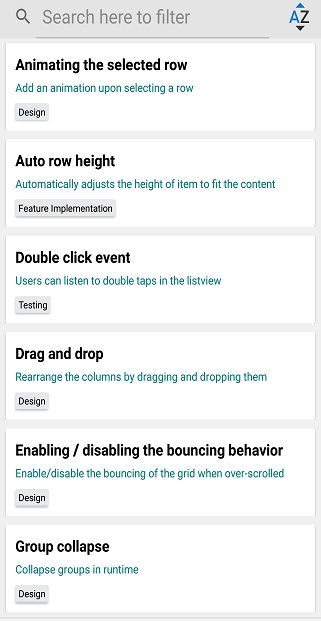
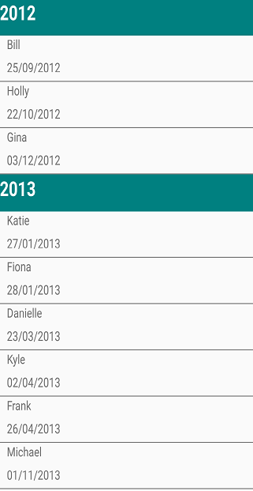
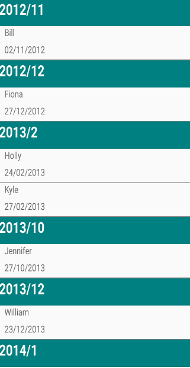

# Sorting 

The SfListView supports sorting the data either in ascending or descending order by using [DataSource.SortDescriptors](https://help.syncfusion.com/cr/cref_files/xamarin/datasource/Syncfusion.DataSource.Portable~Syncfusion.DataSource.DataSource~SortDescriptors.html) property and by using the custom logic.

## Programmatic Sorting

Sorting the data by creating the [SortDescriptor](https://help.syncfusion.com/cr/cref_files/xamarin/datasource/Syncfusion.DataSource.Portable~Syncfusion.DataSource.SortDescriptor.html) with required property name and direction and adding it into the [DataSource.SortDescriptors](https://help.syncfusion.com/cr/cref_files/xamarin/datasource/Syncfusion.DataSource.Portable~Syncfusion.DataSource.DataSource~SortDescriptors.html) property.

`SortDescriptor` object holds the following three properties:

* [PropertyName](https://help.syncfusion.com/cr/cref_files/xamarin/sflistview/Syncfusion.DataSource.Portable~Syncfusion.DataSource.SortDescriptor~PropertyName.html): Describes the name of the sorted property.
* [Direction](https://help.syncfusion.com/cr/cref_files/xamarin/sflistview/Syncfusion.DataSource.Portable~Syncfusion.DataSource.SortDescriptor~Direction.html): Describes an object of type [ListSortDirection](https://help.syncfusion.com/cr/cref_files/xamarin/datasource/Syncfusion.DataSource.Portable~Syncfusion.DataSource.ListSortDirection.html) that defines the sorting direction.
* [Comparer](https://help.syncfusion.com/cr/cref_files/xamarin/sflistview/Syncfusion.DataSource.Portable~Syncfusion.DataSource.SortDescriptor~Comparer.html): Describes the comparer to be applied when sorting take place.



<ContentPage xmlns:syncfusion="clr-namespace:Syncfusion.ListView.XForms;assembly=Syncfusion.SfListView.XForms"
             xmlns:data="clr-namespace:Syncfusion.DataSource;assembly=Syncfusion.DataSource.Portable">
  <syncfusion:SfListView x:Name="listView">
    <syncfusion:SfListView.DataSource>
      <data:DataSource>
        <data:DataSource.SortDescriptors>
          <data:SortDescriptor PropertyName="ContactName" Direction="Ascending"/>
        </data:DataSource.SortDescriptors>
      </data:DataSource>
    </syncfusion:SfListView.DataSource>
  </syncfusion:SfListView>
</ContentPage>


listView.DataSource.SortDescriptors.Add(new SortDescriptor()
{
  PropertyName = "ContactName",
  Direction = ListSortDirection.Ascending,
}); 
listView.RefreshView();



N> It is mandatory to specify the `PropertyName` of `SortDescriptor`.

## Custom Sorting

Sort the items based on the custom logic and it can be applied to either [SfListView.DataSource.SortComparer](https://help.syncfusion.com/cr/cref_files/xamarin/datasource/Syncfusion.DataSource.Portable~Syncfusion.DataSource.DataSource~SortComparer.html) property or [SortDescriptor.Comparer](https://help.syncfusion.com/cr/cref_files/xamarin/datasource/Syncfusion.DataSource.Portable~Syncfusion.DataSource.SortDescriptor~Comparer.html) which is added into the [DataSource.SortDescriptors](https://help.syncfusion.com/cr/cref_files/xamarin/datasource/Syncfusion.DataSource.Portable~Syncfusion.DataSource.DataSource~SortDescriptors.html) collection.



<ContentPage xmlns:syncfusion="clr-namespace:Syncfusion.ListView.XForms;assembly=Syncfusion.SfListView.XForms"
             xmlns:data="clr-namespace:Syncfusion.DataSource;assembly=Syncfusion.DataSource.Portable">
  <ContentPage.Resources>
    <ResourceDictionary>
      <local:CustomComparer x:Key="Comparer" />
    </ResourceDictionary>
  </ContentPage.Resources>
  <syncfusion:SfListView x:Name="listView"
    <syncfusion:SfListView.DataSource>
      <data:DataSource>
        <data:DataSource.SortDescriptors>
          <data:SortDescriptor PropertyName="ContactName" Direction="Ascending" 
                               Comparer="{StaticResource Comparer}"/>
        </data:DataSource.SortDescriptors>
      </data:DataSource>
    </syncfusion:SfListView.DataSource>
  </syncfusion:SfListView>
</ContentPage>


listView.DataSource.SortDescriptors.Add(new SortDescriptor()
{
  PropertyName = "ContactName",
  Direction = ListSortDirection.Ascending,
  Comparer = new CustomComparer()
});





public class CustomComparer : IComparer<object>, ISortDirection
{
  public int Compare(object x, object y)
  {
     int nameX;
     int nameY;

     //For Contacts Type data
     if (x.GetType() == typeof(Contacts))
     {
       //Calculating the length of ContactName if the object type is Contacts
       nameX = ((Contacts)x).ContactName.Length;
       nameY = ((Contacts)y).ContactName.Length;
     }
     else
     {
       nameX = x.ToString().Length;
       nameY = y.ToString().Length;
     }

     // Objects are compared and return the SortDirection
     if (nameX.CompareTo(nameY) > 0)
        return SortDirection == ListSortDirection.Ascending ? 1 : -1;
     else if (nameX.CompareTo(nameY) == -1)
        return SortDirection == ListSortDirection.Ascending ? -1 : 1;
     else
        return 0;
   }

   //Get or Set the SortDirection value
   private ListSortDirection _SortDirection;
   public ListSortDirection SortDirection
   {
     get { return _SortDirection; }
     set { _SortDirection = value; }
   }
}



## Sort the Items on Header Tapped

To apply the sorting when tapping the header, handle the [ItemTapped](https://help.syncfusion.com/cr/cref_files/xamarin/sflistview/Syncfusion.SfListView.XForms~Syncfusion.ListView.XForms.SfListView~ItemTapped_EV.html) event of the SfListView.



<ContentPage xmlns:syncfusion="clr-namespace:Syncfusion.ListView.XForms;assembly=Syncfusion.SfListView.XForms"
             xmlns:data="clr-namespace:Syncfusion.DataSource;assembly=Syncfusion.DataSource.Portable">
  <syncfusion:SfListView x:Name="listView" ItemSize="60"
                        ItemsSource="{Binding customerDetails}" 
                        ItemTapped="ListView_ItemTapped" 
                        IsStickyHeader="True">
    <syncfusion:SfListView.HeaderTemplate>
      <DataTemplate>
        <ViewCell>
          <ViewCell.View>
            <StackLayout BackgroundColor="Teal">
              <Label TextColor="White" FontSize="20" FontAttributes="Bold" Text="CustomerDetails" />
            </StackLayout>
          </ViewCell.View>
        </ViewCell>
      </DataTemplate>
    </syncfusion:SfListView.HeaderTemplate>
  </syncfusion:SfListView>
</ContentPage>


listView = new SfListView();
listView.ItemsSource = viewModel.customerDetails;
listView.ItemSize = 60;
listView.ItemTapped += ListView_ItemTapped;
listView.IsStickyHeader = true;
listView.HeaderTemplate = new DataTemplate(() => 
{
  var stackLayout = new StackLayout { BackgroundColor = Color.Teal };
  var label = new Label { Text = "CustomerDetails", TextColor = Color.White, 
                          FontAttributes = FontAttributes.Bold, FontSize = 20 };
  stackLayout.Children.Add(label);
  return stackLayout;
});



When the `ItemTapped` event is raised for the Header, add the [SortDescriptor](https://help.syncfusion.com/cr/cref_files/xamarin/datasource/Syncfusion.DataSource.Portable~Syncfusion.DataSource.SortDescriptor.html) and refresh the view.



private void ListView_ItemTapped(object sender, Syncfusion.ListView.XForms.ItemTappedEventArgs e)
{
  //Applying sorting to the underlying data when the header item is tapped.
  if (e.ItemType == ItemType.Header && listView.IsStickyHeader)
  {
    listView.DataSource.SortDescriptors.Clear();
    listView.DataSource.SortDescriptors.Add(new SortDescriptor()
    {
      PropertyName = "ContactName",
      Direction = ListSortDirection.Ascending
    });
  }
}



## How To

### Sort the Items along with Grouping
 
The SfListView allows sorting the items along with grouping by adding the [DataSource.GroupDescriptors](https://help.syncfusion.com/cr/cref_files/xamarin/datasource/Syncfusion.DataSource.Portable~Syncfusion.DataSource.DataSource~GroupDescriptors.html) and the [DataSource.SortDescriptors](https://help.syncfusion.com/cr/cref_files/xamarin/datasource/Syncfusion.DataSource.Portable~Syncfusion.DataSource.DataSource~SortDescriptors.html) with required property name. 

#### Sorting with Grouping Year

Sorting the items along with grouping by using [KeySelector](https://help.syncfusion.com/cr/cref_files/xamarin/datasource/Syncfusion.DataSource.Portable~Syncfusion.DataSource.GroupDescriptor~KeySelector.html) based on retuning the year value of the data-time property.



<ContentPage xmlns:syncfusion="clr-namespace:Syncfusion.ListView.XForms;assembly=Syncfusion.SfListView.XForms"
             xmlns:data="clr-namespace:Syncfusion.DataSource;assembly=Syncfusion.DataSource.Portable">
  <ContentPage.Content>
    <syncfusion:SfListView x:Name="listView" ItemsSource="{Binding Items}" ItemSize="50">
      <syncfusion:SfListView.GroupHeaderTemplate>
        <DataTemplate>
		  <Grid>
          <Label Text= "{Binding Key}" BackgroundColor="Teal" FontAttributes="Bold" TextColor="White"/>
		  </Grid>
        </DataTemplate>
      </syncfusion:SfListView.GroupHeaderTemplate>
    </syncfusion:SfListView>
  </ContentPage.Content>
</ContentPage>


var listView = new SfListView();
listView.ItemSize = 50;
listView.ItemsSource = viewModel.Items;
listView.GroupHeaderTemplate = new DataTemplate(() => 
{
   var grid = new Grid();
   var headerLabel = new Label
   {
   TextColor = Color.White,
   FontAttributes = FontAttributes.Bold,
   BackgroundColor=Color.Teal
   };
   headerLabel.SetBinding(Label.TextProperty, new Binding("key"));
   grid.Children.Add(headerLabel);
   return grid;
});
listView.DataSource.GroupDescriptors.Add(new GroupDescriptor()
{
  PropertyName = "DateOfBirth",
  KeySelector = (object obj1) =>
  {
   var item = (obj1 as Contacts);
   return item.DateOfBirth.Year;
  },
});
this.listView.DataSource.SortDescriptors.Add(new SortDescriptor()
{
  PropertyName = "DateOfBirth",
  Direction = ListSortDirection.Ascending
});



The following screenshot shows the output when items are sorted by year. You can download the entire source code from [here](http://www.syncfusion.com/downloads/support/directtrac/general/ze/ListViewSample1205954757)

#### Sorting with Grouping Month and Year

Sorting the items along with grouping by using `KeySelector` based on retuning the month and year value of the data-time property.



<ContentPage xmlns:syncfusion="clr-namespace:Syncfusion.ListView.XForms;assembly=Syncfusion.SfListView.XForms"
             xmlns:data="clr-namespace:Syncfusion.DataSource;assembly=Syncfusion.DataSource.Portable">
  <ContentPage.Content>
    <syncfusion:SfListView x:Name="listView">
      <syncfusion:SfListView.DataSource>
        <data:DataSource>
        <data:DataSource.GroupDescriptors>
            <data:GroupDescriptor PropertyName="ContactName" />
          </data:DataSource.GroupDescriptors>
          <data:DataSource.SortDescriptors>
            <data:SortDescriptor PropertyName="ContactName" Direction="Ascending"/>
          </data:DataSource.SortDescriptors>
        </data:DataSource>
      </syncfusion:SfListView.DataSource>
    </syncfusion:SfListView>
  </ContentPage.Content>
</ContentPage>


public partial class MainPage : ContentPage
{
   public MainPage()
   {
       InitializeComponent();
       listView.DataSource.GroupDescriptors.Add(new GroupDescriptor()
       {
           PropertyName = "DateOfBirth",
           KeySelector = (object obj1) =>
           {
               var item = (obj1 as Contacts);
               return item.DateOfBirth.Month + "/" + item.DateOfBirth.Year;
           },
           Comparer = new CustomGroupComparer()
       });
       this.listView.DataSource.SortDescriptors.Add(new SortDescriptor()
       {
           PropertyName = "DateOfBirth",
           Direction = ListSortDirection.Ascending
       });
   }
}



The following screenshot shows the output when items are sorted by month and year.

