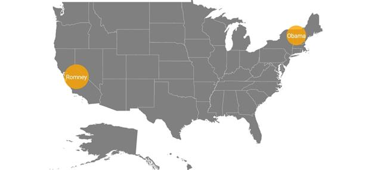

# Bubble marker

Bubbles in the maps control represents the underlying data values of the map. Bubbles are scattered throughout the map shapes that contain bound values.

Bubbles are included when the data binding and [`BubbleMarkerSettings`](https://help.syncfusion.com/cr/cref_files/xamarin/sfmaps/Syncfusion.SfMaps.XForms~Syncfusion.SfMaps.XForms.ShapeFileLayer~BubbleMarkerSettings.html# ) are set to the shape layers.

## Adding bubbles

To add bubbles to a map, the bubble marker setting should be added to the shape file layer. Create the Model and ViewModel as illustrated in the Data binding section, and add the following code. Also, set the [`MaxSize`](https://help.syncfusion.com/cr/cref_files/xamarin/sfmaps/Syncfusion.SfMaps.XForms~Syncfusion.SfMaps.XForms.BubbleMarkerSetting~MaxSize.html#), [`MinSize`](https://help.syncfusion.com/cr/cref_files/xamarin/sfmaps/Syncfusion.SfMaps.XForms~Syncfusion.SfMaps.XForms.BubbleMarkerSetting~MinSize.html#), [`ShowBubbles`](https://help.syncfusion.com/cr/cref_files/xamarin/sfmaps/Syncfusion.SfMaps.XForms~Syncfusion.SfMaps.XForms.BubbleMarkerSetting~ShowBubbles.html#), and [`ValuePath`](https://help.syncfusion.com/cr/cref_files/xamarin/sfmaps/Syncfusion.SfMaps.XForms~Syncfusion.SfMaps.XForms.BubbleMarkerSetting~ValuePath.html#) properties as illustrated in the following code sample.

Show map items should be enabled to display the label on bubble marker.





<maps:ShapeFileLayer  Uri="usa_state.shp"  ShapeIDPath="State"  ShapeIDTableField="STATE_NAME" 
ItemsSource="{Binding Data}  ShowMapItems="True"  />





ShapeFileLayer layer = new ShapeFileLayer();

layer.Uri = "usa_state.shp";

layer.ItemsSource = viewModel.Data;

layer.ShapeIDTableField = "STATE_NAME";

layer.ShapeIDPath = "State";

layer.ShowMapItems = true;

map.Layers.Add(layer);

public class ViewModel
    {
        public ObservableCollection<ElectionData> Data { get; set; }
        public ViewModel()
        {
            Data = new ObservableCollection<ElectionData>();
            Data.Add(new ElectionData("California", "Romney", 55));            
            Data.Add(new ElectionData("Vermont", "Obama", 3));
        }
    }





## Bubble marker customization

The fill color and opacity of the bubbles can be customized using the [`Fill`](https://help.syncfusion.com/cr/cref_files/xamarin/sfmaps/Syncfusion.SfMaps.XForms~Syncfusion.SfMaps.XForms.BubbleMarkerSetting~Fill.html#) and [`Opacity`](https://help.syncfusion.com/cr/cref_files/xamarin/sfmaps/Syncfusion.SfMaps.XForms~Syncfusion.SfMaps.XForms.BubbleMarkerSetting~Opacity.html#)  properties.

The following code explains the bubble marker customization.





<maps:ShapeFileLayer.BubbleMarkerSettings>

<maps:BubbleMarkerSetting ShowBubbles="True"  MaxSize="25" MinSize="20"

ValuePath="Electors" Fill="Orange" Opacity="0.8"                                                       

Fill="#ffa500" />

</maps:ShapeFileLayer.BubbleMarkerSettings>

<maps:ShapeFileLayer.ShapeSettings>

<maps:ShapeSetting ShapeValuePath="Candidate" />

</maps:ShapeFileLayer.ShapeSettings>





BubbleMarkerSetting bubbleSetting = new BubbleMarkerSetting();

bubbleSetting.ShowBubbles = true;

bubbleSetting.MinSize = 20;

bubbleSetting.MaxSize = 25;         

bubbleSetting.Fill = Color.Orange;

bubbleSetting.Opacity = 0.8;           

bubbleSetting.ValuePath = "Electors";

layer.BubbleMarkerSettings = bubbleSetting;

ShapeSetting shapeSetting = new ShapeSetting();

shapeSetting.ShapeValuePath = "Candidate";

layer.ShapeSettings = shapeSetting;





