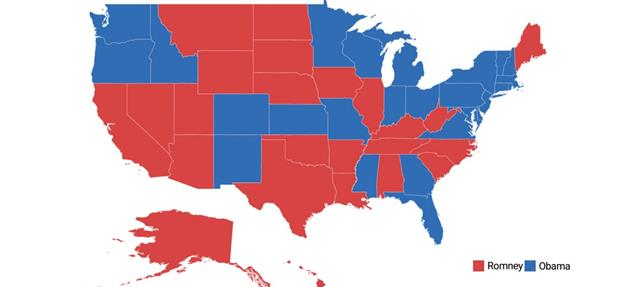

# Legend

A legend is a key used on a map that contains swatches of symbols with descriptions. A legend interprets what the map displays; it can be represented in various colors, shapes, or other identifiers based on the data. It gives a breakdown of what each symbol represents throughout the map.
Legends can be added with the help of [`LegendSettings`](https://help.syncfusion.com/cr/cref_files/xamarin/sfmaps/Syncfusion.SfMaps.XForms~Syncfusion.SfMaps.XForms.ShapeFileLayer~LegendSettings.html) in the shape file layer.

## Visibility

The legends can be made visible by setting the [`ShowLegend`](https://help.syncfusion.com/cr/cref_files/xamarin/sfmaps/Syncfusion.SfMaps.XForms~Syncfusion.SfMaps.XForms.MapLegendSetting~ShowLegend.html#) property in [`MapLegendSetting`](https://help.syncfusion.com/cr/cref_files/xamarin/sfmaps/Syncfusion.SfMaps.XForms~Syncfusion.SfMaps.XForms.MapLegendSetting.html#) to true.





<maps:ShapeFileLayer.LegendSettings>

<maps:MapLegendSetting ShowLegend="True"></maps:MapLegendSetting>

</maps:ShapeFileLayer.LegendSettings>





MapLegendSetting legendSetting = new MapLegendSetting();

legendSetting.ShowLegend = true;

layer.LegendSettings = legendSetting;





## Legend position

Based on the margin values of x and y-axes, the legends can be positioned using the [`LegendPosition`](https://help.syncfusion.com/cr/cref_files/xamarin/sfmaps/Syncfusion.SfMaps.XForms~Syncfusion.SfMaps.XForms.MapLegendSetting~LegendPosition.html#) property of [`MapLegendSetting`](https://help.syncfusion.com/cr/cref_files/xamarin/sfmaps/Syncfusion.SfMaps.XForms~Syncfusion.SfMaps.XForms.MapLegendSetting.html#) class.





<maps:ShapeFileLayer.LegendSettings>

<maps:MapLegendSetting ShowLegend="True" LegendPosition="75,90"></maps:MapLegendSetting>

</maps:ShapeFileLayer.LegendSettings>





MapLegendSetting legendSetting = new MapLegendSetting();

legendSetting.ShowLegend = true;

legendSetting.LegendPosition = new Point(75, 90);

layer.LegendSettings = legendSetting;





## Icon customization

The icon size of a legend can be customized using the [`IconSize`](https://help.syncfusion.com/cr/cref_files/xamarin/sfmaps/Syncfusion.SfMaps.XForms~Syncfusion.SfMaps.XForms.MapLegendSetting~IconSize.html#) property.





<maps:ShapeFileLayer.LegendSettings>

<maps:MapLegendSetting ShowLegend="True" LegendPosition="75,90">

<maps:MapLegendSetting.IconSize>

<Size Width="20" Height="20"/>

</maps:MapLegendSetting.IconSize>

</maps:MapLegendSetting>

</maps:ShapeFileLayer.LegendSettings>





MapLegendSetting legendSetting = new MapLegendSetting();

legendSetting.ShowLegend = true;

legendSetting.LegendPosition = new Point(75, 90);

legendSetting.IconSize = new Size(20, 0);

layer.LegendSettings = legendSetting;





## Legend label

[`LegendLabel`](https://help.syncfusion.com/cr/cref_files/xamarin/sfmaps/Syncfusion.SfMaps.XForms~Syncfusion.SfMaps.XForms.ColorMapping~LegendLabel.html) provides an information about the map content. It is specified under color mapping.





<maps:ShapeSetting.ColorMappings>
<maps:EqualColorMapping Color="#D84444" Value="Romney" LegendLabel="Romney"/>
<maps:EqualColorMapping Color="#316DB5" Value="Obama" LegendLabel="Obama"/>
</maps:ShapeSetting.ColorMappings>





EqualColorMapping colorMapping = new EqualColorMapping();

colorMapping.Color = Color.FromHex("#D84444");

colorMapping.LegendLabel = "Romney";

colorMapping.Value = "Romney";

EqualColorMapping colorMapping1 = new EqualColorMapping();

colorMapping1.Color = Color.FromHex("#316DB5");

colorMapping1.LegendLabel = "Obama";

colorMapping1.Value = "Obama";





The following code snippet explains the complete code for adding legend along with its customization.





<maps:SfMaps x:Name="sfmap"  BackgroundColor="White">
                <maps:SfMaps.Layers>
                    
                    <maps:ShapeFileLayer Uri="usa_state.shp" ItemsSource="{Binding Data}"
                                         ShapeIDPath="State" ShapeIDTableField="STATE_NAME" >

                        <maps:ShapeFileLayer.LegendSettings>
                            <maps:MapLegendSetting ShowLegend="True"  LegendPosition="75,90">
                                <maps:MapLegendSetting.IconSize>
                                    <Size Width="20" Height="20"/>
                                </maps:MapLegendSetting.IconSize>
                            </maps:MapLegendSetting>
                        </maps:ShapeFileLayer.LegendSettings>

                        <maps:ShapeFileLayer.ShapeSettings>
                            <maps:ShapeSetting ShapeColorValuePath="Candidate" ShapeValuePath="Candidate">
                                <maps:ShapeSetting.ColorMappings>
                                    <maps:EqualColorMapping Color="#D84444" Value="Romney"
                                                            LegendLabel="Romney"/>
                                    <maps:EqualColorMapping Color="#316DB5" Value="Obama" 
                                                            LegendLabel="Obama"/>
                                </maps:ShapeSetting.ColorMappings>
                            </maps:ShapeSetting>
                        </maps:ShapeFileLayer.ShapeSettings>

                    </maps:ShapeFileLayer>
                </maps:SfMaps.Layers>
            </maps:SfMaps>





SfMaps map = new SfMaps();

            map.BackgroundColor = Color.White;

            ShapeFileLayer layer = new ShapeFileLayer();

            layer.Uri = "usa_state.shp";

            layer.ItemsSource = viewModel.Data;

            layer.ShapeIDTableField = "STATE_NAME";

            layer.ShapeIDPath = "State";

            map.Layers.Add(layer);

            MapLegendSetting legendSetting = new MapLegendSetting();

            legendSetting.ShowLegend = true;

            legendSetting.LegendPosition = new Point(75, 90);

            legendSetting.IconSize = new Size(20, 20);

            layer.LegendSettings = legendSetting;

            EqualColorMapping colorMapping = new EqualColorMapping();

            colorMapping.Color = Color.FromHex("#D84444");

            colorMapping.LegendLabel = "Romney";

            colorMapping.Value = "Romney";

            EqualColorMapping colorMapping1 = new EqualColorMapping();

            colorMapping1.Color = Color.FromHex("#316DB5");

            colorMapping1.LegendLabel = "Obama";

            colorMapping1.Value = "Obama";

            ShapeSetting shapeSetting = new ShapeSetting();

            shapeSetting.ShapeValuePath = "Candidate";

            shapeSetting.ShapeColorValuePath = "Candidate";

            shapeSetting.ColorMappings.Add(colorMapping);

            shapeSetting.ColorMappings.Add(colorMapping1);

            layer.ShapeSettings = shapeSetting;

            this.Content = map;





