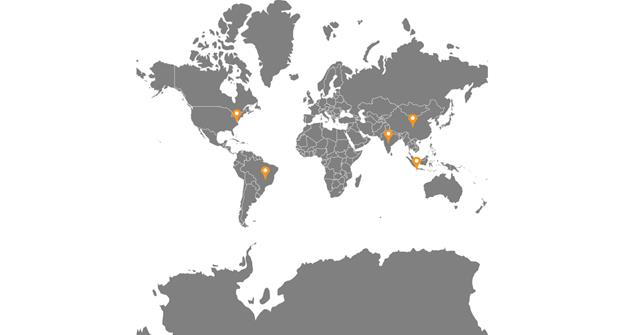
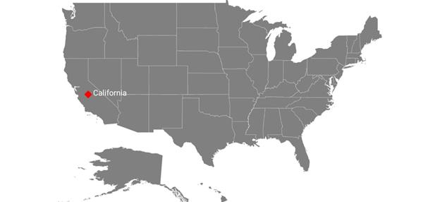

# Markers

Markers provide some messages on the map.

Markers are set to map by using the following two ways:

1. Adding marker objects to map.
2. Defining custom marker.

## Adding marker

Any number of markers can be added to the shape file layers using the [`Markers`](https://help.syncfusion.com/cr/cref_files/xamarin/sfmaps/Syncfusion.SfMaps.XForms~Syncfusion.SfMaps.XForms.ShapeFileLayer~Markers.html#) property. Each marker object contains the following list of properties:

[`Label`](https://help.syncfusion.com/cr/cref_files/xamarin/sfmaps/Syncfusion.SfMaps.XForms~Syncfusion.SfMaps.XForms.MapMarker~Label.html#): Text that is used to display information.

[`Latitude`](https://help.syncfusion.com/cr/cref_files/xamarin/sfmaps/Syncfusion.SfMaps.XForms~Syncfusion.SfMaps.XForms.MapMarker~Latitude.html#): Latitude point that specifies the y-axis position of the marker.

[`Longitude`](https://help.syncfusion.com/cr/cref_files/xamarin/sfmaps/Syncfusion.SfMaps.XForms~Syncfusion.SfMaps.XForms.MapMarker~Longitude.html#): Longitude point that specifies the x-axis position of the marker.





<maps:SfMaps x:Name="sfmap"  BackgroundColor="White">
                <maps:SfMaps.Layers>
                    <maps:ShapeFileLayer Uri="usa_state.shp">
                        <maps:ShapeFileLayer.Markers>

                            <maps:MapMarker Label = "California" Latitude = "37" Longitude = "-120"/>
                        </maps:ShapeFileLayer.Markers>

                    </maps:ShapeFileLayer>
                </maps:SfMaps.Layers>
            </maps:SfMaps>





 SfMaps map = new SfMaps();

            map.BackgroundColor = Color.White;

            ShapeFileLayer layer = new ShapeFileLayer();

            layer.Uri = "usa_state.shp";

            map.Layers.Add(layer);

            MapMarker marker = new MapMarker();

            marker.Label = "California";

            marker.Latitude = "37";

            marker.Longitude = "-120";

            layer.Markers.Add(marker);

            this.Content = map;





## Marker customization

A map marker can be customized using the [`MarkerSettings`](https://help.syncfusion.com/cr/cref_files/xamarin/sfmaps/Syncfusion.SfMaps.XForms~Syncfusion.SfMaps.XForms.ShapeFileLayer~MarkerSettings.html#) property in shape file layer.

### Icon customization

Shape, size, and color of a marker icon can be customized using the [`MarkerIcon`](https://help.syncfusion.com/cr/cref_files/xamarin/sfmaps/Syncfusion.SfMaps.XForms~Syncfusion.SfMaps.XForms.MapMarkerSetting~MarkerIcon.html#) , [`IconSize`](https://help.syncfusion.com/cr/cref_files/xamarin/sfmaps/Syncfusion.SfMaps.XForms~Syncfusion.SfMaps.XForms.MapMarkerSetting~IconSize.html#), and [`IconColor`](https://help.syncfusion.com/cr/cref_files/xamarin/sfmaps/Syncfusion.SfMaps.XForms~Syncfusion.SfMaps.XForms.MapMarkerSetting~IconColor.html#) properties. 

### Label customization

A marker label’s color and size can be customized using the [`LabelColor`](https://help.syncfusion.com/cr/cref_files/xamarin/sfmaps/Syncfusion.SfMaps.XForms~Syncfusion.SfMaps.XForms.MapMarkerSetting~LabelColor.html#)  and [`LabelSize`](https://help.syncfusion.com/cr/cref_files/xamarin/sfmaps/Syncfusion.SfMaps.XForms~Syncfusion.SfMaps.XForms.MapMarkerSetting~LabelSize.html#) properties.

The following code explains the marker customization.





<maps:SfMaps x:Name="sfmap"  BackgroundColor="White">
                <maps:SfMaps.Layers>
                    <maps:ShapeFileLayer Uri="usa_state.shp">
                        <maps:ShapeFileLayer.Markers>

                            <maps:MapMarker Label = "California" Latitude = "37" Longitude = "-120"/>
                        </maps:ShapeFileLayer.Markers>

                        <maps:ShapeFileLayer.MarkerSettings>

                            <maps:MapMarkerSetting IconColor="Red" IconSize="25" MarkerIcon="Diamond"
                                            LabelColor="White" LabelSize="20"/>

                        </maps:ShapeFileLayer.MarkerSettings>
                    </maps:ShapeFileLayer>
                </maps:SfMaps.Layers>
            </maps:SfMaps>





SfMaps map = new SfMaps();

            map.BackgroundColor = Color.White;

            ShapeFileLayer layer = new ShapeFileLayer();

            layer.Uri = "usa_state.shp";

            map.Layers.Add(layer);

            MapMarker marker = new MapMarker();

            marker.Label = "California";

            marker.Latitude = "37";

            marker.Longitude = "-120";

            layer.Markers.Add(marker);

            MapMarkerSetting markerSetting = new MapMarkerSetting();

            markerSetting.IconColor = Color.Red;

            markerSetting.IconSize = 25;

            markerSetting.MarkerIcon = MapMarkerIcon.Diamond;

            markerSetting.LabelColor = Color.White;

            markerSetting.LabelSize = 20;

            layer.MarkerSettings = markerSetting;

            this.Content = map;





## Custom marker

Maps provide support for defining the custom marker using the [`MarkerTemplate`](https://help.syncfusion.com/cr/cref_files/xamarin/sfmaps/Syncfusion.SfMaps.XForms~Syncfusion.SfMaps.XForms.ShapeFileLayer~MarkerTemplate.html#) property.





<maps:SfMaps x:Name="sfmap"  BackgroundColor="White">

<maps:SfMaps.Layers >

<maps:ShapeFileLayer Uri="world1.shp"  >

<maps:ShapeFileLayer.ShapeSettings>

<maps:ShapeSetting ShapeFill="Gray" />

</maps:ShapeFileLayer.ShapeSettings>

<maps:ShapeFileLayer.Markers>

<local:CustomMarker  Latitude="38.8833" Longitude= "-77.0167"  />

<local:CustomMarker  Latitude="-15.7833" Longitude= "-47.8667"  />

<local:CustomMarker  Latitude="21.0000" Longitude= "78.0000" />

<local:CustomMarker  Latitude="35.0000" Longitude= "103.0000"  />

<local:CustomMarker  Latitude="-6.1750" Longitude= "106.8283"  />

</maps:ShapeFileLayer.Markers>

<maps:ShapeFileLayer.MarkerTemplate>

<DataTemplate >

<StackLayout    Padding="-12,-12,0,0" IsClippedToBounds="false" HorizontalOptions="StartAndExpand" VerticalOptions="Center" HeightRequest="60" WidthRequest="60"  >

<Image Source="{Binding ImageName}" Scale="1" Aspect="AspectFit " HorizontalOptions="StartAndExpand" VerticalOptions="Center"  HeightRequest="15" WidthRequest="23"   />

</StackLayout>

</DataTemplate>

</maps:ShapeFileLayer.MarkerTemplate>

</maps:ShapeFileLayer>

</maps:SfMaps.Layers>

</maps:SfMaps>





 SfMaps map = new SfMaps();
            map.BackgroundColor = Color.White;
            ShapeFileLayer layer = new ShapeFileLayer();
            layer.Uri = "world1.shp";
            ShapeSetting shapeSetting = new ShapeSetting();
            shapeSetting.ShapeFill = Color.Gray;
            layer.ShapeSettings = shapeSetting;
            map.Layers.Add(layer);

            CustomMarker marker1 = new CustomMarker();           
            marker1.Latitude = "38.8833";
            marker1.Longitude = "-77.0167";            

            CustomMarker marker2 = new CustomMarker();           
            marker2.Latitude = "-15.7833";
            marker2.Longitude = "-47.866";           

            CustomMarker marker3 = new CustomMarker();           
            marker3.Latitude = "21.0000";
            marker3.Longitude = "78.0000";            

            CustomMarker marker4 = new CustomMarker();           
            marker4.Latitude = "35.0000";
            marker4.Longitude = "103.0000";           

            CustomMarker marker5 = new CustomMarker();            
            marker5.Latitude = "-6.1750";
            marker5.Longitude = "106.8283";          

            layer.Markers.Add(marker1);
            layer.Markers.Add(marker2);
            layer.Markers.Add(marker3);
            layer.Markers.Add(marker4);
            layer.Markers.Add(marker5);          
          

            DataTemplate dataTemplate = new DataTemplate(() =>
            {
                StackLayout stackLayout = new StackLayout();
                stackLayout.Padding = new Thickness(-12, -12, 0, 0);
                stackLayout.IsClippedToBounds = false;
                stackLayout.HorizontalOptions = LayoutOptions.StartAndExpand;
                stackLayout.VerticalOptions = LayoutOptions.Center;
                stackLayout.HeightRequest = 60;
                stackLayout.WidthRequest = 60;

                Image image = new Image();
                image.Source = marker1.ImageName;
                image.Scale = 1;
                image.Aspect = Aspect.AspectFit;
                image.HorizontalOptions = LayoutOptions.StartAndExpand;
                image.VerticalOptions = LayoutOptions.Center;
                image.HeightRequest = 15;
                image.WidthRequest = 23;
                stackLayout.Children.Add(image);

                return stackLayout;
            });

            layer.MarkerTemplate = dataTemplate;

            grid.Children.Add(map);





Below snippet explains on how to define custom marker with image support. 





public class CustomMarker : MapMarker

{

public ImageSource ImageName { get; set; }

public CustomMarker()

{

ImageName = ImageSource.FromResource("MapsSample.pin.png");

}

}





## Events

[`MarkerSelected`](https://help.syncfusion.com/cr/cref_files/xamarin/sfmaps/Syncfusion.SfMaps.XForms~Syncfusion.SfMaps.XForms.ShapeFileLayer~MarkerSelected_EV.html) event is triggered when the marker is selected.
Argument contains the [`MapMarker`](https://help.syncfusion.com/cr/cref_files/xamarin/sfmaps/Syncfusion.SfMaps.XForms~Syncfusion.SfMaps.XForms.MapMarker.html) which gives the information about the marker.





  <maps:ShapeFileLayer Uri="usa_state.shp"  ShapeIDPath="State"   ItemsSource="{Binding Data}"                                       
                                         ShapeIDTableField="STATE_NAME"  ShapeSelected="ShapeFileLayer_ShapeSelected"
                                         ShowMapItems="True"/>                                     





private void ShapeFileLayer_MarkerSelected(MapMarker marker)
        {
            Toast.IsVisible = true;

            markerLabel.Text = marker.Label;           

            Device.StartTimer(new TimeSpan(0, 0, 3), () =>
            {
                Toast.IsVisible = false;
                return false;
            });
        }





Below code snippet explains the template used for Popup message.





<StackLayout   x:Name="Toast" IsVisible="false" Orientation="Vertical" Spacing="0"  
                           WidthRequest="100"  HorizontalOptions="Center" VerticalOptions="End" >
                <Label x:Name="markerLabel" Text="State" HorizontalOptions="Center" 
                       VerticalOptions="Center" XAlign="Center" YAlign="Center" FontSize="10" 
                       WidthRequest="100"  HeightRequest= "20"   BackgroundColor="Green" 
                       TextColor="White" />              

 </StackLayout>





