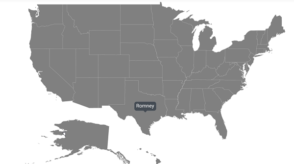
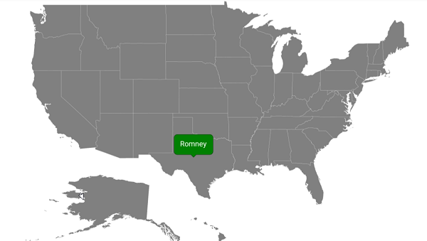
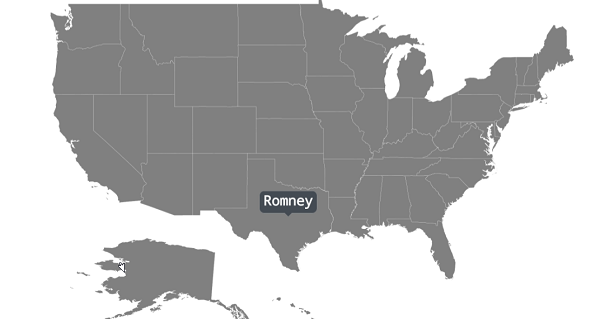
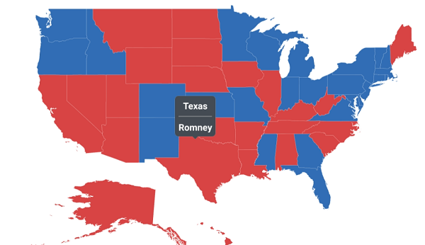
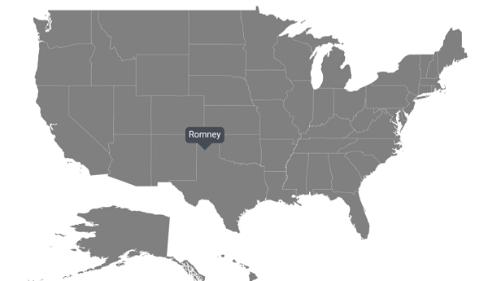
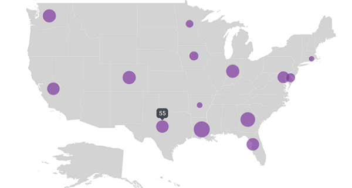
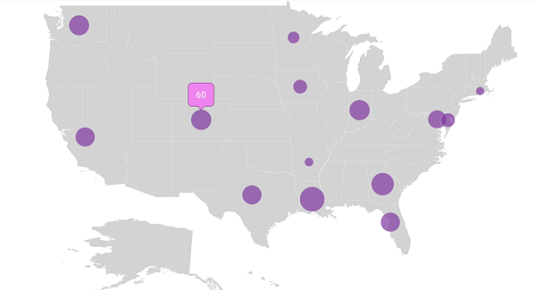
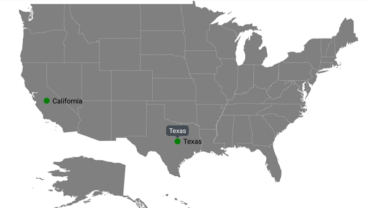

# Tooltip

Tooltip provides additional information about the shapes in the maps. To enable tooltip, set the [`ShowTooltip`](https://help.syncfusion.com/cr/cref_files/xamarin/Syncfusion.SfMaps.XForms~Syncfusion.SfMaps.XForms.TooltipSetting~ShowTooltip.html) property to true, and set the [`ValuePath`](https://help.syncfusion.com/cr/cref_files/xamarin/Syncfusion.SfMaps.XForms~Syncfusion.SfMaps.XForms.TooltipSetting~ValuePath.html) property of tooltip.

Tooltip is displayed by tapping the following elements:
•	Shapes
•	Bubbles
•	Markers

The following code sample shows how to enable tooltip by tapping the shapes.

 



<maps:SfMaps>
  <maps:SfMaps.Layers >
    <maps:ShapeFileLayer Uri="usa_state.shp" ShapeIDPath="State" ShapeIDTableField="STATE_NAME"                                ItemsSource="{Binding Data}">
    <maps:ShapeFileLayer.TooltipSettings>
        <maps:TooltipSetting ShowTooltip="True" ValuePath="Candidate"/>
    </maps:ShapeFileLayer.TooltipSettings>
    </maps:ShapeFileLayer>
  </maps:SfMaps.Layers>
</maps:SfMaps>





SfMaps sfMaps = new SfMaps();
ShapeFileLayer shapeFileLayer = new ShapeFileLayer();
shapeFileLayer.Uri = "usa_state.shp";
ViewModel model = new ViewModel();
shapeFileLayer.ItemsSource = model.Data;
shapeFileLayer.ShapeIDTableField = "STATE_NAME";
shapeFileLayer.ShapeIDPath = "State";
shapeFileLayer.TooltipSettings.ShowTooltip = true;
shapeFileLayer.TooltipSettings.ValuePath = "Candidate";
sfMaps.Layers.Add(shapeFileLayer);
Content = sfMaps;



 

## Tooltip customization

The appearance of the tooltip can be customized using the following properties:
*	[`TextColor`](https://help.syncfusion.com/cr/cref_files/xamarin/Syncfusion.SfMaps.XForms~Syncfusion.SfMaps.XForms.TooltipSetting~TextColor.html): Customizes the text color of tooltip.
*	[`BackgroundColor`](https://help.syncfusion.com/cr/cref_files/xamarin/Syncfusion.SfMaps.XForms~Syncfusion.SfMaps.XForms.TooltipSetting~BackgroundColor.html): Customizes the background color of tooltip.
* [`StrokeColor`](https://help.syncfusion.com/cr/cref_files/xamarin/Syncfusion.SfMaps.XForms~Syncfusion.SfMaps.XForms.TooltipSetting~StrokeColor.html): Customizes the stroke color of tooltip.
* [`StrokeWidth`](https://help.syncfusion.com/cr/cref_files/xamarin/Syncfusion.SfMaps.XForms~Syncfusion.SfMaps.XForms.TooltipSetting~StrokeWidth.html): Customizes the stroke width of tooltip.
* [`Duration`](https://help.syncfusion.com/cr/cref_files/xamarin/Syncfusion.SfMaps.XForms~Syncfusion.SfMaps.XForms.TooltipSetting~Duration.html): Specifies the duration of tooltip to be displayed.
* [`Margin`](https://help.syncfusion.com/cr/cref_files/xamarin/Syncfusion.SfMaps.XForms~Syncfusion.SfMaps.XForms.TooltipSetting~Margin.html): Sets the margin for tooltip.

The following code sample shows all the above customizations.

 



<maps:SfMaps>
  <maps:SfMaps.Layers >
    <maps:ShapeFileLayer Uri="usa_state.shp" ShapeIDPath="State" ShapeIDTableField="STATE_NAME"                                ItemsSource="{Binding Data}">
    <maps:ShapeFileLayer.TooltipSettings>
       <maps:TooltipSetting  ShowTooltip="True" ValuePath="Candidate" TextColor="White" Margin="10"                              BackgroundColor="Green"  StrokeColor="Black" StrokeWidth="2"                                        Duration="2000"/>
    </maps:ShapeFileLayer.TooltipSettings>
    </maps:ShapeFileLayer>
  </maps:SfMaps.Layers>
</maps:SfMaps>





SfMaps sfMaps = new SfMaps();
ShapeFileLayer shapeFileLayer = new ShapeFileLayer();
shapeFileLayer.Uri = "usa_state.shp";
ViewModel model = new ViewModel();
shapeFileLayer.ItemsSource = model.Data;
shapeFileLayer.ShapeIDTableField = "STATE_NAME";
shapeFileLayer.ShapeIDPath = "State";
shapeFileLayer.TooltipSettings.ShowTooltip = true;
shapeFileLayer.TooltipSettings.ValuePath = "Candidate";
shapeFileLayer.TooltipSettings.TextColor = Color.White;
shapeFileLayer.TooltipSettings.BackgroundColor = Color.Green;
shapeFileLayer.TooltipSettings.StrokeColor = Color.Black;
shapeFileLayer.TooltipSettings.StrokeWidth = 2;
shapeFileLayer.TooltipSettings.Margin = 10;
shapeFileLayer.TooltipSettings.Duration = 2000;
sfMaps.Layers.Add(shapeFileLayer);
Content = sfMaps;



 

## Tooltip font customization

The font can be customized using the [`FontSize`](https://help.syncfusion.com/cr/cref_files/xamarin/Syncfusion.SfMaps.XForms~Syncfusion.SfMaps.XForms.TooltipSetting~FontSize.html), [`FontAttributes`](https://help.syncfusion.com/cr/cref_files/xamarin/Syncfusion.SfMaps.XForms~Syncfusion.SfMaps.XForms.TooltipSetting~FontAttributes.html), and [`FontFamily`](https://help.syncfusion.com/cr/cref_files/xamarin/Syncfusion.SfMaps.XForms~Syncfusion.SfMaps.XForms.TooltipSetting~FontFamily.html) properties of tooltip.

 



<maps:SfMaps>
        <maps:SfMaps.Layers >
            <maps:ShapeFileLayer Uri="usa_state.shp" ShapeIDPath="State" ShapeIDTableField="STATE_NAME" ItemsSource="{Binding Data}">
                <maps:ShapeFileLayer.TooltipSettings>
                    <maps:TooltipSetting  ShowTooltip="True" ValuePath="Candidate" FontSize="15" FontAttributes="Bold">
                        <maps:TooltipSetting.FontFamily>
                            <OnPlatform x:TypeArguments="x:String" iOS="Chalkduster" Android="monospace" WinPhone="Chiller" />
                        </maps:TooltipSetting.FontFamily>
                    </maps:TooltipSetting>
                </maps:ShapeFileLayer.TooltipSettings>
            </maps:ShapeFileLayer>
        </maps:SfMaps.Layers>
</maps:SfMaps>





SfMaps sfMaps = new SfMaps();
ShapeFileLayer shapeFileLayer = new ShapeFileLayer();
shapeFileLayer.Uri = "usa_state.shp";
ViewModel model = new ViewModel();
shapeFileLayer.ItemsSource = model.Data;
shapeFileLayer.ShapeIDTableField = "STATE_NAME";
shapeFileLayer.ShapeIDPath = "State";
shapeFileLayer.TooltipSettings.ShowTooltip = true;
shapeFileLayer.TooltipSettings.ValuePath = "Candidate";
shapeFileLayer.TooltipSettings.FontSize = 15;
shapeFileLayer.TooltipSettings.FontAttributes = FontAttributes.Bold;
shapeFileLayer.TooltipSettings.FontFamily = Device.RuntimePlatform == Device.iOS ? "Chalkduster" : Device.RuntimePlatform == Device.Android ? "monospace" : "Chiller";
sfMaps.Layers.Add(shapeFileLayer);
Content = sfMaps;



 

## Custom template for tooltip

The maps control provides options to design your own template for tooltip using the [`TooltipTemplate`](https://help.syncfusion.com/cr/cref_files/xamarin/Syncfusion.SfMaps.XForms~Syncfusion.SfMaps.XForms.TooltipSetting~TooltipTemplate.html) property.

 



<maps:SfMaps Margin="20" BackgroundColor="White">
        <maps:SfMaps.Layers >
            <maps:ShapeFileLayer Uri="usa_state.shp" ShapeIDPath="State" ShapeIDTableField="STATE_NAME" ItemsSource="{Binding Data}">
                <maps:ShapeFileLayer.ShapeSettings>
                    <maps:ShapeSetting ShapeValuePath="Candidate" ShapeColorValuePath="Candidate" >
                        <maps:ShapeSetting.ColorMappings>
                            <maps:EqualColorMapping Color="#D84444" Value = "Romney"/>
                            <maps:EqualColorMapping Color="#316DB5" Value="Obama"/>
                        </maps:ShapeSetting.ColorMappings>
                    </maps:ShapeSetting>
                </maps:ShapeFileLayer.ShapeSettings>
                <maps:ShapeFileLayer.TooltipSettings>
                    <maps:TooltipSetting  ShowTooltip="True" ValuePath="State" Duration="2000">
                        <maps:TooltipSetting.TooltipTemplate>
                            <DataTemplate>
                                <StackLayout>
                                    <Label Text="{Binding State}" HorizontalTextAlignment="Center" VerticalTextAlignment="Center" TextColor="#FFFFFF" FontAttributes="Bold" FontFamily="Helvetica" Margin="0" FontSize="12" Grid.Row="0" />
                                    <BoxView Color="#888C91" HeightRequest="1" VerticalOptions="FillAndExpand" HorizontalOptions="FillAndExpand" />
                                    <Label Text="{Binding Candidate}" VerticalTextAlignment="Center" HorizontalOptions="Center" TextColor="#FFFFFF" FontAttributes="Bold" FontFamily="Helvetica" FontSize="12" />
                                </StackLayout>
                            </DataTemplate>
                        </maps:TooltipSetting.TooltipTemplate>
                    </maps:TooltipSetting>
                </maps:ShapeFileLayer.TooltipSettings>
            </maps:ShapeFileLayer>
        </maps:SfMaps.Layers>
</maps:SfMaps>





SfMaps sfMaps = new SfMaps();
ShapeFileLayer shapeFileLayer = new ShapeFileLayer();
shapeFileLayer.Uri = "usa_state.shp";
ViewModel model = new ViewModel();
shapeFileLayer.ItemsSource = model.Data;
shapeFileLayer.ShapeIDTableField = "STATE_NAME";
shapeFileLayer.ShapeIDPath = "State";

EqualColorMapping colorMapping = new EqualColorMapping();
colorMapping.Color = Color.FromHex("#D84444");
colorMapping.Value = "Romney";
EqualColorMapping colorMapping1 = new EqualColorMapping();
colorMapping1.Color = Color.FromHex("#316DB5");
colorMapping1.Value = "Obama";
ShapeSetting shapeSetting = new ShapeSetting();
shapeSetting.ShapeValuePath = "Candidate";
shapeSetting.ShapeColorValuePath = "Candidate";
shapeSetting.ColorMappings.Add(colorMapping);
shapeSetting.ColorMappings.Add(colorMapping1);
shapeFileLayer.ShapeSettings = shapeSetting;
shapeFileLayer.TooltipSettings.ShowTooltip = true;
shapeFileLayer.TooltipSettings.ValuePath = "State";
DataTemplate template = new DataTemplate(() =>
{
StackLayout categoryLayout = new StackLayout();
Label category = new Label();
category.HorizontalTextAlignment = TextAlignment.Center;
category.VerticalTextAlignment = TextAlignment.Center;
category.TextColor = Color.FromHex("#FFFFFF");
category.FontAttributes = FontAttributes.Bold;
category.FontFamily = "Helvetica";
category.Margin = 0;
category.FontSize = 12;
category.SetBinding(Label.TextProperty, "State");
categoryLayout.Children.Add(category);

BoxView boxView = new BoxView();
boxView.Color = Color.FromHex("#888C91");
boxView.HeightRequest = 1;
boxView.VerticalOptions = LayoutOptions.FillAndExpand;
boxView.HorizontalOptions = LayoutOptions.FillAndExpand;
categoryLayout.Children.Add(boxView);

Label category1 = new Label();
category1.HorizontalTextAlignment = TextAlignment.Center;
category1.VerticalTextAlignment = TextAlignment.Center;
category1.TextColor = Color.FromHex("#FFFFFF");
category1.FontAttributes = FontAttributes.Bold;
category1.FontFamily = "Helvetica";
category1.Margin = 0;
category1.FontSize = 12;
category1.SetBinding(Label.TextProperty, "Candidate");
categoryLayout.Children.Add(category1);

return categoryLayout;
});

shapeFileLayer.TooltipSettings.TooltipTemplate = template;

sfMaps.Layers.Add(shapeFileLayer);
Content = sfMaps;



 

## Setting animation for tooltip

You can enable or disable the animation of tooltip using the [`EnableAnimation`](https://help.syncfusion.com/cr/cref_files/xamarin/Syncfusion.SfMaps.XForms~Syncfusion.SfMaps.XForms.TooltipSetting~EnableAnimation.html) property.

 



  <maps:ShapeFileLayer.TooltipSettings>
        <maps:TooltipSetting  ShowTooltip="True" ValuePath="State"  EnableAnimation="False"/>
  </maps:ShapeFileLayer.TooltipSettings>





shapeFileLayer.TooltipSettings.ShowTooltip = true;
shapeFileLayer.TooltipSettings.ValuePath = "State";
shapeFileLayer.TooltipSettings.EnableAnimation = false;
sfMaps.Layers.Add(shapeFileLayer);



 

## Setting pointer length for tooltip

You can customize the pointer length of the tooltip using the [`PointerLength`](https://help.syncfusion.com/cr/cref_files/xamarin/Syncfusion.SfMaps.XForms~Syncfusion.SfMaps.XForms.TooltipSetting~PointerLength.html) property.

 



  <maps:SfMaps>
            <maps:SfMaps.Layers >
                <maps:ShapeFileLayer Uri="usa_state.shp" ShapeIDPath="State" ShapeIDTableField="STATE_NAME" ItemsSource="{Binding Data}">
                    <maps:ShapeFileLayer.TooltipSettings>
                        <maps:TooltipSetting  ShowTooltip="True" ValuePath="Candidate" PointerLength="18"/>
                    </maps:ShapeFileLayer.TooltipSettings>
                </maps:ShapeFileLayer>
            </maps:SfMaps.Layers>
  </maps:SfMaps>





SfMaps sfMaps = new SfMaps();
ShapeFileLayer shapeFileLayer = new ShapeFileLayer();
shapeFileLayer.Uri = "usa_state.shp";
ViewModel model = new ViewModel();
shapeFileLayer.ItemsSource = model.Data;
shapeFileLayer.ShapeIDTableField = "STATE_NAME";
shapeFileLayer.ShapeIDPath = "State";
shapeFileLayer.TooltipSettings.ShowTooltip = true;
shapeFileLayer.TooltipSettings.ValuePath = "Candidate";
shapeFileLayer.TooltipSettings.PointerLength = 18;
sfMaps.Layers.Add(shapeFileLayer);
Content = sfMaps;



 

## Events

### Tooltip opening event

This event occurs whenever you select a shape, bubble, or marker. You will get the [`Data`](https://help.syncfusion.com/cr/cref_files/xamarin/Syncfusion.SfMaps.XForms~Syncfusion.SfMaps.XForms.TooltipOpeningEventArgs~Data.html) and [`TooltipType`](https://help.syncfusion.com/cr/cref_files/xamarin/Syncfusion.SfMaps.XForms~Syncfusion.SfMaps.XForms.TooltipOpeningEventArgs~TooltipType.html) properties as arguments from [`TooltipOpeningEventArgs`](https://help.syncfusion.com/cr/cref_files/xamarin/Syncfusion.SfMaps.XForms~Syncfusion.SfMaps.XForms.TooltipOpeningEventArgs~_ctor.html) handler, and you can cancel the event for a particular shape using the [`Cancel`](https://help.syncfusion.com/cr/cref_files/xamarin/Syncfusion.SfMaps.XForms~Syncfusion.SfMaps.XForms.TooltipOpeningEventArgs~Cancel.html) property.

 



<maps:SfMaps  TooltipOpening="SfMaps_TooltipOpening">
            <maps:SfMaps.Layers >
                <maps:ShapeFileLayer Uri="usa_state.shp" ShapeIDPath="State" ShapeIDTableField="STATE_NAME" ItemsSource="{Binding Data}">
                    <maps:ShapeFileLayer.TooltipSettings>
                        <maps:TooltipSetting  ShowTooltip="True" ValuePath="State" />
                    </maps:ShapeFileLayer.TooltipSettings>
                </maps:ShapeFileLayer>
            </maps:SfMaps.Layers>
</maps:SfMaps>





private void SfMaps_TooltipOpening(object sender, TooltipOpeningEventArgs e)
{
    if ((e.Data is ElectionData) && (e.Data as ElectionData).State == "Montana")
      {
          e.Cancel = true;
      }
}



 

## Tooltip for bubbles

You can get tooltip by tapping the bubbles in the shapes.

 



<maps:SfMaps>
        <maps:SfMaps.Layers >
            <maps:ShapeFileLayer Uri="usa_state.shp" ShapeIDPath="State" ShapeIDTableField="STATE_NAME" ItemsSource="{Binding Data}">
                <maps:ShapeFileLayer.BubbleMarkerSettings>
                    <maps:BubbleMarkerSetting ValuePath="Electors" ColorValuePath="Electors"  Fill="#7F38A0">
                        <maps:BubbleMarkerSetting.TooltipSettings>
                            <maps:TooltipSetting ShowTooltip="True" ValuePath="Electors"/>
                        </maps:BubbleMarkerSetting.TooltipSettings>
                    </maps:BubbleMarkerSetting>
                </maps:ShapeFileLayer.BubbleMarkerSettings>
                <maps:ShapeFileLayer.ShapeSettings>
                    <maps:ShapeSetting ShapeFill="LightGray"/>
                </maps:ShapeFileLayer.ShapeSettings>
            </maps:ShapeFileLayer>
        </maps:SfMaps.Layers>
</maps:SfMaps>





SfMaps sfMaps = new SfMaps();
ShapeFileLayer shapeFileLayer = new ShapeFileLayer();
shapeFileLayer.Uri = "usa_state.shp";
ViewModel model = new ViewModel();
shapeFileLayer.ItemsSource = model.Data;
shapeFileLayer.ShapeIDTableField = "STATE_NAME";
shapeFileLayer.ShapeIDPath = "State";
BubbleMarkerSetting bubbleMarkerSetting = new BubbleMarkerSetting();
bubbleMarkerSetting.ColorValuePath = "Electors";
bubbleMarkerSetting.ValuePath = "Electors";
bubbleMarkerSetting.Fill = Color.FromHex("#7F38A0");
bubbleMarkerSetting.TooltipSettings.ShowTooltip = true;
bubbleMarkerSetting.TooltipSettings.ValuePath = "Electors";
shapeFileLayer.BubbleMarkerSettings = bubbleMarkerSetting;
ShapeSetting shapeSetting = new ShapeSetting();
shapeSetting.ShapeFill = Color.LightGray;
shapeFileLayer.ShapeSettings = shapeSetting;
sfMaps.Layers.Add(shapeFileLayer);
Content = sfMaps;



 

## Bubble tooltip customization

To customize the tooltip in the bubbles, refer to this link.

 



<maps:SfMaps>
        <maps:SfMaps.Layers >
            <maps:ShapeFileLayer Uri="usa_state.shp" ShapeIDPath="State" ShapeIDTableField="STATE_NAME" ItemsSource="{Binding Data}">
                <maps:ShapeFileLayer.BubbleMarkerSettings>
                    <maps:BubbleMarkerSetting ValuePath="Electors" ColorValuePath="Electors"  Fill="#7F38A0">
                        <maps:BubbleMarkerSetting.TooltipSettings>
                            <maps:TooltipSetting ShowTooltip="True" ValuePath="Electors" TextColor="White" Margin="10" BackgroundColor="Violet"  StrokeColor="Black" StrokeWidth="2" Duration="2000"/>
                        </maps:BubbleMarkerSetting.TooltipSettings>
                    </maps:BubbleMarkerSetting>
                </maps:ShapeFileLayer.BubbleMarkerSettings>
                <maps:ShapeFileLayer.ShapeSettings>
                    <maps:ShapeSetting ShapeFill="LightGray"/>
                </maps:ShapeFileLayer.ShapeSettings>
            </maps:ShapeFileLayer>
        </maps:SfMaps.Layers>
</maps:SfMaps>





SfMaps sfMaps = new SfMaps();
ShapeFileLayer shapeFileLayer = new ShapeFileLayer();
shapeFileLayer.Uri = "usa_state.shp";
ViewModel model = new ViewModel();
shapeFileLayer.ItemsSource = model.Data;
shapeFileLayer.ShapeIDTableField = "STATE_NAME";
shapeFileLayer.ShapeIDPath = "State";
BubbleMarkerSetting bubbleMarkerSetting = new BubbleMarkerSetting();
bubbleMarkerSetting.ColorValuePath = "Electors";
bubbleMarkerSetting.ValuePath = "Electors";
bubbleMarkerSetting.Fill = Color.FromHex("#7F38A0");
bubbleMarkerSetting.TooltipSettings.ShowTooltip = true;
bubbleMarkerSetting.TooltipSettings.TextColor = Color.White;
bubbleMarkerSetting.TooltipSettings.BackgroundColor = Color.Violet;
bubbleMarkerSetting.TooltipSettings.StrokeColor = Color.Black;
bubbleMarkerSetting.TooltipSettings.StrokeWidth = 2;
bubbleMarkerSetting.TooltipSettings.Margin = 10;
bubbleMarkerSetting.TooltipSettings.Duration = 2000;
bubbleMarkerSetting.TooltipSettings.ValuePath = "Electors";
shapeFileLayer.BubbleMarkerSettings = bubbleMarkerSetting;
ShapeSetting shapeSetting = new ShapeSetting();
shapeSetting.ShapeFill = Color.LightGray;
shapeFileLayer.ShapeSettings = shapeSetting;
sfMaps.Layers.Add(shapeFileLayer);
Content = sfMaps;



 

## Tooltip for markers

You can get the tooltip by tapping the markers in the shapes.

 



<maps:SfMaps>
        <maps:SfMaps.Layers >
            <maps:ShapeFileLayer Uri="usa_state.shp" ShapeIDPath="State" ShapeIDTableField="STATE_NAME" ItemsSource="{Binding Data}">
                <maps:ShapeFileLayer.Markers>
                    <maps:MapMarker Label="Texas" Latitude="31.267153" Longitude="-97.7430608"/>
                    <maps:MapMarker Label="California" Latitude="37" Longitude="-120"/>
                </maps:ShapeFileLayer.Markers>
                <maps:ShapeFileLayer.MarkerSettings>
                    <maps:MapMarkerSetting>
                        <maps:MapMarkerSetting.TooltipSettings>
                            <maps:TooltipSetting ShowTooltip="True" ValuePath="Label" />
                        </maps:MapMarkerSetting.TooltipSettings>
                    </maps:MapMarkerSetting>
                </maps:ShapeFileLayer.MarkerSettings>
            </maps:ShapeFileLayer>
        </maps:SfMaps.Layers>
</maps:SfMaps>





SfMaps sfMaps = new SfMaps();
ShapeFileLayer shapeFileLayer = new ShapeFileLayer();
shapeFileLayer.Uri = "usa_state.shp";
ViewModel model = new ViewModel();
shapeFileLayer.ItemsSource = model.Data;
shapeFileLayer.ShapeIDTableField = "STATE_NAME";
shapeFileLayer.ShapeIDPath = "State";
MapMarker mapMarker = new MapMarker();
mapMarker.Label = "Texas";
mapMarker.Latitude = "31.267153";
mapMarker.Longitude = "-97.7430608";
shapeFileLayer.Markers.Add(mapMarker);
MapMarker mapMarker1 = new MapMarker();
mapMarker1.Label = "California";
mapMarker1.Latitude = "37";
mapMarker1.Longitude = "-120";
shapeFileLayer.Markers.Add(mapMarker1);
MapMarkerSetting mapMarkerSetting = new MapMarkerSetting();
mapMarkerSetting.TooltipSettings.ShowTooltip = true;
mapMarkerSetting.TooltipSettings.ValuePath = "Label";
mapMarkerSetting.TooltipSettings.Duration = 2000;
shapeFileLayer.MarkerSettings = mapMarkerSetting;
sfMaps.Layers.Add(shapeFileLayer);
Content = sfMaps;



 

## Marker tooltip customization

To customize the tooltip in the marker, refer to this link.

 



<maps:SfMaps BackgroundColor="White" Margin="10">
        <maps:SfMaps.Layers >
            <maps:ShapeFileLayer Uri="usa_state.shp" ShapeIDPath="State" ShapeIDTableField="STATE_NAME" ItemsSource="{Binding Data}">
                <maps:ShapeFileLayer.Markers>
                    <maps:MapMarker Label="Texas" Latitude="31.267153" Longitude="-97.7430608"/>
                    <maps:MapMarker Label="California" Latitude="37" Longitude="-120"/>
                </maps:ShapeFileLayer.Markers>
                <maps:ShapeFileLayer.MarkerSettings>
                    <maps:MapMarkerSetting>
                        <maps:MapMarkerSetting.TooltipSettings>
                            <maps:TooltipSetting ShowTooltip="True" ValuePath="Label" TextColor="White" 
                                                 Margin="10" BackgroundColor="Blue"
                                                 StrokeColor="Black" StrokeWidth="2" Duration="2000"/>
                        </maps:MapMarkerSetting.TooltipSettings>
                    </maps:MapMarkerSetting>
                </maps:ShapeFileLayer.MarkerSettings>
            </maps:ShapeFileLayer>
        </maps:SfMaps.Layers>
</maps:SfMaps>





SfMaps sfMaps = new SfMaps();
ShapeFileLayer shapeFileLayer = new ShapeFileLayer();
shapeFileLayer.Uri = "usa_state.shp";
ViewModel model = new ViewModel();
shapeFileLayer.ItemsSource = model.Data;
shapeFileLayer.ShapeIDTableField = "STATE_NAME";
shapeFileLayer.ShapeIDPath = "State";
MapMarker mapMarker = new MapMarker();
mapMarker.Label = "Texas";
mapMarker.Latitude = "31.267153";
mapMarker.Longitude = "-97.7430608";
shapeFileLayer.Markers.Add(mapMarker);
MapMarker mapMarker1 = new MapMarker();
mapMarker1.Label = "California";
mapMarker1.Latitude = "37";
mapMarker1.Longitude = "-120";
shapeFileLayer.Markers.Add(mapMarker1);
MapMarkerSetting mapMarkerSetting = new MapMarkerSetting();
mapMarkerSetting.TooltipSettings.ShowTooltip = true;
mapMarkerSetting.TooltipSettings.ValuePath = "Label";
mapMarkerSetting.TooltipSettings.TextColor = Color.White;
mapMarkerSetting.TooltipSettings.BackgroundColor = Color.Blue;
mapMarkerSetting.TooltipSettings.StrokeColor = Color.Black;
mapMarkerSetting.TooltipSettings.StrokeWidth = 2;
mapMarkerSetting.TooltipSettings.Margin = 10;
mapMarkerSetting.TooltipSettings.Duration = 2000;
shapeFileLayer.MarkerSettings = mapMarkerSetting;
sfMaps.Layers.Add(shapeFileLayer);
Content = sfMaps;



 

## Tilelayer tooltip

You can add tooltip for marker in imagery layer customize the tooltip in the marker.

 



 <maps:SfMaps BackgroundColor="White" Margin="10">
        <maps:SfMaps.Layers >
            <maps:ImageryLayer>
                <maps:ImageryLayer.Markers>
                    <maps:MapMarker Label="India" Latitude="20.593683" Longitude="78.962883" />
                </maps:ImageryLayer.Markers>
                <maps:ImageryLayer.MarkerSettings>
                    <maps:MapMarkerSetting MarkerIcon="Image" ImageSource="pin.png" IconSize="15">
                        <maps:MapMarkerSetting.TooltipSettings>
                            <maps:TooltipSetting ShowTooltip="True" ValuePath="Label" TextColor="White" 
                                                 Margin="10" BackgroundColor="Navy"
                                                 StrokeColor="Black" StrokeWidth="2" />
                        </maps:MapMarkerSetting.TooltipSettings>
                    </maps:MapMarkerSetting>
                </maps:ImageryLayer.MarkerSettings>
            </maps:ImageryLayer>
        </maps:SfMaps.Layers>
</maps:SfMaps>





SfMaps sfMaps = new SfMaps();
ImageryLayer imageryLayer = new ImageryLayer();
MapMarker mapMarker = new MapMarker();
mapMarker.Label = "India";
mapMarker.Latitude = "20.593683";
mapMarker.Longitude = "78.962883";
imageryLayer.Markers.Add(mapMarker);
MapMarkerSetting mapMarkerSetting = new MapMarkerSetting();
mapMarkerSetting.MarkerIcon = MapMarkerIcon.Image;
mapMarkerSetting.ImageSource = "pin.png";
mapMarkerSetting.IconSize = 15;
mapMarkerSetting.TooltipSettings.ShowTooltip = true;
mapMarkerSetting.TooltipSettings.ValuePath = "Label";
mapMarkerSetting.TooltipSettings.TextColor = Color.White;
mapMarkerSetting.TooltipSettings.BackgroundColor = Color.Navy;
mapMarkerSetting.TooltipSettings.StrokeColor = Color.Black;
mapMarkerSetting.TooltipSettings.StrokeWidth = 2;
mapMarkerSetting.TooltipSettings.Margin = 10;
imageryLayer.MarkerSettings = mapMarkerSetting;
sfMaps.Layers.Add(imageryLayer);
Content = sfMaps;



 

