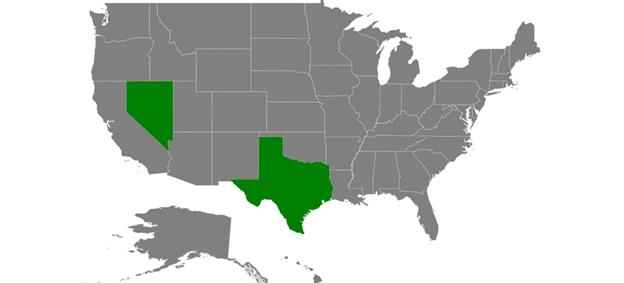

# User interaction

Options such as zooming, panning, and selection enable the effective interaction on map elements.

## Selection

Each shape in a map can be selected or deselected when interacted with shapes. Map shapes can be selected using the following two ways:

* Single Selection
* Multi Selection

The selected map shapes are differentiated by their fill. The [`SelectedShapeColor`](https://help.syncfusion.com/cr/cref_files/xamarin/sfmaps/Syncfusion.SfMaps.XForms~Syncfusion.SfMaps.XForms.ShapeSetting~SelectedShapeColor.html#) of [`ShapeSettings`](https://help.syncfusion.com/cr/cref_files/xamarin/sfmaps/Syncfusion.SfMaps.XForms~Syncfusion.SfMaps.XForms.ShapeFileLayer~ShapeSettings.html#) property gets or sets the selected shape color. The [`SelectedShapeStroke`](https://help.syncfusion.com/cr/cref_files/xamarin/sfmaps/Syncfusion.SfMaps.XForms~Syncfusion.SfMaps.XForms.ShapeSetting~SelectedShapeStroke.html#) property is used to customize the selected shape border.

### Single selection

Single selection allows you to select only one shape at a time. You can select the shape by tapping it. By default, the single selection is enabled when the [`EnableSelection`](https://help.syncfusion.com/cr/cref_files/xamarin/sfmaps/Syncfusion.SfMaps.XForms~Syncfusion.SfMaps.XForms.ShapeFileLayer~EnableSelection.html#) is set to true. You can also enable the single selection by  setting the [`SelectionMode`](https://help.syncfusion.com/cr/cref_files/xamarin/sfmaps/Syncfusion.SfMaps.XForms~Syncfusion.SfMaps.XForms.ShapeFileLayer~SelectionMode.html#) property of ShapeFileLayer to “Single”. When selecting or tapping the rest of the area, the selected shape will be deselected.




<maps:SfMaps x:Name="sfmap"    BackgroundColor="White" >

<maps:SfMaps.Layers >

<maps:ShapeFileLayer Uri="usa_state.shp" EnableSelection="True" 

SelectionMode="Single"  >

<maps:ShapeFileLayer.ShapeSettings>

<maps:ShapeSetting SelectedShapeColor="Green" SelectedShapeStroke="Black" SelectedShapeStrokeThickness="1" />

</maps:ShapeFileLayer.ShapeSettings>

</maps:ShapeFileLayer>

</maps:SfMaps.Layers>

</maps:SfMaps>





SfMaps map = new SfMaps();

map.BackgroundColor = Color.White;

ShapeFileLayer layer = new ShapeFileLayer();

layer.EnableSelection = true;

layer.SelectionMode = SelectionMode.Single;

ShapeSetting shapeSetting = new ShapeSetting();

shapeSetting.SelectedShapeColor = Color.Green;

shapeSetting.SelectedShapeStroke = Color.Black;

shapeSetting.SelectedShapeStrokeThickness = 1;      

layer.ShapeSettings = shapeSetting;

map.Layers.Add(layer);

this.Content = map;





### Multi selection

Multi selection allows you to select the multiple shapes at a time. You can select many shapes by tapping them. To enable this feature, set the [`SelectionMode`](https://help.syncfusion.com/cr/cref_files/xamarin/sfmaps/Syncfusion.SfMaps.XForms~Syncfusion.SfMaps.XForms.ShapeFileLayer~SelectionMode.html#) property to “Multiple” along with the [`EnableSelection`](https://help.syncfusion.com/cr/cref_files/xamarin/sfmaps/Syncfusion.SfMaps.XForms~Syncfusion.SfMaps.XForms.ShapeFileLayer~EnableSelection.html#) property. 

I> Shapes cannot be selected when the [`EnableSelection`](https://help.syncfusion.com/cr/cref_files/xamarin/sfmaps/Syncfusion.SfMaps.XForms~Syncfusion.SfMaps.XForms.ShapeFileLayer~EnableSelection.html#) property is set to false.





<maps:SfMaps x:Name="sfmap"    BackgroundColor="White" >

<maps:SfMaps.Layers >

<maps:ShapeFileLayer Uri="usa_state.shp" EnableSelection="True" 

SelectionMode="Multiple"  >

<maps:ShapeFileLayer.ShapeSettings>

<maps:ShapeSetting SelectedShapeColor="Green" SelectedShapeStroke="Black" SelectedShapeStrokeThickness="1" />

</maps:ShapeFileLayer.ShapeSettings>

</maps:ShapeFileLayer>

</maps:SfMaps.Layers>

</maps:SfMaps>





SfMaps map = new SfMaps();

map.BackgroundColor = Color.White;

ShapeFileLayer layer = new ShapeFileLayer();

layer.Uri = "usa_state.shp";

layer.EnableSelection = true;

layer.SelectionMode = SelectionMode.Multiple;

ShapeSetting shapeSetting = new ShapeSetting();

shapeSetting.SelectedShapeColor = Color.Green;

shapeSetting.SelectedShapeStroke = Color.Black;

shapeSetting.SelectedShapeStrokeThickness = 1;

layer.ShapeSettings = shapeSetting;

map.Layers.Add(layer);

this.Content = map;





### Selected items

The SelectedItems property allows you to select the shapes without tapping or touching them.

To select a shape and deselect it from the same collection without tapping or touching, just add the shape that is to be selected to the selected items collection.

The following code sample explains the selection and deselection.



var model = GetDataSource();

ShapeFileLayer layer=new ShapeFileLayer();

layer.ItemsSource=model;

SelectedItemButton.Clicked += (sender, e) =>

{

layer.SelectedItems.Add(model[4]);

};

RemoveItemButton.Clicked += (sender, e) =>

{

layer.SelectedItems.Remove(model[4]);

};



## Zooming

The zooming feature enables you to zoom in and zoom out the map to show the in-depth information. The following properties are related to the zooming feature of maps control:

[`EnableZooming`](https://help.syncfusion.com/cr/cref_files/xamarin/sfmaps/Syncfusion.SfMaps.XForms~Syncfusion.SfMaps.XForms.SfMaps~EnableZooming.html#) property is used to control whether to perform zooming or not.

[`MinZoom`](https://help.syncfusion.com/cr/cref_files/xamarin/sfmaps/Syncfusion.SfMaps.XForms~Syncfusion.SfMaps.XForms.SfMaps~MinZoom.html#) property sets the minimum level of zooming.

[`MaxZoom`](https://help.syncfusion.com/cr/cref_files/xamarin/sfmaps/Syncfusion.SfMaps.XForms~Syncfusion.SfMaps.XForms.SfMaps~MaxZoom.html#) property sets the maximum level of zooming.





 <maps:SfMaps x:Name="sfmap"  EnableZooming="True" MinZoom="1" 
                       MaxZoom="10"   BackgroundColor="White" />




 SfMaps map = new SfMaps(); 
            map.EnableZooming = true;
            map.MinZoom = 1;
            map.MaxZoom = 10;





## Panning

Panning feature allows moving the visible area of the map when it is zoomed in. To enable panning, you have to set [`EnablePanning`](https://help.syncfusion.com/cr/cref_files/xamarin/sfmaps/Syncfusion.SfMaps.XForms~Syncfusion.SfMaps.XForms.SfMaps~EnablePanning.html#) property to true.





 <maps:SfMaps x:Name="sfmap"  EnablePanning="True" EnableZooming="True" MinZoom="1" 
                       MaxZoom="10"   BackgroundColor="White" />




 SfMaps map = new SfMaps();
 map.EnablePanning = true;
            map.EnableZooming = true;
            map.MinZoom = 1;
            map.MaxZoom = 10;





