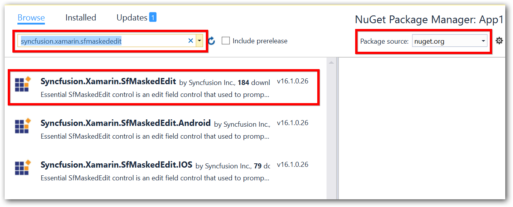

# Getting Started

This section explains you the steps required to configure a `SfMaskedEdit` control in a real-time scenario and provides a walk-through on some of the customization features available in `SfMaskedEdit` control.

## Add SfMaskedEdit reference

Syncfusion Xamarin components are available in [nuget.org](https://www.nuget.org/). To add maskededit to your project, open the NuGet package manager in Visual Studio, and search for "[syncfusion.xamarin.sfmaskededit](https://www.nuget.org/packages/Syncfusion.Xamarin.SfMaskedEdit)", and then install it. 

 

After adding the assembly reference, an additional step is required for iOS and UWP projects.

### Additional step for iOS

To launch SfMaskedEdit in iOS, call the `SfMaskedEditRenderer.Init()` in `FinishedLaunching` overridden method of `AppDelegate` class in iOS Project, as demonstrated in the following code example.



public override bool FinishedLaunching(UIApplication app, NSDictionary options)
{
    global::Xamarin.Forms.Forms.Init();
    LoadApplication(new App());
    SfMaskedEditRenderer.Init();
    return base.FinishedLaunching(app, options);
}



### Additional step for UWP

This step is required only if the application is deployed in Release mode with .NET native tool chain enabled and it is for resolving the known Framework issue “Custom controls not rendering in Release mode” in UWP platform. Initializing the SfMaskedEdit assembly at `OnLaunched` overridden method of the `App` class in UWP project is the suggested work around, as demonstrated in the following code example.



protected override void OnLaunched(LaunchActivatedEventArgs e)
{

    ..... 

    rootFrame.NavigationFailed += OnNavigationFailed;
    // you'll need to add `using System.Reflection;` 
    List<Assembly> assembliesToInclude = new List<Assembly>();
    //Now, add all the assemblies your app uses 
    assembliesToInclude.Add(typeof(SfMaskedEditRenderer).GetTypeInfo().Assembly);
    // replaces Xamarin.Forms.Forms.Init(e);
    Xamarin.Forms.Forms.Init(e, assembliesToInclude);

    ..... 

}



## Create a Simple SfMaskedEdit

The SfMaskedEdit control is configured entirely in C# code or by using XAML markup. The following steps explain how to create a SfMaskedEdit and configure its elements:

### Add namespace for referred assemblies



xmlns:syncfusion="clr-namespace:Syncfusion.XForms.MaskedEdit;assembly=Syncfusion.SfMaskedEdit.XForms"


using Syncfusion.XForms.MaskedEdit;



### Refer SfMaskedEdit control with declared suffix name for Namespace



<?xml version="1.0" encoding="utf-8" ?>
<ContentPage xmlns="http://xamarin.com/schemas/2014/forms"
             xmlns:x="http://schemas.microsoft.com/winfx/2009/xaml"
             xmlns:local="clr-namespace:GettingStarted"
             xmlns:syncmaskededit="clr-namespace:Syncfusion.XForms.MaskedEdit;assembly=Syncfusion.SfMaskedEdit.XForms"
             x:Class="GettingStarted.MainPage">
    <ContentPage.Content>
        <StackLayout Margin= "0,100,0,0">
            <syncmaskededit:SfMaskedEdit x:Name="maskedEdit" />
        </StackLayout>
    </ContentPage.Content>
</ContentPage>



using Syncfusion.XForms.MaskedEdit;
using Xamarin.Forms;

namespace GettingStarted
{
    public partial class MainPage : ContentPage
    {
        public MainPage()
        {
            InitializeComponent();
            StackLayout stackLayout = new StackLayout();
			stackLayout.Margin = new Thickness(0, 100, 0, 0);
            SfMaskedEdit maskedEdit = new SfMaskedEdit();
            stackLayout.Children.Add(maskedEdit);
            this.Content = stackLayout;
        }
    }
}



## Masking the input

To mask the input, set the `Mask` property as follows:



<syncmaskededit:SfMaskedEdit x:Name="maskedEdit" Mask="00/00/0000"/>


SfMaskedEdit maskedEdit = new SfMaskedEdit();
maskedEdit.Mask = "00/00/0000";



This mask expression allows only numeric inputs in the places of 0.

Refer to this [link](masktype.html) to know more about the Mask characters and Mask Types available in SfMaskedEdit control.

Run the project and check if you get the following output to make sure that you have configured your project properly to add `SfMaskedEdit`.

You can find the complete getting started sample from this [link](http://files2.syncfusion.com/Xamarin.Forms/Samples/MaskedEdit_GettingStarted.zip).
