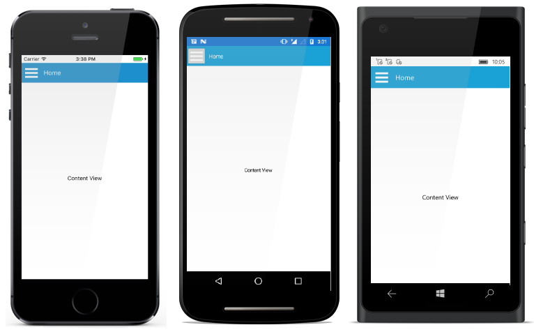

# Getting Started

This section explains you the steps required to create a navigation DrawerPanel with content area and data filled drawer and it covers only the minimal features that you need to know to get started with the NavigationDrawer.

## Add SfNavigationDrawer assembly

Refer [this]( https://help.syncfusion.com/xamarin/introduction/download-and-installation) article to know how to obtain and reference Essential Studio components in your solution; then refer [this]( https://help.syncfusion.com/xamarin/introduction/control-dependencies#sfnavigationdrawer) link to know about the assemblies required for adding NavigationDrawer to your project.

### Additional Step for iOS

Currently an additional step is required for iOS project. We need to create an instance of the NavigationDrawer custom renderer as shown below. 

Create an instance of SfNavigationDrawerRenderer in FinishedLaunching overridden method of AppDelegate class in iOS project as shown below:





public override bool FinishedLaunching(UIApplication app, NSDictionary options) 

{ 

new Syncfusion.SfNavigationDrawer.XForms.iOS.SfNavigationDrawerRenderer(); 

global::Xamarin.Forms.Forms.Init(); LoadApplication(new App()); 

return base.FinishedLaunching(app, options); 

}





### Additional Step for UWP

This step is required only if application is deployed in Release mode with .NET native tool chain enabled and it is for resolving the known Framework issue “Custom controls not rendering in Release mode” in UWP platform. Initializing the SfNavigationDrawer assembly at OnLaunched overridden method of App class in UWP project is the suggested workaround. And the code example is shown below: 





protected override void OnLaunched(LaunchActivatedEventArgs e)

{ 

#if DEBUG 

if (System.Diagnostics.Debugger.IsAttached)

{ 

this.DebugSettings.EnableFrameRateCounter = true; 

} 

#endif 

Frame rootFrame = Window.Current.Content as Frame; 

if (rootFrame == null)

{ 

rootFrame = new Frame(); 

rootFrame.NavigationFailed += OnNavigationFailed; List<System.Reflection.Assembly> assembliesToInclude = new List<System.Reflection.Assembly>(); 

// Add all the renderer assemblies your app uses assembliesToInclude.Add(typeof(Syncfusion.SfNavigationDrawer.XForms.UWP.SfNavigationDrawerRenderer).GetTypeInfo().Assembly); 

// Replace the Xamarin.Forms.Forms.Init(e);

Xamarin.Forms.Forms.Init(e, assembliesToInclude); 

if (e.PreviousExecutionState == ApplicationExecutionState.Terminated) 

{ 

//TODO: Load state from previously suspended application

} 

// Place the frame in the current Window

Window.Current.Content = rootFrame; 

} 

if (rootFrame.Content == null) 

{

// When the navigation stack isn't restored navigate to the first page, 
// configuring the new page by passing required information as a navigation 
// parameter rootFrame.Navigate(typeof(MainPage), e.Arguments);

} 

// Ensure the current window is active 

Window.Current.Activate();

}





## Initialize SfNavigationDrawer

Import the SfNavigationDrawer namespace in respective Page as shown below: 





	<xmlns:navigationdrawer="clr-namespace:Syncfusion.SfNavigationDrawer.XForms;assembly=Syncfusion.SfNavigationDrawer.XForms"/>
	




	using Syncfusion.SfNavigationDrawer.XForms;





Then initialize an empty navigation drawer as shown below,



	<StackLayout VerticalOptions="Center" HorizontalOptions="Center">
		<navigationdrawer:SfNavigationDrawer x:Name="navigationDrawer"/>
	</StackLayout>
	


## Adjust Drawer Size

The default position of navigation pane is left so let us change the drawer width to 200.



	<StackLayout VerticalOptions="Center" HorizontalOptions="Center">
		<navigationdrawer:SfNavigationDrawer x:Name="navigationDrawer" DrawerWidth ="200"/>
	</StackLayout>
	


N> For changing the side of navigation pane use Position property. Use DrawerHeight property to change the drawer height in Top and Bottom positions.

## Add Hamburger Menu for Toggling Drawer

Create a button and set required image to the Image property of Button. Subscribe Clicked event of the button and invoke ToggleDrawer() method in it to toggle the drawer. Set this button as ContentView property of SfNavigationDrawer. Align the layout of ContentView properly to get the hamburger icon at top left as shown in following code:

	



	<navigationdrawer:SfNavigationDrawer x:Name="navigationDrawer" DrawerWidth ="200">
		<navigationdrawer:SfNavigationDrawer.ContentView>
			<Grid x:Name="mainContentView" BackgroundColor="White">
				<Grid.RowDefinitions>
    				<RowDefinition Height="auto"/>
						<RowDefinition/>
				    </Grid.RowDefinitions>
				  <StackLayout BackgroundColor="#1aa1d6" Orientation="Horizontal">
					<Button x:Name="hamburgerButton" HeightRequest="50" WidthRequest="50" HorizontalOptions="Start" FontSize="20" BackgroundColor="#1aa1d6" Clicked="hamburgerButton_Clicked"/>
					<Label x:Name="headerLabel" HeightRequest="50" HorizontalTextAlignment="Center" VerticalTextAlignment="Center" Text="Home" FontSize="16" TextColor="White" BackgroundColor="#1aa1d6"/>
				 </StackLayout>
			   <Label Grid.Row="1" x:Name="contentLabel" VerticalOptions="Center" HorizontalOptions="Center" Text="Content View" FontSize="14" TextColor="Black"/>
			</Grid>
		</navigationdrawer:SfNavigationDrawer.ContentView>        
	</navigationdrawer:SfNavigationDrawer>
	

	
 

public MainPage()

{

	InitializeComponent();	
	navigationDrawer.DrawerWidth = 200;
    hamburgerButton.Image = (FileImageSource)ImageSource.FromFile("hamburgericon.png");

}

 void hamburgerButton_Clicked(object sender, EventArgs e)

  {

       navigationDrawer.ToggleDrawer();

  }
  
    




N> Add the required images in drawable folder of Android project, Assets folder of iOS project and add it directly to the UWP project.

## Set ListView as Drawer Content

Create a ListView with five items and set it as DrawerContentView. 

	



	    <navigationdrawer:SfNavigationDrawer x:Name="navigationDrawer" DrawerWidth ="200" DrawerHeaderHeight="160">
		<navigationdrawer:SfNavigationDrawer.ContentView>
			<Grid x:Name="mainContentView" BackgroundColor="White">
				<Grid.RowDefinitions>
				<RowDefinition Height="auto"/>
				<RowDefinition/>
				</Grid.RowDefinitions>
				<StackLayout BackgroundColor="#1aa1d6" Orientation="Horizontal">
					<Button x:Name="hamburgerButton" HeightRequest="50" WidthRequest="50" HorizontalOptions="Start" FontSize="20" BackgroundColor="#1aa1d6" Clicked="hamburgerButton_Clicked"/>
					<Label x:Name="headerLabel" HeightRequest="50" HorizontalTextAlignment="Center" VerticalTextAlignment="Center" Text="Home" FontSize="16" TextColor="White" BackgroundColor="#1aa1d6"/>
				</StackLayout>
				<Label Grid.Row="1" x:Name="contentLabel" VerticalOptions="Center" HorizontalOptions="Center" Text="Content View" FontSize="14" TextColor="Black"/>
			</Grid>
		</navigationdrawer:SfNavigationDrawer.ContentView>
		<navigationdrawer:SfNavigationDrawer.DrawerHeaderView>
			<Grid BackgroundColor="#1aa1d6">
				<Grid.RowDefinitions>
					<RowDefinition Height="120"/>
					<RowDefinition Height="40"/>
				</Grid.RowDefinitions>
				<Image Source="user.png" HeightRequest="110" Margin="0,10,0,0" BackgroundColor="#1aa1d6" VerticalOptions="Center" HorizontalOptions="Center"/>
				<Label Text="James Pollock" Grid.Row="1" HorizontalTextAlignment="Center" HorizontalOptions="Center" FontSize="20" TextColor="White"/>
			</Grid>
		</navigationdrawer:SfNavigationDrawer.DrawerHeaderView>
		<navigationdrawer:SfNavigationDrawer.DrawerContentView>
			<ListView x:Name="listView" ItemSelected="listView_ItemSelected">
				<ListView.ItemTemplate>
					<DataTemplate>
						<ViewCell>
							<StackLayout HeightRequest="40">
								<Label Margin="10,7,0,0" Text="{Binding}" FontSize="16"/>
							</StackLayout>
						</ViewCell>
					</DataTemplate>
				</ListView.ItemTemplate>
			</ListView>
		</navigationdrawer:SfNavigationDrawer.DrawerContentView>
	</navigationdrawer:SfNavigationDrawer>

  	

	


public MainPage()

        {
            InitializeComponent();
            navigationDrawer.DrawerWidth = 200;
            hamburgerButton.Image = (FileImageSource)ImageSource.FromFile("hamburgericon.png");
            List<string> list = new List<string>();
            list.Add("Home");
            list.Add("Profile");
            list.Add("Inbox");
            list.Add("Outbox");
            list.Add("Sent");
            list.Add("Draft");
            listView.ItemsSource = list;
        }
		
        void hamburgerButton_Clicked(object sender, EventArgs e)
        {
            navigationDrawer.ToggleDrawer();
        }

    private void listView_ItemSelected(object sender, SelectedItemChangedEventArgs e)
        {
            // Your codes here
            navigationDrawer.ToggleDrawer();
        }





You can find the Getting Started Sample from this [link.](http://www.syncfusion.com/downloads/support/directtrac/170260/ze/NavigationDrawerGettingStarted-858071784)