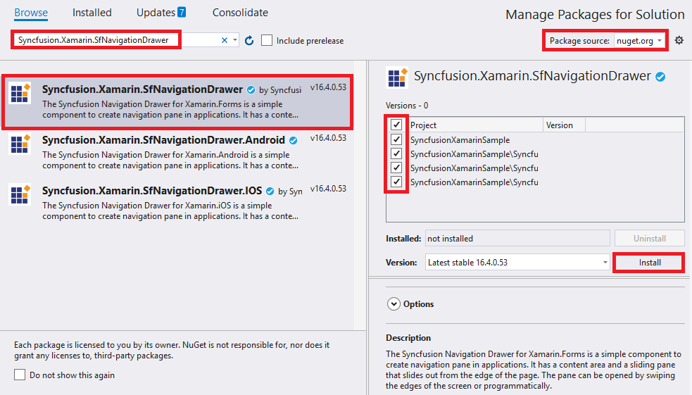
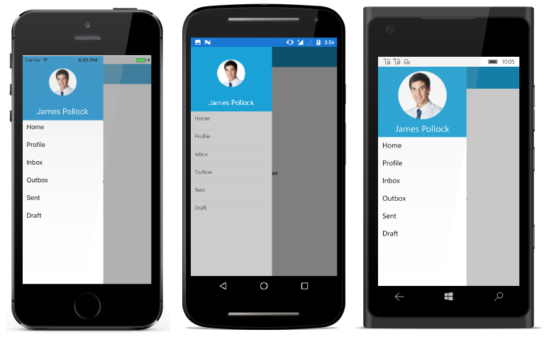

# Getting Started

This section explains you the steps required to create a navigation DrawerPanel with content area and data filled drawer and it covers only the minimal features that you need to know to get started with the NavigationDrawer.

## Adding SfNavigationDrawer reference

You can add SfNavigationDrawer reference using one of the following methods:

**Method 1: Adding SfNavigationDrawer reference from nuget.org**

Syncfusion Xamarin components are available in [nuget.org](https://www.nuget.org/). To add SfNavigationDrawer to your project, open the NuGet package manager in Visual Studio, search for [Syncfusion.Xamarin.SfNavigationDrawer](https://www.nuget.org/packages/Syncfusion.Xamarin.SfNavigationDrawer), and then install it.

N> Install the same version of SfNavigationDrawer NuGet in all the projects.

**Method 2: Adding SfNavigationDrawer reference from toolbox**

Syncfusion also provides Xamarin Toolbox. Using this toolbox, you can drag the SfNavigationDrawer control to the XAML page. It will automatically install the required NuGet packages and add the namespace to the page. To install Syncfusion Xamarin Toolbox, refer to [Toolbox](https://help.syncfusion.com/xamarin/utility#toolbox).

**Method 3: Adding SfNavigationDrawer assemblies manually from the installed location**

If you prefer to manually reference the assemblies instead referencing from NuGet, add the following assemblies in respective projects.

Location: {Installed location}/{version}/Xamarin/lib

<table>
<tr>
<td>PCL</td>
<td>Syncfusion.SfNavigationDrawer.XForms.dll Syncfusion.Core.XForms.dll Syncfusion.Licensing.dll </td>
</tr>
<tr>
<td>Android</td>
<td>Syncfusion.SfNavigationDrawer.Android.dll Syncfusion.SfNavigationDrawer.XForms.Android.dll Syncfusion.SfNavigationDrawer.XForms.dll Syncfusion.Core.XForms.dll Syncfusion.Core.XForms.Android.dll Syncfusion.Licensing.dll </td>
</tr>
<tr>
<td>iOS</td>
<td>Syncfusion.SfNavigationDrawer.iOS.dll Syncfusion.SfNavigationDrawer.XForms.iOS.dll Syncfusion.SfNavigationDrawer.XForms.dll Syncfusion.Core.XForms.dll Syncfusion.Core.XForms.iOS.dll Syncfusion.Licensing.dll </td>
</tr>
<tr>
<td>UWP</td>
<td>Syncfusion.SfNavigationDrawer.UWP.dll Syncfusion.SfNavigationDrawer.XForms.UWP.dll Syncfusion.SfNavigationDrawer.XForms.dll Syncfusion.Core.XForms.dll Syncfusion.Core.XForms.UWP.dll Syncfusion.Licensing.dll </td>
</tr>
</table>

N> To know more about obtaining our components, refer to these links for [Mac](https://help.syncfusion.com/xamarin/introduction/download-and-installation/mac/) and [Windows](https://help.syncfusion.com/xamarin/introduction/download-and-installation/windows/).

I> Starting with v16.2.0.x, if you reference Syncfusion assemblies from the trial setup or from the NuGet feed, you also have to include a license key in your projects. Please refer to [Syncfusion license key](https://help.syncfusion.com/common/essential-studio/licensing/license-key/) to know about registering Syncfusion license key in your Xamarin application to use our components.

N> After adding the reference, an additional step is required for iOS and UWP projects. If you are adding the references from toolbox, this step is not needed.

### Additional Step for iOS

Currently an additional step is required for iOS project. We need to create an instance of the NavigationDrawer custom renderer as shown below. 

Create an instance of SfNavigationDrawerRenderer in FinishedLaunching overridden method of AppDelegate class in iOS project as shown below:





public override bool FinishedLaunching(UIApplication app, NSDictionary options) 

{ 

new Syncfusion.SfNavigationDrawer.XForms.iOS.SfNavigationDrawerRenderer(); 

global::Xamarin.Forms.Forms.Init(); LoadApplication(new App()); 

return base.FinishedLaunching(app, options); 

}





### Additional Step for UWP

This step is required only if application is deployed in Release mode with .NET native tool chain enabled and it is for resolving the known Framework issue “Custom controls not rendering in Release mode” in UWP platform. Initializing the SfNavigationDrawer assembly at OnLaunched overridden method of App class in UWP project is the suggested workaround. And the code example is shown below: 





protected override void OnLaunched(LaunchActivatedEventArgs e)

{ 

#if DEBUG 

if (System.Diagnostics.Debugger.IsAttached)

{ 

this.DebugSettings.EnableFrameRateCounter = true; 

} 

#endif 

Frame rootFrame = Window.Current.Content as Frame; 

if (rootFrame == null)

{ 

rootFrame = new Frame(); 

rootFrame.NavigationFailed += OnNavigationFailed; List<System.Reflection.Assembly> assembliesToInclude = new List<System.Reflection.Assembly>(); 

// Add all the renderer assemblies your app uses assembliesToInclude.Add(typeof(Syncfusion.SfNavigationDrawer.XForms.UWP.SfNavigationDrawerRenderer).GetTypeInfo().Assembly); 

// Replace the Xamarin.Forms.Forms.Init(e);

Xamarin.Forms.Forms.Init(e, assembliesToInclude); 

if (e.PreviousExecutionState == ApplicationExecutionState.Terminated) 

{ 

//TODO: Load state from previously suspended application

} 

// Place the frame in the current Window

Window.Current.Content = rootFrame; 

} 

if (rootFrame.Content == null) 

{

// When the navigation stack isn't restored navigate to the first page, 
// configuring the new page by passing required information as a navigation 
// parameter rootFrame.Navigate(typeof(MainPage), e.Arguments);

} 

// Ensure the current window is active 

Window.Current.Activate();

}





## Initialize SfNavigationDrawer

Import the SfNavigationDrawer namespace in respective Page as shown below: 





	<xmlns:navigationdrawer="clr-namespace:Syncfusion.SfNavigationDrawer.XForms;assembly=Syncfusion.SfNavigationDrawer.XForms"/>
	




	using Syncfusion.SfNavigationDrawer.XForms;





Then initialize an empty navigation drawer as shown below,

	


<?xml version="1.0" encoding="utf-8"?>
<ContentPage xmlns="http://xamarin.com/schemas/2014/forms" 
             xmlns:x="http://schemas.microsoft.com/winfx/2009/xaml" 
             xmlns:local="clr-namespace:NaviSample" 
             xmlns:navigationdrawer="clr-namespace:Syncfusion.SfNavigationDrawer.XForms;assembly=Syncfusion.SfNavigationDrawer.XForms"
             x:Class="NaviSample.MainPage">
   <navigationdrawer:SfNavigationDrawer x:Name="navigationDrawer">
        <navigationdrawer:SfNavigationDrawer.ContentView>
            <Grid/>
        </navigationdrawer:SfNavigationDrawer.ContentView>
    </navigationdrawer:SfNavigationDrawer>
</ContentPage>
	

 

using Syncfusion.SfNavigationDrawer.XForms;
using Xamarin.Forms;

namespace NaviSample
{
    public partial class MainPage : ContentPage
    {
        public MainPage()
        {
            InitializeComponent();
            SfNavigationDrawer navigationDrawer = new SfNavigationDrawer();
            Grid grid = new Grid();
            navigationDrawer.ContentView = grid;
            this.Content = navigationDrawer;
        }
    }
}





N> It is mandatory to set ContentView for SfNavigationDrawer on initializing.

## Adjust Drawer Size

The default position of navigation pane is left so let us change the drawer width to 200.

	


<?xml version="1.0" encoding="utf-8"?>
<ContentPage xmlns="http://xamarin.com/schemas/2014/forms" 
             xmlns:x="http://schemas.microsoft.com/winfx/2009/xaml" 
             xmlns:local="clr-namespace:NaviSample" 
             xmlns:navigationdrawer="clr-namespace:Syncfusion.SfNavigationDrawer.XForms;assembly=Syncfusion.SfNavigationDrawer.XForms"
             x:Class="NaviSample.MainPage">
   <navigationdrawer:SfNavigationDrawer x:Name="navigationDrawer"
                                        DrawerWidth="200">
        <navigationdrawer:SfNavigationDrawer.ContentView>
            <Grid/>
        </navigationdrawer:SfNavigationDrawer.ContentView>
    </navigationdrawer:SfNavigationDrawer>
</ContentPage>
	

 

using Syncfusion.SfNavigationDrawer.XForms;
using Xamarin.Forms;

namespace NaviSample
{
    public partial class MainPage : ContentPage
    {
        public MainPage()
        {
            InitializeComponent();
            SfNavigationDrawer navigationDrawer = new SfNavigationDrawer()
            {
                DrawerWidth = 200
            };

            Grid grid = new Grid();
            navigationDrawer.ContentView = grid;
            this.Content = navigationDrawer;
        }
    }
}





N> For changing the side of navigation pane use Position property. Use DrawerHeight property to change the drawer height in Top and Bottom positions.

## Add Hamburger Menu for Toggling Drawer

Create a button and set required image to the Image property of Button. Subscribe Clicked event of the button and invoke ToggleDrawer() method in it to toggle the drawer. Set this button as ContentView property of SfNavigationDrawer. Align the layout of ContentView properly to get the hamburger icon at top left as shown in following code:

	



<?xml version="1.0" encoding="utf-8"?>
<ContentPage xmlns="http://xamarin.com/schemas/2014/forms" 
             xmlns:x="http://schemas.microsoft.com/winfx/2009/xaml" 
             xmlns:local="clr-namespace:NaviSample" 
             xmlns:navigationdrawer="clr-namespace:Syncfusion.SfNavigationDrawer.XForms;assembly=Syncfusion.SfNavigationDrawer.XForms"
             x:Class="NaviSample.MainPage">
    <navigationdrawer:SfNavigationDrawer x:Name="navigationDrawer" 
                                         DrawerWidth ="200">
        <navigationdrawer:SfNavigationDrawer.ContentView>
            <Grid x:Name="mainContentView" 
                  BackgroundColor="White">
                <Grid.RowDefinitions>
                    <RowDefinition Height="auto"/>
                    <RowDefinition/>
                </Grid.RowDefinitions>
                <StackLayout BackgroundColor="#1aa1d6" 
                               Orientation="Horizontal">
                    <Button x:Name="hamburgerButton" 
                            HeightRequest="50" 
                            WidthRequest="50" 
                            HorizontalOptions="Start" 
                            FontSize="20" 
                            BackgroundColor="#1aa1d6" 
                            Clicked="hamburgerButton_Clicked"/>
                    <Label x:Name="headerLabel" 
                           HeightRequest="50" 
                           HorizontalTextAlignment="Center" 
                           VerticalTextAlignment="Center" 
                           Text="Home" FontSize="16" 
                           TextColor="White" 
                           BackgroundColor="#1aa1d6"/>
                </StackLayout>
                <Label Grid.Row="1" 
                      x:Name="contentLabel" 
                      VerticalOptions="Center" 
                      HorizontalOptions="Center" 
                      Text="Content View" 
                      FontSize="14" 
                      TextColor="Black"/>
            </Grid>
        </navigationdrawer:SfNavigationDrawer.ContentView>
    </navigationdrawer:SfNavigationDrawer>
</ContentPage>
	

	
 

using System;
using Syncfusion.SfNavigationDrawer.XForms;
using Xamarin.Forms;

namespace NaviSample
{
    public partial class MainPage : ContentPage
    {
        public MainPage()
        {
            InitializeComponent();
            hamburgerButton.Image = (FileImageSource)ImageSource.FromFile("hamburger_icon.png");
        }
        void hamburgerButton_Clicked(object sender, EventArgs e)
        {
            navigationDrawer.ToggleDrawer();
        }
    }
}
    




N> Add the required images in drawable folder of Android project, Assets folder of iOS project and add it directly to the UWP project.

## Set ListView as Drawer Content

Create a ListView with five items and set it as DrawerContentView. 

	



<?xml version="1.0" encoding="utf-8"?>
<ContentPage xmlns="http://xamarin.com/schemas/2014/forms" 
             xmlns:x="http://schemas.microsoft.com/winfx/2009/xaml" 
             xmlns:local="clr-namespace:NaviSample" 
             xmlns:navigationdrawer="clr-namespace:Syncfusion.SfNavigationDrawer.XForms;assembly=Syncfusion.SfNavigationDrawer.XForms"
             x:Class="NaviSample.MainPage">
    <navigationdrawer:SfNavigationDrawer x:Name="navigationDrawer" 
                                         DrawerWidth ="200" 
                                         DrawerHeaderHeight="160">
        <navigationdrawer:SfNavigationDrawer.ContentView>
            <Grid x:Name="mainContentView" 
                  BackgroundColor="White">
                <Grid.RowDefinitions>
                <RowDefinition Height="auto"/>
                <RowDefinition/>
                </Grid.RowDefinitions>
                <StackLayout BackgroundColor="#1aa1d6" 
                             Orientation="Horizontal">
                    <Button x:Name="hamburgerButton" 
                            HeightRequest="50" 
                            WidthRequest="50" 
                            HorizontalOptions="Start" 
                            FontSize="20" 
                            BackgroundColor="#1aa1d6" 
                            Clicked="hamburgerButton_Clicked"/>
                    <Label x:Name="headerLabel" 
                           HeightRequest="50" 
                           HorizontalTextAlignment="Center" 
                           VerticalTextAlignment="Center" 
                           Text="Home" 
                           FontSize="16" 
                           TextColor="White" 
                           BackgroundColor="#1aa1d6"/>
                </StackLayout>
                <Label Grid.Row="1" 
                       x:Name="contentLabel" 
                       VerticalOptions="Center" 
                       HorizontalOptions="Center" 
                       Text="Content View" 
                       FontSize="14" 
                       TextColor="Black"/>
            </Grid>
        </navigationdrawer:SfNavigationDrawer.ContentView>
        <navigationdrawer:SfNavigationDrawer.DrawerHeaderView>
            <Grid BackgroundColor="#1aa1d6">
                <Grid.RowDefinitions>
                    <RowDefinition Height="120"/>
                    <RowDefinition Height="40"/>
                </Grid.RowDefinitions>
                <Image Source="user.png" 
                       HeightRequest="110" 
                       Margin="0,10,0,0" 
                       BackgroundColor="#1aa1d6" 
                       VerticalOptions="Center" 
                       HorizontalOptions="Center"/>
                <Label Text="James Pollock" 
                       Grid.Row="1" 
                       HorizontalTextAlignment="Center" 
                       HorizontalOptions="Center" 
                       FontSize="20" 
                       TextColor="White"/>
            </Grid>
        </navigationdrawer:SfNavigationDrawer.DrawerHeaderView>
        <navigationdrawer:SfNavigationDrawer.DrawerContentView>
            <ListView x:Name="listView" 
                      ItemSelected="listView_ItemSelected">
                <ListView.ItemTemplate>
                    <DataTemplate>
                        <ViewCell>
                            <StackLayout HeightRequest="40">
                                <Label Margin="10,7,0,0" 
                                       Text="{Binding}" 
                                       FontSize="16"/>
                            </StackLayout>
                        </ViewCell>
                    </DataTemplate>
                </ListView.ItemTemplate>
            </ListView>
        </navigationdrawer:SfNavigationDrawer.DrawerContentView>
    </navigationdrawer:SfNavigationDrawer>
</ContentPage>

  	

	


using System;
using System.Collections.Generic;
using Syncfusion.SfNavigationDrawer.XForms;
using Xamarin.Forms;

namespace NaviSample
{
    public partial class MainPage : ContentPage
    {
        public MainPage()
        {
            InitializeComponent();
            hamburgerButton.Image = (FileImageSource)ImageSource.FromFile("hamburger_icon.png");
            List<string> list = new List<string>();
            list.Add("Home");
            list.Add("Profile");
            list.Add("Inbox");
            list.Add("Out box");
            list.Add("Sent");
            list.Add("Draft");
            listView.ItemsSource = list;
        }

        void hamburgerButton_Clicked(object sender, EventArgs e)
        {
            navigationDrawer.ToggleDrawer();
        }

        private void listView_ItemSelected(object sender, SelectedItemChangedEventArgs e)
        {
            // Your codes here
            navigationDrawer.ToggleDrawer();
        }
    }
}





We have created knowledge base document by creating SfNavigationDrawer sample fully in code behind. Please refer the same in this [link.](https://www.syncfusion.com/kb/8020/how-to-create-sfnavigationdrawer-sample-in-code-behind)

You can find the Getting Started Sample from this [link.](http://www.syncfusion.com/downloads/support/directtrac/general/ze/GettingStarted1660685208.zip)