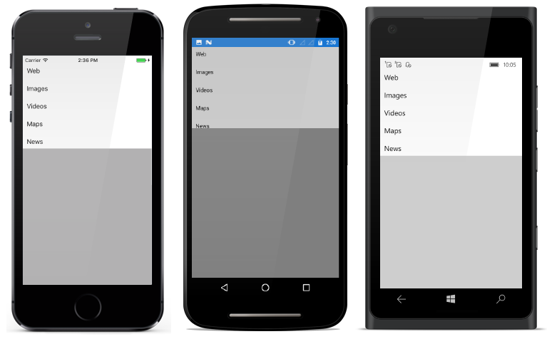

# Navigation Pane Sides

The supplemental pane can be drawn in and out from all four sides. `Position` property is used to change the side of pane and the values are

*	Left

*	Right

*	Top

*	Bottom

N> The default position is Left.

## Left

The navigation pane draws in and out from Left side. It can be set as shown below:

	



<navigationdrawer:SfNavigationDrawer x:Name="navigationDrawer" Position="Left" DrawerHeaderHeight="0">
        <navigationdrawer:SfNavigationDrawer.ContentView>
            <StackLayout>
                  <Grid BackgroundColor="#1aa1d6" HeightRequest="50" VerticalOptions="Start">
                    <Button x:Name="hamburgerButton" HeightRequest="50" WidthRequest="50" HorizontalOptions="Start" FontSize="20" BackgroundColor="#1aa1d6" Clicked="hamburgerButton_Clicked"/>
                </Grid>
            </StackLayout>
        </navigationdrawer:SfNavigationDrawer.ContentView>
        <navigationdrawer:SfNavigationDrawer.DrawerContentView>
            <Grid >
                <ListView x:Name="listView" ItemSelected="listView_ItemSelected" SeparatorColor="Transparent" >
                    
                    <ListView.ItemTemplate>
                        <DataTemplate>
                            <ViewCell>
                                <StackLayout HeightRequest="40">
                                    <Label Margin="10,7,0,0" Text="{Binding}" TextColor="Black" FontSize="16"/>
                                </StackLayout>
                            </ViewCell>
                        </DataTemplate>
                    </ListView.ItemTemplate>
                </ListView>
            </Grid>
        </navigationdrawer:SfNavigationDrawer.DrawerContentView>
    </navigationdrawer:SfNavigationDrawer>


	


public MainPage()

        {
            InitializeComponent();
            navigationDrawer.DrawerWidth = 200; 
		    navigationDrawer.Position = Syncfusion.SfNavigationDrawer.XForms.Position.Left;
            hamburgerButton.Image = (FileImageSource)ImageSource.FromFile("hamburgericon.png");
            List<string> list = new List<string>();
            list.Add("Web");
            list.Add("Images");
            list.Add("Videos");
            list.Add("Maps");
            list.Add("News");
            listView.ItemsSource = list;

        }
        void hamburgerButton_Clicked(object sender, EventArgs e)
        {
            navigationDrawer.ToggleDrawer();
        }

        private void listView_ItemSelected(object sender, SelectedItemChangedEventArgs e)
        {
            //    Your codes here
            navigationDrawer.ToggleDrawer();
        }





## Right

The navigation pane draws in and out from Left side. It can be set as shown below:

	



	<navigationdrawer:SfNavigationDrawer x:Name="navigationDrawer" Position="Right" DrawerHeaderHeight="0">
        <navigationdrawer:SfNavigationDrawer.ContentView>
            <StackLayout>
                  <Grid BackgroundColor="#1aa1d6" HeightRequest="50" VerticalOptions="Start">
                    <Button x:Name="hamburgerButton" HeightRequest="50" WidthRequest="50" HorizontalOptions="Start" FontSize="20" BackgroundColor="#1aa1d6" Clicked="hamburgerButton_Clicked"/>
                </Grid>
            </StackLayout>
        </navigationdrawer:SfNavigationDrawer.ContentView>
        <navigationdrawer:SfNavigationDrawer.DrawerContentView>
            <Grid >
                <ListView x:Name="listView" ItemSelected="listView_ItemSelected" SeparatorColor="Transparent" >
                    
                    <ListView.ItemTemplate>
                        <DataTemplate>
                            <ViewCell>
                                <StackLayout HeightRequest="40">
                                    <Label Margin="10,7,0,0" Text="{Binding}" TextColor="Black" FontSize="16"/>
                                </StackLayout>
                            </ViewCell>
                        </DataTemplate>
                    </ListView.ItemTemplate>
                </ListView>
            </Grid>
        </navigationdrawer:SfNavigationDrawer.DrawerContentView>
    </navigationdrawer:SfNavigationDrawer> 

	

	


public MainPage()

        {
            InitializeComponent();
            navigationDrawer.DrawerWidth = 200;
		    navigationDrawer.Position = Syncfusion.SfNavigationDrawer.XForms.Position.Right;
            hamburgerButton.Image = (FileImageSource)ImageSource.FromFile("hamburgericon.png");
            List<string> list = new List<string>();
            list.Add("Web");
            list.Add("Images");
            list.Add("Videos");
            list.Add("Maps");
            list.Add("News");
            listView.ItemsSource = list;
        }

        void hamburgerButton_Clicked(object sender, EventArgs e)
        {
            navigationDrawer.ToggleDrawer();
        }

        private void listView_ItemSelected(object sender, SelectedItemChangedEventArgs e)
        {
            //    Your codes here
            navigationDrawer.ToggleDrawer();
        }





	
## Top

The navigation pane draws in and out from Left side. It can be set as shown below:





	<navigationdrawer:SfNavigationDrawer x:Name="navigationDrawer" Position="Top" DrawerFooterHeight="0" DrawerHeaderHeight="0">
        <navigationdrawer:SfNavigationDrawer.ContentView>
            <StackLayout>
                  <Grid BackgroundColor="#1aa1d6" HeightRequest="50" VerticalOptions="Start">
                    <Button x:Name="hamburgerButton" HeightRequest="50" WidthRequest="50" HorizontalOptions="Start" FontSize="20" BackgroundColor="#1aa1d6" Clicked="hamburgerButton_Clicked"/>
                </Grid>
            </StackLayout>
        </navigationdrawer:SfNavigationDrawer.ContentView>
        <navigationdrawer:SfNavigationDrawer.DrawerContentView>
            <Grid >
                <ListView x:Name="listView" ItemSelected="listView_ItemSelected" SeparatorColor="Transparent" >
                    
                    <ListView.ItemTemplate>
                        <DataTemplate>
                            <ViewCell>
                                <StackLayout HeightRequest="40">
                                    <Label Margin="10,7,0,0" Text="{Binding}" TextColor="Black" FontSize="16"/>
                                </StackLayout>
                            </ViewCell>
                        </DataTemplate>
                    </ListView.ItemTemplate>
                </ListView>
            </Grid>
        </navigationdrawer:SfNavigationDrawer.DrawerContentView>
    </navigationdrawer:SfNavigationDrawer>

	
	
	

	
public MainPage()

        {
            InitializeComponent();
		    navigationDrawer.DrawerWidth = 200;
	    	navigationDrawer.Position = Syncfusion.SfNavigationDrawer.XForms.Position.Top;
            hamburgerButton.Image = (FileImageSource)ImageSource.FromFile("hamburgericon.png");
            List<string> list = new List<string>();
            list.Add("Web");
            list.Add("Images");
            list.Add("Videos");
            list.Add("Maps");
            list.Add("News");
            listView.ItemsSource = list;
        }

        void hamburgerButton_Clicked(object sender, EventArgs e)
        {
            navigationDrawer.ToggleDrawer();
        }

        private void listView_ItemSelected(object sender, SelectedItemChangedEventArgs e)
        {
            //    Your codes here
            navigationDrawer.ToggleDrawer();
        }





## Bottom

The navigation pane draws in and out from Left side. It can be set as shown below:

	



	<navigationdrawer:SfNavigationDrawer x:Name="navigationDrawer" Position="Bottom" DrawerFooterHeight="0" DrawerHeaderHeight="0">
        <navigationdrawer:SfNavigationDrawer.ContentView>
            <StackLayout>
                  <Grid BackgroundColor="#1aa1d6" HeightRequest="50" VerticalOptions="Start">
                    <Button x:Name="hamburgerButton" HeightRequest="50" WidthRequest="50" HorizontalOptions="Start" FontSize="20" BackgroundColor="#1aa1d6" Clicked="hamburgerButton_Clicked"/>
                </Grid>
            </StackLayout>
        </navigationdrawer:SfNavigationDrawer.ContentView>
        <navigationdrawer:SfNavigationDrawer.DrawerContentView>
            <Grid >
                <ListView x:Name="listView" ItemSelected="listView_ItemSelected" SeparatorColor="Transparent" >
                    
                    <ListView.ItemTemplate>
                        <DataTemplate>
                            <ViewCell>
                                <StackLayout HeightRequest="40">
                                    <Label Margin="10,7,0,0" Text="{Binding}" TextColor="Black" FontSize="16"/>
                                </StackLayout>
                            </ViewCell>
                        </DataTemplate>
                    </ListView.ItemTemplate>
                </ListView>
            </Grid>
        </navigationdrawer:SfNavigationDrawer.DrawerContentView>
    </navigationdrawer:SfNavigationDrawer> 


	


public MainPage()

        {
            InitializeComponent();
	     	navigationDrawer.DrawerWidth = 200;
	     	navigationDrawer.Position = Syncfusion.SfNavigationDrawer.XForms.Position.Bottom;
            hamburgerButton.Image = (FileImageSource)ImageSource.FromFile("hamburgericon.png");
            List<string> list = new List<string>();
            list.Add("Web");
            list.Add("Images");
            list.Add("Videos");
            list.Add("Maps");
            list.Add("News");
            listView.ItemsSource = list;
        }

        void hamburgerButton_Clicked(object sender, EventArgs e)
        {
            navigationDrawer.ToggleDrawer();
        }

        private void listView_ItemSelected(object sender, SelectedItemChangedEventArgs e)
        {
            //    Your codes here
            navigationDrawer.ToggleDrawer();
        }





