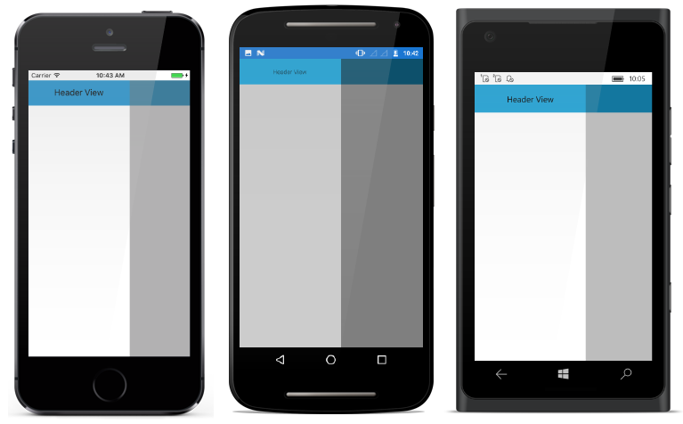
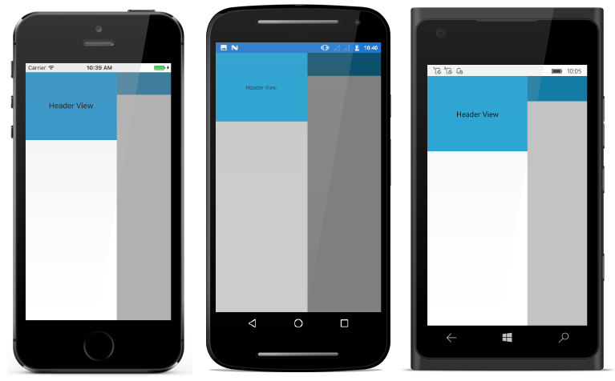
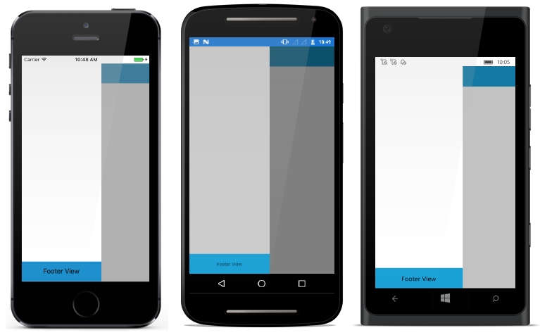
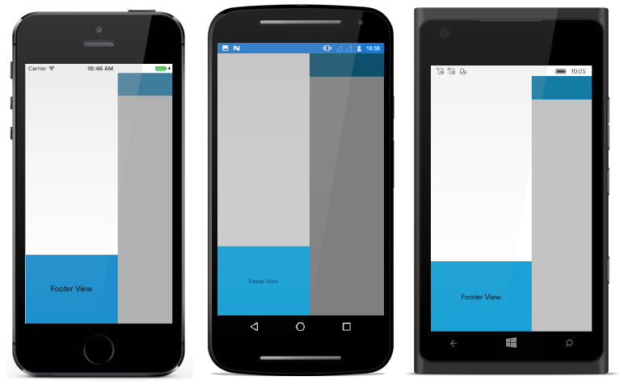
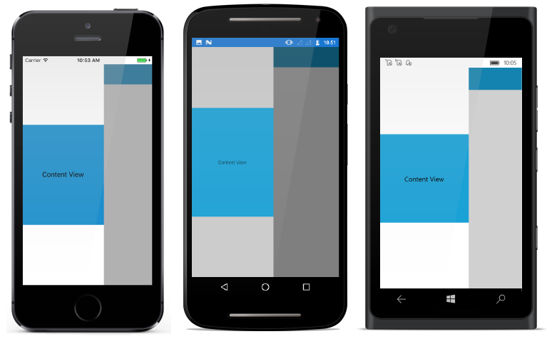

# Side Pane Content

The drawer pane content is viewable only if drawer is in open state. Its content can be set as

*	Header Content

*	Drawer Content

*	Footer Content

N> Header and Footer content are optional but Drawer content is mandatory to allocate space for the drawer.
		
## Header Content

As the name suggests it is displayed at the top of drawer. `DrawerHeaderView` property is used to set the header content of drawer. 





    <navigationdrawer:SfNavigationDrawer x:Name="navigationDrawer">
        <navigationdrawer:SfNavigationDrawer.ContentView>
            <StackLayout>
                <Grid BackgroundColor="#1aa1d6" HeightRequest="50" VerticalOptions="Start">
                    <Button x:Name="hamburgerButton" HeightRequest="50" WidthRequest="50" HorizontalOptions="Start" FontSize="20" BackgroundColor="#1aa1d6" Clicked="hamburgerButton_Clicked"/>
                </Grid>
            </StackLayout>
        </navigationdrawer:SfNavigationDrawer.ContentView>
        <navigationdrawer:SfNavigationDrawer.DrawerHeaderView>
            <Grid BackgroundColor="#1aa1d6" >
               <StackLayout VerticalOptions="Center" HorizontalOptions="Center">
                <Label Text="Header View"/>
               </StackLayout>
            </Grid> 
        </navigationdrawer:SfNavigationDrawer.DrawerHeaderView>
    </navigationdrawer:SfNavigationDrawer>





public MainPage()

        {
            InitializeComponent();
             navigationDrawer.DrawerWidth = 200;
            hamburgerButton.Image = (FileImageSource)ImageSource.FromFile("hamburgericon.png");
        }

        void hamburgerButton_Clicked(object sender, EventArgs e)
        {
            navigationDrawer.ToggleDrawer();
        }

  




## Header Height

Height of the drawer header content can be adjusted using `DrawerHeaderHeight` property.




    
    <navigationdrawer:SfNavigationDrawer x:Name="navigationDrawer" DrawerHeaderHeight="50">
        <navigationdrawer:SfNavigationDrawer.ContentView>
            <StackLayout>
                <Grid BackgroundColor="#1aa1d6" HeightRequest="50" VerticalOptions="Start">
                    <Button x:Name="hamburgerButton" HeightRequest="50" WidthRequest="50" HorizontalOptions="Start" FontSize="20" BackgroundColor="#1aa1d6" Clicked="hamburgerButton_Clicked"/>
                </Grid>
            </StackLayout>
        </navigationdrawer:SfNavigationDrawer.ContentView>
        <navigationdrawer:SfNavigationDrawer.DrawerHeaderView>
            <Grid BackgroundColor="#1aa1d6" >
                    <StackLayout VerticalOptions="Center" HorizontalOptions="Center">
                <Label Text="Header View"/>
                        </StackLayout>
            </Grid> 
        </navigationdrawer:SfNavigationDrawer.DrawerHeaderView>
    </navigationdrawer:SfNavigationDrawer>





public MainPage()

        {
            InitializeComponent();
            navigationDrawer.DrawerWidth = 200;
            hamburgerButton.Image = (FileImageSource)ImageSource.FromFile("hamburgericon.png");
        }

        void hamburgerButton_Clicked(object sender, EventArgs e)
        {
            navigationDrawer.ToggleDrawer();
        }





## Footer Content

As the name suggests it is displayed at the bottom of drawer. `DrawerFooterView` property is used to set the footer content of drawer. 





    <navigationdrawer:SfNavigationDrawer x:Name="navigationDrawer">
        <navigationdrawer:SfNavigationDrawer.ContentView>
            <StackLayout>
                <Grid BackgroundColor="#1aa1d6" HeightRequest="50" VerticalOptions="Start">
                    <Button x:Name="hamburgerButton" HeightRequest="50" WidthRequest="50" HorizontalOptions="Start" FontSize="20" BackgroundColor="#1aa1d6" Clicked="hamburgerButton_Clicked"/>
                </Grid>
            </StackLayout>
        </navigationdrawer:SfNavigationDrawer.ContentView>
        <navigationdrawer:SfNavigationDrawer.DrawerFooterView>
           <Grid BackgroundColor="#1aa1d6" >
            <StackLayout VerticalOptions="Center" HorizontalOptions="Center">
                <Label Text="Footer View"/>
            </StackLayout>
           </Grid> 
        </navigationdrawer:SfNavigationDrawer.DrawerFooterView>
    </navigationdrawer:SfNavigationDrawer>





public MainPage()

        {
            InitializeComponent();
            navigationDrawer.DrawerWidth = 200;
            hamburgerButton.Image = (FileImageSource)ImageSource.FromFile("hamburgericon.png");
        }

        void hamburgerButton_Clicked(object sender, EventArgs e)
        {
            navigationDrawer.ToggleDrawer();
        }





## Footer Height

Height of the drawer footer content can be adjusted using `DrawerFooterHeight` property.



 

   <navigationdrawer:SfNavigationDrawer x:Name="navigationDrawer" DrawerFooterHeight="50">
        <navigationdrawer:SfNavigationDrawer.ContentView>
            <StackLayout>
                <Grid BackgroundColor="#1aa1d6" HeightRequest="50" VerticalOptions="Start">
                    <Button x:Name="hamburgerButton" HeightRequest="50" WidthRequest="50" HorizontalOptions="Start" FontSize="20" BackgroundColor="#1aa1d6" Clicked="hamburgerButton_Clicked"/>
                </Grid>
            </StackLayout>
        </navigationdrawer:SfNavigationDrawer.ContentView>
        <navigationdrawer:SfNavigationDrawer.DrawerFooterView>
            <Grid BackgroundColor="#1aa1d6" >
            <StackLayout VerticalOptions="Center" HorizontalOptions="Center">
                <Label Text="Footer View"/>
            </StackLayout>
             </Grid> 
        </navigationdrawer:SfNavigationDrawer.DrawerFooterView>
    </navigationdrawer:SfNavigationDrawer>

	



        
public MainPage()

        {
            InitializeComponent();
            navigationDrawer.DrawerWidth = 200;
            hamburgerButton.Image = (FileImageSource)ImageSource.FromFile("hamburgericon.png");
        }

        void hamburgerButton_Clicked(object sender, EventArgs e)
        {
            navigationDrawer.ToggleDrawer();
        }

  




## Main Content

Drawer main content is displayed in between header and footer content. It can be set using `DrawerContentView` property. Content view occupies the remaining space left by header and footer content.



 

    <navigationdrawer:SfNavigationDrawer x:Name="navigationDrawer">
        <navigationdrawer:SfNavigationDrawer.ContentView>
            <StackLayout>
                <Grid BackgroundColor="#1aa1d6" HeightRequest="50" VerticalOptions="Start">
                    <Button x:Name="hamburgerButton" HeightRequest="50" WidthRequest="50" HorizontalOptions="Start" FontSize="20" BackgroundColor="#1aa1d6" Clicked="hamburgerButton_Clicked"/>
                </Grid>
            </StackLayout>
        </navigationdrawer:SfNavigationDrawer.ContentView>
        <navigationdrawer:SfNavigationDrawer.DrawerContentView>
            <Grid BackgroundColor="#1aa1d6">
                <Label Text="Content View" VerticalOptions="Center" HorizontalOptions="Center"/>
            </Grid>
        </navigationdrawer:SfNavigationDrawer.DrawerContentView>
    </navigationdrawer:SfNavigationDrawer>

	



        
public MainPage()

        {
            InitializeComponent();
            navigationDrawer.DrawerWidth = 200;
            hamburgerButton.Image = (FileImageSource)ImageSource.FromFile("hamburgericon.png");
        }

        void hamburgerButton_Clicked(object sender, EventArgs e)
        {
            navigationDrawer.ToggleDrawer();
        }

  




