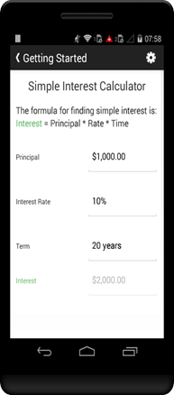
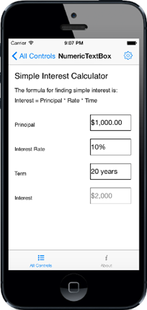

# Getting Started

This section explains how to configure the NumericTextBox in the following three platforms.

* Create your first NumericTextBox in Xamarin.Android.
* Create your first NumericTextBox in Xamarin.iOS.
* Create your first NumericTextBox in Xamarin.Forms.

## Create your first NumericTextBox in Xamarin.Android

This section encompasses how to create the NumericTextBox that lets you to enter values in an efficient way. You can also 
display numbers in the format of its mentioned culture. In this instance, how to create a NumericTextBox and to use its several 
features have been demonstrated.

### Add Syncfusion assembly reference

After installing the Essential StudioforXamarin, you can find all the required assemblies in the following installed folders,

{Syncfusion Installed location}\Essential Studio\{version number}\lib

N> Assemblies are available in unzipped package location in Mac.

Add the following assembly references to the Xamarin project.

android\Syncfusion.SfNumericTextBox.Android.dll

### Create a NumericTextBox

To develop an application with the Android NumericTextBox is simple. The following steps explain how to create and configure its properties.

Create an instance for the SfNumericTextBox in the constructor and set that SfNumericTextBox as content view of Activity. 

  

SfNumericTextBox numtext=new SfNumericTextBox(this);

SetContentView(numtext);

 

### Configure the NumericTextBox

You can set the initial value and numberformat for the NumericTextBox by using the value and formatString properties in the NumericTextBox. 

  

numtext.Value=123.45;

numtext.FormatString=”n”;

numtext.MaximumNumberDecimalDigits=2;

 

The above code example illustrates the value and formatstring of the NumericTextBox. The MaximumNumberDecimalDigits can be specified to determine the digits after the decimal.

### Adding ParsingMode

Value of the NumericTextBox gets parsed based on the ParsingMode property. ParsingMode is of type Parsers that is the enum of Double and Decimal.

  

numtext.Value=123.45;

numtext.ParsingMode=Parsers.Decimal

 

## Create your first NumericTextBox in Xamarin.Forms

This section provides a quick overview for working with the Essential NumericTextBox for Xamarin.Forms.

### Add Syncfusion assembly reference

Add the required Syncfusionassembly references to the respective projects as follows. Refer to the following installed location for the required assemblies:

{Syncfusion Installed location}\Essential Studio\(version)\lib

Example: C:\Program Files (x86)\Syncfusion\Essential Studio\(version)\lib

#### PCL project

XForms\Syncfusion.SfNumericTextBox.XForms.dll 

#### Android project

Android\Syncfusion.SfNumericTextBox.Android.dll

Android\Syncfusion.SfNumericTextBox.XForms.Android.dll

#### iOS project

iOS\Syncfusion.SfNumericTextBox.iOS.dll  

iOS\Syncfusion.SfNumericTextBox.XForms.iOS.dll

#### Windows Phone project

WinPhone\Syncfusion. SfInput.WP8.dll

WinPhone\Syncfusion.SfNumericTextBox.XForms.WinPhone.dll

WinPhone\Syncfusion. SfShared.WP8.dll

N> Essential  NumericTextBox  for Xamarin is compatible with Xamarin Forms 1.3.

An additional step is required for Windows Phone and iOS projects. Create an instance of the SfNumericTextBoxRenderer in the MainPage constructor in Windows Phone project as follows.

  

public MainPage()
{

    new SfNumericTextBoxRenderer ();

    ...    

}
		
 

Create an instance of the SfNumericTextBoxRenderer in the FinishedLaunching overridden method of the AppDelegate class in the iOS Project as follows.



public override bool FinishedLaunching(UIApplication app, NSDictionary options)
{

    ...

    new SfNumericTextBoxRenderer ();

    ...

}

 

### Create a NumericTextBox

The NumericTextBox control is configured entirely in the C# code or by using the XAML markup.

Create an instance of the SfNumericTextBox.

   

  

// Update App.cs source in this file.

using Syncfusion.XForms.SfNumericTextBox;

…

…

public class App : Application
{

public App()
{
	MainPage = new NumericTextBoxPage ();
}

}

public class NumericTextBoxPage : ContentPage
{

SfNumericTextBox sfnumerictextbox;
public NumericTextBoxPage ()
{        
	sfnumerictextbox = new SfNumericTextBox();
}

}

 

 

Use this in App.CS source.

<?xml version="1.0" encoding="UTF-8"?>
 <ContentPage xmlns="http://xamarin.com/schemas/2014/forms" BackgroundColor="White" 
   xmlns:x="http://schemas.microsoft.com/winfx/2009/xaml" x:Class="NumericTextBoxGettingStarted.NumericTextBoxPage"
   xmlns:syncfusion="clr-namespace:Syncfusion.SfNumericTextBox.XForms;assembly=Syncfusion.SfNumericTextBox.XForms"> 
	  <ContentPage.Content>
			<syncfusion:SfNumericTextBox />
	  </ContentPage.Content>
 </ContentPage> 
 </ContentPage.Content>
 </ContentPage>



 

### Configure the NumericTextBox

Add the NumericTextBox properties in your application.

   

 

SfNumericTextBox sfnumerictextbox = new SfNumericTextBox();

sfnumerictextbox.Value= 1000;

sfnumerictextbox.FormatString= “c”;

sfnumerictextbox.AllowNull= true;

sfnumerictextbox.MaximumNumberDecimalDigits= 2;

 
 
 

<syncfusion:SfNumericTextBox HeightRequest="100"  Value="1000"  Orientation="Horizontal" 
	
	WidthRequest="200" FormatString=”C” AllowNull=”true” MaximumNumberDecimalDigits=”2”>

</syncfusion:SfNumericTextBox> 

 

 

The following screenshot shows the NumericTextBox in cross platforms.

## Create your first NumericTextBox in Xamarin.iOS

This section encompasses how to create the NumericTextBox that lets you enter values in an efficient way. You can also display numbers in the format of its mentioned culture. In this instance, how to create a NumericTextBox and to use its several features have been demonstrated.

### Add Syncfusion assembly reference

After installing Essential Studio for Xamarin, you can find all the required assemblies in the following installed folders:

 {Syncfusion Installed location}\Essential Studio\{version number}\lib

N> Assemblies are available in unzipped package location in Mac.

Add the following assembly references to the iOS project.

iOS\Syncfusion.SfNumericTextBox.iOS.dll

### Creating a NumericTextBox

To develop an application with the iOS NumericTextBox is simple. The following steps explain how to create and configure its properties.

Create an instance for the SfNumericTextBox in the constructor and set that SfNumericTextBox as the content view of Activity. 

  

public override void ViewDidLoad ()
{

  base.ViewDidLoad   ();

  SFNumericTextBox numericTextBox1;

  numericTextBox1.Frame = new CGRect (200, 120, 100, 40)]

  }

 

### Configure the NumericTextBox

You can set the initial value and numberformat for the NumericTextBox by using the value and formatString properties in the NumericTextBox. 

  

numericTextBox1.Value = 1000;

numericTextBox1.FormatString=”n”;

numericTextBox1.MaximumNumberDecimalDigits = 2;

 

The above code example illustrates the value and formatstring of the NumericTextBox. The MaximumNumberDecimalDigits can be specified to determine the digits after the decimal.

### Adding ParsingMode

Value of the NumericTextBox gets parsed based on the ParsingMode property. ParsingMode is of type Parsers that is the enum of
 Double and Decimal.

 

numericTextBox1.ParserMode = SFNumericTextBoxParsers.Decimal;

 

