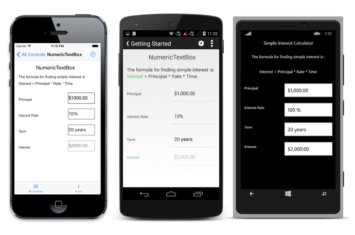

# Getting Started

This section explains you the steps to configure a SfNumericTextBox control in a real-time scenario and also provides a walk-through on some of the customization features available in SfNumericTextBox control.

## Add SfNumericTextBox

You can then add the assembly references to the respective projects as shown below

<table>
<tr>
<th>Project</th>
<th>Required assemblies</th>
</tr>
<tr>
<td>PCL</td>
<td>pcl\Syncfusion.SfNumericTextBox.XForms.dll</td>
</tr>
<tr>
<td>Android</td>
<td>android\Syncfusion.SfNumericTextBox.Android.dll android\Syncfusion.SfNumericTextBox.XForms.Android.dll android\Syncfusion.SfNumericTextBox.XForms.dll</td>
</tr>
<tr>
<td>iOS (Unified)</td>
<td>iOS-unified\Syncfusion.SfNumericTextBox.iOS.dll iOS-unified\Syncfusion.SfNumericTextBox.XForms.iOS.dll iOS-unified\Syncfusion.SfNumericTextBox.XForms.dll</td>
</tr>
<tr>
<td>Windows Phone</td>
<td>wp8\Syncfusion.SfInput.WP8.dll wp8\Syncfusion.SfShared.WP8.dll wp8\Syncfusion.SfNumericTextBox.XForms.dll wp8\Syncfusion.SfNumericTextBox.XForms.WinPhone.dll</td>
</tr>
<tr>
<td>Windows Phone 8.1</td>
<td>wp81\Syncfusion.SfInput.WP.dll wp81\Syncfusion.SfShared.WP.dll wp81\Syncfusion.SfNumericTextBox.XForms.dll wp81\Syncfusion.SfNumericTextBox.XForms.WinPhone.dll</td>
</tr>
<tr>
<td>WinRT</td>
<td>winrt\Syncfusion.SfInput.WinRT.dll winrt\Syncfusion.SfShared.WinRT.dll winrt\Syncfusion.SfNumericTextBox.XForms.dll winrt\Syncfusion.SfNumericTextBox.XForms.WinRT.dll</td>
</tr>
<tr>
<td>UWP</td>
<td>uwp\Syncfusion.SfInput.UWP.dll uwp\Syncfusion.SfShared.UWP.dll uwp\Syncfusion.SfNumericTextBox.XForms.dll uwp\Syncfusion.SfNumericTextBox.XForms.UWP.dll</td>
</tr>
</table>

Currently an additional step is required for Windows Phone, Windows Phone 8.1 and iOS projects. We need to create an instance of the NumericTextBox custom renderer as shown below. 

Create an instance of SfNumericTextBoxRenderer in MainPage constructor of the Windows Phone and Windows Phone 8.1  project as shown 





public MainPage()
{
    new SfNumericTextBoxRenderer(); 
}





Create an instance of SfNumericTextBoxRenderer in FinishedLaunching overridden method of AppDelegate class in iOS Project as shown below





public override bool FinishedLaunching(UIApplication app, NSDictionary options)
{
    new SfNumericTextBoxRenderer ();
}	





The SfNumericTextBox control configured entirely in C# code or by using XAML markup. The following steps explains how to create a NumericTextBox and configure its elements,

* Adding namespace for the added assemblies. 





	<xmlns:numeric="clr-namespace:Syncfusion.SfNumericTextBox.XForms;assembly=Syncfusion.SfNumericTextBox.XForms"/> 
	




	using Syncfusion.SfNumericTextBox.XForms;





* Now add the SfNumericTextBox control with a required optimal name by using the included namespace.





	<numeric:SfNumericTextBox x:Name="numericTextBox" />
	




	SfNumericTextBox numericTextBox=new SfNumericTextBox();
	this.Content = numericTextBox;





## Set Value

The SfNumericTextBox control display value can be set using `Value` property.





	<numeric:SfNumericTextBox x:Name="numericTextBox" Value="123.45" />
	




SfNumericTextBox numericTextBox=new SfNumericTextBox();
	numericTextBox.Value = 123.45;
	this.Content = numericTextBox;





## Enable Parsing Mode

SfNumericTextBox provides option to display the value in double or decimal. Following code shows the Decimal parsing mode which can be set through `ParsingMode` property.





	<numeric:SfNumericTextBox x:Name="numericTextBox" Value="123.45" ParsingMode="Decimal" />
	




SfNumericTextBox numericTextBox=new SfNumericTextBox();
	numericTextBox.ParsingMode=Parsers.Decimal;
	numericTextBox.Value = 123.45;
	this.Content = numericTextBox;
	




## Add Format String

SfNumericTextBox provides option to format the display text in currency format. Following code explains how to set the currency format using `FormatString` property.





	<numeric:SfNumericTextBox x:Name="numericTextBox" Value="123.45" ParsingMode="Decimal" FormatString="c" />
	




SfNumericTextBox numericTextBox=new SfNumericTextBox();
	numericTextBox.FormatString = "c";
	numericTextBox.Value = 123.45;
	this.Content = numericTextBox;





N> The control displays the formatted text on lost focus. Default Value of `FormatString` is "n".

