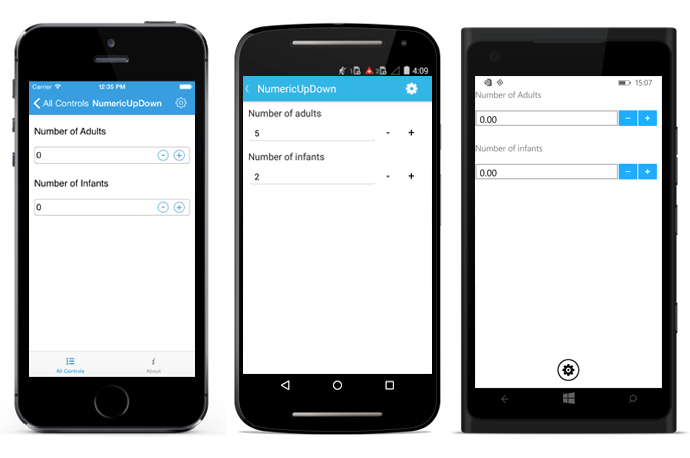

# Getting Started

This section provides overview for working with Essential SfNumericUpDown for Xamarin.Forms. You can walk through the entire process of creating a SfNumericUpDown.

## Add SfNumericUpDown

You can then add the assembly references to the respective projects as shown below

<table>
<tr>
<th>Project</th>
<th>Required assemblies</th>
</tr>
<tr>
<td>PCL</td>
<td>pcl\Syncfusion.SfNumericUpDown.XForms.dll</td>
</tr>
<tr>
<td>Android</td>
<td>android\Syncfusion.SfNumericUpDown.Android.dll android\Syncfusion.SfNumericUpDown.XForms.Android.dll android\Syncfusion.SfNumericUpDown.XForms.dll</td>
</tr>
<tr>
<td>iOS (Unified)</td>
<td>iOS-unified\Syncfusion.SfNumericUpDown.iOS.dll iOS-unified\Syncfusion.SfNumericUpDown.XForms.iOS.dll iOS-unified\Syncfusion.SfNumericUpDown.XForms.dll</td>
</tr>
<tr>
<td>UWP</td>
<td>uwp\Syncfusion.SfInput.UWP.dll uwp\Syncfusion.SfShared.UWP.dll uwp\Syncfusion.SfNumericUpDown.XForms.dll uwp\Syncfusion.SfNumericUpDown.XForms.UWP.dll</td>
</tr>
</table>

Currently an additional step is required for iOS project. We need to create an instance of the NumericUpDown custom renderer as shown below. 

Create an instance of SfNumericUpDownRenderer in FinishedLaunching overridden method of AppDelegate class in iOS Project as shown below





public override bool FinishedLaunching(UIApplication app, NSDictionary options)
{
    new SfNumericUpDownRenderer ();
}	





### ReleaseMode issue in UWP platform

There is a known Framework issue in UWP platform. The custom controls will not render when deployed the application in `Release Mode`.

The above problem can be resolved by initializing the SfNumericUpDown assemblies in `App.xaml.cs` in UWP project as like in below code snippet.



// In App.xaml.cs

protected override void OnLaunched(LaunchActivatedEventArgs e)
{
…

	rootFrame.NavigationFailed += OnNavigationFailed;
		
	// you'll need to add `using System.Reflection;`
	List<Assembly> assembliesToInclude = new List<Assembly>();

	//Now, add all the assemblies your app uses
	assembliesToInclude.Add(typeof(SfNumericUpDownRenderer).GetTypeInfo().Assembly);

	// replaces Xamarin.Forms.Forms.Init(e);        
	Xamarin.Forms.Forms.Init(e, assembliesToInclude);
		
…     
}


The SfNumericUpDown control configured entirely in C# code or by using XAML markup. The following steps explains how to create a SfNumericUpDown and configure its elements.

* Adding namespace for the added assemblies. 





	<xmlns:numeric="clr-namespace:Syncfusion.SfNumericUpDown.XForms;assembly=Syncfusion.SfNumericUpDown.XForms"/>
	




	using Syncfusion.SfNumericUpDown.XForms;





* Now add the SfNumericUpDown control with a required optimal name by using the included namespace.





	<numeric:SfNumericUpDown x:Name="numericUpDown"/>
	




	SfNumericUpDown numericUpDown=new SfNumericUpDown();
	this.Content = numericUpDown;





## Set Value

The SfNumericUpDown control display value can be set using `Value` property. 





	<numeric:SfNumericUpDown x:Name="numericUpDown" Value="5"/>
	




SfNumericUpDown numericUpDown=new SfNumericUpDown();
	numericUpDown.Value= 5;
	this.Content = numericTextBox;





## Enable Parsing Mode

SfNumericTextBox provides option to display the value in double or decimal. Following code shows the Decimal parsing mode which can be set through `ParsingMode` property.





	<numeric:SfNumericUpDown x:Name="numericUpDown" Value="5" ParsingMode="Decimal"/>
	




SfNumericUpDown numericUpDown=new SfNumericUpDown();
	numericUpDown.Value= 5;
	numericUpDown.ParsingMode=Parsers.Decimal;
	this.Content = numericTextBox;
	




## Add Format String

SfNumericTextBox provides option to format the display text in currency format. 

It has three types,

* c - Display the value with currency notation.
* n – Display the value in number format.
* p – Display the value in Percentage.

N> The control displays the formatted text on lost focus. Default Value of `FormatString` is "n".

Following code explains how to set the currency format using `FormatString` property.





	<numeric:SfNumericUpDown x:Name="numericUpDown" Value="5" ParsingMode="Decimal" FormatString="c"/>
	




SfNumericUpDown numericUpDown=new SfNumericUpDown();
	numericUpDown.Value= 5;
	numericUpDown.ParsingMode=ParsingMode.Decimal;
	numericUpDown.FormatString = "c";
	this.Content = numericTextBox;





## Structure

Text area and spin button are the two elements of SfNumericUpDown control. 

### Text area 

It is the area where the numeric values are displayed.

### Spin Button

Current value of the SfNumericUpDown control can be incremented or decremented using the spin button.

Spin button position can be customized as follows.





	numericUpDown.SpinButtonAlignment = SpinButtonAlignment.Right;





	<numeric:SfNumericUpDown x:Name="numericUpDown" SpinButtonAlignment="Right"/>
	




