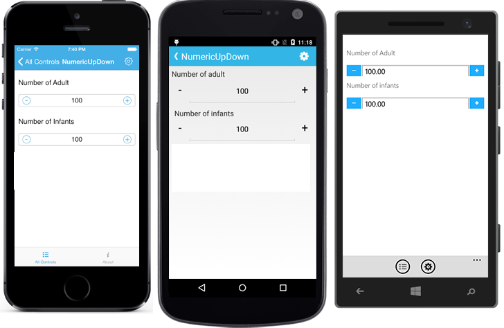

# Spin Button Alignment

Spin Button position in the SfNumericUpDown control can be changed relative to the TextBox based on `SpinButtonAlignment` property. 

There are three built-in modes.

### Right

Spin Buttons will get aligned to the right side of the control.





	numericUpDown.SpinButtonAlignment = SpinButtonAlignment.Right;





	<numeric:SfNumericUpDown x:Name="numericUpDown" SpinButtonAlignment="Right"/>
	




### Left

Spin Buttons will get aligned to the left side of the control.





	<numeric:SfNumericUpDown x:Name="numericUpDown" SpinButtonAlignment="Left"/>
	




	numericUpDown.SpinButtonAlignment = SpinButtonAlignment.Left;





### Both

Spin Buttons will get aligned to the both side of the control.





	<numeric:SfNumericUpDown x:Name="numericUpDown" SpinButtonAlignment="Both"/>
	




	numericUpDown.SpinButtonAlignment = SpinButtonAlignment.Both;





N> By default the property value is Right.

## UpDownButtonSetting Customization

We can set the Up Down button of SfNumericUpDown control by using any of the below given ways.

1. View
2. Image
3. FontIconText

N> For image and Font icon we need to add the the respective image and TTF file.
		For android: Add image at Resource/Drawable/{Image} and .ttf file at Asserts/{.ttf}
		For iOS: Add image and .ttf file to Resource/{Image/.ttf} and To use FontIcons, add respective FontFamily name in info.plist file under Fonts provided by application category.
		For UWP: Add the image and .ttf file directly to the project.

### By using View





	<StackLayout Padding="50" >

<updown:SfNumericUpDown x:Name="upDown" SpinButtonAlignment="Both" TextAlignment="Center">
<updown:SfNumericUpDown.IncrementButtonSettings>
<updown:UpDownButtonSettings ButtonHeight="45" ButtonWidth="45">
<updown:UpDownButtonSettings.ButtonView>
<Grid HeightRequest="40" WidthRequest="40">
<Image Source="up.png" Aspect="AspectFit" />
</Grid>
</updown:UpDownButtonSettings.ButtonView>
</updown:UpDownButtonSettings>
</updown:SfNumericUpDown.IncrementButtonSettings>
<updown:SfNumericUpDown.DecrementButtonSettings>
<updown:UpDownButtonSettings ButtonHeight="45" ButtonWidth="45">
<updown:UpDownButtonSettings.ButtonView>
<Grid HeightRequest="40" WidthRequest="40">
<Image Source="down.png" Aspect="AspectFit" />
</Grid>
</updown:UpDownButtonSettings.ButtonView>
</updown:UpDownButtonSettings>
</updown:SfNumericUpDown.DecrementButtonSettings>
</updown:SfNumericUpDown>

	</StackLayout>
	




SfNumericUpDown upDown = new SfNumericUpDown();
upDown.SpinButtonAlignment = SpinButtonAlignment.Both;
UpDownButtonSettings incSettings = new UpDownButtonSettings();
Grid incrementStack = new Grid();
incrementStack.HeightRequest = 40;
incrementStack.WidthRequest = 40;
Image incrementImage = new Image();
incrementImage.HorizontalOptions = LayoutOptions.Center;
incrementImage.VerticalOptions = LayoutOptions.Center;
incrementImage.Source = (FileImageSource)ImageSource.FromFile("up.png");
incrementImage.Aspect = Aspect.AspectFit;
incrementStack.Children.Add(incrementImage);
incSettings.ButtonView = incrementStack;
incSettings.ButtonHeight = 45;
incSettings.ButtonWidth = 45;
upDown.IncrementButtonSettings = incSettings;
UpDownButtonSettings decrementSettings = new UpDownButtonSettings();
Grid decrementStack = new Grid();
decrementStack.HeightRequest = 40;
decrementStack.WidthRequest = 40;
Image decrementImage = new Image();
decrementImage.Source = (FileImageSource)ImageSource.FromFile("down.png");
decrementImage.Aspect = Aspect.AspectFit;
decrementImage.HorizontalOptions = LayoutOptions.Center;
decrementImage.VerticalOptions = LayoutOptions.Center;
decrementStack.Children.Add(decrementImage);
decrementSettings.ButtonView = decrementStack;
decrementSettings.ButtonHeight = 45;
decrementSettings.ButtonWidth = 45;
upDown.DecrementButtonSettings = decrementSettings;
this.Content = upDown;





### By using Image





<updown:SfNumericUpDown x:Name="upDown" SpinButtonAlignment="Both" TextAlignment="Center">
<updown:SfNumericUpDown.IncrementButtonSettings>
<updown:UpDownButtonSettings ButtonImage="up" ButtonHeight="35" ButtonWidth="35" />
</updown:SfNumericUpDown.IncrementButtonSettings>
<updown:SfNumericUpDown.DecrementButtonSettings>
<updown:UpDownButtonSettings ButtonImage="down" ButtonHeight="35" ButtonWidth="35" />
</updown:SfNumericUpDown.DecrementButtonSettings>
</updown:SfNumericUpDown> 

	




SfNumericUpDown upDown = new SfNumericUpDown();
upDown.SpinButtonAlignment = SpinButtonAlignment.Both;
UpDownButtonSettings incSettings = new UpDownButtonSettings();
incSettings.ButtonImage = "up";
incSettings.ButtonHeight = 45;
incSettings.ButtonWidth = 45;
upDown.IncrementButtonSettings = incSettings;
UpDownButtonSettings decrementSettings = new UpDownButtonSettings();
decrementSettings.ButtonImage = "down";
decrementSettings.ButtonHeight = 45;
decrementSettings.ButtonWidth = 45;
upDown.DecrementButtonSettings = decrementSettings;
this.Content = upDown;





### By using FontIconText





<updown:SfNumericUpDown x:Name="upDown" SpinButtonAlignment="Both" TextAlignment="Center">
<updown:SfNumericUpDown.IncrementButtonSettings>
<updown:UpDownButtonSettings.ButtonFontFamily>
<OnPlatform
                x:TypeArguments="x:String">
                <On
                    Platform="Android"
                    Value="numeric.ttf">
                </On>
                <On
                    Platform="iOS"
                    Value="numeric">
                </On>
            </OnPlatform>
</updown:UpDownButtonSettings.ButtonFontFamily>
<updown:UpDownButtonSettings ButtonFontIcon="&#xe701;" ButtonHeight="35" ButtonWidth="35" />
</updown:SfNumericUpDown.IncrementButtonSettings>
<updown:SfNumericUpDown.DecrementButtonSettings>
<updown:UpDownButtonSettings.ButtonFontFamily>
<OnPlatform
                x:TypeArguments="x:String">
                <On
                    Platform="Android"
                    Value="numeric.ttf">
                </On>
                <On
                    Platform="iOS"
                    Value="numeric">
                </On>
            </OnPlatform>
</updown:UpDownButtonSettings.ButtonFontFamily>
<updown:UpDownButtonSettings ButtonFontIcon="&#xe700;" ButtonHeight="35" ButtonWidth="35" />
</updown:SfNumericUpDown.DecrementButtonSettings>
</updown:SfNumericUpDown> 





SfNumericUpDown upDown = new SfNumericUpDown();
upDown.SpinButtonAlignment = SpinButtonAlignment.Both;
UpDownButtonSettings incSettings = new UpDownButtonSettings();
incSettings.ButtonFontIcon = "\xe701";
    if (Device.OS == TargetPlatform.Android)
{
    incSettings.ButtonFontFamily = "numeric.ttf";
    decrementSettings.ButtonFontFamily = "numeric.ttf";
}

else
{
    incSettings.ButtonFontFamily = "numeric";
    decrementSettings.ButtonFontFamily = "numeric";
}
upDown.IncrementButtonSettings = incSettings;
UpDownButtonSettings decrementSettings = new UpDownButtonSettings();
decrementSettings.ButtonFontIcon = "\xe700";
decrementSettings.ButtonWidth = 45;
upDown.DecrementButtonSettings = decrementSettings;
this.Content = upDown;





