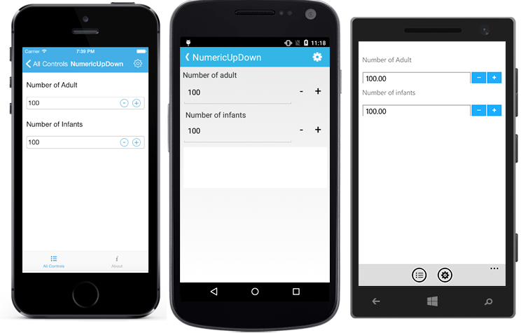

# Spin Button Alignment

Spin Button position in the SfNumericUpDown control can be changed relative to the TextBox based on `SpinButtonAlignment` property. 

There are three built-in modes.

### Right

Spin Buttons will get aligned to the right side of the control.





	numericUpDown.SpinButtonAlignment = SpinButtonAlignment.Right;





	<numeric:SfNumericUpDown x:Name="numericUpDown" SpinButtonAlignment="Right"/>
	




### Left

Spin Buttons will get aligned to the left side of the control.





	<numeric:SfNumericUpDown x:Name="numericUpDown" SpinButtonAlignment="Left"/>
	




	numericUpDown.SpinButtonAlignment = SpinButtonAlignment.Left;





### Both

Spin Buttons will get aligned to the both side of the control.





	<numeric:SfNumericUpDown x:Name="numericUpDown" SpinButtonAlignment="Both"/>
	




	numericUpDown.SpinButtonAlignment = SpinButtonAlignment.Both;





N> By default the property value is Right.

##UpDownButtonSetting Customization

We can set the Up Down button of SfNumericUpDown control by using any of the below given ways.

1. View
2. Image
3. FontIconText

N> For image and Fonticon we need to add the the respective image and TTF file.
		For android: Add image at Resource/Drawable/{Image} and .ttf file at Asserts/{.ttf}
		For iOS: Add image and .ttf file to Resource/{Image/.ttf} and To use FontIcons, add respective FontFamily name in info.plist file under Fonts provided by application category.
		For UWP: Add the image and .ttf file directly to the project.

#By using View





	<StackLayout Padding="50" >

		<updown:SfNumericUpDown x:Name="upDown" SpinButtonAlignment="Both" TextAlignment="Center" />

	</StackLayout>
	




			UpDownButtonSettings incSettings = new UpDownButtonSettings();
			Grid incrementStack = new Grid();
			Image incrementImage = new Image();
			incrementImage.HorizontalOptions = LayoutOptions.Center;
			incrementImage.VerticalOptions = LayoutOptions.Center;
			incrementImage.Source = (FileImageSource)ImageSource.FromFile("up.png");
			incrementImage.Aspect = Aspect.AspectFit;
			incrementStack.Children.Add(incrementImage);
			incrementStack.Padding = new Thickness(5,7);
			incSettings.ButtonView = incrementStack;
			incSettings.ButtonHeight = 45;
			incSettings.ButtonWidth = 45;
			upDown.IncrementButtonSettings = incSettings;
			UpDownButtonSettings decSettings = new UpDownButtonSettings();
			Grid decerementStack = new Grid();
			Image decrementImage = new Image();
			decrementImage.Source = (FileImageSource)ImageSource.FromFile("down.png");
			decrementImage.Aspect = Aspect.AspectFit;
			decrementImage.HorizontalOptions = LayoutOptions.Center;
			decrementImage.VerticalOptions = LayoutOptions.Center;
			decerementStack.Children.Add(decrementImage);
			decerementStack.Padding = new Thickness(5,7);
			decSettings.ButtonView = decerementStack;
			decSettings.ButtonHeight = 45;
			decSettings.ButtonWidth = 45;
			upDown.DecrementButtonSettings = decSettings;





#By using Image





	<StackLayout Padding="50" >

		<updown:SfNumericUpDown x:Name="upDown" SpinButtonAlignment="Both" TextAlignment="Center" />

	</StackLayout>
	




			UpDownButtonSettings incSettings = new UpDownButtonSettings();
			Grid incrementStack = new Grid();
			incSettings.ButtonImage = "up";
			incSettings.ButtonHeight = 45;
			incSettings.ButtonWidth = 45;
			upDown.IncrementButtonSettings = incSettings;
			UpDownButtonSettings decSettings = new UpDownButtonSettings();
			Grid decerementStack = new Grid();
			decSettings.ButtonImage = "down";
			decSettings.ButtonHeight = 45;
			decSettings.ButtonWidth = 45;
			upDown.DecrementButtonSettings = decSettings;





#By using FontIconText





	<StackLayout Padding="50" >

		<updown:SfNumericUpDown x:Name="upDown" SpinButtonAlignment="Both" TextAlignment="Center" />

	</StackLayout>
	




			UpDownButtonSettings incSettings = new UpDownButtonSettings();
            UpDownButtonSettings decSettings = new UpDownButtonSettings();
			incSettings.ButtonFontIcon = "\xe701";
            decSettings.ButtonFontIcon = "\xe700";
            if (Device.OS == TargetPlatform.Android)
            {
                incSettings.ButtonFontFamily = "numeric.ttf";
                decSettings.ButtonFontFamily = "numeric.ttf";
            }

            else
            {
                incSettings.ButtonFontFamily = "numeric";
                decSettings.ButtonFontFamily = "numeric";
            }
			upDown.IncrementButtonSettings = incSettings;
			upDown.DecrementButtonSettings = decSettings;





