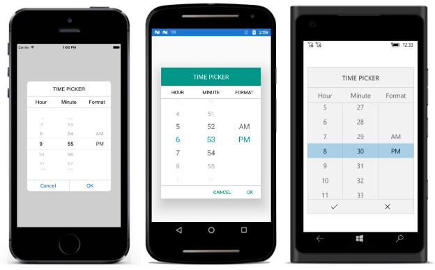

# Time Picker

This section explains the steps required to create custom TimePicker by using picker control.

**Step** **1** **:** Create a custom class, and name it as “CustomTimePicker”. This class should be inherited from the picker control.


public class CustomTimePicker: SfPicker

{

}



**Step** **2** **:** Create four ObservableCollection with object type in CustomTimePicker class.

**Collection** **details** **:**

Time collection, Minute collection, Hour collection, and Format collection.

Time Collection -Add all the three collections.

Minute collection -Added minutes from 0 to 59.

Hour collection -Added hours from 1 to 12.

Format Collection -Add two formats, namely AM and PM.

The following code demonstrates time collection creation.



public class CustomTimePicker: SfPicker
    
{
  
// Time api is used to modify the Hour collection as per change in Time

    /// 

/// Time is the actual DataSource for SfPicker control which will holds the collection of Hour ,Minute and Format

    /// 

public ObservableCollection<object> Time { get; set; }

//Minute is the collection of minute numbers

public ObservableCollection<object> Minute;

//Hour is the collection of hour numbers

public ObservableCollection<object> Hour;

//Format is the collection of AM and PM

public ObservableCollection<object> Format;

    /// 

/// Header api is holds the column name for every column in time picker

    /// 

        
public ObservableCollection<string> Headers { get; set; }

public CustomTimePicker()

{

Time = new ObservableCollection<object>();
            
Hour = new ObservableCollection<object>();
            
Minute = new ObservableCollection<object>();
            
Format = new ObservableCollection<object>();
            
PopulateTimeCollection();
            
this.ItemsSource = Time;

}

private void PopulateTimeCollection()
        
{
            
//Populate Hour
        
for (int i = 1; i <= 12; i++)
        
{
        
Hour.Add(i.ToString());
        
}

//Populate Minute
        
for (int j = 0; j < 60; j++)
        
{

if (j < 10)

{
        
Minute.Add("0" + j);
        
}
        
else
        
Minute.Add(j.ToString());
        
}

//Populate Format

Format.Add("AM");

Format.Add("PM");

Time.Add(Hour);

Time.Add(Minute);

Time.Add(Format);

}

}



**Step** **3** **:** Define each column headers “Hour”, “Minute”, and “Format” by using the ColumnHeaderText property of picker control. The following code demonstrates how to define header for each column of picker control.



public class CustomTimePicker: SfPicker

{

/// 

/// Header API is holds the column name for every column in time picker

/// 

public ObservableCollection<string> Headers { get; set; }

public CustomTimePicker()

{

Headers = new ObservableCollection<string>();

if (Device.RuntimePlatform == Device.Android)

{

Headers.Add("HOUR");

Headers.Add("MINUTE");

Headers.Add("FORMAT");

}

else

{

Headers.Add("Hour");

Headers.Add("Minute");

Headers.Add("Format");

}

//SfPicker header text

HeaderText = "TIME PICKER";

// Column header text collection

this.ColumnHeaderText = Headers;

}

}



**Step** **4** **:** Finally, enable the picker header, column header, and footer by using the ShowHeader,ShowFooter, and ShowColumnHeader properties.



public CustomTimePicker()

{

//Enable Footer of SfPicker

ShowFooter = true;

//Enable Header of SfPicker

ShowHeader = true;

//Enable Column Header of SfPicker

ShowColumnHeader = true;

}



**Step** **5** **:** Add the CustomTimePicker control in main XAML page. Please refer the following code snippets.




<ContentPage xmlns="http://xamarin.com/schemas/2014/forms"

xmlns:x="http://schemas.microsoft.com/winfx/2009/xaml"

xmlns:local="clr-namespace:TimePicker"

x:Class="TimePicker.MainPage"

xmlns:picker="clr-namespace:Syncfusion.SfPicker.XForms;assembly=Syncfusion.SfPicker.XForms">

<!--Assign the TimePickerViewModel to BindingContext of Page-->

<ContentPage.BindingContext>

<local:TimePickerViewModel />

</ContentPage.BindingContext>

<Grid>

<Button

Clicked="Button_Clicked"

HeightRequest="50"

VerticalOptions="Center"

HorizontalOptions="Center"

Text="Show TimePicker"

WidthRequest="200" />

<!--Initialize the CustomTimePicker-->

<local:CustomTimePicker

x:Name="date"

ColumnHeaderHeight="40"

HorizontalOptions="Center"

VerticalOptions="Center"

PickerHeight="400"

PickerMode="Dialog"

PickerWidth="300" 

SelectedItem="{Binding SelectedTime,Mode=TwoWay}"/>

</Grid>

</ContentPage>





public partial class MainPage : ContentPage

{

public MainPage()

{

InitializeComponent();

}

private void Button_Clicked(object sender, EventArgs e)

{

//open picker dialog

date.IsOpen = !date.IsOpen;

}

}




The following screenshot illustrates the output of the above code snippets.

You can download the TimePicker sample for reference from the following link.

Sample link: [TimePicker](http://www.syncfusion.com/downloads/support/directtrac/general/ze/TimePicker-664195767.zip)
