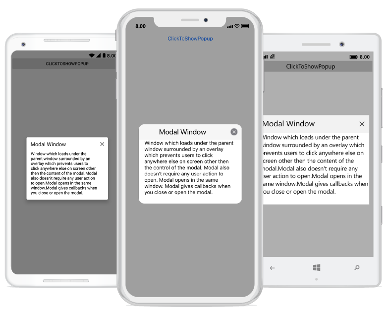

---
layout: post
title: Modal Window Popup | SfPopupLayout |Xamarin| Syncfusion
description: Modal Window Popup with SfPopupLayout
platform: Xamarin
control: SfPopupLayout
documentation: ug
--- 

# Modal Window Pop-up

You can use pop-up layout as model window by using the built-in Close icon and the [SfPopupLayout.StaysOpen](https://help.syncfusion.com/cr/cref_files/xamarin/sfpopuplayout/Syncfusion.SfPopupLayout.XForms~Syncfusion.XForms.PopupLayout.SfPopupLayout~StaysOpenProperty.html) property prevents interaction with your application until you close the window.

`Modal`: Modal Window will load under the parent window surrounded by the overlay which prevents you to click anywhere else on screen apart from the content of the modal.

Modal does not require any action to open. It opens in the same window and gives callbacks when closing or opening the window.

Refer to the following code example in which the pop-up will close only if you click on Close icon.

## Displaying pop-up when the SfPopupLayout is set as root view 


<?xml version="1.0" encoding="utf-8" ?>
<ContentPage xmlns="http://xamarin.com/schemas/2014/forms"
             xmlns:x="http://schemas.microsoft.com/winfx/2009/xaml"
             xmlns:local="clr-namespace:GettingStarted"
             x:Class="GettingStarted.MainPage" 
             Padding="0,40,0,0"
             xmlns:sfPopup="clr-namespace:Syncfusion.XForms.PopupLayout;assembly=Syncfusion.SfPopupLayout.XForms">
 <sfPopup:SfPopupLayout x:Name="popUpLayout">
   <sfPopup:SfPopupLayout.Content>
     <StackLayout x:Name="mainLayout">
       <Button x:Name="clickToShowPopup" Text="ClickToShowPopup" VerticalOptions="Start" HorizontalOptions="FillAndExpand" />
     </StackLayout>
    </sfPopup:SfPopupLayout.Content>
  </sfPopup:SfPopupLayout>
</ContentPage>





using Syncfusion.XForms.PopupLayout;

namespace GettingStarted
{
    public partial class MainPage : ContentPage
    {
        DataTemplate contentTemplateView;
        Label popupContent;

        public MainPage()
        {
            InitializeComponent();
            contentTemplateView = new DataTemplate(() =>
            {
                popupContent = new Label();
                popupContent.Text = "Window which loads under the parent window surrounded by an overlay which prevents users to click anywhere else on screen other then the content of the modal.Modal also doesn't require any user action to open.Modal opens in the same window.Modal gives callbacks when you close or open the modal.";
                popupContent.WidthRequest = 260;
                popupContent.BackgroundColor = Color.White;
                popupContent.HorizontalOptions = LayoutOptions.FillAndExpand;
                return popupContent;
            });

            popupLayout.PopupView.HeightRequest = 230;
            popupLayout.PopupView.HeaderTitle = "Modal Window";
            popupLayout.PopupView.ContentTemplate = contentTemplateView;
            popupLayout.PopupView.ShowFooter = false;

            clickToShowPopup.Clicked += ClickToShowPopup_Clicked;
        }

        private void ClickToShowPopup_Clicked(object sender, EventArgs e)
        {
            // Below code ensures that the popup doesn't collapse when user interacts outside the popup.
            popupLayout.StaysOpen = true;
            popupLayout.PopupView.ShowCloseButton = true;
            popupLayout.IsOpen = true;            
        }
    }
}


This is how the final output will look like on iOS, Android, and Windows Phone devices.

