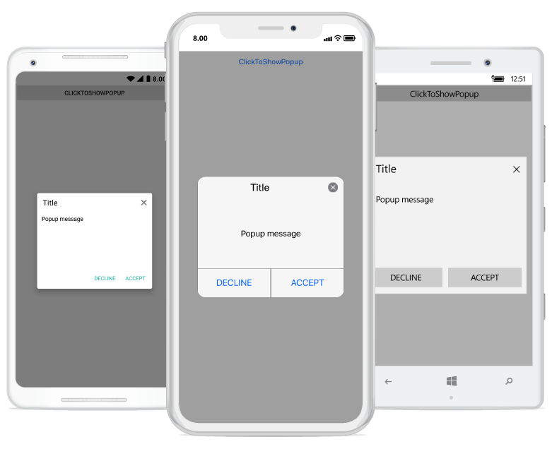

---
layout: post
title: Popup Layouts | SfPopupLayout |Xamarin | Syncfusion
description: Layouts in SfPopupLayout
platform: Xamarin
control: SfPopupLayout
documentation: ug
--- 

# AppearanceMode

SfPopupLayout supports two types of [SfPopupLayout.PopupView.AppearanceMode](https://help.syncfusion.com/cr/cref_files/xamarin/sfpopuplayout/Syncfusion.SfPopupLayout.XForms~Syncfusion.XForms.PopupLayout.AppearanceMode.html). By default, "AppearanceMode.OneButton" is set. You can change the appearance of the SfPopupLayout by using `SfPopupLayout.PopupView.AppearanceMode` property.
Two different appearance mode in SfPopupLayout as listed below.

<table>
<tr>
<th> Modes </th>
<th> Description </th>
</tr>
<tr>
<td> {{'[OneButton](https://help.syncfusion.com/cr/cref_files/xamarin/sfpopuplayout/Syncfusion.SfPopupLayout.XForms~Syncfusion.XForms.PopupLayout.AppearanceMode.html)'| markdownify }} </td>
<td> Shows SfPopupLayout with OneButton in the FooterView. This is the default value.</td>
</tr>
<tr>
<td> {{'[TwoButton](https://help.syncfusion.com/cr/cref_files/xamarin/sfpopuplayout/Syncfusion.SfPopupLayout.XForms~Syncfusion.XForms.PopupLayout.AppearanceMode.html)'| markdownify }} </td>
<td> Shows SfPopupLayout with TwoButtons in the FooterView.</td>
</tr>
</table>

## OneButton

In the below code example we have set `SfPopupLayout.PopupView.AppearanceMode` property as `OneButton` which displays only AcceptButton in the FooterView.

### Type A:


<?xml version="1.0" encoding="utf-8" ?>
<ContentPage xmlns="http://xamarin.com/schemas/2014/forms"
             xmlns:x="http://schemas.microsoft.com/winfx/2009/xaml"
             xmlns:local="clr-namespace:GettingStarted"
             x:Class="GettingStarted.MainPage" 
             Padding="0,40,0,0"
             xmlns:sfPopup="clr-namespace:Syncfusion.XForms.PopupLayout;assembly=Syncfusion.SfPopupLayout.XForms">
<sfPopup:SfPopupLayout x:Name="popUpLayout">
   <sfPopup:SfPopupLayout.Content>
     <StackLayout x:Name="layout">
       <Button x:Name="clickToShowPopup" Text="ClickToShowPopup" VerticalOptions="Start" HorizontalOptions="FillAndExpand" />
     </StackLayout>
    </sfPopup:SfPopupLayout.Content>
  </sfPopup:SfPopupLayout>
</ContentPage>




using Syncfusion.XForms.PopupLayout;

namespace GettingStarted
{
    public partial class MainPage : ContentPage
    {
        public MainPage()
        {
            InitializeComponent();
           
            // Setting the AppearanceMode as OneButton
            popupLayout.PopupView.AppearanceMode = AppearanceMode.OneButton;
            clickToShowPopup.Clicked += ClickToShowPopup_Clicked;
        }

        private void ClickToShowPopup_Clicked(object sender, EventArgs e)
        {
             popupLayout.Show();
        }
    }
}


If we run the above sample with `AppearanceMode` as `OneButton`, the output will appear on iOS, Android and Windows Phone devices as shown below.

## TwoButton

In the below code example we have set `SfPopupLayout.PopupView.AppearanceMode` property as `TwoButton` which displays only AcceptButton in the FooterView.

### Type A:


<?xml version="1.0" encoding="utf-8" ?>
<ContentPage xmlns="http://xamarin.com/schemas/2014/forms"
             xmlns:x="http://schemas.microsoft.com/winfx/2009/xaml"
             xmlns:local="clr-namespace:GettingStarted"
             x:Class="GettingStarted.MainPage" 
             Padding="0,40,0,0"
             xmlns:sfPopup="clr-namespace:Syncfusion.XForms.PopupLayout;assembly=Syncfusion.SfPopupLayout.XForms">
<sfPopup:SfPopupLayout x:Name="popUpLayout">
   <sfPopup:SfPopupLayout.Content>
     <StackLayout x:Name="layout">
       <Button x:Name="clickToShowPopup" Text="ClickToShowPopup" VerticalOptions="Start" HorizontalOptions="FillAndExpand" />
     </StackLayout>
    </sfPopup:SfPopupLayout.Content>
  </sfPopup:SfPopupLayout>
</ContentPage>




using Syncfusion.XForms.PopupLayout;

namespace GettingStarted
{
    public partial class MainPage : ContentPage
    {
        public MainPage()
        {
            InitializeComponent();
          
            // Setting the AppearanceMode as TwoButton
            popupLayout.PopupView.AppearanceMode = AppearanceMode.TwoButton;        
            clickToShowPopup.Clicked += ClickToShowPopup_Clicked;
        }

        private void ClickToShowPopup_Clicked(object sender, EventArgs e)
        {
             popupLayout.Show();
        }
    }
}


If we run the above sample with `AppearanceMode` as `TwoButton`, the output will appear on iOS, Android and Windows Phone devices as shown below.

# Customizing Header and Footer template
 
You can also customize the entire view of the popup by loading templates or custom views individually for the header, body and footer of the popup.

## Header customization

Any view can be added as the header content using the [SfPopupLayout.PopupView.HeaderTemplate](https://help.syncfusion.com/cr/cref_files/xamarin/sfpopuplayout/Syncfusion.SfPopupLayout.XForms~Syncfusion.XForms.PopupLayout.PopupView~HeaderTemplate.html) property to refresh it. Refer to the following code example in which a Label is added as a header content:

##### Type A:


<?xml version="1.0" encoding="utf-8" ?>
<ContentPage xmlns="http://xamarin.com/schemas/2014/forms"
             xmlns:x="http://schemas.microsoft.com/winfx/2009/xaml"
             xmlns:local="clr-namespace:GettingStarted"
             x:Class="GettingStarted.MainPage" 
             Padding="0,40,0,0"
             xmlns:sfPopup="clr-namespace:Syncfusion.XForms.PopupLayout;assembly=Syncfusion.SfPopupLayout.XForms">
 <sfPopup:SfPopupLayout x:Name="popUpLayout">
   <sfPopup:SfPopupLayout.Content>
     <StackLayout x:Name="layout">
       <Button x:Name="clickToShowPopup" Text="ClickToShowPopup" VerticalOptions="Start" HorizontalOptions="FillAndExpand" />
     </StackLayout>
    </sfPopup:SfPopupLayout.Content>
  </sfPopup:SfPopupLayout>
</ContentPage>




using Syncfusion.XForms.PopupLayout;

namespace GettingStarted
{
    public partial class MainPage : ContentPage
    {
        DataTemplate headerTemplateView;
        Label headerContent;

        public MainPage()
        {
            InitializeComponent();
            clickToShowPopup.Clicked += ClickToShowPopup_Clicked;
            headerTemplateView = new DataTemplate(() =>
            {
                headerContent = new Label();
                headerContent.Text = "Customized Header";
                headerContent.FontAttributes = FontAttributes.Bold;
                headerContent.BackgroundColor = Color.LightSkyBlue;
                headerContent.FontSize = 16;
                headerContent.HorizontalTextAlignment = TextAlignment.Center;
                headerContent.VerticalTextAlignment = TextAlignment.Center;
                return headerContent;
            });

            // Adding HeaderTemplate of the SfPopupLayout
            popupLayout.PopupView.HeaderTemplate = headerTemplateView;
        }

        private void ClickToShowPopup_Clicked(object sender, EventArgs e)
        {
            popupLayout.Show();
        }
    }
}


This is how the final output will look like on iOS device.

## Footer customization

Any view can be added as the header content using the [SfPopupLayout.PopupView.FooterTemplate](https://help.syncfusion.com/cr/cref_files/xamarin/sfpopuplayout/Syncfusion.SfPopupLayout.XForms~Syncfusion.XForms.PopupLayout.PopupView~ContentTemplate.html) property to refresh it. Refer to the following code example in which a Label is added as a header content:

##### Type A:


<?xml version="1.0" encoding="utf-8" ?>
<ContentPage xmlns="http://xamarin.com/schemas/2014/forms"
             xmlns:x="http://schemas.microsoft.com/winfx/2009/xaml"
             xmlns:local="clr-namespace:GettingStarted"
             x:Class="GettingStarted.MainPage" 
             Padding="0,40,0,0"
             xmlns:sfPopup="clr-namespace:Syncfusion.XForms.PopupLayout;assembly=Syncfusion.SfPopupLayout.XForms">
 <sfPopup:SfPopupLayout x:Name="popUpLayout">
   <sfPopup:SfPopupLayout.Content>
     <StackLayout x:Name="layout">
       <Button x:Name="clickToShowPopup" Text="ClickToShowPopup" VerticalOptions="Start" HorizontalOptions="FillAndExpand" />
     </StackLayout>
    </sfPopup:SfPopupLayout.Content>
  </sfPopup:SfPopupLayout>
</ContentPage>




using Syncfusion.XForms.PopupLayout;

namespace GettingStarted
{
    public partial class MainPage : ContentPage
    {
        DataTemplate footerTemplateView;
        Label footerContent;

        public MainPage()
        {
            InitializeComponent();
            clickToShowPopup.Clicked += ClickToShowPopup_Clicked;
            footerTemplateView = new DataTemplate(() =>
            {
                footerContent = new Label();
                footerContent.Text = "Customized Footer";
                footerContent.FontAttributes = FontAttributes.Bold;
                footerContent.BackgroundColor = Color.LightSkyBlue;
                footerContent.FontSize = 16;
                footerContent.HorizontalTextAlignment = TextAlignment.Center;
                footerContent.VerticalTextAlignment = TextAlignment.Center;
                return headerContent;
            });

            // Adding FooterTemplate of the SfPopupLayout
            popupLayout.PopupView.FooterTemplate = footerTemplateView;
        }

        private void ClickToShowPopup_Clicked(object sender, EventArgs e)
        {
            popupLayout.Show();
        }
    }
}


This is how the final output will look like on iOS device.

## How to hide Header in SfPopupLayout ?

SfPopupLayout allows you to hide the Header by using [SfPopupLayout.PopupView.ShowHeader](https://help.syncfusion.com/cr/cref_files/xamarin/sfpopuplayout/Syncfusion.SfPopupLayout.XForms~Syncfusion.XForms.PopupLayout.PopupView~ShowHeader.html) property. The default value of this property is `true`.

To hide the header in SfPopupLayout, follow the code example:


//MainPage.cs

public MainPage()
{
    ....
    InitializeComponent();
    popupLayout.PopupView.ShowHeader = false;
    ....
}


## How to hide Footer in SfPopupLayout ?

SfPopupLayout allows you to hide the Header by using [SfPopupLayout.PopupView.ShowFooter](https://help.syncfusion.com/cr/cref_files/xamarin/sfpopuplayout/Syncfusion.SfPopupLayout.XForms~Syncfusion.XForms.PopupLayout.PopupView~ShowFooter.html) property. The default value of this property is `true`.

To hide the footer in SfPopupLayout, follow the code example:


//MainPage.cs

public MainPage()
{
    ....
    InitializeComponent();
    popupLayout.PopupView.ShowFooter = false;
    ....
}


## How to hide the close button in SfPopupLayout ?

SfPopupLayout allows you to hide the Close button by using [SfPopupLayout.PopupView.ShowCloseButton](https://help.syncfusion.com/cr/cref_files/xamarin/sfpopuplayout/Syncfusion.SfPopupLayout.XForms~Syncfusion.XForms.PopupLayout.PopupView~ShowCloseButton.html) property. The default value of this property is `true`.

To hide the close button in SfPopupLayout, follow the code example:


//MainPage.cs

public MainPage()
{
    ....
    InitializeComponent();
    popupLayout.PopupView.ShowCloseButton = false;
    ....
}

