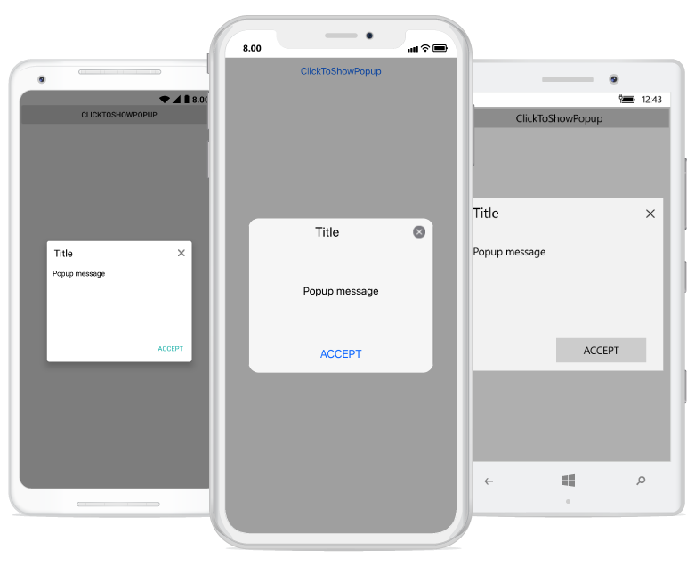
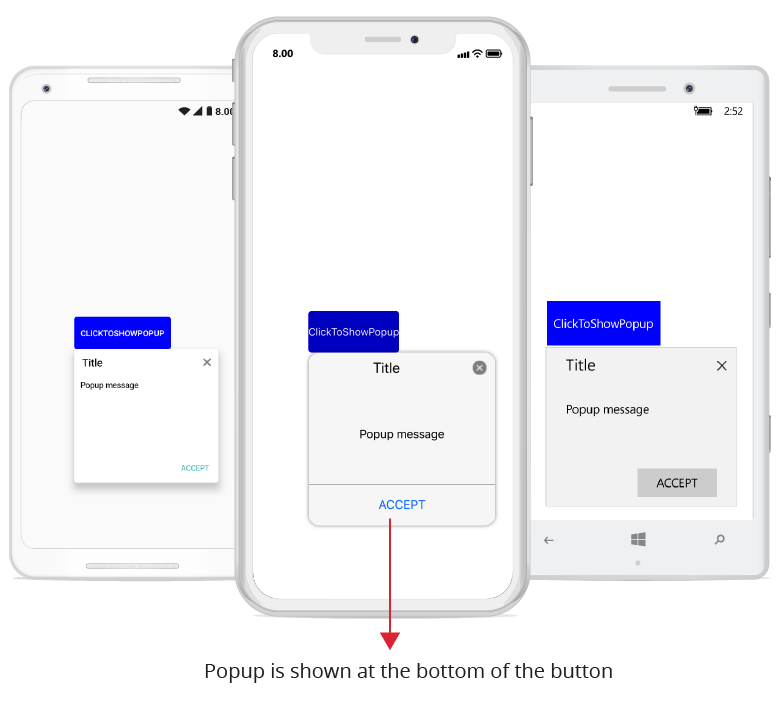

---
layout: post
title: Popup positioning | SfPopupLayout |Xamarin| Syncfusion
description: Positioning capabilities of SfPopupLayout
platform: Xamarin
control: SfPopupLayout
documentation: ug
--- 

# Showing SfPopupLayout at various position

SfPopupLayout allows you to show the Popup content at various position based on the requirement.

Following are the list of options available to show SfPopupLayout at various position.

<table>
<tr>
<th> Methods / Property </th>
<th> Description </th>
</tr>
<tr>
<td> {{'[SfPopupLayout.IsOpen](https://help.syncfusion.com/cr/cref_files/xamarin/sfpopuplayout/Syncfusion.SfPopupLayout.XForms~Syncfusion.XForms.PopupLayout.SfPopupLayout~IsOpen.html)'| markdownify }} </td>
<td> Shows SfPopupLayout at the center.</td>
</tr>
<tr>
<td> {{'[SfPopupLayout.Show()](https://help.syncfusion.com/cr/cref_files/xamarin/sfpopuplayout/Syncfusion.SfPopupLayout.XForms~Syncfusion.XForms.PopupLayout.SfPopupLayout~Show.html)'| markdownify }} </td>
<td> It is similar to SfPopupLayout.IsOpen property.</td>
</tr>
<tr>
<td> {{'[popupLayout.Show(x-position, y-position)](https://help.syncfusion.com/cr/cref_files/xamarin/sfpopuplayout/Syncfusion.SfPopupLayout.XForms~Syncfusion.XForms.PopupLayout.SfPopupLayout~Show.html)'| markdownify }} </td>
<td> Shows SfPopupLayout at the specified X and y position.</td>
</tr>
<tr>
<td> {{'[popupLayout.ShowAtTouchPoint()](https://help.syncfusion.com/cr/cref_files/xamarin/sfpopuplayout/Syncfusion.SfPopupLayout.XForms~Syncfusion.XForms.PopupLayout.SfPopupLayout~ShowAtTouchPoint.html)'| markdownify }} </td>
<td> Shows SfPopupLayout at the touch point.</td>
</tr>
<tr>
<td> {{'[popupLayout.ShowRelativeToView(View, RelativePosition)](https://help.syncfusion.com/cr/cref_files/xamarin/sfpopuplayout/Syncfusion.SfPopupLayout.XForms~Syncfusion.XForms.PopupLayout.SfPopupLayout~ShowRelativeToView.html)'| markdownify }} </td>
<td> Shows SfPopupLayout at the position relative to the specified view.</td>
</tr>
</table>

## IsOpen Property

In the below code example we have open the SfPopupLayout by using `SfPopupLayout.IsOpen` property.

### Type A:


<?xml version="1.0" encoding="utf-8" ?>
<ContentPage xmlns="http://xamarin.com/schemas/2014/forms"
             xmlns:x="http://schemas.microsoft.com/winfx/2009/xaml"
             xmlns:local="clr-namespace:GettingStarted"
             x:Class="GettingStarted.MainPage" 
             Padding="0,40,0,0"
             xmlns:sfPopup="clr-namespace:Syncfusion.XForms.PopupLayout;assembly=Syncfusion.SfPopupLayout.XForms">
<sfPopup:SfPopupLayout x:Name="popUpLayout">
   <sfPopup:SfPopupLayout.Content>
     <StackLayout x:Name="layout">
       <Button x:Name="clickToShowPopup" Text="ClickToShowPopup" VerticalOptions="Start" HorizontalOptions="FillAndExpand" />
     </StackLayout>
    </sfPopup:SfPopupLayout.Content>
  </sfPopup:SfPopupLayout>
</ContentPage>




using Syncfusion.XForms.PopupLayout;

namespace GettingStarted
{
    public partial class MainPage : ContentPage
    {
        public MainPage()
        {
            InitializeComponent();
            clickToShowPopup.Clicked += ClickToShowPopup_Clicked;
        }

        private void ClickToShowPopup_Clicked(object sender, EventArgs e)
        {
            // Shows SfPopupLayout at the center of the view.
            popupLayout.IsOpen = true;
        }
    }
}


N > SfPopupLayout.IsOpen property is not applicable for Type B.

If we run the above sample, the below output will appear on iOS device as shown below.

## SfPopupLayout.Show()

In the below code example we have open the SfPopupLayout by using `SfPopupLayout.Show()`.

### Type A:


<?xml version="1.0" encoding="utf-8" ?>
<ContentPage xmlns="http://xamarin.com/schemas/2014/forms"
             xmlns:x="http://schemas.microsoft.com/winfx/2009/xaml"
             xmlns:local="clr-namespace:GettingStarted"
             x:Class="GettingStarted.MainPage" 
             Padding="0,40,0,0"
             xmlns:sfPopup="clr-namespace:Syncfusion.XForms.PopupLayout;assembly=Syncfusion.SfPopupLayout.XForms">
<sfPopup:SfPopupLayout x:Name="popUpLayout">
   <sfPopup:SfPopupLayout.Content>
     <StackLayout x:Name="layout">
       <Button x:Name="clickToShowPopup" Text="ClickToShowPopup" VerticalOptions="Start" HorizontalOptions="FillAndExpand" />
     </StackLayout>
    </sfPopup:SfPopupLayout.Content>
  </sfPopup:SfPopupLayout>
</ContentPage>




using Syncfusion.XForms.PopupLayout;

namespace GettingStarted
{
    public partial class MainPage : ContentPage
    {
        public MainPage()
        {
            InitializeComponent();
            clickToShowPopup.Clicked += ClickToShowPopup_Clicked;
        }

        private void ClickToShowPopup_Clicked(object sender, EventArgs e)
        {
           // Shows SfPopupLayout at the center of the view.
           popupLayout.Show();
        }
    }
}


If we run the above sample, the below output will appear on iOS device as shown below.

## SfPopupLayout.Show(x-position, y-position)

In the below code example we have open the SfPopupLayout by using `SfPopupLayout.Show(x-position, y-position)`.

### Type A:


<?xml version="1.0" encoding="utf-8" ?>
<ContentPage xmlns="http://xamarin.com/schemas/2014/forms"
             xmlns:x="http://schemas.microsoft.com/winfx/2009/xaml"
             xmlns:local="clr-namespace:GettingStarted"
             x:Class="GettingStarted.MainPage" 
             Padding="0,40,0,0"
             xmlns:sfPopup="clr-namespace:Syncfusion.XForms.PopupLayout;assembly=Syncfusion.SfPopupLayout.XForms">
<sfPopup:SfPopupLayout x:Name="popUpLayout">
   <sfPopup:SfPopupLayout.Content>
     <StackLayout x:Name="layout">
       <Button x:Name="clickToShowPopup" Text="ClickToShowPopup" VerticalOptions="Start" HorizontalOptions="FillAndExpand" />
     </StackLayout>
    </sfPopup:SfPopupLayout.Content>
  </sfPopup:SfPopupLayout>
</ContentPage>




using Syncfusion.XForms.PopupLayout;

namespace GettingStarted
{
    public partial class MainPage : ContentPage
    {
        public MainPage()
        {
            InitializeComponent();
            clickToShowPopup.Clicked += ClickToShowPopup_Clicked;
        }

        private void ClickToShowPopup_Clicked(object sender, EventArgs e)
        {
           // Shows SfPopupLayout at x-position 100 and y position 100.
           popupLayout.Show(100, 100);
        }
    }
}


If we run the above sample, the below output will appear on iOS device as shown below.

## SfPopupLayout.ShowAtTouchPoint()

In the below code example we have open the SfPopupLayout by using `SfPopupLayout.ShowAtTouchPoint()`.

### Type A:


<?xml version="1.0" encoding="utf-8" ?>
<ContentPage xmlns="http://xamarin.com/schemas/2014/forms"
             xmlns:x="http://schemas.microsoft.com/winfx/2009/xaml"
             xmlns:local="clr-namespace:GettingStarted"
             x:Class="GettingStarted.MainPage" 
             Padding="0,40,0,0"
             xmlns:sfPopup="clr-namespace:Syncfusion.XForms.PopupLayout;assembly=Syncfusion.SfPopupLayout.XForms">
<sfPopup:SfPopupLayout x:Name="popUpLayout">
   <sfPopup:SfPopupLayout.Content>
     <StackLayout x:Name="layout">
       <Button x:Name="clickToShowPopup" Text="ClickToShowPopup" VerticalOptions="Start" HorizontalOptions="FillAndExpand" />
     </StackLayout>
    </sfPopup:SfPopupLayout.Content>
  </sfPopup:SfPopupLayout>
</ContentPage>




using Syncfusion.XForms.PopupLayout;

namespace GettingStarted
{
    public partial class MainPage : ContentPage
    {
        public MainPage()
        {
            InitializeComponent();
            clickToShowPopup.Clicked += ClickToShowPopup_Clicked;
        }

        private void ClickToShowPopup_Clicked(object sender, EventArgs e)
        {
            // Shows SfPopupLayout at the touch point.
            popupLayout.ShowAtTouchPoint();
        }
    }
}


N > SfPopupLayout.ShowAtTouchPoint() is not applicable for Type B.

If we run the above sample, the below output will appear on iOS device as shown below.

## SfPopupLayout.ShowRelativeToView(View, RelativePosition)

In the below code example we have open the SfPopupLayout by using `SfPopupLayout.ShowRelativeToView(View, RelativePosition)`.

### Type A:


<?xml version="1.0" encoding="utf-8" ?>
<ContentPage xmlns="http://xamarin.com/schemas/2014/forms"
             xmlns:x="http://schemas.microsoft.com/winfx/2009/xaml"
             xmlns:local="clr-namespace:GettingStarted"
             x:Class="GettingStarted.MainPage" 
             Padding="0,40,0,0"
             xmlns:sfPopup="clr-namespace:Syncfusion.XForms.PopupLayout;assembly=Syncfusion.SfPopupLayout.XForms">
<sfPopup:SfPopupLayout x:Name="popUpLayout">
   <sfPopup:SfPopupLayout.Content>
     <StackLayout x:Name="layout">
       <Button x:Name="clickToShowPopup" Text="ClickToShowPopup" VerticalOptions="Start" HorizontalOptions="FillAndExpand" />
       <Label x:Name="label" IsVisible="true" Text="This is SfPopupLayout"/>
     </StackLayout>
    </sfPopup:SfPopupLayout.Content>
  </sfPopup:SfPopupLayout>
</ContentPage>




using Syncfusion.XForms.PopupLayout;

namespace GettingStarted
{
    public partial class MainPage : ContentPage
    {
        public MainPage()
        {
            InitializeComponent();
            clickToShowPopup.Clicked += ClickToShowPopup_Clicked;
        }

        private void ClickToShowPopup_Clicked(object sender, EventArgs e)
        {
           // Shows SfPopupLayout at the bottom of the label.
           popupLayout.ShowRelativeToView(label, RelativePosition.AlignBottom);
        }
    }
}


This is how the final output will look like on iOS, Android and Windows Phone devices.
