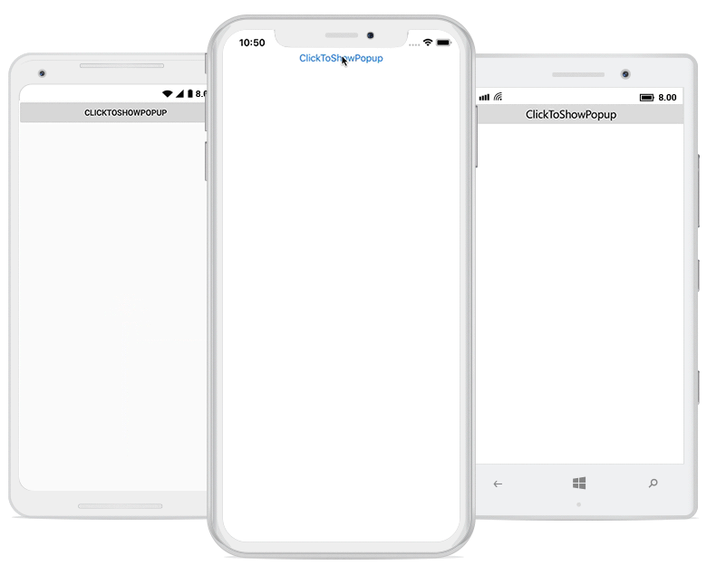
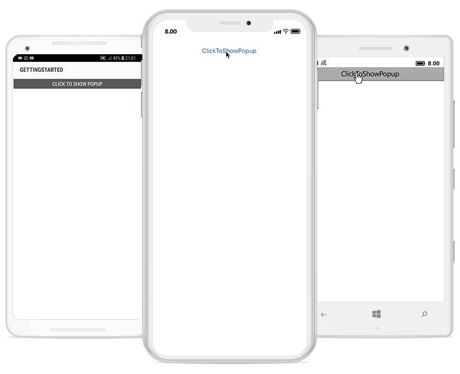

---
layout: post
title: Popup Animations | SfPopupLayout |Xamarin| Syncfusion
description: Animations in SfPopupLayout
platform: Xamarin
control: SfPopupLayout
documentation: ug
--- 

# Popup Animations

Built-in animations are available in SfPopupLayout, which is applied when the PopupView opens and closes in the screen.
The SfPopupLayout has different animation modes as listed as follows:

* Zoom
* Fade
* SlideOnLeft
* SlideOnRight
* SlideOnTop
* SlideOnBottom
* None

N> Setting of AnimationMode is same for both `Displaying pop-up when the SfPopupLayout is set as root view` and `Displaying pop-up when the SfPopupLayout is not set as root view`. 

## Zoom 

Zoom-out animation will be applied when the PopupView opens and Zoom-in animation will be applied when the PopupView closes.



//MainPage.cs

public MainPage()
{
    ....
    InitializeComponent();
    popupLayout.PopupView.AnimationMode = AnimationMode.Zoom;
    ....
}



## Fade 

Fade-out animation will be applied when the PopupView opens and Fade-in animation will be applied when the PopupView closes.



//MainPage.cs

public MainPage()
{
    ....
    InitializeComponent();
    popupLayout.PopupView.AnimationMode = AnimationMode.Fade;
    ....
}



## SlideOnLeft 

PopupView will be animated from left-to-right when it opens and from right-to-left when it closes.



//MainPage.cs

public MainPage()
{
    ....
    InitializeComponent();
    popupLayout.PopupView.AnimationMode = AnimationMode.SlideOnLeft;
    ....
}



## SlideOnRight

PopupView will be animated from right-to-left when it opens and from left-to-right when it closes.



//MainPage.cs

public MainPage()
{
    ....
    InitializeComponent();
    popupLayout.PopupView.AnimationMode = AnimationMode.SlideOnRight;
    ....
}



## SlideOnTop 

PopupView will be animated from top-to-bottom when it opens and from bottom-to-top when it closes.



//MainPage.cs

public MainPage()
{
    ....
    InitializeComponent();
    popupLayout.PopupView.AnimationMode = AnimationMode.SlideOnTop;
    ....
}



## SlideOnBottom

PopupView will be animated from bottom-to-top when it opens and from top-to-bottom when it closes.



//MainPage.cs

public MainPage()
{
    ....
    InitializeComponent();
    popupLayout.PopupView.AnimationMode = AnimationMode.SlideOnBottom;
    ....
}



## None

Animation will not be applied.



//MainPage.cs

public MainPage()
{
    ....
    InitializeComponent();
    popupLayout.PopupView.AnimationMode = AnimationMode.None;
    ....
}



