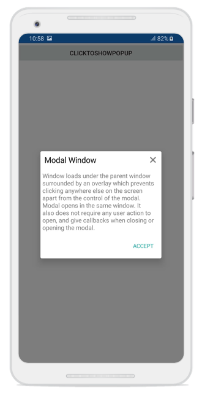

# Popup Size

SfPopupLayout allows displaying the Popup at any desired width and height by setting the `SfPopupLayout.PopupView.WidthRequest` and `SfPopupLayout.PopupView.HeightRequest`. The Popup size can also be changed by setting width request and height request to the views loaded inside the templates of the Popup.

In the following code snippet the Popup is loaded in 350x350 pixels, where width request is set for the ListView that is loaded as template content and height request is set for the `PopupView`.



<?xml version="1.0" encoding="utf-8" ?>
<ContentPage xmlns="http://xamarin.com/schemas/2014/forms"
             xmlns:x="http://schemas.microsoft.com/winfx/2009/xaml"
             xmlns:local="clr-namespace:PopupDemo"
             xmlns:sfPopup="clr-namespace:Syncfusion.XForms.PopupLayout;assembly=Syncfusion.SfPopupLayout.XForms"
             xmlns:sfListView="clr-namespace:Syncfusion.ListView.XForms;assembly=Syncfusion.SfListView.XForms"
             x:Class="PopupDemo.MainPage">

    <ContentPage.BindingContext>
        <local:ContactsViewModel x:Name="viewModel"/>
    </ContentPage.BindingContext>

    <sfPopup:SfPopupLayout x:Name="popupLayout">
        <sfPopup:SfPopupLayout.PopupView>
            <sfPopup:PopupView HeaderTitle="ListView" HeightRequest ="350">
                <sfPopup:PopupView.ContentTemplate>
                    <DataTemplate>
                        <sfListView:SfListView  x:Name="listView"  ItemSpacing="5" WidthRequest="350" 
                          ItemsSource="{Binding Items}" 
                          >
                            <sfListView:SfListView.ItemTemplate>
                                <DataTemplate>
                                    <ViewCell>
                                        <ViewCell.View>
                                            <Grid x:Name="grid" RowSpacing="1">
                                                <Grid.RowDefinitions>
                                                    <RowDefinition Height="*" />
                                                </Grid.RowDefinitions>
                                                <Grid.ColumnDefinitions>
                                                    <ColumnDefinition Width="50" />
                                                    <ColumnDefinition Width="200" />
                                                    <ColumnDefinition Width="50" />
                                                </Grid.ColumnDefinitions>

                                                <Image Source="{Binding ContactImage}"
                                       VerticalOptions="Center"
                                       HorizontalOptions="Center"
                                       HeightRequest="50"/>

                                                <Label Grid.Column="1"
                                        HorizontalTextAlignment="Center"
                                        LineBreakMode="NoWrap"
                                        Text="{Binding ContactName}" 
                                        FontSize="Medium" />

                                                <Image Grid.Column="2" 
                                       Source="{Binding ContactType}"
                                       VerticalOptions="End"
                                       HorizontalOptions="End"
                                       HeightRequest="50"/>

                                            </Grid>
                                        </ViewCell.View>
                                    </ViewCell>
                                </DataTemplate>
                            </sfListView:SfListView.ItemTemplate>
                        </sfListView:SfListView>
                    </DataTemplate>
                </sfPopup:PopupView.ContentTemplate>
            </sfPopup:PopupView>
        </sfPopup:SfPopupLayout.PopupView>
        <sfPopup:SfPopupLayout.Content>
            <StackLayout>
                <Button Text="Click to show popup" Clicked="isOpenButton_Clicked"/>
            </StackLayout>
        </sfPopup:SfPopupLayout.Content>
    </sfPopup:SfPopupLayout>
</ContentPage>





using Syncfusion.ListView.XForms;
using Syncfusion.XForms.PopupLayout;

namespace PopupDemo
{
    public partial class MainPage : ContentPage
    {
        SfListView listView;
        ContactsViewModel viewModel;
        SfPopupLayout popupLayout;

        public MainPage()
        {
            InitializeComponent();
            listView = new SfListView() { ItemSpacing = 5 };
            listView.WidthRequest = 350;
            listView.ItemTemplate = new DataTemplate(() =>
            {
                ViewCell viewCell = new ViewCell();
                var grid = new Grid() { RowSpacing = 1 };
                grid.ColumnDefinitions.Add(new ColumnDefinition() { Width = 50 });
                grid.ColumnDefinitions.Add(new ColumnDefinition() { Width = 200 });
                grid.ColumnDefinitions.Add(new ColumnDefinition() { Width = 50 });
                var contactImage = new Image()
                {
                    VerticalOptions = LayoutOptions.Center,
                    HorizontalOptions = LayoutOptions.Center,
                    HeightRequest = 50
                };
                contactImage.SetBinding(Image.SourceProperty, new Binding("ContactImage"));
                var contactName = new Label()
                {
                    HorizontalTextAlignment = TextAlignment.Center,
                    LineBreakMode = LineBreakMode.NoWrap,
                    FontSize = Font.SystemFontOfSize(NamedSize.Medium).FontSize,
                };
                contactName.SetBinding(Label.TextProperty, new Binding("ContactName"));
                var contactType = new Image()
                {
                    VerticalOptions = LayoutOptions.End,
                    HorizontalOptions = LayoutOptions.End,
                    HeightRequest = 50,
                };
                contactType.SetBinding(Image.SourceProperty, new Binding("ContactType"));
                grid.Children.Add(contactImage, 0, 0);
                grid.Children.Add(contactName, 1, 0);
                grid.Children.Add(contactType, 2, 0);
                viewCell.View = grid;
                return viewCell;
            });
            viewModel = new ContactsViewModel();
            listView.ItemsSource = viewModel.Items;
            popupLayout = new SfPopupLayout();
            popupLayout.PopupView.HeaderTitle = "ListView";
            popupLayout.PopupView.HeightRequest = 350;
            popupLayout.PopupView.ContentTemplate = new DataTemplate(() =>
            {
                return listView;
            });
            StackLayout stackLayout = new StackLayout();
            Button isOpenButton = new Button();
            isOpenButton.Clicked += isOpenButton_Clicked;
            isOpenButton.Text = "Click to show popup";
            stackLayout.Children.Add(isOpenButton);
            popupLayout.Content = stackLayout;
            this.Content = popupLayout;
        }

        private void isOpenButton_Clicked(object sender, EventArgs e)
        {
            popupLayout.Show();
        }
    }
}




## Full Screen

SfPopupLayout can be shown in full width and height of the screen using,

  * [SfPopupLayout.PopupView.IsFullScreen](https://help.syncfusion.com/cr/cref_files/xamarin/Syncfusion.SfPopupLayout.XForms~Syncfusion.XForms.PopupLayout.PopupView~IsFullScreen.html)
  * [SfPopupLayout.Show(bool)](https://help.syncfusion.com/cr/cref_files/xamarin/Syncfusion.SfPopupLayout.XForms~Syncfusion.XForms.PopupLayout.SfPopupLayout~Show(Boolean).html)

Refer the below code example to open the popup in full screen.


<?xml version="1.0" encoding="utf-8" ?>
<ContentPage xmlns="http://xamarin.com/schemas/2014/forms"
             xmlns:x="http://schemas.microsoft.com/winfx/2009/xaml"
             xmlns:local="clr-namespace:GettingStarted"
             x:Class="GettingStarted.MainPage" 
             Padding="0,40,0,0"
			  xmlns:textinput="clr-namespace:Syncfusion.XForms.TextInputLayout;assembly=Syncfusion.Core.XForms"
             xmlns:sfPopup="clr-namespace:Syncfusion.XForms.PopupLayout;assembly=Syncfusion.SfPopupLayout.XForms">
<sfPopup:SfPopupLayout x:Name="popupLayout">
<popuplayout:SfPopupLayout.PopupView>
                    <popuplayout:PopupView AppearanceMode="TwoButton"
                                           AcceptButtonText="SAVE"
                                           DeclineButtonText="CANCEL">
                        <popuplayout:PopupView.HeaderTemplate>
                            <DataTemplate>
                                <Label Text="ADD EVENT" VerticalTextAlignment="Center" HorizontalTextAlignment="Start" FontAttributes="Bold"/>
                            </DataTemplate>
                        </popuplayout:PopupView.HeaderTemplate>
                        <popuplayout:PopupView.ContentTemplate>
                            <DataTemplate>
                                <Grid BackgroundColor="White" Padding="15,20,15,0">
                                    <Grid.RowDefinitions>
                                        <RowDefinition Height="100"/>
                                        <RowDefinition Height="100"/>
                                        <RowDefinition Height="30"/>
                                        <RowDefinition Height="50"/>
                                        <RowDefinition Height="30"/>
                                        <RowDefinition Height="50"/>
                                        <RowDefinition>
                                            <RowDefinition.Height>
                                                <OnPlatform x:TypeArguments="GridLength" Android="55" iOS="55">
                                                    <On Platform="UWP" Value="75"/>
                                                </OnPlatform>
                                            </RowDefinition.Height>
                                        </RowDefinition>
                                    </Grid.RowDefinitions>

                                    <Grid Grid.Row="0" BackgroundColor="#F3F3F9" Margin="0,15,0,0">
                                        <textinput:SfTextInputLayout Hint="Event name" ContainerType="Outlined" BackgroundColor="Transparent">
                                            <Entry HeightRequest="75" BackgroundColor="Transparent"/>
                                        </textinput:SfTextInputLayout>
                                    </Grid>

                                    <Grid Grid.Row="1" BackgroundColor="#F3F3F9" Margin="0,15,0,0">
                                        <textinput:SfTextInputLayout Hint="Location" ContainerType="Outlined" BackgroundColor="Transparent">
                                            <Entry HeightRequest="75" BackgroundColor="Transparent"/>
                                        </textinput:SfTextInputLayout>
                                    </Grid>

                                    <Label Grid.Row="2" Text="From" Margin="0,10,0,0"/>
                                    <Grid Grid.Row="3">
                                        <Grid.ColumnDefinitions>
                                            <ColumnDefinition/>
                                            <ColumnDefinition/>
                                        </Grid.ColumnDefinitions>
                                        <DatePicker Grid.Column="0" FontSize="Small"/>
                                        <TimePicker Grid.Column="1" FontSize="Small"/>
                                    </Grid>

                                    <Label Grid.Row="4" Text="To" Margin="0,10,0,0"/>
                                    <Grid Grid.Row="5">
                                        <Grid.ColumnDefinitions>
                                            <ColumnDefinition/>
                                            <ColumnDefinition/>
                                        </Grid.ColumnDefinitions>
                                        <DatePicker Grid.Column="0" FontSize="Small"/>
                                        <TimePicker Grid.Column="1" FontSize="Small"/>
                                    </Grid>
                                    <Grid Grid.Row="6" Margin="0,35,0,0">
                                        <Grid.ColumnDefinitions>
                                            <ColumnDefinition Width="Auto"/>
                                            <ColumnDefinition Width="Auto"/>
                                        </Grid.ColumnDefinitions>
                                        <Switch Grid.Column="0"/>
                                        <Label Grid.Column="1" Text="All-day">
                                            <Label.Margin>
                                                <OnPlatform x:TypeArguments="Thickness">
                                                    <On Platform="UWP" Value="0,10,0,0"/>
                                                </OnPlatform>
                                            </Label.Margin>
                                        </Label>
                                    </Grid>
                                </Grid>
                            </DataTemplate>
                        </popuplayout:PopupView.ContentTemplate>
                    </popuplayout:PopupView>
                </popuplayout:SfPopupLayout.PopupView>
   <sfPopup:SfPopupLayout.Content>
     <StackLayout x:Name="layout">
       <Button x:Name="clickToShowPopup" Text="ClickToShowPopup" 
               VerticalOptions="Start"   HorizontalOptions="FillAndExpand" Clicked="ClickToShowPopup_Clicked" />
     </StackLayout>
    </sfPopup:SfPopupLayout.Content>
  </sfPopup:SfPopupLayout>
</ContentPage>




using Syncfusion.XForms.PopupLayout;

namespace GettingStarted
{
    public partial class MainPage : ContentPage
    {
        public MainPage()
        {
            InitializeComponent();
        }

        private void ClickToShowPopup_Clicked(object sender, EventArgs e)
        {
            // Shows SfPopupLayout in full width and height of the screen using the SfPopupLayout.PopupView.IsFullScreen property.
            popupLayout.PopupView.IsFullScreen = true;
			popupLayout.IsOpen = true;
			
			// Shows SfPopupLayout in full width and height of the screen using the SfPopupLayout.Show(bool) method.
			// popupLayout.Show(true);
        }
    }
}


Executing the above codes renders the following output in an Android device.

## Auto-size Popup

The `SfPopupLayout` can auto-size the popup view based on the contents loaded inside its `SfPopupLayout.PopupView.ContentTemplate` property using the `SfPopupLayout.PopupView.AutoSizeMode` property. The default value is `AutoSizeMode.None`. You can choose to auto-size the Popup in height, width, or in both height and width of its contents. By default, the `HeightRequest` and `WidthRequest` set to the `SfPopupLayout.PopupView` or the views loaded inside the template is given higher priority than the `AutoSizeMode`.

In the following code snippet the Popup is auto-sized in height based on the content loaded inside the `SfPopupLayout.PopupView.ContentTemplate` property.





    <sfPopup:SfPopupLayout x:Name="popUpLayout">
        <sfPopup:SfPopupLayout.PopupView>
            <sfPopup:PopupView AutoSizeMode="Height">
                <sfPopup:PopupView.ContentTemplate>
                    <DataTemplate>
                        <StackLayout Padding="5,5,5,0">
                            <Label Text="Window loads under the parent window surrounded by an overlay which prevents clicking anywhere else on the screen apart from the control of the modal. Modal opens in the same window. It also does not require any user action to open, and give callbacks when closing or opening the modal."
                            BackgroundColor="White"
                            LineBreakMode="WordWrap"
                           />
                        </StackLayout>
                    </DataTemplate>
                </sfPopup:PopupView.ContentTemplate>
            </sfPopup:PopupView>
        </sfPopup:SfPopupLayout.PopupView>
    </sfPopup:SfPopupLayout>





popUpLayout.PopupView.AutoSizeMode = AutoSizeMode.Height;





Executing the above codes renders the following output in Android devices.

You can download the above sample code by clicking the following link: [Sample](http://www.syncfusion.com/downloads/support/directtrac/general/ze/AutoSize_SfPopuplayout1703576210).
