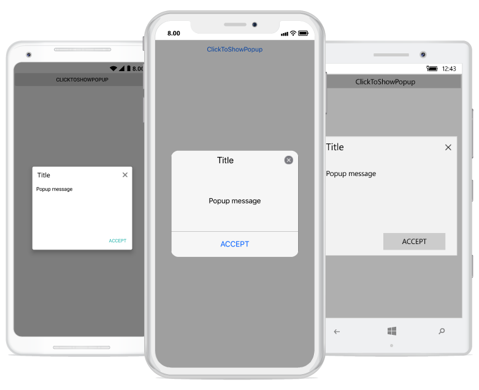
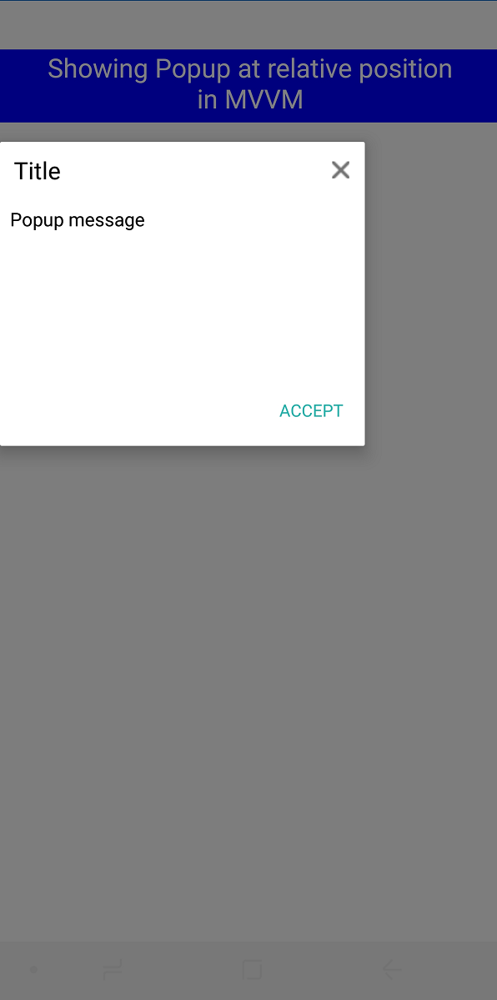

---
layout: post
title: Popup positioning | SfPopupLayout |Xamarin| Syncfusion
description: Position the popup at the center, absolute postion, relative to another view and relative with absolute postion using the Xamarin.Forms PopupLayout.
platform: Xamarin
control: SfPopupLayout
documentation: ug
--- 

# Popup Positioning

The SfPopupLayout allows showing the popup content at various available positions.

Following are the list of options available to show SfPopupLayout at various positions.

<table>
<tr>
<th> Methods / Properties </th>
<th> Description </th>
</tr>
<tr>
<td> {{'[SfPopupLayout.IsOpen](https://help.syncfusion.com/cr/cref_files/xamarin/Syncfusion.SfPopupLayout.XForms~Syncfusion.XForms.PopupLayout.SfPopupLayout~IsOpen.html)'| markdownify }} </td>
<td> Shows the `SfPopupLayout` at center.</td>
</tr>
<tr>
<td> {{'[SfPopupLayout.Show](https://help.syncfusion.com/cr/cref_files/xamarin/Syncfusion.SfPopupLayout.XForms~Syncfusion.XForms.PopupLayout.SfPopupLayout~Show.html)'| markdownify }} </td>
<td> Similar as <code>SfPopupLayout.IsOpen</code> property.</td>
</tr>
<tr>
<td> {{'[SfPopupLayout.Show(x-position, y-position)](https://help.syncfusion.com/cr/cref_files/xamarin/Syncfusion.SfPopupLayout.XForms~Syncfusion.XForms.PopupLayout.SfPopupLayout~Show.html)'| markdownify }} </td>
<td> Shows the `SfPopupLayout` at the specified X and y positions.</td>
</tr>
<tr>
<td> {{'[SfPopupLayout.ShowAtTouchPoint()](https://help.syncfusion.com/cr/cref_files/xamarin/Syncfusion.SfPopupLayout.XForms~Syncfusion.XForms.PopupLayout.SfPopupLayout~ShowAtTouchPoint.html)'| markdownify }} </td>
<td> Shows the `SfPopupLayout` at the touch point.</td>
</tr>
<tr>
<td> {{'[SfPopupLayout.ShowRelativeToView(View, RelativePosition)](https://help.syncfusion.com/cr/cref_files/xamarin/Syncfusion.SfPopupLayout.XForms~Syncfusion.XForms.PopupLayout.SfPopupLayout~ShowRelativeToView.html)'| markdownify }} </td>
<td> Shows the `SfPopupLayout` at the position relative to the specified view.</td>
</tr>
<tr>
<td> {{'[SfPopupLayout.ShowRelativeToView(View, RelativePosition,x-position,y-position)](https://help.syncfusion.com/cr/cref_files/xamarin/Syncfusion.SfPopupLayout.XForms~Syncfusion.XForms.PopupLayout.SfPopupLayout~ShowRelativeToView(View,RelativePosition,Double,Double).html)'| markdownify }} </td>
<td> Shows the `SfPopupLayout` at an absolute x, y coordinate from the relative position of the specified view.</td>
</tr>
<tr>
<td> {{'[SfPopupLayout.PopupView.IsFullScreen](https://help.syncfusion.com/cr/cref_files/xamarin/Syncfusion.SfPopupLayout.XForms~Syncfusion.XForms.PopupLayout.PopupView~IsFullScreen.html)'| markdownify }} </td>
<td> Shows the `SfPopupLayout` in full width and height of the screen.</td>
</tr>
<td> {{'[SfPopupLayout.Show(bool)](https://help.syncfusion.com/cr/cref_files/xamarin/Syncfusion.SfPopupLayout.XForms~Syncfusion.XForms.PopupLayout.SfPopupLayout~Show(Boolean).html)'| markdownify }} </td>
<td> Similar as <code>SfPopupLayout.PopupView.IsFullScreen</code> property. </td>
</tr>
</table>

## Center positioning

SfPopupLayout can be shown at the center by using the following options.

  * [IsOpen property](https://help.syncfusion.com/cr/cref_files/xamarin/Syncfusion.SfPopupLayout.XForms~Syncfusion.XForms.PopupLayout.SfPopupLayout~IsOpen.html)
  * [SfPopupLayout.Show](https://help.syncfusion.com/cr/cref_files/xamarin/Syncfusion.SfPopupLayout.XForms~Syncfusion.XForms.PopupLayout.SfPopupLayout~Show.html) method

To open the SfPopupLayout, use the `SfPopupLayout.IsOpen` property as in the following code sample.


<?xml version="1.0" encoding="utf-8" ?>
<ContentPage xmlns="http://xamarin.com/schemas/2014/forms"
             xmlns:x="http://schemas.microsoft.com/winfx/2009/xaml"
             xmlns:local="clr-namespace:GettingStarted"
             x:Class="GettingStarted.MainPage" 
             Padding="0,40,0,0"
             xmlns:sfPopup="clr-namespace:Syncfusion.XForms.PopupLayout;assembly=Syncfusion.SfPopupLayout.XForms">
<sfPopup:SfPopupLayout x:Name="popupLayout">
   <sfPopup:SfPopupLayout.Content>
     <StackLayout x:Name="layout">
       <Button x:Name="clickToShowPopup" Text="ClickToShowPopup" 
               VerticalOptions="Start"   HorizontalOptions="FillAndExpand" Clicked="ClickToShowPopup_Clicked" />
     </StackLayout>
    </sfPopup:SfPopupLayout.Content>
  </sfPopup:SfPopupLayout>
</ContentPage>




using Syncfusion.XForms.PopupLayout;

namespace GettingStarted
{
    public partial class MainPage : ContentPage
    {
        public MainPage()
        {
            InitializeComponent();
        }

        private void ClickToShowPopup_Clicked(object sender, EventArgs e)
        {
            // Shows SfPopupLayout at the center of the view.
            popupLayout.IsOpen = true;
        }
    }
}


Executing the above codes renders the following output in iOS, Android and Windows Phone devices respectively.

To open the SfPopupLayout, use the [SfPopupLayout.Show](https://help.syncfusion.com/cr/cref_files/xamarin/Syncfusion.SfPopupLayout.XForms~Syncfusion.XForms.PopupLayout.SfPopupLayout~Show.html) method as in the following code sample.


<?xml version="1.0" encoding="utf-8" ?>
<ContentPage xmlns="http://xamarin.com/schemas/2014/forms"
             xmlns:x="http://schemas.microsoft.com/winfx/2009/xaml"
             xmlns:local="clr-namespace:GettingStarted"
             x:Class="GettingStarted.MainPage" 
             Padding="0,40,0,0"
             xmlns:sfPopup="clr-namespace:Syncfusion.XForms.PopupLayout;assembly=Syncfusion.SfPopupLayout.XForms">
<sfPopup:SfPopupLayout x:Name="popupLayout">
   <sfPopup:SfPopupLayout.Content>
     <StackLayout x:Name="layout">
       <Button x:Name="clickToShowPopup" Text="ClickToShowPopup" 
               VerticalOptions="Start"  HorizontalOptions="FillAndExpand" Clicked="ClickToShowPopup_Clicked" />
     </StackLayout>
    </sfPopup:SfPopupLayout.Content>
  </sfPopup:SfPopupLayout>
</ContentPage>




using Syncfusion.XForms.PopupLayout;

namespace GettingStarted
{
    public partial class MainPage : ContentPage
    {
        public MainPage()
        {
            InitializeComponent();
        }

        private void ClickToShowPopup_Clicked(object sender, EventArgs e)
        {
           // Shows SfPopupLayout at the center of the view.
           popupLayout.Show();
        }
    }
}


Executing the above codes renders the following output in iOS, Android and Windows Phone devices respectively.

## Absolute positioning

To open the SfPopupLayout in specific X,Y coordinates, use the `SfPopupLayout.Show(x-position, y-position)` property as in the following code sample.


<?xml version="1.0" encoding="utf-8" ?>
<ContentPage xmlns="http://xamarin.com/schemas/2014/forms"
             xmlns:x="http://schemas.microsoft.com/winfx/2009/xaml"
             xmlns:local="clr-namespace:GettingStarted"
             x:Class="GettingStarted.MainPage" 
             Padding="0,40,0,0"
             xmlns:sfPopup="clr-namespace:Syncfusion.XForms.PopupLayout;assembly=Syncfusion.SfPopupLayout.XForms">
<sfPopup:SfPopupLayout x:Name="popupLayout">
   <sfPopup:SfPopupLayout.Content>
     <StackLayout x:Name="layout">
       <Button x:Name="clickToShowPopup" Text="ClickToShowPopup" 
               VerticalOptions="Start" HorizontalOptions="FillAndExpand" Clicked="ClickToShowPopup_Clicked" />
     </StackLayout>
    </sfPopup:SfPopupLayout.Content>
  </sfPopup:SfPopupLayout>
</ContentPage>




using Syncfusion.XForms.PopupLayout;

namespace GettingStarted
{
    public partial class MainPage : ContentPage
    {
        public MainPage()
        {
            InitializeComponent();
        }

        private void ClickToShowPopup_Clicked(object sender, EventArgs e)
        {
           // Shows SfPopupLayout at x-position 100 and y position 100.
           popupLayout.Show(100, 700);
        }
    }
}


Executing the above codes renders the following output in iOS, Android and Windows Phone devices respectively.

## Position popup at touch point

To open the SfPopupLayout from the touch point in the screen, use the [SfPopupLayout.ShowAtTouchPoint](https://help.syncfusion.com/cr/cref_files/xamarin/Syncfusion.SfPopupLayout.XForms~Syncfusion.XForms.PopupLayout.SfPopupLayout~ShowAtTouchPoint.html) method as in the following code sample.


<?xml version="1.0" encoding="utf-8" ?>
<ContentPage xmlns="http://xamarin.com/schemas/2014/forms"
             xmlns:x="http://schemas.microsoft.com/winfx/2009/xaml"
             xmlns:local="clr-namespace:GettingStarted"
             x:Class="GettingStarted.MainPage" 
             Padding="0,40,0,0"
             xmlns:sfPopup="clr-namespace:Syncfusion.XForms.PopupLayout;assembly=Syncfusion.SfPopupLayout.XForms">
<sfPopup:SfPopupLayout x:Name="popupLayout">
   <sfPopup:SfPopupLayout.Content>
     <StackLayout x:Name="layout">
       <Button x:Name="clickToShowPopup" Text="ClickToShowPopup" 
               VerticalOptions="Start" HorizontalOptions="FillAndExpand" Clicked="ClickToShowPopup_Clicked" />
     </StackLayout>
    </sfPopup:SfPopupLayout.Content>
  </sfPopup:SfPopupLayout>
</ContentPage>




using Syncfusion.XForms.PopupLayout;

namespace GettingStarted
{
    public partial class MainPage : ContentPage
    {
        public MainPage()
        {
            InitializeComponent();
        }

        private void ClickToShowPopup_Clicked(object sender, EventArgs e)
        {
            // Shows SfPopupLayout at the touch point.
            popupLayout.ShowAtTouchPoint();
        }
    }
}


Executing the above codes renders the following output in iOS, Android and Windows Phone devices respectively.

N> Positioning popup at touch point is not supported when using the approach of `Displaying popup on the fly`.

## Relative positioning

SfPopupLayout can be shown at the relative position by using the following method.

### Display popup relative to a view

To open the SfPopupLayout relative to a view, use the `SfPopupLayout.ShowRelativeToView(View, RelativePosition,x-position,y-position)` method.


<?xml version="1.0" encoding="utf-8" ?>
<ContentPage xmlns="http://xamarin.com/schemas/2014/forms"
             xmlns:x="http://schemas.microsoft.com/winfx/2009/xaml"
             xmlns:local="clr-namespace:GettingStarted"
             x:Class="GettingStarted.MainPage" 
             Padding="0,40,0,0"
             xmlns:sfPopup="clr-namespace:Syncfusion.XForms.PopupLayout;assembly=Syncfusion.SfPopupLayout.XForms">
<sfPopup:SfPopupLayout x:Name="popupLayout">
   <sfPopup:SfPopupLayout.Content>
    <StackLayout x:Name="mainLayout" VerticalOptions="Center" HorizontalOptions="Center">
        <StackLayout VerticalOptions="CenterAndExpand" HorizontalOptions="StartAndExpand">
          <Button x:Name="clickToShowPopup" Text="ClickToShowPopup" TextColor="White" 
                  HeightRequest="60" VerticalOptions="Center" Margin="100,0,0,0" HorizontalOptions="Center" BackgroundColor="Blue" Clicked="ClickToShowPopup_Clicked"/>
        </StackLayout>
     </StackLayout>
    </sfPopup:SfPopupLayout.Content>
  </sfPopup:SfPopupLayout>
</ContentPage>




using Syncfusion.XForms.PopupLayout;

namespace GettingStarted
{
    public partial class MainPage : ContentPage
    {
        public MainPage()
        {
            InitializeComponent();            
        }

        private void ClickToShowPopup_Clicked(object sender, EventArgs e)
        {
           // Shows SfPopupLayout at the bottom of the label.
           popupLayout.ShowRelativeToView(label, RelativePosition.AlignBottom, 0, 0);
        }
    }
}



Executing the above codes renders the following output in iOS, Android and Windows Phone devices respectively.

### Display popup relatively to a view with absolute coordinates

The SfPopupLayout can be displayed at an absolute x, y coordinate from the relative position of the specified view by using the following method.

To open the SfPopupLayout in the specific x, y coordinate relative to a view, use the `SfPopupLayout.ShowRelativeToView(View, RelativePosition,x-position,y-position)` method.

 
 
<?xml version="1.0" encoding="utf-8" ?>
<ContentPage xmlns="http://xamarin.com/schemas/2014/forms"
             xmlns:x="http://schemas.microsoft.com/winfx/2009/xaml"
             xmlns:local="clr-namespace:GettingStarted"
             x:Class="GettingStarted.MainPage" 
             Padding="0,200,0,0"
             xmlns:sfPopup="clr-namespace:Syncfusion.XForms.PopupLayout;assembly=Syncfusion.SfPopupLayout.XForms">
<sfPopup:SfPopupLayout x:Name="popupLayout">
   <sfPopup:SfPopupLayout.Content>
    <StackLayout x:Name="mainLayout" VerticalOptions="StartAndExpand" HorizontalOptions="Start">
        <StackLayout VerticalOptions="StartAndExpand" HorizontalOptions="StartAndExpand">
          <Button x:Name="clickToShowPopup" Text="ClickToShowPopup" TextColor="White" 
                  HeightRequest="60" VerticalOptions="Start" Margin="50,0,0,0" HorizontalOptions="StartAndExpand" BackgroundColor="Blue" 
                  Clicked="ClickToShowPopup_Clicked"/>
        </StackLayout>
     </StackLayout>
    </sfPopup:SfPopupLayout.Content>
  </sfPopup:SfPopupLayout>
</ContentPage>






using Syncfusion.XForms.PopupLayout;

namespace GettingStarted
{
    public partial class MainPage : ContentPage
    {
        public MainPage()
        {
            InitializeComponent();
        }

        private void ClickToShowPopup_Clicked(object sender, EventArgs e)
        {
            // Shows SfPopupLayout at the bottom of the label and with absolute relative position.
              popupLayout.ShowRelativeToView(label, RelativePosition.AlignBottom,50,50);
        }
    }
}



You can pass both negative and positive values as parameters to the `SfPopupLayout.ShowRelativeToView(View, RelativePosition, x-position, y-position)`. The popup will be positioned by considering the relative position as (0, 0) the center point. For example, if you have set the `RelativePosition` as `RelativePosition.BottomRight` and `RelativeView` as a button, bottom right corner of the button will be considered as the 0, 0 point and a negative x-position value will place the popup to the left of that point and a positive x-position value will place the popup to the right of that point. The same applies for y-position also.

N> To open the SfPopupLayout relative to a view without absolute position, pass the x-position and y-position parameters as 0 in `SfPopupLayout.ShowRelativeToView(View, RelativePosition,x-position,y-position)`.

### Show relative to view in MVVM

To open the SfPopupLayout relative to a view in MVVM assign values to the `SfPopupLayout.RelativeView` and `SfPopup.RelativePosition` properties and use the `SfPopupLayout.IsOpen` property to open or close the popup using binding.



<?xml version="1.0" encoding="utf-8" ?>
<ContentPage xmlns="http://xamarin.com/schemas/2014/forms"
             xmlns:x="http://schemas.microsoft.com/winfx/2009/xaml"
             xmlns:local="clr-namespace:GettingStarted"
             x:Class="GettingStarted.MainPage" 
             Padding="0,40,0,0"
             xmlns:sfPopup="clr-namespace:Syncfusion.XForms.PopupLayout;assembly=Syncfusion.SfPopupLayout.XForms">

<ContentPage.BindingContext>
    <local:ViewModel x:Name="viewModel" />
</ContentPage.BindingContext>
    
<ContentPage.Content>
    <sfPopup:SfPopupLayout x:Name="popupLayout" IsOpen="{Binding DisplayPopup}" RelativePosition="AlignBottom" AbsoluteX="0" AbsoluteY="0">
        <sfPopup:SfPopupLayout.Content>
            <StackLayout >
                <Label x:Name="relativeView" Text="Showing Popup at relative position in MVVM" VerticalOptions="StartAndExpand" HorizontalOptions="FillAndExpand" HorizontalTextAlignment="Center" HeightRequest="60" LineBreakMode="WordWrap" FontSize="Medium" BackgroundColor="Blue" TextColor="White"/>
            </StackLayout>
        </sfPopup:SfPopupLayout.Content>
        <sfPopup:SfPopupLayout.RelativeView>
            <x:Reference Name="relativeView"/>
        </sfPopup:SfPopupLayout.RelativeView>
    </sfPopup:SfPopupLayout>
</ContentPage.Content>

</ContentPage>



using Syncfusion.XForms.PopupLayout;

namespace GettingStarted
{
    public partial class MainPage : ContentPage
    {
        public MainPage()
        {
            InitializeComponent();
        }

        protected override void OnAppearing()
        {
            base.OnAppearing();
            viewModel.DisplayPopup = true;
        }
    }
}



// ViewModel
public class ViewModel: INotifyPropertyChanged
{
    private bool displayPopup;

    public  bool DisplayPopup
    {
        get { return displayPopup; }
        set { displayPopup = value; RaisePropertyChanged("DisplayPopup"); }
    }

    public ViewModel()
    {
        this.displayPopup = false;
    }

    public void RaisePropertyChanged(string propName)
    {
        if (this.PropertyChanged != null)
            this.PropertyChanged(this, new PropertyChangedEventArgs(propName));
    }

    public event PropertyChangedEventHandler PropertyChanged;
}

Executing the above codes renders the following output in Android device respectively.

## Full Screen

SfPopupLayout can be shown in full width and height of the screen using,

  * `IsFullScreen property`
  * `SfPopupLayout.Show(bool)`

Refer the below code example to open the popup in full screen.


<?xml version="1.0" encoding="utf-8" ?>
<ContentPage xmlns="http://xamarin.com/schemas/2014/forms"
             xmlns:x="http://schemas.microsoft.com/winfx/2009/xaml"
             xmlns:local="clr-namespace:GettingStarted"
             x:Class="GettingStarted.MainPage" 
             Padding="0,40,0,0"
			  xmlns:textinput="clr-namespace:Syncfusion.XForms.TextInputLayout;assembly=Syncfusion.Core.XForms"
             xmlns:sfPopup="clr-namespace:Syncfusion.XForms.PopupLayout;assembly=Syncfusion.SfPopupLayout.XForms">
<sfPopup:SfPopupLayout x:Name="popupLayout">
<popuplayout:SfPopupLayout.PopupView>
                    <popuplayout:PopupView AppearanceMode="TwoButton"
                                           AcceptButtonText="SAVE"
                                           DeclineButtonText="CANCEL">
                        <popuplayout:PopupView.HeaderTemplate>
                            <DataTemplate>
                                <Label Text="ADD EVENT" VerticalTextAlignment="Center" HorizontalTextAlignment="Start" FontAttributes="Bold"/>
                            </DataTemplate>
                        </popuplayout:PopupView.HeaderTemplate>
                        <popuplayout:PopupView.ContentTemplate>
                            <DataTemplate>
                                <Grid BackgroundColor="White" Padding="15,20,15,0">
                                    <Grid.RowDefinitions>
                                        <RowDefinition Height="100"/>
                                        <RowDefinition Height="100"/>
                                        <RowDefinition Height="30"/>
                                        <RowDefinition Height="50"/>
                                        <RowDefinition Height="30"/>
                                        <RowDefinition Height="50"/>
                                        <RowDefinition>
                                            <RowDefinition.Height>
                                                <OnPlatform x:TypeArguments="GridLength" Android="55" iOS="55">
                                                    <On Platform="UWP" Value="75"/>
                                                </OnPlatform>
                                            </RowDefinition.Height>
                                        </RowDefinition>
                                    </Grid.RowDefinitions>

                                    <Grid Grid.Row="0" BackgroundColor="#F3F3F9" Margin="0,15,0,0">
                                        <textinput:SfTextInputLayout Hint="Event name" ContainerType="Outlined" BackgroundColor="Transparent">
                                            <Entry HeightRequest="75" BackgroundColor="Transparent"/>
                                        </textinput:SfTextInputLayout>
                                    </Grid>

                                    <Grid Grid.Row="1" BackgroundColor="#F3F3F9" Margin="0,15,0,0">
                                        <textinput:SfTextInputLayout Hint="Location" ContainerType="Outlined" BackgroundColor="Transparent">
                                            <Entry HeightRequest="75" BackgroundColor="Transparent"/>
                                        </textinput:SfTextInputLayout>
                                    </Grid>

                                    <Label Grid.Row="2" Text="From" Margin="0,10,0,0"/>
                                    <Grid Grid.Row="3">
                                        <Grid.ColumnDefinitions>
                                            <ColumnDefinition/>
                                            <ColumnDefinition/>
                                        </Grid.ColumnDefinitions>
                                        <DatePicker Grid.Column="0" FontSize="Small"/>
                                        <TimePicker Grid.Column="1" FontSize="Small"/>
                                    </Grid>

                                    <Label Grid.Row="4" Text="To" Margin="0,10,0,0"/>
                                    <Grid Grid.Row="5">
                                        <Grid.ColumnDefinitions>
                                            <ColumnDefinition/>
                                            <ColumnDefinition/>
                                        </Grid.ColumnDefinitions>
                                        <DatePicker Grid.Column="0" FontSize="Small"/>
                                        <TimePicker Grid.Column="1" FontSize="Small"/>
                                    </Grid>
                                    <Grid Grid.Row="6" Margin="0,35,0,0">
                                        <Grid.ColumnDefinitions>
                                            <ColumnDefinition Width="Auto"/>
                                            <ColumnDefinition Width="Auto"/>
                                        </Grid.ColumnDefinitions>
                                        <Switch Grid.Column="0"/>
                                        <Label Grid.Column="1" Text="All-day">
                                            <Label.Margin>
                                                <OnPlatform x:TypeArguments="Thickness">
                                                    <On Platform="UWP" Value="0,10,0,0"/>
                                                </OnPlatform>
                                            </Label.Margin>
                                        </Label>
                                    </Grid>
                                </Grid>
                            </DataTemplate>
                        </popuplayout:PopupView.ContentTemplate>
                    </popuplayout:PopupView>
                </popuplayout:SfPopupLayout.PopupView>
   <sfPopup:SfPopupLayout.Content>
     <StackLayout x:Name="layout">
       <Button x:Name="clickToShowPopup" Text="ClickToShowPopup" 
               VerticalOptions="Start"   HorizontalOptions="FillAndExpand" Clicked="ClickToShowPopup_Clicked" />
     </StackLayout>
    </sfPopup:SfPopupLayout.Content>
  </sfPopup:SfPopupLayout>
</ContentPage>




using Syncfusion.XForms.PopupLayout;

namespace GettingStarted
{
    public partial class MainPage : ContentPage
    {
        public MainPage()
        {
            InitializeComponent();
        }

        private void ClickToShowPopup_Clicked(object sender, EventArgs e)
        {
            // Shows SfPopupLayout in full width and height of the screen using the SfPopupLayout.PopupView.IsFullScreen property.
            popupLayout.PopupView.IsFullScreen = true;
			popupLayout.IsOpen = true;
			
			// Shows SfPopupLayout in full width and height of the screen using the SfPopupLayout.Show(bool) method.
			// popupLayout.Show(true);
        }
    }
}


Executing the above codes renders the following output in Android device respectively.

