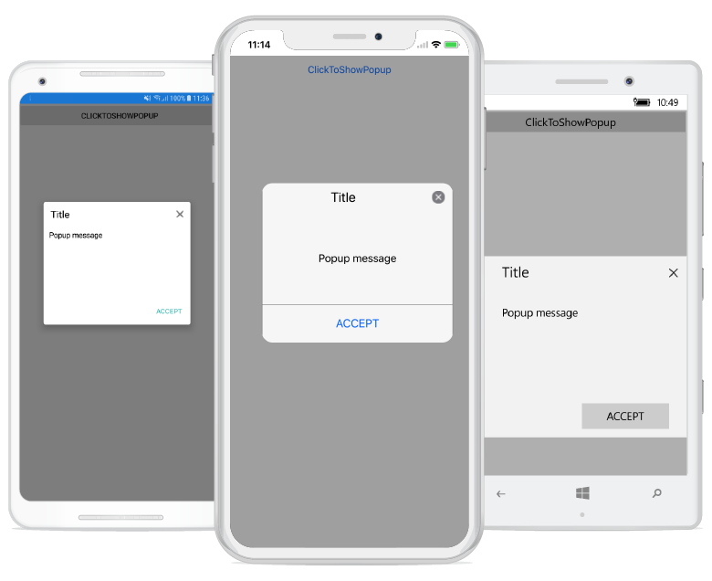
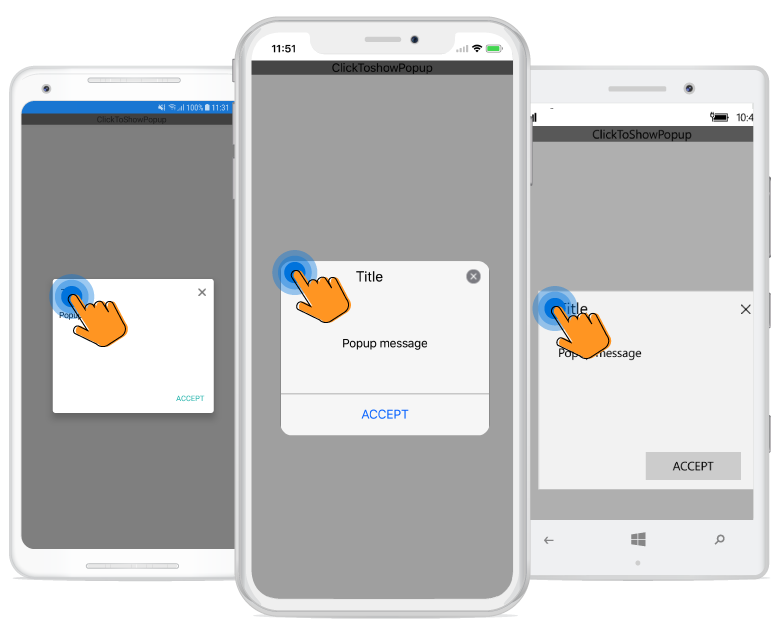

---
layout: post
title: Popup positioning | SfPopupLayout |Xamarin| Syncfusion
description: Positioning capabilities of SfPopupLayout
platform: Xamarin
control: SfPopupLayout
documentation: ug
--- 

# Pop-up Positioning

The SfPopupLayout allows showing the pop-up content at various available positions.

Following are the list of options available to show SfPopupLayout at various positions.

<table>
<tr>
<th> Methods / Properties </th>
<th> Description </th>
</tr>
<tr>
<td> {{'[SfPopupLayout.IsOpen](https://help.syncfusion.com/cr/cref_files/xamarin/sfpopuplayout/Syncfusion.SfPopupLayout.XForms~Syncfusion.XForms.PopupLayout.SfPopupLayout~IsOpen.html)'| markdownify }} </td>
<td> Shows the SfPopupLayout at center.</td>
</tr>
<tr>
<td> {{'[SfPopupLayout.Show()](https://help.syncfusion.com/cr/cref_files/xamarin/sfpopuplayout/Syncfusion.SfPopupLayout.XForms~Syncfusion.XForms.PopupLayout.SfPopupLayout~Show.html)'| markdownify }} </td>
<td> Similar as <code>SfPopupLayout.IsOpen</code> property.</td>
</tr>
<tr>
<td> {{'[SfPopupLayout.Show(x-position, y-position)](https://help.syncfusion.com/cr/cref_files/xamarin/sfpopuplayout/Syncfusion.SfPopupLayout.XForms~Syncfusion.XForms.PopupLayout.SfPopupLayout~Show.html)'| markdownify }} </td>
<td> Shows the SfPopupLayout at the specified X and y positions.</td>
</tr>
<tr>
<td> {{'[SfPopupLayout.ShowAtTouchPoint()](https://help.syncfusion.com/cr/cref_files/xamarin/sfpopuplayout/Syncfusion.SfPopupLayout.XForms~Syncfusion.XForms.PopupLayout.SfPopupLayout~ShowAtTouchPoint.html)'| markdownify }} </td>
<td> Shows the SfPopupLayout at the touch point.</td>
</tr>
<tr>
<td> {{'[SfPopupLayout.ShowRelativeToView(View, RelativePosition)](https://help.syncfusion.com/cr/cref_files/xamarin/sfpopuplayout/Syncfusion.SfPopupLayout.XForms~Syncfusion.XForms.PopupLayout.SfPopupLayout~ShowRelativeToView.html)'| markdownify }} </td>
<td> Shows the SfPopupLayout at the position relative to the specified view.</td>
</tr>
<tr>
<td> {{'[SfPopupLayout.ShowRelativeToView(View, RelativePosition,x-position,y-position)](http://help.syncfusion.com/cr/cref_files/xamarin/Syncfusion.SfPopupLayout.XForms~Syncfusion.XForms.PopupLayout.SfPopupLayout~ShowRelativeToView(View,RelativePosition,Double,Double).html)'| markdownify }} </td>
<td> Shows the SfPopupLayout at an absolute x,y coordinate, from the relative position of the specified view.</td>
</tr>
</table>

## Center positioning

SfPopupLayout can be shown at the center by using the following options.

### IsOpen property

To open the SfPopupLayout, use the `SfPopupLayout.IsOpen` property as in the following code sample.


<?xml version="1.0" encoding="utf-8" ?>
<ContentPage xmlns="http://xamarin.com/schemas/2014/forms"
             xmlns:x="http://schemas.microsoft.com/winfx/2009/xaml"
             xmlns:local="clr-namespace:GettingStarted"
             x:Class="GettingStarted.MainPage" 
             Padding="0,40,0,0"
             xmlns:sfPopup="clr-namespace:Syncfusion.XForms.PopupLayout;assembly=Syncfusion.SfPopupLayout.XForms">
<sfPopup:SfPopupLayout x:Name="popUpLayout">
   <sfPopup:SfPopupLayout.Content>
     <StackLayout x:Name="layout">
       <Button x:Name="clickToShowPopup" Text="ClickToShowPopup" VerticalOptions="Start" HorizontalOptions="FillAndExpand" />
     </StackLayout>
    </sfPopup:SfPopupLayout.Content>
  </sfPopup:SfPopupLayout>
</ContentPage>




using Syncfusion.XForms.PopupLayout;

namespace GettingStarted
{
    public partial class MainPage : ContentPage
    {
        public MainPage()
        {
            InitializeComponent();
            clickToShowPopup.Clicked += ClickToShowPopup_Clicked;
        }

        private void ClickToShowPopup_Clicked(object sender, EventArgs e)
        {
            // Shows SfPopupLayout at the center of the view.
            popupLayout.IsOpen = true;
        }
    }
}


Executing the above codes renders the following output in iOS, Android and Windows Phone devices respectively.

### SfPopupLayout.Show()

To open the SfPopupLayout, use the `SfPopupLayout.Show()` as in the following code sample.


<?xml version="1.0" encoding="utf-8" ?>
<ContentPage xmlns="http://xamarin.com/schemas/2014/forms"
             xmlns:x="http://schemas.microsoft.com/winfx/2009/xaml"
             xmlns:local="clr-namespace:GettingStarted"
             x:Class="GettingStarted.MainPage" 
             Padding="0,40,0,0"
             xmlns:sfPopup="clr-namespace:Syncfusion.XForms.PopupLayout;assembly=Syncfusion.SfPopupLayout.XForms">
<sfPopup:SfPopupLayout x:Name="popUpLayout">
   <sfPopup:SfPopupLayout.Content>
     <StackLayout x:Name="layout">
       <Button x:Name="clickToShowPopup" Text="ClickToShowPopup" VerticalOptions="Start" HorizontalOptions="FillAndExpand" />
     </StackLayout>
    </sfPopup:SfPopupLayout.Content>
  </sfPopup:SfPopupLayout>
</ContentPage>




using Syncfusion.XForms.PopupLayout;

namespace GettingStarted
{
    public partial class MainPage : ContentPage
    {
        public MainPage()
        {
            InitializeComponent();
            clickToShowPopup.Clicked += ClickToShowPopup_Clicked;
        }

        private void ClickToShowPopup_Clicked(object sender, EventArgs e)
        {
           // Shows SfPopupLayout at the center of the view.
           popupLayout.Show();
        }
    }
}


Executing the above codes renders the following output in iOS, Android and Windows Phone devices respectively.

## Absolute positioning

SfPopupLayout can be shown at the specified position by using the following method.

### SfPopupLayout.Show(x-position, y-position)

To open the SfPopupLayout in specific X,Y coordinates, use the `SfPopupLayout.Show(x-position, y-position)` property as in the following code sample.


<?xml version="1.0" encoding="utf-8" ?>
<ContentPage xmlns="http://xamarin.com/schemas/2014/forms"
             xmlns:x="http://schemas.microsoft.com/winfx/2009/xaml"
             xmlns:local="clr-namespace:GettingStarted"
             x:Class="GettingStarted.MainPage" 
             Padding="0,40,0,0"
             xmlns:sfPopup="clr-namespace:Syncfusion.XForms.PopupLayout;assembly=Syncfusion.SfPopupLayout.XForms">
<sfPopup:SfPopupLayout x:Name="popUpLayout">
   <sfPopup:SfPopupLayout.Content>
     <StackLayout x:Name="layout">
       <Button x:Name="clickToShowPopup" Text="ClickToShowPopup" VerticalOptions="Start" HorizontalOptions="FillAndExpand" />
     </StackLayout>
    </sfPopup:SfPopupLayout.Content>
  </sfPopup:SfPopupLayout>
</ContentPage>




using Syncfusion.XForms.PopupLayout;

namespace GettingStarted
{
    public partial class MainPage : ContentPage
    {
        public MainPage()
        {
            InitializeComponent();
            clickToShowPopup.Clicked += ClickToShowPopup_Clicked;
        }

        private void ClickToShowPopup_Clicked(object sender, EventArgs e)
        {
           // Shows SfPopupLayout at x-position 100 and y position 100.
           popupLayout.Show(100, 700);
        }
    }
}


Executing the above codes renders the following output in iOS, Android and Windows Phone devices respectively.

### SfPopupLayout.ShowAtTouchPoint()

To open the SfPopupLayout from the touch point in the screen, use the `SfPopupLayout.ShowAtTouchPoint()` property as in the following code sample.


<?xml version="1.0" encoding="utf-8" ?>
<ContentPage xmlns="http://xamarin.com/schemas/2014/forms"
             xmlns:x="http://schemas.microsoft.com/winfx/2009/xaml"
             xmlns:local="clr-namespace:GettingStarted"
             x:Class="GettingStarted.MainPage" 
             Padding="0,40,0,0"
             xmlns:sfPopup="clr-namespace:Syncfusion.XForms.PopupLayout;assembly=Syncfusion.SfPopupLayout.XForms">
<sfPopup:SfPopupLayout x:Name="popUpLayout">
   <sfPopup:SfPopupLayout.Content>
     <StackLayout x:Name="layout">
       <Button x:Name="clickToShowPopup" Text="ClickToShowPopup" VerticalOptions="Start" HorizontalOptions="FillAndExpand" />
     </StackLayout>
    </sfPopup:SfPopupLayout.Content>
  </sfPopup:SfPopupLayout>
</ContentPage>




using Syncfusion.XForms.PopupLayout;

namespace GettingStarted
{
    public partial class MainPage : ContentPage
    {
        public MainPage()
        {
            InitializeComponent();
            clickToShowPopup.Clicked += ClickToShowPopup_Clicked;
        }

        private void ClickToShowPopup_Clicked(object sender, EventArgs e)
        {
            // Shows SfPopupLayout at the touch point.
            popupLayout.ShowAtTouchPoint();
        }
    }
}


Executing the above codes renders the following output in iOS, Android and Windows Phone devices respectively.

## Relative positioning

SfPopupLayout can be shown at the relative position by using the following method.

### SfPopupLayout.ShowRelativeToView(View, RelativePosition)

To open the SfPopupLayout relative to a view, use the `SfPopupLayout.ShowRelativeToView(View, RelativePosition)` property as in the following code sample.


<?xml version="1.0" encoding="utf-8" ?>
<ContentPage xmlns="http://xamarin.com/schemas/2014/forms"
             xmlns:x="http://schemas.microsoft.com/winfx/2009/xaml"
             xmlns:local="clr-namespace:GettingStarted"
             x:Class="GettingStarted.MainPage" 
             Padding="0,40,0,0"
             xmlns:sfPopup="clr-namespace:Syncfusion.XForms.PopupLayout;assembly=Syncfusion.SfPopupLayout.XForms">
<sfPopup:SfPopupLayout x:Name="popUpLayout">
   <sfPopup:SfPopupLayout.Content>
    <StackLayout x:Name="mainLayout" VerticalOptions="Center" HorizontalOptions="Center">
        <StackLayout VerticalOptions="CenterAndExpand" HorizontalOptions="StartAndExpand">
          <Button x:Name="clickToShowPopup" Text="ClickToShowPopup" TextColor="White" HeightRequest="60" VerticalOptions="Center" Margin="100,0,0,0"
            HorizontalOptions="Center" BackgroundColor="Blue" />
        </StackLayout>
     </StackLayout>
    </sfPopup:SfPopupLayout.Content>
  </sfPopup:SfPopupLayout>
</ContentPage>




using Syncfusion.XForms.PopupLayout;

namespace GettingStarted
{
    public partial class MainPage : ContentPage
    {
        public MainPage()
        {
            InitializeComponent();
            clickToShowPopup.Clicked += ClickToShowPopup_Clicked;
        }

        private void ClickToShowPopup_Clicked(object sender, EventArgs e)
        {
           // Shows SfPopupLayout at the bottom of the label.
           popupLayout.ShowRelativeToView(label, RelativePosition.AlignBottom);
        }
    }
}


Executing the above codes renders the following output in iOS, Android and Windows Phone devices respectively.

### Absolute relative positioning

Along with the relative positioning SfPopupLayout can be displayed at an absolute x,y coordinate, from the relative position of the specified view by using the following method.

#### SfPopupLayout.ShowRelativeToView(View, RelativePosition,x-position,y-position)

To open the SfPopupLayout in specific X,Y coordinates relative to a view, use the `SfPopupLayout.ShowRelativeToView(View, RelativePosition,x-position,y-position)` property as shown in the following code snippet.

 % tabs %}
 
<?xml version="1.0" encoding="utf-8" ?>
<ContentPage xmlns="http://xamarin.com/schemas/2014/forms"
             xmlns:x="http://schemas.microsoft.com/winfx/2009/xaml"
             xmlns:local="clr-namespace:GettingStarted"
             x:Class="GettingStarted.MainPage" 
             Padding="0,200,0,0"
             xmlns:sfPopup="clr-namespace:Syncfusion.XForms.PopupLayout;assembly=Syncfusion.SfPopupLayout.XForms">
<sfPopup:SfPopupLayout x:Name="popUpLayout">
   <sfPopup:SfPopupLayout.Content>
    <StackLayout x:Name="mainLayout" VerticalOptions="StartAndExpand" HorizontalOptions="Start">
        <StackLayout VerticalOptions="StartAndExpand" HorizontalOptions="StartAndExpand">
          <Button x:Name="clickToShowPopup" Text="ClickToShowPopup" TextColor="White" HeightRequest="60" VerticalOptions="Start" Margin="50,0,0,0"
            HorizontalOptions="StartAndExpand" BackgroundColor="Blue" />
        </StackLayout>
     </StackLayout>
    </sfPopup:SfPopupLayout.Content>
  </sfPopup:SfPopupLayout>
</ContentPage>




% tabs %}

using Syncfusion.XForms.PopupLayout;

namespace GettingStarted
{
    public partial class MainPage : ContentPage
    {
        public MainPage()
        {
            InitializeComponent();
            clickToShowPopup.Clicked += ClickToShowPopup_Clicked;
        }

        private void ClickToShowPopup_Clicked(object sender, EventArgs e)
        {
            // Shows SfPopupLayout at the bottom of the label and with absolute relative position.
              popupLayout.ShowRelativeToView(label, RelativePosition.AlignBottom,50,50);
        }
    }
}



Executing the above codes renders the following output in iOS, Android and Windows Phone devices respectively

You can pass both negative and positive value as parameters to the `SfPopupLayout.ShowRelativeToView(View, RelativePosition,x-position,y-position)`.The popup will be positioned considering the relative position as as the (0,0) center point. For example if we have set the `RelativePosition` as `RelativePosition.BottomRight` and `RelativeView` as a Button, the button's bottom right corner will be considered as the 0,0 point and a negative x-position value will place the popup to the left of that point and a positive x-position value will place the popup to the right of that point. The same applies for y-position also.

N> To open the SfPopupLayout relative to a view without absolute position, you have to pass the x-position and y-position parameters as 0 in the `SfPopupLayout.ShowRelativeToView(View, RelativePosition,x-position,y-position)`.