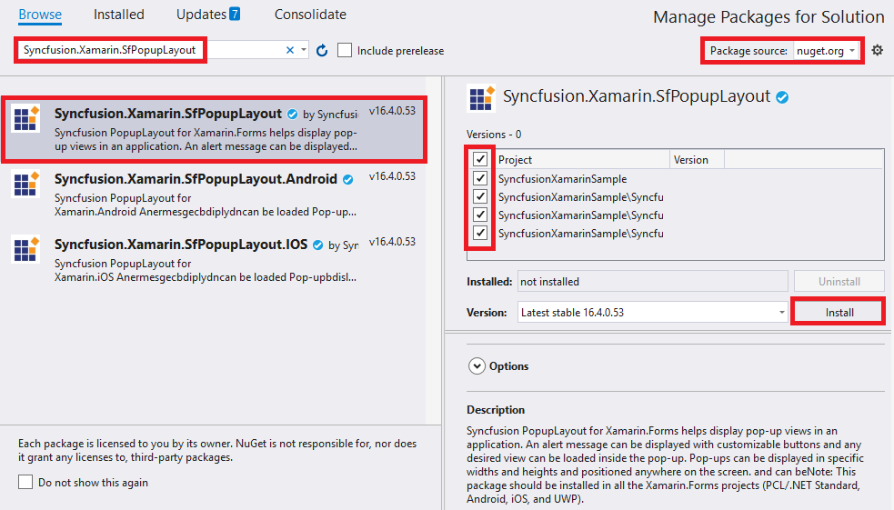
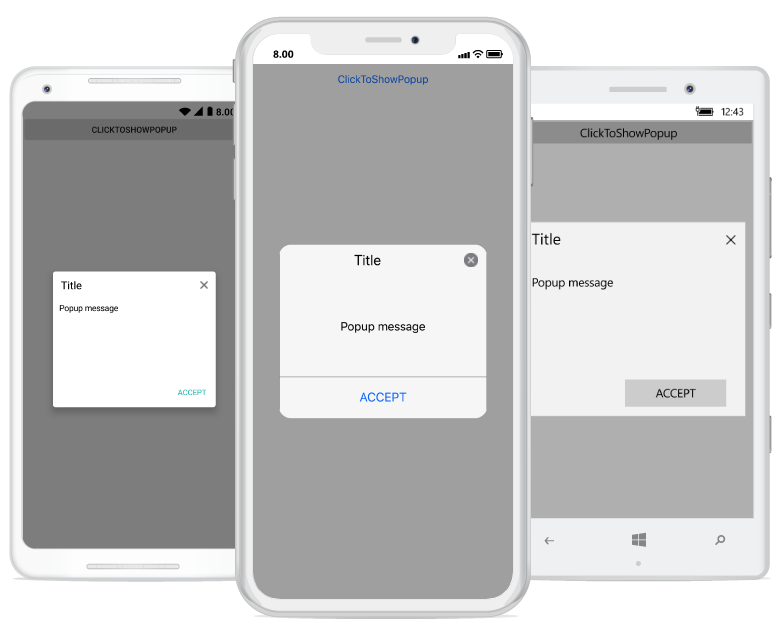

# Getting Started

This section provides a quick overview for working with the SfPopupLayout for Xamarin.Forms.

## Assembly deployment

After installing Essential Studio for Xamarin, you can get all the required assemblies in the {Syncfusion Essential Studio Installed location}\Essential Studio\{{ site.releaseversion }}\Xamarin\lib installation folder. 

E.g.  C:\Program Files (x86)\Syncfusion\Essential Studio\{{ site.releaseversion }}\Xamarin\lib

N> Assemblies can be found in an unzipped package location in Mac.

## NuGet configuration

To install the required NuGet for the SfPopupLayout control in the application, configure the NuGet packages of the Syncfusion components.

Refer to the following KB to configure the NuGet package of the Syncfusion components:

[How to configure package source and install Syncfusion NuGet packages in an existing project?](https://www.syncfusion.com/kb/7441/how-to-configure-package-source-and-install-syncfusion-nuget-packages-in-an-existing-project)

The following NuGet package should be installed to use the SfPopupLayout control in the application.

<table>
<tr>
<th> Project </th>
<th> Required package </th>
</tr>
<tr>
<td> Xamarin.Forms </td>
<td> Syncfusion.Xamarin.SfPopupLayout</td>
</tr>
</table>

## Adding SfPopupLayout reference

You can add SfPopupLayout reference using one of the following methods:

**Method 1: Adding SfPopupLayout reference from nuget.org**

Syncfusion Xamarin components are available in [nuget.org](https://www.nuget.org/). To add SfPopupLayout to your project, open the NuGet package manager in Visual Studio, search for [Syncfusion.Xamarin.SfPopupLayout](https://www.nuget.org/packages/Syncfusion.Xamarin.SfPopupLayout), and then install it.

N> Install the same version of SfPopupLayout NuGet in all the projects.

**Method 2: Adding SfPopupLayout reference from toolbox**

Syncfusion also provides Xamarin Toolbox. Using this toolbox, you can drag the SfPopupLayout control to the XAML page. It will automatically install the required NuGet packages and add the namespace to the page. To install Syncfusion Xamarin Toolbox, refer to [Toolbox](https://help.syncfusion.com/xamarin/utility#toolbox).

**Method 3: Adding SfPopupLayout assemblies manually from the installed location**

If you prefer to manually reference the assemblies instead referencing from NuGet, add the following assemblies in respective projects.

Location: {Installed location}/{version}/Xamarin/lib

<table>
<tr>
<td>PCL</td>
<td>Syncfusion.SfPopupLayout.XForms.dll Syncfusion.Core.XForms.dll Syncfusion.Licensing.dll </td>
</tr>
<tr>
<td>Android</td>
<td>Syncfusion.SfPopupLayout.XForms.dll Syncfusion.SfPopupLayout.XForms.Android.dll Syncfusion.Core.XForms.dll Syncfusion.Core.XForms.Android.dll Syncfusion.Licensing.dll </td>
</tr>
<tr>
<td>iOS</td>
<td>Syncfusion.SfPopupLayout.XForms.dll Syncfusion.SfPopupLayout.XForms.iOS.dll Syncfusion.Core.XForms.dll Syncfusion.Core.XForms.iOS.dll Syncfusion.Licensing.dll </td>
</tr>
<tr>
<td>UWP</td>
<td>Syncfusion.SfPopupLayout.XForms.dll Syncfusion.SfPopupLayout.XForms.UWP.dll Syncfusion.Core.XForms.dll Syncfusion.Core.XForms.UWP.dll Syncfusion.Licensing.dll </td>
</tr>
</table>

N> To know more about obtaining our components, refer to these links for [Mac](https://help.syncfusion.com/xamarin/introduction/download-and-installation/mac/) and [Windows](https://help.syncfusion.com/xamarin/introduction/download-and-installation/windows/).

I> Starting with v16.2.0.x, if you reference Syncfusion assemblies from the trial setup or from the NuGet feed, you also have to include a license key in your projects. Please refer to [Syncfusion license key](https://help.syncfusion.com/common/essential-studio/licensing/license-key/) to know about registering Syncfusion license key in your Xamarin application to use our components.

## Launching the SfPopupLayout on each platform

To use the SfPopupLayout inside an application, each platform application must initialize the SfPopupLayout renderer. This initialization step varies from platform to platform and is discussed in the following sections.

### Android

If you are using SfPopupLayout by [Displaying popup when the SfPopupLayout is set as root view](https://help.syncfusion.com/xamarin/sfpopuplayout/getting-started#displaying-popup-when-the-sfpopuplayout-is-set-as-root-view), the Android launches the SfPopupLayout without any initialization and is enough to only initialize the Xamarin.Forms Framework to launch the application.

If you are using SfPopupLayout by [Displaying popup on the go](https://help.syncfusion.com/xamarin/sfpopuplayout/getting-started#displaying-popup-on-the-go), call the `SfPopupLayoutRenderer.Init()` in the `OnCreate` overridden method of the MainActivity.cs class after the Xamarin.Forms Framework initialization and before the LoadApplication is called as demonstrated in the following code example.





protected override void OnCreate(Bundle bundle)
{
    ...
    global::Xamarin.Forms.Forms.Init(this, bundle);
    Syncfusion.XForms.Android.PopupLayout.SfPopupLayoutRenderer.Init();
    LoadApplication(new App());
}

 



N> If you are adding the references from toolbox, this step is not needed.

### iOS

To launch the SfPopupLayout in iOS, call the `SfPopupLayoutRenderer.Init()` in the `FinishedLaunching` overridden method of the AppDelegate class after the Xamarin.Forms Framework initialization and before the LoadApplication is called as demonstrated in the following code example.





public override bool FinishedLaunching(UIApplication app, NSDictionary options)
{
    …
    global::Xamarin.Forms.Forms.Init ();
    Syncfusion.XForms.iOS.PopupLayout.SfPopupLayoutRenderer.Init();
    LoadApplication (new App ());
    …
}

 



### Universal Windows Platform (UWP)

To launch the SfPopupLayout in UWP, call the `SfPopupLayoutRenderer.Init()` in the `MainPage` constructor before the LoadApplication is called as demonstrated in the following code example.





public MainPage()
{
    …
    Syncfusion.XForms.UWP.PopupLayout.SfPopupLayoutRenderer.Init();
    LoadApplication (new App ());
    …
}





### ReleaseMode issue in UWP platform

The known Framework issue in UWP platform is the custom controls will not render when deployed the application in `Release Mode`. It can be resolved by initializing the SfPopupLayout assemblies in `App.xaml.cs` in UWP project as in the following code snippet.





// In App.xaml.cs

protected override void OnLaunched(LaunchActivatedEventArgs e)
{
    …

    rootFrame.NavigationFailed += OnNavigationFailed;
        
    // you'll need to add `using System.Reflection;`
    List<Assembly> assembliesToInclude = new List<Assembly>();

    //Now, add all the assemblies your app uses
    assembliesToInclude.Add(typeof(SfPopupLayoutRenderer).GetTypeInfo().Assembly);

    // replaces Xamarin.Forms.Forms.Init(e);        
    Xamarin.Forms.Forms.Init(e, assembliesToInclude);
        
    …     
}





## Create a simple popup

This section explains how to create a SfPopupLayout and configure it. 
 
Create a new BlankApp (Xamarin.Forms.Portable) application in Xamarin Studio or Visual Studio for Xamarin.Forms. 

## Adding SfPopupLayout in Xamarin.Forms 

1. Add the required assembly references to the pcl and renderer projects as discussed in the [Assembly deployment](#assembly-deployment) section.
2. Import the control namespace as xmlns:syncfusion="clr-namespace:Syncfusion.XForms.SfPopupLayout;assembly=Syncfusion.SfPopupLayout.XForms" in XAML Page.
3. The SfPopupLayout can be displayed by the following cases. 

### Displaying popup when the SfPopupLayout is set as root view

The SfPopupLayout can be displayed by making it as base view or content view of the main page. For the first case, set the view over which the SfPopupLayout should be displayed as the content of the SfPopupLayout by using the [SfPopupLayout.Content](https://help.syncfusion.com/cr/cref_files/xamarin/Syncfusion.SfPopupLayout.XForms~Syncfusion.XForms.PopupLayout.SfPopupLayout~ContentProperty.html) property.

Refer to the following code example for displaying popup.





<?xml version="1.0" encoding="utf-8" ?>
<ContentPage xmlns="http://xamarin.com/schemas/2014/forms"
             xmlns:x="http://schemas.microsoft.com/winfx/2009/xaml"
             xmlns:local="clr-namespace:GettingStarted"
             x:Class="GettingStarted.MainPage" 
             Padding="0,40,0,0"
             xmlns:sfPopup="clr-namespace:Syncfusion.XForms.PopupLayout;assembly=Syncfusion.SfPopupLayout.XForms">
 <sfPopup:SfPopupLayout x:Name="popupLayout">
   <sfPopup:SfPopupLayout.Content>
     <StackLayout x:Name="mainLayout">
       <Button x:Name="clickToShowPopup" Text="ClickToShowPopup" 
               VerticalOptions="Start" HorizontalOptions="FillAndExpand"
                Clicked="ClickToShowPopup_Clicked"/>
     </StackLayout>
    </sfPopup:SfPopupLayout.Content>
  </sfPopup:SfPopupLayout>
</ContentPage>





using Syncfusion.XForms.PopupLayout;

namespace GettingStarted
{
    public partial class MainPage : ContentPage
    {
        public MainPage()
        {
            InitializeComponent();
        }

        private void ClickToShowPopup_Clicked(object sender, EventArgs e)
        {
            popupLayout.Show();
        }
    }
}




 
### Displaying popup on the go

You can continue to keep your view as the content view of the main page and still display popup over your view by simply calling the [SfPopupLayout.Show]((https://help.syncfusion.com/cr/cref_files/xamarin/Syncfusion.SfPopupLayout.XForms~Syncfusion.XForms.PopupLayout.SfPopupLayout~Show.html)) method.

Refer to the following code example for displaying popup.





<?xml version="1.0" encoding="utf-8" ?>
<ContentPage xmlns="http://xamarin.com/schemas/2014/forms"
             xmlns:x="http://schemas.microsoft.com/winfx/2009/xaml"
             xmlns:local="clr-namespace:GettingStarted"
             x:Class="GettingStarted.MainPage" 
             Padding="0,40,0,0">
     <StackLayout x:Name="mainLayout">
       <Button x:Name="clickToShowPopup" Text="ClickToShowPopup" 
               VerticalOptions="Start" HorizontalOptions="FillAndExpand"
               Clicked="ClickToShowPopup_Clicked" />
     </StackLayout>
</ContentPage>





using Syncfusion.XForms.PopupLayout;

namespace GettingStarted
{
    public partial class MainPage : ContentPage
    {
        SfPopupLayout popupLayout;

        public MainPage()
        {
            InitializeComponent();
            popupLayout = new SfPopupLayout();
        }

        private void ClickToShowPopup_Clicked(object sender, EventArgs e)
        {
            popupLayout.Show();
        }
    }
}





Executing the above codes renders the following output in iOS, Android and Windows Phone devices respectively.

You can download the source code of this sample [here](https://github.com/SyncfusionExamples/SfPopupLayout_XForms_GettingStarted).

N> Two Popups cannot be displayed at the same time in a page.

## Customize positioning

The SfPopupLayout allows showing the popup content at various positions.

The following list of options are available to position the SfPopupLayout in the desired position:

* `Center Positioning`: Use the [SfPopupLayout.IsOpen](https://help.syncfusion.com/cr/cref_files/xamarin/Syncfusion.SfPopupLayout.XForms~Syncfusion.XForms.PopupLayout.SfPopupLayout~IsOpen.html) property or [SfPopupLayout.Show](https://help.syncfusion.com/cr/cref_files/xamarin/Syncfusion.SfPopupLayout.XForms~Syncfusion.XForms.PopupLayout.SfPopupLayout~Show.html) method to display the SfPopupLayout at the center.
* `Absolute Positioning`: Use the [SfPopupLayout.Show(x-position, y-position)](https://help.syncfusion.com/cr/cref_files/xamarin/Syncfusion.SfPopupLayout.XForms~Syncfusion.XForms.PopupLayout.SfPopupLayout~Show.html) to display the SfPopupLayout at the specified X and y position.
* `OnTouch`: Use the [SfPopupLayout.ShowAtTouchPoint()](https://help.syncfusion.com/cr/cref_files/xamarin/Syncfusion.SfPopupLayout.XForms~Syncfusion.XForms.PopupLayout.SfPopupLayout~ShowAtTouchPoint.html) to display the SfPopupLayout at the touch point.
* `Relative Positioning`: Use the [SfPopupLayout.ShowRelativeToView(View, RelativePosition)](https://help.syncfusion.com/cr/cref_files/xamarin/Syncfusion.SfPopupLayout.XForms~Syncfusion.XForms.PopupLayout.SfPopupLayout~ShowRelativeToView.html) to display the SfPopupLayout at any of the 8 positions relative to the specified view.
* `Absolute relative positioning`: Use the [SfPopupLayout.ShowRelativeToView(View, RelativePosition,x position,y position)](https://help.syncfusion.com/cr/cref_files/xamarin/Syncfusion.SfPopupLayout.XForms~Syncfusion.XForms.PopupLayout.SfPopupLayout~ShowRelativeToView(View,RelativePosition,Double,Double).html) to display the SfPopupLayout at an absolute x,y coordinate from the relative position of the specified view.

More information for popup positioning is in this [link](https://help.syncfusion.com/xamarin/sfpopuplayout/popup-positioning).
 
## Customizing layouts

By default, you can choose a layout from the following available layouts in the SfPopupLayout by using the property [SfPopupLayout.AppearanceMode](https://help.syncfusion.com/cr/cref_files/xamarin/Syncfusion.SfPopupLayout.XForms~Syncfusion.XForms.PopupLayout.AppearanceMode.html).

* [OneButton](https://help.syncfusion.com/cr/cref_files/xamarin/Syncfusion.SfPopupLayout.XForms~Syncfusion.XForms.PopupLayout.AppearanceMode.html): Shows the SfPopupLayout with one button in the footer view. This is the default value.
* [TwoButton](https://help.syncfusion.com/cr/cref_files/xamarin/Syncfusion.SfPopupLayout.XForms~Syncfusion.XForms.PopupLayout.AppearanceMode.html): Shows the SfPopupLayout with two buttons in the footer view.

You can also customize the entire view of the popup by loading the templates or custom views for the header, body, and footer.

More information for popup positioning is in this [link](https://help.syncfusion.com/xamarin-ios/sfpopuplayout/layout-customizations).

###  Load your template view in the popup body

Any view can be added as popup content by using the [SfPopupLayout.PopupView.ContentTemplate](https://help.syncfusion.com/cr/cref_files/xamarin/Syncfusion.SfPopupLayout.XForms~Syncfusion.XForms.PopupLayout.PopupView~ContentTemplate.html) property to refresh it. Refer to the following code example in which a label is added as a popup content and displaying the popup when the SfPopupLayout is set as root view.





<?xml version="1.0" encoding="utf-8" ?>
<ContentPage xmlns="http://xamarin.com/schemas/2014/forms"
             xmlns:x="http://schemas.microsoft.com/winfx/2009/xaml"
             xmlns:local="clr-namespace:GettingStarted"
             x:Class="GettingStarted.MainPage" 
             Padding="0,40,0,0"
             xmlns:sfPopup="clr-namespace:Syncfusion.XForms.PopupLayout;assembly=Syncfusion.SfPopupLayout.XForms">
 <sfPopup:SfPopupLayout x:Name="popupLayout">
    <sfPopup:SfPopupLayout.PopupView>
        <sfPopup:PopupView>
            <sfPopup:PopupView.ContentTemplate>
                <DataTemplate>
                    <Label Text="This is SfPopupLayout" BackgroundColor="SkyBlue"
                           HorizontalTextAlignment="Center"/>
                </DataTemplate>
            </sfPopup:PopupView.ContentTemplate>
        </sfPopup:PopupView>
    </sfPopup:SfPopupLayout.PopupView>
   <sfPopup:SfPopupLayout.Content>
     <StackLayout x:Name="layout">
       <Button x:Name="clickToShowPopup" Text="ClickToShowPopup" VerticalOptions="Start" 
               HorizontalOptions="FillAndExpand"  Clicked="ClickToShowPopup_Clicked" />
     </StackLayout>
    </sfPopup:SfPopupLayout.Content>
  </sfPopup:SfPopupLayout>
</ContentPage>





using Syncfusion.XForms.PopupLayout;

namespace GettingStarted
{
    public partial class MainPage : ContentPage
    {
        DataTemplate templateView;
        Label popupContent;

        public MainPage()
        {
            InitializeComponent();            
            templateView = new DataTemplate(() =>
            {
                popupContent = new Label();
                popupContent.Text = "This is the SfPopupLayout";
                popupContent.BackgroundColor = Color.LightSkyBlue;
                popupContent.HorizontalTextAlignment = TextAlignment.Center;
                return popupContent;
            });

            // Adding ContentTemplate of the SfPopupLayout
            popupLayout.PopupView.ContentTemplate = templateView;
        }

        private void ClickToShowPopup_Clicked(object sender, EventArgs e)
        {
            popupLayout.Show();
        }
    }
}





Executing the above codes renders the following output in iOS, Android and Windows Phone devices respectively.

N> Setting the content view is same for both cases i.e. displaying the popup when the SfPopupLayout is set as root view and vice versa.

## Customizing animations

Available built-in animations will be applied to the SfPopupLayout when the PopupView opens and closes in the screen. By default, you can choose from the following animations available in the SfPopupLayout by using the property [SfPopupLayout.AnimationMode](https://help.syncfusion.com/cr/cref_files/xamarin/Syncfusion.SfPopupLayout.XForms~Syncfusion.XForms.PopupLayout.AnimationMode.html):

* [Zoom](https://help.syncfusion.com/cr/cref_files/xamarin/Syncfusion.SfPopupLayout.XForms~Syncfusion.XForms.PopupLayout.AnimationMode.html): Zoom-out animation will be applied when the PopupView opens and zoom-in animation will be applied when the PopupView closes. This is the default AnimationMode.
* [Fade](https://help.syncfusion.com/cr/cref_files/xamarin/Syncfusion.SfPopupLayout.XForms~Syncfusion.XForms.PopupLayout.AnimationMode.html): Fade-out animation will be applied when the PopupView opens and fade-in animation will be applied when the PopupView closes.
* [SlideOnLeft](https://help.syncfusion.com/cr/cref_files/xamarin/Syncfusion.SfPopupLayout.XForms~Syncfusion.XForms.PopupLayout.AnimationMode.html): PopupView will be animated from left-to-right when it opens and from right-to-left when the PopupView closes.
* [SlideOnRight](https://help.syncfusion.com/cr/cref_files/xamarin/Syncfusion.SfPopupLayout.XForms~Syncfusion.XForms.PopupLayout.AnimationMode.html): PopupView will be animated from right-to-left when it opens and from left-to-right when the PopupView closes.
* [SlideOnTop](https://help.syncfusion.com/cr/cref_files/xamarin/Syncfusion.SfPopupLayout.XForms~Syncfusion.XForms.PopupLayout.AnimationMode.html): PopupView will be animated from top-to-bottom when it opens and from bottom-to-top when the PopupView closes.
* [SlideOnBottom](https://help.syncfusion.com/cr/cref_files/xamarin/Syncfusion.SfPopupLayout.XForms~Syncfusion.XForms.PopupLayout.AnimationMode.html): PopupView will be animated from bottom-to-top when it opens and from top-to-bottom when the PopupView closes
* [None](https://help.syncfusion.com/cr/cref_files/xamarin/Syncfusion.SfPopupLayout.XForms~Syncfusion.XForms.PopupLayout.AnimationMode.html): Animations will not be applied.

More information for popup animations is in this [link](https://help.syncfusion.com/xamarin/sfpopuplayout/popup-animations).





<sfPopup:SfPopupLayout x:Name="popupLayout">
    <sfPopup:SfPopupLayout.PopupView>
        <sfPopup:PopupView AnimationMode="Fade" />
    </sfPopup:SfPopupLayout.PopupView>
</sfPopup:SfPopupLayout>





//MainPage.cs

public MainPage()
{
    InitializeComponent();
    popupLayout.PopupView.AnimationMode = AnimationMode.Fade;
}



