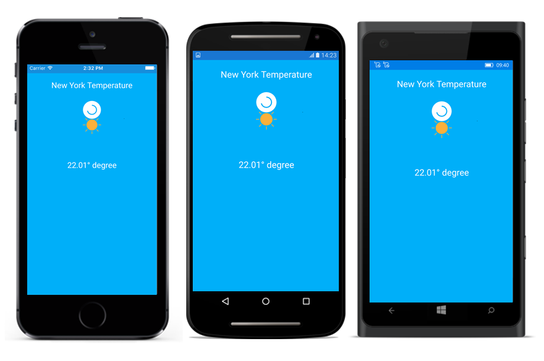
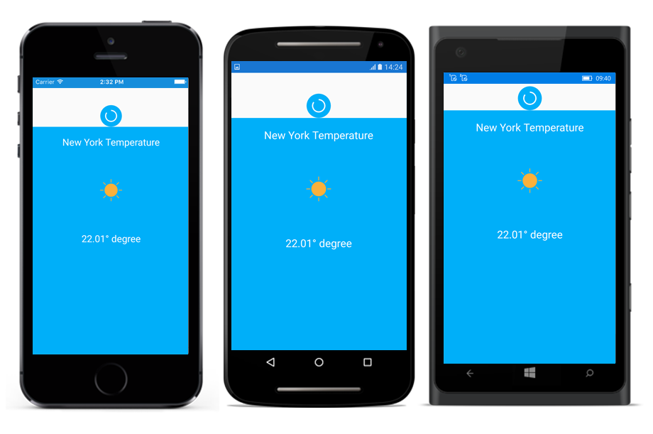
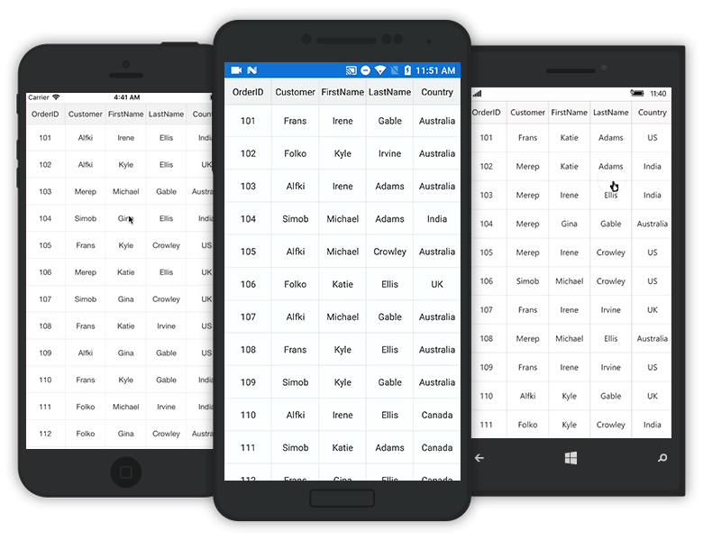
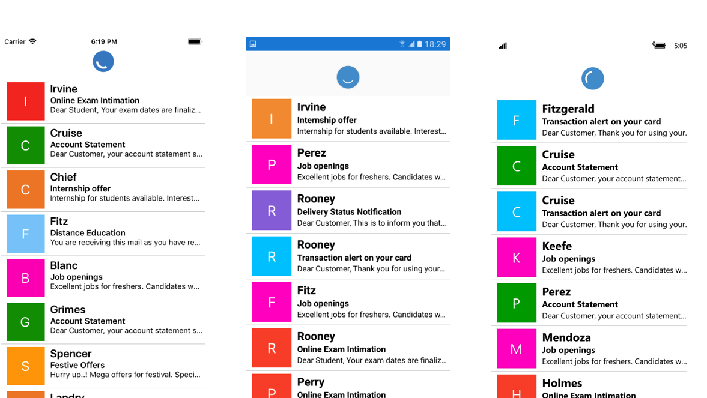

# Features

## PullableContent

Gets or sets the content of the refresh view. `PullableContent` is the main view of the `SfPullToRefresh` control on which the desired items can be placed.



  <syncfusion:SfPullToRefresh x:Name="pullToRefresh"
                                    PullingThreshold="120"
                                    RefreshContentHeight="30"
                                    RefreshContentThreshold="30"
                                    RefreshContentWidth="30">
            <syncfusion:SfPullToRefresh.PullableContent>
                    <Label x:Name="Monthlabel" TextColor="White" HorizontalTextAlignment="Center" VerticalTextAlignment="Start" />
            </syncfusion:SfPullToRefresh.PullableContent>
  </syncfusion:SfPullToRefresh>



## TransitionMode

The `TransitionMode` property specifies the mode of the animations. It has the following two modes:

* `SlideOnTop`
* `Push`

The default transition is `SlideOnTop` that draws the RefreshContent on top of the `PullableContent`.





    pullToRefresh.TransitionMode = TransitionType.SlideOnTop;





    <syncfusion:SfPullToRefresh x:Name="pullToRefresh" TransitionMode="SlideOnTop" />





The following code example shows how to set `TransitionMode` as `Push` to SfPullToRefresh. This transition moves the refresh content and main content simultaneously.





    pullToRefresh.TransitionMode = TransitionType.Push;





    <syncfusion:SfPullToRefresh x:Name=" pullToRefresh" TransitionMode="Push" />





## RefreshContentThreshold

Gets or sets the refresh content threshold value that indicates progress indicator starting position in view





    pullToRefresh.RefreshContentThreshold = 50d;



 





    <syncfusion:SfPullToRefresh x:Name="pullToRefresh" RefreshContentThreshold="50"/>

 



## PullingThreshold

Gets or sets the value for the refresh content threshold, this indicate progress indicator maximum pulling position in view.





    pullToRefresh.PullingThreshold = 200d;



 





    <syncfusion:SfPullToRefresh x:Name="pullToRefresh" PullingThreshold="200"/>

 



## IsRefreshing

Get or set the state for refreshing the view. View will get refresh while `IsRefreshing` property is set `true` and View refreshing will be stopped when you set `IsRefreshing` is `false`.
 




    pullToRefresh.IsRefreshing = true;



 





    <syncfusion:SfPullToRefresh x:Name="pullToRefresh" IsRefreshing = "True"/>

 



## ProgressBackgroundColor

Get or set the background color to the progress indicator.





    pullToRefresh.ProgressBackgroundColor = Color.White;



 





    <syncfusion:SfPullToRefresh x:Name="pullToRefresh" ProgressBackgroundColor = "White"/>

 



## ProgressStrokeColor

Get or set the color to the progress indicator stroke 





    pullToRefresh.ProgressStrokeColor = Color.Blue;



 





    <syncfusion:SfPullToRefresh x:Name="pullToRefresh" ProgressStrokeColor = "Blue"/>

 



## ProgressStrokeWidth

Get or set the width to the progress indicator stroke. 





    pullToRefresh.ProgressStrokeWidth = 5d;









    <syncfusion:SfPullToRefresh x:Name="pullToRefresh" ProgressStrokeWidth="5"/>





## RefreshContentWidth

Get or set the width to the refresh content.





    pullToRefresh.RefreshContentWidth = 50d;









    <syncfusion:SfPullToRefresh x:Name="pullToRefresh" RefreshContentWidth="50"/>





## RefreshContentHeight

Get or set the width to the refresh content.





    pullToRefresh.RefreshContentHeight = 50d;









    <syncfusion:SfPullToRefresh x:Name="pullToRefresh" RefreshContentHeight="50"/>





## Programmatic Support 

### StartRefreshing()

StartRefreshing method is used to refresh the content without interaction in pullable content. When invoke this StartRefreshing() method,then Progress indicator will be shown. 





    pullToRefresh.StartRefreshing();





### EndRefreshing()

EndRefreshing method is used to ends the progress animation of `SfPullToRefresh`.





    pullToRefresh.EndRefreshing();





## Hosting complex and custom layouts as pullable content

### Host SfDataGrid as pullable content

SfPullToRefresh controls provides support for loading any custom control as pullable content. To host SfDatagrid inside the SfPullToRefresh, follow the below steps.

1.	Add the required assembly references to the pcl and renderer projects as discussed in the [Assembly deployment](#assembly-deployment) section of SfDataGrid and SfPullToRefresh.
2.	Import SfPullToRefresh and SfDataGrid control namespace as follows.




using Syncfusion.SfPullToRefresh.XForms;
using Syncfusion.SfDataGrid.XForms;





<xmlns:syncfusion="clr-namespace:Syncfusion.SfDataGrid.XForms;assembly=Syncfusion.SfDataGrid.XForms">          
<xmlns:pull="clr-namespace:Syncfusion.SfPullToRefresh.XForms;assembly=Syncfusion.SfPullToRefresh.XForms">




3.	Define SfDataGrid as PullableContent of the SfPullToRefresh. 
4.	Handle the pull to refresh events for refreshing the data. 
5.	Customize the required properties of SfDataGrid and SfPullToRefresh based on your requirement. 

This is how the final output will look like on iOS, Android and Windows Phone devices when hosting a SfDatagrid control as pullable content.



    <?xml version="1.0" encoding="utf-8" ?>
<ContentPage xmlns="http://xamarin.com/schemas/2014/forms"
             xmlns:x="http://schemas.microsoft.com/winfx/2009/xaml"
             xmlns:local="clr-namespace:PullToRefreshSample"
             x:Class="PullToRefreshSample.MainPage"
            xmlns:syncfusion="clr-namespace:Syncfusion.SfDataGrid.XForms;assembly=Syncfusion.SfDataGrid.XForms"
            xmlns:pull="clr-namespace:Syncfusion.SfPullToRefresh.XForms;assembly=Syncfusion.SfPullToRefresh.XForms">

    <ContentPage.BindingContext>
        <local:ViewModel x:Name="viewModel" />
    </ContentPage.BindingContext>

    <pull:SfPullToRefresh x:Name="pulltorefresh"
                           TransitionMode="SlideOnTop"
                           PullingThreshold="100"
                           RefreshContentHeight="30"
                           RefreshContentThreshold="40"
                           RefreshContentWidth="30">
        <pull:SfPullToRefresh.PullableContent>

            <syncfusion:SfDataGrid x:Name="dataGrid" ItemsSource="{Binding OrdersInfo}" 
                                   AutoGenerateColumns="false">

                        <syncfusion:SfDataGrid.Columns>
                            <syncfusion:GridTextColumn MappingName="OrderID" />
                            <syncfusion:GridTextColumn MappingName="Customer"/>
                            <syncfusion:GridTextColumn MappingName="FirstName" />
                            <syncfusion:GridTextColumn MappingName="LastName" />
                            <syncfusion:GridTextColumn MappingName="Country" />

                        </syncfusion:SfDataGrid.Columns>
            </syncfusion:SfDataGrid>

        </pull:SfPullToRefresh.PullableContent>
    </pull:SfPullToRefresh>
</ContentPage>





using Syncfusion.SfPullToRefresh.XForms;
using Xamarin.Forms;
using Syncfusion.SfDataGrid.XForms;
namespace PullToRefreshSample
{
    public partial class MainPage : ContentPage
    {   
        public MainPage()
        {
            InitializeComponent();
            pulltorefresh.Refreshing += PullToRefresh_Refreshing;
            dataGrid.VerticalOverScrollMode=VerticalOverScrollMode.None;
        }

        private async void PullToRefresh_Refreshing(object sender, EventArgs args)
        {
            await Task.Delay(new TimeSpan(0, 0, 3));
            viewModel.ItemsSourceRefresh();
            pulltorefresh.IsRefreshing = false;
        }
    }
}

//Model class:

public class OrderInfo
{
    public OrderInfo()
    {
    }
    public string EmployeeID { get; internal set; }
    public object FirstName { get; internal set; }
    public object LastName { get; internal set; }
    public string Country { get; internal set; }
    public int OrderID { get; internal set; }
    public string Customer { get; internal set; }
}

//ViewModel Class:

public class ViewModel
    {
        Random random = new Random();
        public ViewModel()
        { 
        }

        #region ItemsSourceRefresh

        public void ItemsSourceRefresh()
        {
           for (int i = 1; i <= 5; i++)
            {
                this.OrdersInfo.Insert(0, order.RefreshItemsource(i));
            }
        }

        #endregion
    }

//OrderInfoRepository Class:

public class OrderInfoRepository
{
   public OrderInfoRepository()
   {
   }
   private Random random = new Random();

   #region GetOrderDetails

   public ObservableCollection<OrderInfo> GetOrderDetails(int count)
   {
   ObservableCollection<OrderInfo> orderDetails = new ObservableCollection<OrderInfo>();

            for (int i = 101; i <= count + 100; i++)
            {
                var order = new OrderInfo()
                {
                    OrderID = i,
                    Customer = Customer[random.Next(5)],
                    EmployeeID = random.Next(1700, 1800).ToString(),
                    FirstName = FirstNames[random.Next(5)],
                    LastName = LastNames[random.Next(5)],
                    Country = country[random.Next(5)],
                };
                orderDetails.Add(order);
            }
            return orderDetails;
    }
    public OrderInfo RefreshItemsource(int i)
    {
            var order = new OrderInfo()
            {
                OrderID = (i + random.Next(100,110)),                
                Customer = Customer[random.Next(5)],
                EmployeeID = random.Next(1700, 1800).ToString(),
                FirstName = FirstNames[random.Next(5)],
                LastName = LastNames[random.Next(5)],
                Country = country[random.Next(5)]
            };
            return order;
        }

        #endregion

        // Main DataSources

        string[] FirstNames = new string[] {"Kyle","Gina","Irene","Katie","Michael"};
        string[] LastNames = new string[] {"Adams","Crowley","Ellis","Gable","Irvine"};
        string[] Customer = new string[] {"Alfie","Frans","Mered","Folios","Simon"};
        string[] country = new string[] {"US","Australia","Canada","UK","India"};
      }







If we run the above sample with TransitionMode as Push, the output will look like on iOS, Android and Windows Phone devices as shown below.

### Host SfListView as pullable content

To host SfListView inside the SfPullToRefresh which is used to update items in the list while performing the pull to refresh action.

1.	Add the required assembly references to the pcl and renderer projects as discussed in the [Assembly deployment](#assembly-deployment) section of SfListView and SfPullToRefresh.
2.	Import SfPullToRefresh control and SfListView control namespace as follows.





using Syncfusion.SfPullToRefresh.XForms;
using Syncfusion.ListView.XForms;





<xmlns:syncfusion="clr-namespace:Syncfusion.ListView.XForms;assembly=Syncfusion.SfListView.XForms">          
<xmlns:pull="clr-namespace:Syncfusion.SfPullToRefresh.XForms;assembly=Syncfusion.SfPullToRefresh.XForms">





3.	Define SfListView as PullableContent of the SfPullToRefresh. 
4.	Handle the pull to refresh events for refreshing the data. 
5.	Customize the required properties of SfListView and SfPullToRefresh based on your requirement. 

This is how the final output will look like on iOS, Android and Windows Phone devices when hosting a SfListView control as pullable content.



    <?xml version="1.0" encoding="utf-8" ?>
<ContentPage xmlns="http://xamarin.com/schemas/2014/forms"
             xmlns:x="http://schemas.microsoft.com/winfx/2009/xaml"
             xmlns:local="clr-namespace:ListviewPulltorefresh"
             x:Class="ListviewPulltorefresh.MainPage"
             xmlns:syncfusion="clr-namespace:Syncfusion.ListView.XForms;assembly=Syncfusion.SfListView.XForms"
             xmlns:pullToRefresh="clr-namespace:Syncfusion.SfPullToRefresh.XForms;assembly=Syncfusion.SfPullToRefresh.XForms" >

    <ContentPage.BindingContext>
        <local:InboxRepositiory x:Name="ViewModel" />
    </ContentPage.BindingContext>

    <ContentPage.Content>
        <pullToRefresh:SfPullToRefresh x:Name="pullToRefresh" PullingThreshold="80"
                               ProgressBackgroundColor="#428BCA" RefreshContentWidth="40" RefreshContentHeight="40"
                               TransitionMode="Push" IsRefreshing="False">
            <pullToRefresh:SfPullToRefresh.PullableContent>
                <syncfusion:SfListView x:Name="listView" ItemSize="80" ItemsSource="{Binding InboxItems}"  ItemSpacing="0,0,0,1" BackgroundColor="LightGray"
                           SelectionMode="None">
                    <syncfusion:SfListView.ItemTemplate>
                        <DataTemplate>
                            <Grid ColumnSpacing="5" BackgroundColor="White" Padding="5" >
                                <Grid.ColumnDefinitions>
                                    <ColumnDefinition Width="80" />
                                    <ColumnDefinition Width="*"/>
                                </Grid.ColumnDefinitions>
                                <StackLayout Grid.Column="0"  HeightRequest="70" WidthRequest="70" VerticalOptions="Center" HorizontalOptions="Center" BackgroundColor="{Binding BackgroundColor}">
                                    <Grid  HorizontalOptions="CenterAndExpand" VerticalOptions="CenterAndExpand" >
                                        <Label Text="{Binding DisplayString}" TextColor="White" FontSize="25" HorizontalOptions="CenterAndExpand" VerticalOptions="CenterAndExpand"/>
                                    </Grid>
                                    
                                </StackLayout>

                                <Grid Grid.Column="1" RowSpacing="0">
                                    <Grid.RowDefinitions>
                                        <RowDefinition Height="Auto"/>
                                        <RowDefinition Height="Auto" />
                                        <RowDefinition Height="Auto" />
                                    </Grid.RowDefinitions>
                                    <Label Text="{Binding Sender}" TextColor="Black" FontAttributes="Bold" FontSize="20"/>
                                    <Label Grid.Row="1" FontSize = "15" TextColor="Black"  FontAttributes="Bold" Text="{Binding Subject}" LineBreakMode="TailTruncation"  />
                                    <Label Grid.Row="2" FontSize="14" TextColor="Black" Text="{Binding Details}" LineBreakMode="TailTruncation" />
                                </Grid>
                            </Grid>
                        </DataTemplate>
                    </syncfusion:SfListView.ItemTemplate>
                </syncfusion:SfListView>
            </pullToRefresh:SfPullToRefresh.PullableContent>
        </pullToRefresh:SfPullToRefresh>
    </ContentPage.Content>
</ContentPage>
    





using Syncfusion.SfPullToRefresh.XForms;
using Xamarin.Forms;
using Syncfusion.ListView.XForms;
namespace PullToRefreshSample
{
    public partial class MainPage : ContentPage
    {   
        public MainPage()
        {
            InitializeComponent();
            pullToRefresh.Refreshing += PullToRefresh_Refreshing; ;
        }

        private async void PullToRefresh_Refreshing(object sender, EventArgs e)
        {
            pullToRefresh.IsRefreshing = true;
            await Task.Delay(2000);
            ViewModel.RefreshItemSource();
            pullToRefresh.IsRefreshing = false;
        }
    }
}







