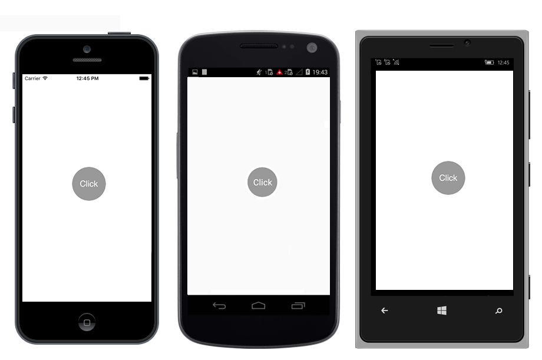
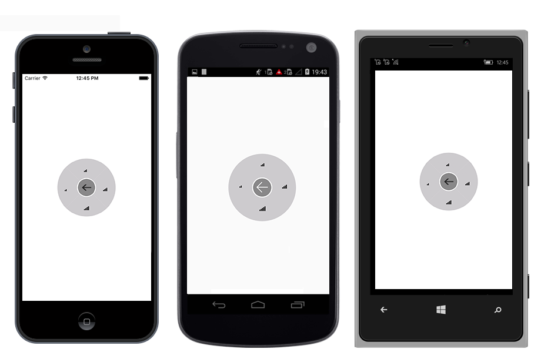
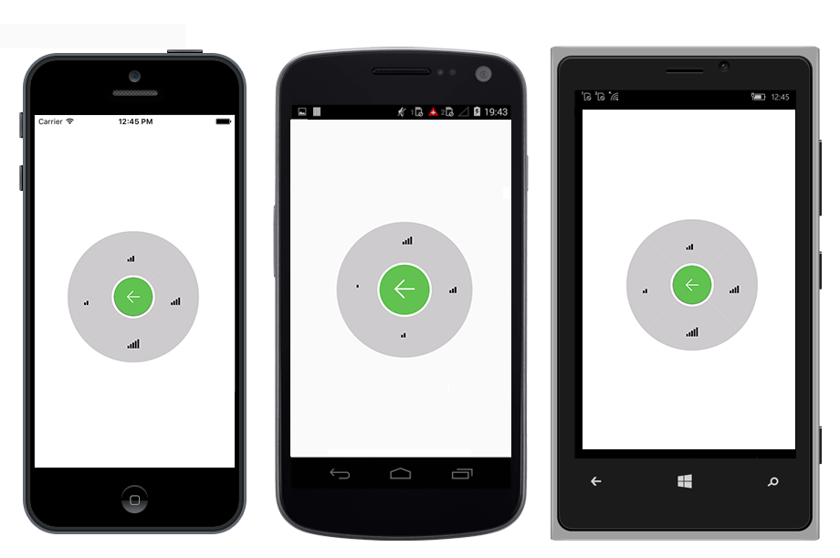

# Dealing with CenterButton

CenterButton/BackButton in RadialMenu is nothing but the view in center of the RadialMenu. It performs the operations like Openining and Closing the rim and Navigation to next level items. SfRadialMenu allows us to customize the CenterButton/BackButton with `FontIcon`, `Custom View` and `Caption`.

## Add Icon through Icon Font

We can able to set IconFonts to CenterButton using the `CenterButtonText` property available in SfRadialMenu.And we have to set respective FontFamily for the text in `CenterButtonFontFamily`.





<?xml version="1.0" encoding="UTF-8"?>
<ContentPage xmlns="http://xamarin.com/schemas/2014/forms" BackgroundColor="White"
 xmlns:x="http://schemas.microsoft.com/winfx/2009/xaml" x:Class="RadialMenuGettingStarted.RadialMenuPage"
 xmlns:radialMenu="clr-namespace:Syncfusion.SfRadialMenu.XForms;assembly=Syncfusion.SfRadialMenu.XForms">
    
<ContentPage.Content>
          <radialMenu:SfRadialMenu x:Name="radial_Menu" CenterButtonText="H" CenterButtonFontFamily="navigation.ttf" CenterButtonRadius="30" RimColor="#FFCDCBCE" RimRadius="100" CenterButtonFontSize="26" CenterButtonTextColor="White" CenterButtonBackgroundColor="#FF898889" CenterButtonBorderColor="White"
			CenterButtonBorderThickness="3" />
 </ContentPage.Content>
</ContentPage> 





using Syncfusion.XForms.SfRadialMenu;
using Xamarin.Forms;

public class App : Application
    {
        public App()
        {
            MainPage = new RadialMenuPage ();
        }

    }
Public class RadialMenuPage : ContentPage
{
   
	public RadialMenuPage ()
	{
		InitializeComponent();
		SfRadialMenu radialMenu = new SfRadialMenu();

		//Initilizing RadialMenu's properties
		radialMenu.CenterButtonText = "H";
		radialMenu.CenterButtonFontFamily = "navigation.ttf";
		radialMenu.CenterButtonRadius = 26;
		radialMenu.CenterButtonBorderColor = Color.White;

        this.Content = radialMenu;
	}
}



## Add Caption

SfRadialMenu allows us to enter direct caption for its CenterButton. And it can be achieved by using the property `CenterButtonText`.





<?xml version="1.0" encoding="UTF-8"?>
<ContentPage xmlns="http://xamarin.com/schemas/2014/forms" BackgroundColor="White"
 xmlns:x="http://schemas.microsoft.com/winfx/2009/xaml" x:Class="RadialMenuGettingStarted.RadialMenuPage"
 xmlns:radialMenu="clr-namespace:Syncfusion.SfRadialMenu.XForms;assembly=Syncfusion.SfRadialMenu.XForms">
    
<ContentPage.Content>
          		<radialMenu:SfRadialMenu x:Name="radialMenu" CenterButtonRadius="24" CenterButtonText="Click" CenterButtonFontSize="12" CenterButtonBorderColor="White" CenterButtonBorderThickness="3" />
 </ContentPage.Content>
</ContentPage> 





using Syncfusion.XForms.SfRadialMenu;
using Xamarin.Forms;

public class App : Application
    {
        public App()
        {
            MainPage = new RadialMenuPage ();
        }

    }
Public class RadialMenuPage : ContentPage
{
   
	public RadialMenuPage ()
	{
			InitializeComponent();
			//Creating instance for RadialMenu
			SfRadialMenu radialMenu = new SfRadialMenu();

			//Initilizing RadialMenu's properties
			radialMenu.CenterButtonText = "Click";
			radialMenu.CenterButtonFontSize = 12;
			radialMenu.CenterButtonRadius = 24;
			radialMenu.CenterButtonBorderThickness = 3;

            this.Content = radialMenu;
	}
}



## Add any View

SfRadialMenu allows us to give customized view to its CenterButton. And we can accomplish this by using the property `CenterButtonView`.





<?xml version="1.0" encoding="UTF-8"?>
<ContentPage xmlns="http://xamarin.com/schemas/2014/forms" BackgroundColor="White"
 xmlns:x="http://schemas.microsoft.com/winfx/2009/xaml" x:Class="RadialMenuGettingStarted.RadialMenuPage"
 xmlns:radialMenu="clr-namespace:Syncfusion.SfRadialMenu.XForms;assembly=Syncfusion.SfRadialMenu.XForms">

<ContentPage.Content>
          		<radialMenu:SfRadialMenu x:Name="radialMenu" CenterButtonRadius="30" RimColor="Transparent" RimRadius="100" CenterButtonBackgroundColor="Transparent" CenterButtonBorderColor="Transparent" CenterButtonBorderThickness="3">
			<radialMenu:SfRadialMenu.CenterButtonView>
				<Grid HeightRequest="40" WidthRequest="40">
					<Image Source="green.png" />
					<Label Text="&#xe703;" x:Name="share" FontSize="20" HeightRequest="30" WidthRequest="30" XAlign="Center" YAlign="Center" TextColor="White" HorizontalOptions="Center" VerticalOptions="Center"
						HorizontalTextAlignment="Center" VerticalTextAlignment="Center">
						<Label.FontFamily>
							<OnPlatform x:TypeArguments="x:String" iOS="Social" Android="socialicons.ttf#socialicons" />
						</Label.FontFamily>
					</Label>
				</Grid>
			</radialMenu:SfRadialMenu.CenterButtonView>
        </radialMenu:SfRadialMenu>
 </ContentPage.Content>
</ContentPage> 





using Syncfusion.XForms.SfRadialMenu;
using Xamarin.Forms;

public class App : Application
    {
        public App()
        {
            MainPage = new RadialMenuPage ();
        }

    }
Public class RadialMenuPage : ContentPage
{
   
	public RadialMenuPage ()
	{
			InitializeComponent();
			//Creating instance for RadialMenu
			SfRadialMenu radialMenu = new SfRadialMenu();

			//Creating CustomView
			Grid customView = new Grid();
			Label textLabel = new Label();
			textLabel.Text = "\ue703";
			textLabel.TextColor = Color.White;
			if (Device.OS == TargetPlatform.iOS)
				textLabel.FontFamily = "Social";
			else
				textLabel.FontFamily = "socialicons.ttf#socialicons";
			textLabel.FontSize = 20;
			textLabel.HorizontalTextAlignment = TextAlignment.Center;
			textLabel.VerticalTextAlignment = TextAlignment.Center;
			textLabel.HeightRequest = 30;
			textLabel.WidthRequest = 30;
			Image backgroundImage = new Image();
			backgroundImage.Source = (FileImageSource)ImageSource.FromFile("green.png");
			customView.Children.Add(backgroundImage);
			customView.Children.Add(textLabel);

			radialMenu.CenterButtonView = customView;
			radialMenu.CenterButtonRadius = 24;
			radialMenu.CenterButtonBorderColor = Color.White;
			radialMenu.RimColor = Color.Transparent;
			radialMenu.SelectionColor = Color.Transparent;
			radialMenu.CenterButtonBackgroundColor = Color.Transparent;

            this.Content = radialMenu;
	}
}



## Change for next level

SfRadialMenu allows us to add items hierarchically.We can navigate to first level to next level by tapping the respective item and can go back to first by tapping the BackButton.The BackButton helps us to know we were navigated to next level of submenu items from first level. We can able customize the RadialMenu's BackButton with FontIcons,CustomView and Caption like CenterButton.     

### BackButton with IconFotns

We can able to set IconFonts to BackButton using the `CenterButtonBackText` property available in SfRadialMenu.And we have to set respective FontFamily for the text in `CenterButtonBackFontFamily`.





<?xml version="1.0" encoding="UTF-8"?>
<ContentPage xmlns="http://xamarin.com/schemas/2014/forms" BackgroundColor="White"
 xmlns:x="http://schemas.microsoft.com/winfx/2009/xaml" x:Class="RadialMenuGettingStarted.RadialMenuPage"
 xmlns:radialMenu="clr-namespace:Syncfusion.SfRadialMenu.XForms;assembly=Syncfusion.SfRadialMenu.XForms">

<ContentPage.Content>
          		<radialMenu:SfRadialMenu x:Name="radial_Menu" CenterButtonText="&#xe713;" CenterButtonBackText="&#xe72B;" CenterButtonFontFamily="Segoe MDL2 Assets.ttf" CenterButtonBackFontFamily="Segoe MDL2 Assets.ttf" CenterButtonRadius="30" RimColor="#FFCDCBCE" RimRadius="100" CenterButtonFontSize="26" CenterButtonTextColor="White" CenterButtonBackgroundColor="#FF898889" CenterButtonBorderColor="White"
			CenterButtonBorderThickness="3">
			<radialMenu:SfRadialMenu.Items>
				<radialMenu:SfRadialMenuItem FontIconText="" IconFontSize="20" IconFontFamily="Segoe MDL2 Assets.ttf" ItemHeight="40" ItemWidth="30">
					<radialMenu:SfRadialMenuItem.Items>
						<radialMenu:SfRadialMenuItem FontIconText="" IconFontFamily="Segoe MDL2 Assets.ttf" ItemHeight="40" ItemWidth="30" IconFontSize="20" />
						<radialMenu:SfRadialMenuItem FontIconText="" IconFontFamily="Segoe MDL2 Assets.ttf" ItemHeight="40" ItemWidth="30" IconFontSize="20" />
						<radialMenu:SfRadialMenuItem FontIconText="" IconFontFamily="Segoe MDL2 Assets.ttf" ItemHeight="40" ItemWidth="30" IconFontSize="20" />
						<radialMenu:SfRadialMenuItem FontIconText="" IconFontFamily="Segoe MDL2 Assets.ttf" ItemHeight="40" ItemWidth="30" IconFontSize="20" />
					</radialMenu:SfRadialMenuItem.Items>
				</radialMenu:SfRadialMenuItem>
				<radialMenu:SfRadialMenuItem FontIconText="" TextColor="White" FontAttributes="None" SegmentIndex="1" IconFontSize="20" IconFontFamily="Segoe MDL2 Assets.ttf" ItemHeight="40" ItemWidth="30">
				</radialMenu:SfRadialMenuItem>
				<radialMenu:SfRadialMenuItem FontIconText="" TextColor="White" FontAttributes="None" IconFontSize="20" SegmentIndex="2" IconFontFamily="Segoe MDL2 Assets.ttf" ItemHeight="40" ItemWidth="30">
				</radialMenu:SfRadialMenuItem>
				<radialMenu:SfRadialMenuItem FontIconText="" TextColor="White" FontAttributes="None" IconFontSize="20" SegmentIndex="3" IconFontFamily="Segoe MDL2 Assets.ttf" ItemHeight="40" ItemWidth="30">
				</radialMenu:SfRadialMenuItem>
				<radialMenu:SfRadialMenuItem FontIconText="" TextColor="White" FontAttributes="None" IconFontSize="20" IconFontFamily="Segoe MDL2 Assets.ttf" SegmentIndex="4" ItemHeight="40" ItemWidth="30">
				</radialMenu:SfRadialMenuItem>
				<radialMenu:SfRadialMenuItem FontIconText="" TextColor="White" FontAttributes="None" IconFontSize="20" IconFontFamily="Segoe MDL2 Assets.ttf" SegmentIndex="5" ItemHeight="40" ItemWidth="30">
				</radialMenu:SfRadialMenuItem>
			</radialMenu:SfRadialMenu.Items>
		</radialMenu:SfRadialMenu>
 </ContentPage.Content>
</ContentPage> 





using Syncfusion.XForms.SfRadialMenu;
using Xamarin.Forms;

public class App : Application
    {
        public App()
        {
            MainPage = new RadialMenuPage ();
        }

    }
Public class RadialMenuPage : ContentPage
{
   
	public RadialMenuPage ()
	{
			InitializeComponent();

			//Creating instance for RadialMenu
			SfRadialMenu radialMenu = new SfRadialMenu();

			//Initilizing RadialMenu's properties
			radialMenu.CenterButtonText = "\uE713";
			radialMenu.CenterButtonBackText = "\uE72B";
			radialMenu.CenterButtonFontFamily = "Segoe MDL2 Assets.ttf";
			radialMenu.CenterButtonBackFontFamily = "Segoe MDL2 Assets.ttf";
			radialMenu.CenterButtonRadius = 32;
			radialMenu.CenterButtonBorderColor = Color.White;

			string[] layer = new string[] { "\uE701", "\uE702", "\uEA8F", "\uE706", "\uEBAA", "\uE7E8" };
			string[] wifi = new string[] { "\uEC3B", "\uEC3A", "\uEC39", "\uEC38", "\uEC37" };

			//Adding radialMenu main menu items
			for (int i = 0; i < 6; i++)
			{
				SfRadialMenuItem mainMenuItems = new SfRadialMenuItem();
				mainMenuItems.IconFontSize = 20;
				mainMenuItems.FontIconText = layer[i];
				mainMenuItems.ItemHeight = 30;
				mainMenuItems.ItemWidth = 40;
				mainMenuItems.TextColor = Color.White;
				mainMenuItems.IconFontFamily = "Segoe MDL2 Assets.ttf";
				radialMenu.Items.Add(mainMenuItems);
			}

			// Adding wifi submenu items
			for (int i = 0; i < 5; i++)
			{
				SfRadialMenuItem wifiSubMenuItems = new SfRadialMenuItem();
				wifiSubMenuItems.IconFontSize = 20;
				wifiSubMenuItems.FontIconText = wifi[i];
				wifiSubMenuItems.ItemHeight = 30;
				wifiSubMenuItems.ItemWidth = 40;
				wifiSubMenuItems.TextColor = Color.White;
				wifiSubMenuItems.IconFontFamily = "Segoe MDL2 Assets.ttf";
				radialMenu.Items[0].Items.Add(wifiSubMenuItems);
			}

			this.Content = radialMenu;
	}
}



### BackButton with CustomView 

SfRadialMenu allows us to give customized view to its BackButton. And we can accomplish this by using the property `CenterButtonBackView`.





<?xml version="1.0" encoding="UTF-8"?>
<ContentPage xmlns="http://xamarin.com/schemas/2014/forms" BackgroundColor="White"
 xmlns:x="http://schemas.microsoft.com/winfx/2009/xaml" x:Class="RadialMenuGettingStarted.RadialMenuPage"
 xmlns:radialMenu="clr-namespace:Syncfusion.SfRadialMenu.XForms;assembly=Syncfusion.SfRadialMenu.XForms">

<ContentPage.Content>
          		<radialMenu:SfRadialMenu x:Name="radial_Menu"  CenterButtonText="Click" CenterButtonBackText="Back" CenterButtonFontFamily="Segoe MDL2 Assets.ttf" CenterButtonRadius="30" RimColor="#FFCDCBCE" RimRadius="100" CenterButtonFontSize="22" CenterButtonTextColor="White" CenterButtonBackgroundColor="#FF898889"
			CenterButtonBorderColor="White" CenterButtonBorderThickness="3">
			<radialMenu:SfRadialMenu.CenterButtonView>
				<Grid HeightRequest="40" WidthRequest="40">
					<Image Source="green.png" />
					<Label Text="" x:Name="share" FontSize="20" HeightRequest="30" WidthRequest="30" XAlign="Center" YAlign="Center" TextColor="White" HorizontalOptions="Center" VerticalOptions="Center"
						HorizontalTextAlignment="Center" VerticalTextAlignment="Center">
						<Label.FontFamily>
							<OnPlatform x:TypeArguments="x:String" iOS="Social" Android="socialicons.ttf#socialicons" />
						</Label.FontFamily>
					</Label>
				</Grid>
			</radialMenu:SfRadialMenu.CenterButtonView>
			<radialMenu:SfRadialMenu.CenterButtonBackView>
				<Grid HeightRequest="40" WidthRequest="40">
					<Image Source="green.png" />
					<Label Text="&#xe72B;" x:Name="back" FontSize="20" HeightRequest="30" WidthRequest="30" XAlign="Center" YAlign="Center" TextColor="White" HorizontalOptions="Center" VerticalOptions="Center"
						HorizontalTextAlignment="Center" VerticalTextAlignment="Center">
						<Label.FontFamily>
							<OnPlatform x:TypeArguments="x:String" iOS="Segoe MDL2 Assets" Android="Segoe MDL2 Assets.ttf#Segoe MDL2 Assets" />
						</Label.FontFamily>
					</Label>
				</Grid>
			</radialMenu:SfRadialMenu.CenterButtonBackView>
			<radialMenu:SfRadialMenu.Items>
				<radialMenu:SfRadialMenuItem FontIconText="" IconFontSize="20" IconFontFamily="Segoe MDL2 Assets.ttf" ItemHeight="40" ItemWidth="30">
					<radialMenu:SfRadialMenuItem.Items>
						<radialMenu:SfRadialMenuItem FontIconText="" IconFontFamily="Segoe MDL2 Assets.ttf" ItemHeight="40" ItemWidth="30" IconFontSize="20" />
						<radialMenu:SfRadialMenuItem FontIconText="" IconFontFamily="Segoe MDL2 Assets.ttf" ItemHeight="40" ItemWidth="30" IconFontSize="20" />
						<radialMenu:SfRadialMenuItem FontIconText="" IconFontFamily="Segoe MDL2 Assets.ttf" ItemHeight="40" ItemWidth="30" IconFontSize="20" />
						<radialMenu:SfRadialMenuItem FontIconText="" IconFontFamily="Segoe MDL2 Assets.ttf" ItemHeight="40" ItemWidth="30" IconFontSize="20" />
					</radialMenu:SfRadialMenuItem.Items>
				</radialMenu:SfRadialMenuItem>
				<radialMenu:SfRadialMenuItem FontIconText="" TextColor="White" FontAttributes="None" SegmentIndex="1" IconFontSize="20" IconFontFamily="Segoe MDL2 Assets.ttf" ItemHeight="40" ItemWidth="30">
				</radialMenu:SfRadialMenuItem>
				<radialMenu:SfRadialMenuItem FontIconText="" TextColor="White" FontAttributes="None" IconFontSize="20" SegmentIndex="2" IconFontFamily="Segoe MDL2 Assets.ttf" ItemHeight="40" ItemWidth="30">
				</radialMenu:SfRadialMenuItem>
				<radialMenu:SfRadialMenuItem FontIconText="" TextColor="White" FontAttributes="None" IconFontSize="20" SegmentIndex="3" IconFontFamily="Segoe MDL2 Assets.ttf" ItemHeight="40" ItemWidth="30">
				</radialMenu:SfRadialMenuItem>
				<radialMenu:SfRadialMenuItem FontIconText="" TextColor="White" FontAttributes="None" IconFontSize="20" IconFontFamily="Segoe MDL2 Assets.ttf" SegmentIndex="4" ItemHeight="40" ItemWidth="30">
				</radialMenu:SfRadialMenuItem>
				<radialMenu:SfRadialMenuItem FontIconText="" TextColor="White" FontAttributes="None" IconFontSize="20" IconFontFamily="Segoe MDL2 Assets.ttf" SegmentIndex="5" ItemHeight="40" ItemWidth="30">
				</radialMenu:SfRadialMenuItem>
			</radialMenu:SfRadialMenu.Items>
		</radialMenu:SfRadialMenu>
 </ContentPage.Content>
</ContentPage> 





using Syncfusion.XForms.SfRadialMenu;
using Xamarin.Forms;

public class App : Application
    {
        public App()
        {
            MainPage = new RadialMenuPage ();
        }

    }
Public class RadialMenuPage : ContentPage
{
    
	public RadialMenuPage ()
	{
			InitializeComponent();
			//Creating instance for RadialMenu
			SfRadialMenu radialMenu = new SfRadialMenu();

			//Creating CenterButtonView
			Grid customView = new Grid();
			Label textLabel = new Label();
			textLabel.Text = "\ue703";
			textLabel.TextColor = Color.White;
			if (Device.OS == TargetPlatform.iOS)
				textLabel.FontFamily = "Social";
			else
				textLabel.FontFamily = "socialicons.ttf#socialicons";
			textLabel.FontSize = 20;
			textLabel.HorizontalTextAlignment = TextAlignment.Center;
			textLabel.VerticalTextAlignment = TextAlignment.Center;
			textLabel.HeightRequest = 30;
			textLabel.WidthRequest = 30;
			Image backgroundImage = new Image();
			backgroundImage.Source = (FileImageSource)ImageSource.FromFile("green.png");
			customView.Children.Add(backgroundImage);
			customView.Children.Add(textLabel);

			//Creating CenterButtonbackView
			Grid customBackView = new Grid();
			Label backTextLabel = new Label();
			backTextLabel.Text = "\ue72B";
			backTextLabel.TextColor = Color.White;
			if (Device.OS == TargetPlatform.iOS)
				backTextLabel.FontFamily = "Segoe MDL2 Assets";
			else
				backTextLabel.FontFamily = "Segoe MDL2 Assets.ttf#Segoe MDL2 Assets";
			backTextLabel.FontSize = 20;
			backTextLabel.HorizontalTextAlignment = TextAlignment.Center;
			backTextLabel.VerticalTextAlignment = TextAlignment.Center;
			backTextLabel.HeightRequest = 30;
			backTextLabel.WidthRequest = 30;
			Image backgroundBackImage = new Image();
			backgroundBackImage.Source = (FileImageSource)ImageSource.FromFile("green.png");
			customBackView.Children.Add(backgroundImage);
			customBackView.Children.Add(textLabel);

			radialMenu.CenterButtonView = customView;
			radialMenu.CenterButtonBackView = customBackView;
			radialMenu.CenterButtonRadius = 24;
			radialMenu.CenterButtonBorderColor = Color.White;
			radialMenu.RimColor = Color.Transparent;
			radialMenu.SelectionColor = Color.Transparent;
			radialMenu.CenterButtonBackgroundColor = Color.Transparent;

			string[] layer = new string[] { "\uE701", "\uE702", "\uEA8F", "\uE706", "\uEBAA", "\uE7E8" };
			string[] wifi = new string[] { "\uEC3B", "\uEC3A", "\uEC39", "\uEC38", "\uEC37" };

			//Adding radialMenu main menu items
			for (int i = 0; i < 6; i++)
			{
				SfRadialMenuItem mainMenuItems = new SfRadialMenuItem();
				mainMenuItems.IconFontSize = 20;
				mainMenuItems.FontIconText = layer[i];
				mainMenuItems.ItemHeight = 30;
				mainMenuItems.ItemWidth = 40;
				mainMenuItems.TextColor = Color.White;
				mainMenuItems.IconFontFamily = "Segoe MDL2 Assets.ttf";
				radialMenu.Items.Add(mainMenuItems);
			}

			// Adding wifi submenu items
			for (int i = 0; i < 5; i++)
			{
				SfRadialMenuItem wifiSubMenuItems = new SfRadialMenuItem();
				wifiSubMenuItems.IconFontSize = 20;
				wifiSubMenuItems.FontIconText = wifi[i];
				wifiSubMenuItems.ItemHeight = 30;
				wifiSubMenuItems.ItemWidth = 40;
				wifiSubMenuItems.TextColor = Color.White;
				wifiSubMenuItems.IconFontFamily = "Segoe MDL2 Assets.ttf";
				radialMenu.Items[0].Items.Add(wifiSubMenuItems);
			}

			this.Content = radialMenu;
	}
}



## Performaing an action while navigating to next level

In SfRadialMenu we can perform an action while navigating from one level to another level. `Navigating`  event will be fired when navigating from one level to another level and there is a another event called `Navigated` which will be triggered once the navigation is done.





<?xml version="1.0" encoding="UTF-8"?>
<ContentPage xmlns="http://xamarin.com/schemas/2014/forms" BackgroundColor="White"
 xmlns:x="http://schemas.microsoft.com/winfx/2009/xaml" x:Class="RadialMenuGettingStarted.RadialMenuPage"
 xmlns:radialMenu="clr-namespace:Syncfusion.SfRadialMenu.XForms;assembly=Syncfusion.SfRadialMenu.XForms">

<ContentPage.Content>
          		<radialMenu:SfRadialMenu x:Name="radial_Menu" Navigating="Handle_Navigating" Navigated="Handle_Navigated" CenterButtonText="" CenterButtonBackText="" CenterButtonFontFamily="Segoe MDL2 Assets.ttf" CenterButtonBackFontFamily="Segoe MDL2 Assets.ttf" CenterButtonRadius="30" RimColor="#FFCDCBCE" RimRadius="100" CenterButtonFontSize="26" CenterButtonTextColor="White"
			CenterButtonBackgroundColor="#FF898889" CenterButtonBorderColor="White" CenterButtonBorderThickness="3">
			<radialMenu:SfRadialMenu.Items>
				<radialMenu:SfRadialMenuItem x:Name="wifi" FontIconText="" IconFontSize="20" IconFontFamily="Segoe MDL2 Assets.ttf" ItemHeight="40" ItemWidth="30">
					<radialMenu:SfRadialMenuItem.Items>
						<radialMenu:SfRadialMenuItem FontIconText=""  IconFontFamily="Segoe MDL2 Assets.ttf" ItemHeight="40" ItemWidth="30" IconFontSize="20" />
						<radialMenu:SfRadialMenuItem FontIconText="" IconFontFamily="Segoe MDL2 Assets.ttf" ItemHeight="40" ItemWidth="30" IconFontSize="20" />
						<radialMenu:SfRadialMenuItem FontIconText="" IconFontFamily="Segoe MDL2 Assets.ttf" ItemHeight="40" ItemWidth="30" IconFontSize="20" />
						<radialMenu:SfRadialMenuItem FontIconText="" IconFontFamily="Segoe MDL2 Assets.ttf" ItemHeight="40" ItemWidth="30" IconFontSize="20" />
					</radialMenu:SfRadialMenuItem.Items>
				</radialMenu:SfRadialMenuItem>
				<radialMenu:SfRadialMenuItem x:Name="bluetooth" FontIconText="" TextColor="White" FontAttributes="None" SegmentIndex="1" IconFontSize="20" IconFontFamily="Segoe MDL2 Assets.ttf" ItemHeight="40" ItemWidth="30">
				</radialMenu:SfRadialMenuItem>
				<radialMenu:SfRadialMenuItem FontIconText="" TextColor="White" FontAttributes="None" IconFontSize="20" SegmentIndex="2" IconFontFamily="Segoe MDL2 Assets.ttf" ItemHeight="40" ItemWidth="30">
				</radialMenu:SfRadialMenuItem>
				<radialMenu:SfRadialMenuItem FontIconText="" TextColor="White" FontAttributes="None" IconFontSize="20" SegmentIndex="3" IconFontFamily="Segoe MDL2 Assets.ttf" ItemHeight="40" ItemWidth="30">
				</radialMenu:SfRadialMenuItem>
				<radialMenu:SfRadialMenuItem FontIconText="" TextColor="White" FontAttributes="None" IconFontSize="20" IconFontFamily="Segoe MDL2 Assets.ttf" SegmentIndex="4" ItemHeight="40" ItemWidth="30">
				</radialMenu:SfRadialMenuItem>
				<radialMenu:SfRadialMenuItem FontIconText="" TextColor="White" FontAttributes="None" IconFontSize="20" IconFontFamily="Segoe MDL2 Assets.ttf" SegmentIndex="5" ItemHeight="40" ItemWidth="30">
				</radialMenu:SfRadialMenuItem>
			</radialMenu:SfRadialMenu.Items>
		</radialMenu:SfRadialMenu>
 </ContentPage.Content>
</ContentPage> 





using Syncfusion.XForms.SfRadialMenu;
using Xamarin.Forms;

public class App : Application
    {
        public App()
        {
            MainPage = new RadialMenuPage ();
        }

    }
Public class RadialMenuPage : ContentPage
{
    
	public RadialMenuPage ()
	{
			InitializeComponent();

			//Creating instance for RadialMenu
			SfRadialMenu radialMenu = new SfRadialMenu();

			//Initilizing RadialMenu's properties
			radialMenu.CenterButtonText = "\uE713";
			radialMenu.CenterButtonBackText = "\uE72B";
			radialMenu.CenterButtonFontFamily = "Segoe MDL2 Assets.ttf";
			radialMenu.CenterButtonBackFontFamily = "Segoe MDL2 Assets.ttf";
			radialMenu.CenterButtonRadius = 32;
			radialMenu.CenterButtonBorderColor = Color.White;
			radialMenu.Navigated += Handle_Navigated;
			radialMenu.Navigating += Handle_Navigating;

			string[] layer = new string[] { "\uE701", "\uE702", "\uEA8F", "\uE706", "\uEBAA", "\uE7E8" };
			string[] wifi = new string[] { "\uEC3B", "\uEC3A", "\uEC39", "\uEC38", "\uEC37" };

			//Adding radialMenu main menu items
			for (int i = 0; i < 6; i++)
			{
				SfRadialMenuItem mainMenuItems = new SfRadialMenuItem();
				mainMenuItems.IconFontSize = 20;
				mainMenuItems.FontIconText = layer[i];
				mainMenuItems.ItemHeight = 30;
				mainMenuItems.ItemWidth = 40;
				mainMenuItems.TextColor = Color.White;
				mainMenuItems.IconFontFamily = "Segoe MDL2 Assets.ttf";
				radialMenu.Items.Add(mainMenuItems);
			}

			// Adding wifi submenu items
			for (int i = 0; i < 5; i++)
			{
				SfRadialMenuItem wifiSubMenuItems = new SfRadialMenuItem();
				wifiSubMenuItems.IconFontSize = 20;
				wifiSubMenuItems.FontIconText = wifi[i];
				wifiSubMenuItems.ItemHeight = 30;
				wifiSubMenuItems.ItemWidth = 40;
				wifiSubMenuItems.TextColor = Color.White;
				wifiSubMenuItems.IconFontFamily = "Segoe MDL2 Assets.ttf";
				radialMenu.Items[0].Items.Add(wifiSubMenuItems);
			}

			this.Content = radialMenu;
	}
}




void Handle_Navigated(object sender, Syncfusion.SfRadialMenu.XForms.NavigatedEventArgs e)
	{

		DisplayAlert("Alert", "ItemNavigated", "Ok");
	}

void Handle_Navigating(object sender, Syncfusion.SfRadialMenu.XForms.NavigatingEventArgs e)
	{
        DisplayAlert("Alert", "ItemNavigating", "Ok");
	}


N> There is a option to cancel the navigation by using the event argument `Cancel`.