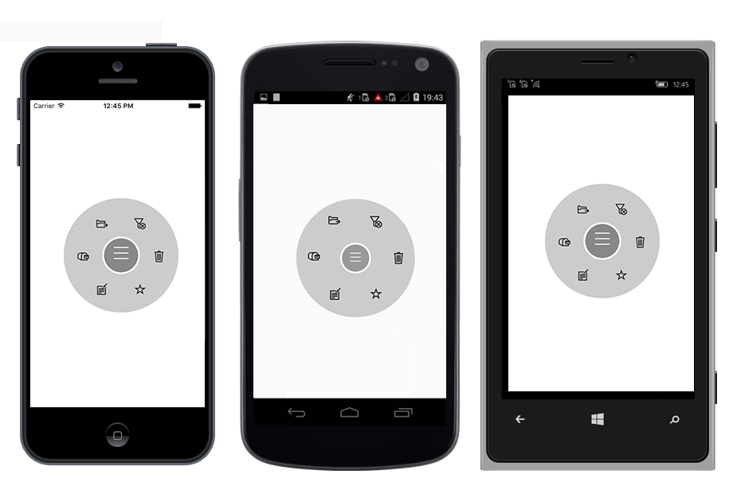
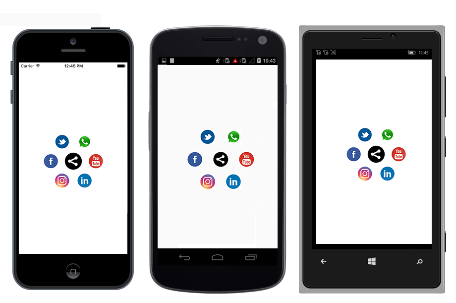
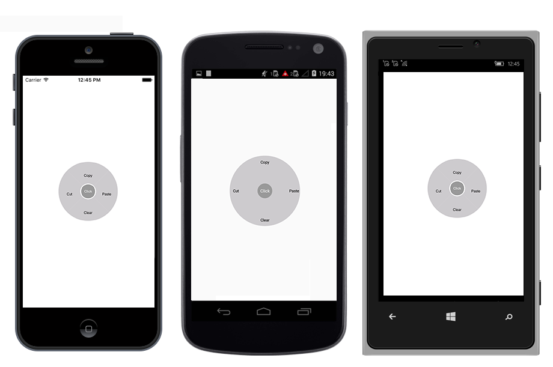
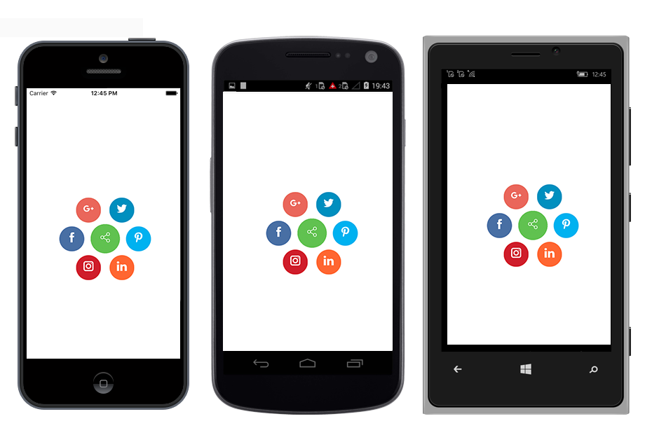
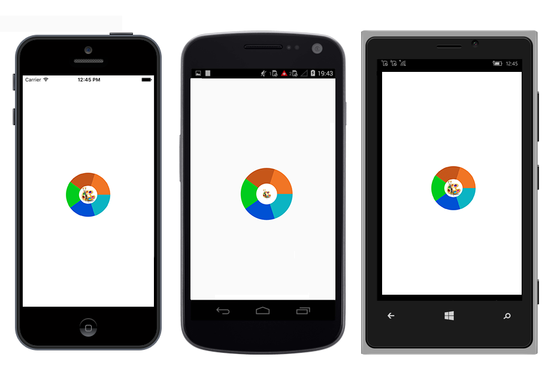

# Dealing with SfRadialMenuItems

`SfRadialMenuItem` class provides various options to customize the items by giving `Custom views`, `FontIcons` and `Images`. And it is possible to add RadialMenu items hierarchically. To add a SfRadialMenuItem with SfRadialMenu, first we have to create an instance for SfRadialMenuItem and add that instance to `Items` property which is available in SfRadialMenu.

## Add Icon through FontIcon

Icon fonts are just fonts. However, instead of containing letters or numbers, they contain symbols and glyphs. Icons fonts are reduces the stretch issues and aspect ratios. Here we have created icons using `Metro studio`.





<?xml version="1.0" encoding="UTF-8"?>
<ContentPage xmlns="http://xamarin.com/schemas/2014/forms" BackgroundColor="White"
 xmlns:x="http://schemas.microsoft.com/winfx/2009/xaml" x:Class="RadialMenuGettingStarted.RadialMenuPage"
 xmlns:radialMenu="clr-namespace:Syncfusion.SfRadialMenu.XForms;assembly=Syncfusion.SfRadialMenu.XForms">
    
<ContentPage.Content>
           <radialMenu:SfRadialMenu x:Name="radial_Menu" CenterButtonText="H" CenterButtonFontFamily="navigation.ttf" CenterButtonRadius="30" RimColor="#FFCDCBCE" RimRadius="100" CenterButtonFontSize="26" CenterButtonTextColor="White"
			CenterButtonBackgroundColor="#FF898889" CenterButtonBorderColor="White" CenterButtonBorderThickness="3">
			<radialMenu:SfRadialMenu.Items>
				<radialMenu:SfRadialMenuItem FontIconText="I" IconFontFamily="navigation.ttf" TextColor="White" FontAttributes="None" IconFontSize="20" ItemHeight="40" ItemWidth="30">
				</radialMenu:SfRadialMenuItem>
				<radialMenu:SfRadialMenuItem FontIconText="G" IconFontFamily="navigation.ttf" TextColor="White" FontAttributes="None" IconFontSize="20" ItemHeight="40" ItemWidth="30">
				</radialMenu:SfRadialMenuItem>
				<radialMenu:SfRadialMenuItem FontIconText="S" IconFontFamily="navigation.ttf" TextColor="White" FontAttributes="None" IconFontSize="20" ItemHeight="40" ItemWidth="30">
				</radialMenu:SfRadialMenuItem>
				<radialMenu:SfRadialMenuItem FontIconText="T" IconFontFamily="navigation.ttf" TextColor="White" FontAttributes="None" IconFontSize="20" ItemHeight="40" ItemWidth="30">
				</radialMenu:SfRadialMenuItem>
				<radialMenu:SfRadialMenuItem FontIconText="R" IconFontFamily="navigation.ttf" TextColor="White" FontAttributes="None" IconFontSize="20" ItemHeight="40" ItemWidth="30">
				</radialMenu:SfRadialMenuItem>
				<radialMenu:SfRadialMenuItem FontIconText="D" IconFontFamily="navigation.ttf" TextColor="White" FontAttributes="None" IconFontSize="20" ItemHeight="40" ItemWidth="30">
				</radialMenu:SfRadialMenuItem>
			</radialMenu:SfRadialMenu.Items>
		</radialMenu:SfRadialMenu>
    </ContentPage.Content>
</ContentPage> 





using Syncfusion.XForms.SfRadialMenu;
using Xamarin.Forms;

public class App : Application
    {
        public App()
        {
            MainPage = new RadialMenuPage ();
        }

    }
Public class RadialMenuPage : ContentPage
{
	public RadialMenuPage ()
	{
        InitializeComponent();
		//Creating instance for RadialMenu
			SfRadialMenu radialMenu = new SfRadialMenu();

			//Initializing RadialMenu's properties
			radialMenu.CenterButtonText = "H";
			radialMenu.CenterButtonFontFamily = "navigation.ttf";
			radialMenu.CenterButtonRadius = 26;
			radialMenu.CenterButtonBorderColor = Color.White;

			//Adding Main menu Items

			string[] icons = new string[] { "I", "G", "S", "T", "R", "D" };

			for (int i = 0; i < 6; i++)
			{
				SfRadialMenuItem mainMenuItems = new SfRadialMenuItem();
				mainMenuItems.IconFontSize = 20;
				mainMenuItems.FontIconText = icons[i];
				mainMenuItems.ItemHeight = 30;
				mainMenuItems.ItemWidth = 40;
				mainMenuItems.TextColor = Color.White;
				mainMenuItems.IconFontFamily = "navigation.ttf";
				radialMenu.Items.Add(mainMenuItems);
			}

			this.Content = radialMenu;
	}
}



N> To use FontIcons, add respective FontFamily name in `info.plist` file under Fonts provided by application category.Here `navigation.ttf` is generated by using `Metro Studio`.

## Add Icon through Image

SfRadialMenuItem allows us to set direct image for icons. And this can be achieved by using the `Image` property available in SfRadialMenuItem.





<?xml version="1.0" encoding="UTF-8"?>
<ContentPage xmlns="http://xamarin.com/schemas/2014/forms" BackgroundColor="White"
 xmlns:x="http://schemas.microsoft.com/winfx/2009/xaml" x:Class="RadialMenuGettingStarted.RadialMenuPage"
 xmlns:radialMenu="clr-namespace:Syncfusion.SfRadialMenu.XForms;assembly=Syncfusion.SfRadialMenu.XForms">
    
<ContentPage.Content>
          <radialMenu:SfRadialMenu x:Name="radialMenu" CenterButtonRadius="24"  RimColor="Transparent" RimRadius="100" CenterButtonBackgroundColor="Transparent" CenterButtonBorderColor="Transparent" CenterButtonBorderThickness="3">
			<radialMenu:SfRadialMenu.CenterButtonView>
				<Image x:Name="centerButtonImage" HeightRequest="22" WidthRequest="22"  Source="share.jpg" Aspect="AspectFill" />
		</radialMenu:SfRadialMenu.CenterButtonView>
			<radialMenu:SfRadialMenu.Items>
				<radialMenu:SfRadialMenuItem Image="facebook2.png" ItemHeight="40" ItemWidth="30">
				</radialMenu:SfRadialMenuItem>
				<radialMenu:SfRadialMenuItem Image="twitter.png" ItemHeight="40" ItemWidth="30">
				</radialMenu:SfRadialMenuItem>
				<radialMenu:SfRadialMenuItem Image="whatsapp.jpeg" ItemHeight="40" ItemWidth="30">
				</radialMenu:SfRadialMenuItem>
				<radialMenu:SfRadialMenuItem Image="youtube.png" ItemHeight="40" ItemWidth="30">
				</radialMenu:SfRadialMenuItem>
				<radialMenu:SfRadialMenuItem Image="linkedin.png" ItemHeight="40" ItemWidth="30">
				</radialMenu:SfRadialMenuItem>
				<radialMenu:SfRadialMenuItem Image="instagram.jpeg" ItemHeight="40" ItemWidth="30">
				</radialMenu:SfRadialMenuItem>
			</radialMenu:SfRadialMenu.Items>
		</radialMenu:SfRadialMenu>
 </ContentPage.Content>
</ContentPage> 





using Syncfusion.XForms.SfRadialMenu;
using Xamarin.Forms;

public class App : Application
    {
        public App()
        {
            MainPage = new RadialMenuPage ();
        }

    }
Public class RadialMenuPage : ContentPage
{
	public RadialMenuPage ()
	{
		InitializeComponent();
		//Creating instance for RadialMenu
		SfRadialMenu radialMenu = new SfRadialMenu();

		//Initializing RadialMenu's properties
		Image centerImage = new Image();
		centerImage.Source = (FileImageSource)ImageSource.FromFile("share.jpg");
		radialMenu.CenterButtonView = centerImage;
		radialMenu.CenterButtonRadius = 24;
		radialMenu.CenterButtonBorderColor = Color.White;
		radialMenu.RimColor = Color.Transparent;
		radialMenu.SelectionColor = Color.Transparent;
		radialMenu.CenterButtonBackgroundColor = Color.Transparent;

		//Adding Main menu Items

		string[] images = new string[] { "Facebook.png", "twitter.png", "WhatsApp.jpeg", "YouTube.png", "LinkedIn.png", "Instagram.jpeg" };

		for (int i = 0; i < 6; i++)
		{
			SfRadialMenuItem mainMenuItems = new SfRadialMenuItem();
			mainMenuItems.Image = (FileImageSource)ImageSource.FromFile(images[i]);
			mainMenuItems.ItemHeight = 30;
			mainMenuItems.ItemWidth = 40;
			radialMenu.Items.Add(mainMenuItems);
		}

		this.Content = radialMenu;
	}
}



## Add Caption

We can set direct captions to SfRadialMenu items by using `Text` property.





<?xml version="1.0" encoding="UTF-8"?>
<ContentPage xmlns="http://xamarin.com/schemas/2014/forms" BackgroundColor="White"
 xmlns:x="http://schemas.microsoft.com/winfx/2009/xaml" x:Class="RadialMenuGettingStarted.RadialMenuPage"
 xmlns:radialMenu="clr-namespace:Syncfusion.SfRadialMenu.XForms;assembly=Syncfusion.SfRadialMenu.XForms">
    
<ContentPage.Content>
          <radialMenu:SfRadialMenu x:Name="radialMenu" CenterButtonRadius="24" CenterButtonText="Click" CenterButtonFontSize="12" CenterButtonBorderColor="White" CenterButtonBorderThickness="3">
			<radialMenu:SfRadialMenu.Items>
				<radialMenu:SfRadialMenuItem Text="Cut" FontSize="11" ItemHeight="50" ItemWidth="65">
				</radialMenu:SfRadialMenuItem>
				<radialMenu:SfRadialMenuItem Text="Copy" FontSize="11" ItemHeight="50" ItemWidth="65">
				</radialMenu:SfRadialMenuItem>
				<radialMenu:SfRadialMenuItem Text="Paste" FontSize="11" ItemHeight="50" ItemWidth="65">
				</radialMenu:SfRadialMenuItem>
				<radialMenu:SfRadialMenuItem Text="Clear" FontSize="11" ItemHeight="50" ItemWidth="65">
				</radialMenu:SfRadialMenuItem>
			</radialMenu:SfRadialMenu.Items>
		</radialMenu:SfRadialMenu>
 </ContentPage.Content>
</ContentPage> 





using Syncfusion.XForms.SfRadialMenu;
using Xamarin.Forms;

public class App : Application
    {
        public App()
        {
            MainPage = new RadialMenuPage ();
        }

    }
Public class RadialMenuPage : ContentPage
{
	public RadialMenuPage ()
	{
		InitializeComponent();
		SfRadialMenu radialMenu = new SfRadialMenu();

		//Initilizing RadialMenu's properties
		radialMenu.CenterButtonText = "Click";
		radialMenu.CenterButtonFontSize = 12;
		radialMenu.CenterButtonRadius = 24;
		radialMenu.CenterButtonBorderThickness = 3;

		//Adding Main menu Items

		string[] text = new string[] { "Cut", "Copy", "Paste", "Clear"};

		for (int i = 0; i < 4; i++)
		{
			SfRadialMenuItem mainMenuItems = new SfRadialMenuItem();
			mainMenuItems.Text = text[i];
			mainMenuItems.FontSize = 11;
			mainMenuItems.ItemHeight = 50;
			mainMenuItems.ItemWidth = 65;
			radialMenu.Items.Add(mainMenuItems);
		}

		this.Content = radialMenu;
	}
}



## Add any view

SfRadialMenuItem allows us to add any custom view to the item. By using the `View` property we can achieve this.





<?xml version="1.0" encoding="UTF-8"?>
<ContentPage xmlns="http://xamarin.com/schemas/2014/forms" BackgroundColor="White"
 xmlns:x="http://schemas.microsoft.com/winfx/2009/xaml" x:Class="RadialMenuGettingStarted.RadialMenuPage"
 xmlns:radialMenu="clr-namespace:Syncfusion.SfRadialMenu.XForms;assembly=Syncfusion.SfRadialMenu.XForms">
    
<ContentPage.Content>
        <radialMenu:SfRadialMenu x:Name="radialMenu" CenterButtonRadius="30" RimColor="Transparent" RimRadius="100" CenterButtonBackgroundColor="Transparent" CenterButtonBorderColor="Transparent" CenterButtonBorderThickness="3">
			<radialMenu:SfRadialMenu.CenterButtonView>
				<Grid HeightRequest="40" WidthRequest="40">
					<Image Source="green.png" />
					<Label Text="&#xe703;" x:Name="share" FontSize="20" HeightRequest="30" WidthRequest="30" XAlign="Center" YAlign="Center" TextColor="White" HorizontalOptions="Center" VerticalOptions="Center"
						HorizontalTextAlignment="Center" VerticalTextAlignment="Center">
						<Label.FontFamily>
							<OnPlatform x:TypeArguments="x:String" iOS="Social" Android="socialicons.ttf#socialicons" />
						</Label.FontFamily>
					</Label>
				</Grid>
			</radialMenu:SfRadialMenu.CenterButtonView>
			<radialMenu:SfRadialMenu.Items>
				<radialMenu:SfRadialMenuItem ItemHeight="50" ItemWidth="50">
					<radialMenu:SfRadialMenuItem.View>
						<Grid HeightRequest="40" WidthRequest="40">
							<Image Source="blue.png" />
							<Label Text="&#xe700;" x:Name="facebook" FontSize="20" HeightRequest="30" WidthRequest="30" XAlign="Center" YAlign="Center" TextColor="White" HorizontalOptions="Center" VerticalOptions="Center"
								HorizontalTextAlignment="Center" VerticalTextAlignment="Center">
								<Label.FontFamily>
									<OnPlatform x:TypeArguments="x:String" iOS="Social" Android="socialicons.ttf#socialicons" />
								</Label.FontFamily>
							</Label>
						</Grid>
					</radialMenu:SfRadialMenuItem.View>
				</radialMenu:SfRadialMenuItem>
				<radialMenu:SfRadialMenuItem ItemHeight="50" ItemWidth="50">
					<radialMenu:SfRadialMenuItem.View>
						<Grid HeightRequest="40" WidthRequest="40">
							<Image Source="red.png" />
							<Label Text="&#xe707;" x:Name="google" FontSize="20" HeightRequest="30" WidthRequest="30" XAlign="Center" YAlign="Center" TextColor="White" HorizontalOptions="Center" VerticalOptions="Center"
								HorizontalTextAlignment="Center" VerticalTextAlignment="Center">
								<Label.FontFamily>
									<OnPlatform x:TypeArguments="x:String" iOS="Social" Android="socialicons.ttf#socialicons" />
								</Label.FontFamily>
							</Label>
						</Grid>
					</radialMenu:SfRadialMenuItem.View>
				</radialMenu:SfRadialMenuItem>
				<radialMenu:SfRadialMenuItem ItemHeight="50" ItemWidth="50">
					<radialMenu:SfRadialMenuItem.View>
						<Grid HeightRequest="40" WidthRequest="40">
							<Image Source="lightblue.png" />
							<Label Text="&#xe704;" x:Name="twitter" FontSize="20" HeightRequest="30" WidthRequest="30" XAlign="Center" YAlign="Center" TextColor="White" HorizontalOptions="Center" VerticalOptions="Center"
								HorizontalTextAlignment="Center" VerticalTextAlignment="Center">
								<Label.FontFamily>
									<OnPlatform x:TypeArguments="x:String" iOS="Social" Android="socialicons.ttf#socialicons" />
								</Label.FontFamily>
							</Label>
						</Grid>
					</radialMenu:SfRadialMenuItem.View>
				</radialMenu:SfRadialMenuItem>
				<radialMenu:SfRadialMenuItem ItemHeight="50" ItemWidth="50">
					<radialMenu:SfRadialMenuItem.View>
						<Grid HeightRequest="40" WidthRequest="40">
							<Image Source="skyblue.png" />
							<Label Text="&#xe705;" x:Name="linkedin" FontSize="20" HeightRequest="30" WidthRequest="30" XAlign="Center" YAlign="Center" TextColor="White" HorizontalOptions="Center" VerticalOptions="Center"
								HorizontalTextAlignment="Center" VerticalTextAlignment="Center">
								<Label.FontFamily>
									<OnPlatform x:TypeArguments="x:String" iOS="Social" Android="socialicons.ttf#socialicons" />
								</Label.FontFamily>
							</Label>
						</Grid>
					</radialMenu:SfRadialMenuItem.View>
				</radialMenu:SfRadialMenuItem>
				<radialMenu:SfRadialMenuItem ItemHeight="50" ItemWidth="50">
					<radialMenu:SfRadialMenuItem.View>
						<Grid HeightRequest="40" WidthRequest="40">
							<Image Source="orange.png" />
							<Label Text="&#xe706;" x:Name="instagram" FontSize="20" HeightRequest="30" WidthRequest="30" XAlign="Center" YAlign="Center" TextColor="White" HorizontalOptions="Center" VerticalOptions="Center"
								HorizontalTextAlignment="Center" VerticalTextAlignment="Center">
								<Label.FontFamily>
									<OnPlatform x:TypeArguments="x:String" iOS="Social" Android="socialicons.ttf#socialicons" />
								</Label.FontFamily>
							</Label>
						</Grid>
					</radialMenu:SfRadialMenuItem.View>
				</radialMenu:SfRadialMenuItem>
				<radialMenu:SfRadialMenuItem ItemHeight="50" ItemWidth="50">
					<radialMenu:SfRadialMenuItem.View>
						<Grid HeightRequest="40" WidthRequest="40">
							<Image Source="maroon.png" />
							<Label Text="&#xe708;" x:Name="pinterest" FontSize="20" HeightRequest="30" WidthRequest="30" XAlign="Center" YAlign="Center" TextColor="White" HorizontalOptions="Center" VerticalOptions="Center"
								HorizontalTextAlignment="Center" VerticalTextAlignment="Center">
								<Label.FontFamily>
									<OnPlatform x:TypeArguments="x:String" iOS="Social" Android="socialicons.ttf#socialicons" />
								</Label.FontFamily>
							</Label>
						</Grid>
					</radialMenu:SfRadialMenuItem.View>
				</radialMenu:SfRadialMenuItem>
			</radialMenu:SfRadialMenu.Items>
		</radialMenu:SfRadialMenu>
 </ContentPage.Content>
</ContentPage> 





using Syncfusion.XForms.SfRadialMenu;
using Xamarin.Forms;

public class App : Application
    {
        public App()
        {
            MainPage = new RadialMenuPage ();
        }

    }
Public class RadialMenuPage : ContentPage
{
	public RadialMenuPage ()
	{
	        InitializeComponent();
			//Creating instance for RadialMenu
			SfRadialMenu radialMenu = new SfRadialMenu();

			//Creating CustomView
			Grid customView = new Grid();
			Label textLabel = new Label();
			textLabel.Text = "\ue703";
			textLabel.TextColor = Color.White;
			if (Device.OS == TargetPlatform.iOS)
				textLabel.FontFamily = "Social";
			else
				textLabel.FontFamily = "social_icons.ttf#social_icons";
			textLabel.FontSize = 20;
			textLabel.HorizontalTextAlignment = TextAlignment.Center;
			textLabel.VerticalTextAlignment = TextAlignment.Center;
			textLabel.HeightRequest = 30;
			textLabel.WidthRequest = 30;
			Image backgroundImage = new Image();
			backgroundImage.Source = (FileImageSource)ImageSource.FromFile("green.png");
			customView.Children.Add(backgroundImage);
			customView.Children.Add(textLabel);

			radialMenu.CenterButtonView = customView;
			radialMenu.CenterButtonRadius = 24;
			radialMenu.CenterButtonBorderColor = Color.White;
			radialMenu.RimColor = Color.Transparent;
			radialMenu.SelectionColor = Color.Transparent;
			radialMenu.CenterButtonBackgroundColor = Color.Transparent;

			//Adding Main menu Items

			string[] text = new string[] { "\ue700", "\ue707", "\ue704", "\ue705", "\ue706", "\ue708" };
			string[] Image = new string[] { "blue.png", "red.png", "light_blue.png", "skyblue.png", "orange.png", "maroon.png" };
			for (int i = 0; i < 6; i++)
			{
				SfRadialMenuItem mainMenuItems = new SfRadialMenuItem();

				Grid itemCustomView = new Grid();
				Label itemCustomLabel = new Label();
				itemCustomLabel.Text = text[i];
				itemCustomLabel.TextColor = Color.White;
				if (Device.OS == TargetPlatform.iOS)
					itemCustomLabel.FontFamily = "Social";
				else
					itemCustomLabel.FontFamily = "social_icons.ttf#social_icons";
				itemCustomLabel.FontSize = 20;
				itemCustomLabel.HorizontalTextAlignment = TextAlignment.Center;
				itemCustomLabel.VerticalTextAlignment = TextAlignment.Center;
				itemCustomLabel.HeightRequest = 30;
				itemCustomLabel.WidthRequest = 30;
				Image itemBackgroundImage = new Image();
				itemBackgroundImage.Source = (FileImageSource)ImageSource.FromFile(Image[i]);
				itemCustomView.Children.Add(itemBackgroundImage);
				itemCustomView.Children.Add(itemCustomLabel);

				mainMenuItems.View = itemCustomView;
				mainMenuItems.ItemWidth = 50;
				mainMenuItems.ItemHeight = 50;
				radialMenu.Items.Add(mainMenuItems);
			}

			this.Content = radialMenu;
		
	}
}



## Performing an action with RadialMenuItem

The `ItemTapped` event will be fired whenever we tap the items present in the RadialMenu. We can add ItemTapped event to only necessary items.





<?xml version="1.0" encoding="UTF-8"?>
<ContentPage xmlns="http://xamarin.com/schemas/2014/forms" BackgroundColor="White"
 xmlns:x="http://schemas.microsoft.com/winfx/2009/xaml" x:Class="RadialMenuGettingStarted.RadialMenuPage"
 xmlns:radialMenu="clr-namespace:Syncfusion.SfRadialMenu.XForms;assembly=Syncfusion.SfRadialMenu.XForms">
    
<ContentPage.Content>
          <Grid BackgroundColor="White" x:Name="grid" >
			<radialMenu:SfRadialMenu x:Name="radialMenu" CenterButtonRadius="30" RimColor="Transparent" RimRadius="75" CenterButtonBackgroundColor="Transparent" CenterButtonBorderColor="Transparent" CenterButtonBorderThickness="5">
				<radialMenu:SfRadialMenu.CenterButtonView>
					<Image x:Name="centerButtonImage" HeightRequest="22" WidthRequest="22" Source="colorPlate.jpg" Aspect="AspectFill" />
				</radialMenu:SfRadialMenu.CenterButtonView>
				<radialMenu:SfRadialMenu.Items>
					<radialMenu:SfRadialMenuItem ItemTapped="Handle_ItemTapped" BackgroundColor="#00cc1d" />
					<radialMenu:SfRadialMenuItem ItemTapped="Handle_ItemTapped" BackgroundColor="#c65619" />
					<radialMenu:SfRadialMenuItem ItemTapped="Handle_ItemTapped" BackgroundColor="#F17525" />
					<radialMenu:SfRadialMenuItem ItemTapped="Handle_ItemTapped" BackgroundColor="#0bb4c3" />
					<radialMenu:SfRadialMenuItem ItemTapped="Handle_ItemTapped" BackgroundColor="#0051d4" />
				</radialMenu:SfRadialMenu.Items>
			</radialMenu:SfRadialMenu>
		</Grid>
 </ContentPage.Content>
</ContentPage> 





using Syncfusion.XForms.SfRadialMenu;
using Xamarin.Forms;

public class App : Application
    {
        public App()
        {
            MainPage = new RadialMenuPage ();
        }

    }
Public class RadialMenuPage : ContentPage
{
    Grid grid;
	public RadialMenuPage ()
	{
		InitializeComponent();
		//Creating instance for RadialMenu
		SfRadialMenu radialMenu = new SfRadialMenu();

		//Initializing RadialMenu's properties
		Image centerImage = new Image();
		centerImage.Source = (FileImageSource)ImageSource.FromFile("colorPlate.jpg");
		radialMenu.CenterButtonView = centerImage;
		radialMenu.CenterButtonRadius = 30;
		radialMenu.RimRadius = 75;
		radialMenu.CenterButtonBorderThickness = 5;
		radialMenu.CenterButtonBorderColor = Color.White;
		radialMenu.RimColor = Color.Transparent;
		radialMenu.SelectionColor = Color.Transparent;
		radialMenu.CenterButtonBackgroundColor = Color.Transparent;

		string[] backgroundColors = new string[] { "#00cc1d", "#c65619", "#F17525", "#0bb4c3", "#0051d4" };

		for (int i = 0; i < 5; i++)
		{
			SfRadialMenuItem mainMenuItems = new SfRadialMenuItem();
			mainMenuItems.BackgroundColor = Color.FromHex(backgroundColors[i]);
			radialMenu.Items.Add(mainMenuItems);
		}
		grid = new Grid();
		grid.Children.Add(radialMenu);
		this.Content = grid;
	}
}




void Handle_ItemTapped(object sender, Syncfusion.SfRadialMenu.XForms.ItemTappedEventArgs e)
		{
			Syncfusion.SfRadialMenu.XForms.SfRadialMenuItem item = sender as Syncfusion.SfRadialMenu.XForms.SfRadialMenuItem;
			radialMenu.Close();
			grid.BackgroundColor = item.BackgroundColor;
		}


