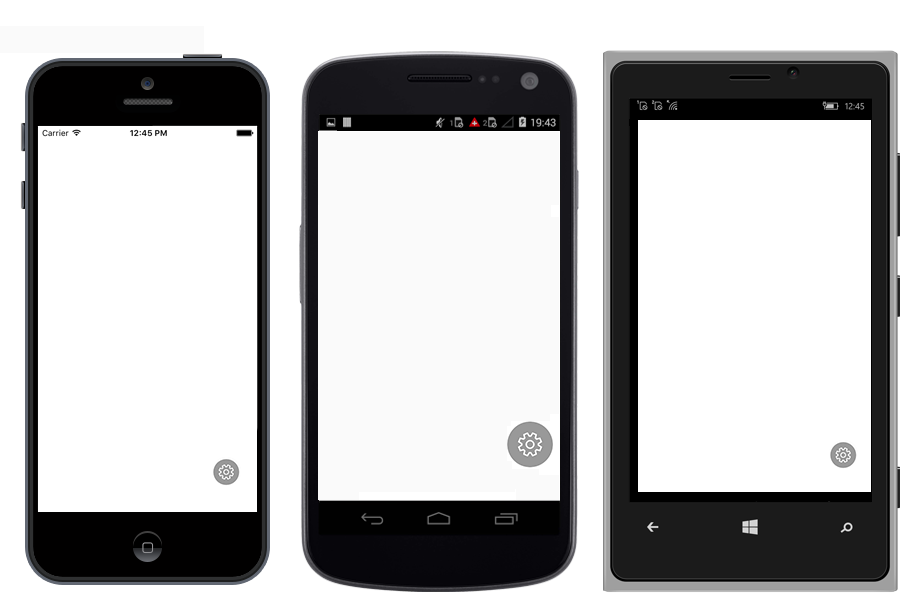

# Placing and Dragging RadialMenu

You can place radial menu anywhere on its parent layout, and drag it with in the parent layout. 

## Dragging RadialMenu

You can enable/disable dragging by using the `IsDragEnabled` property.





<?xml version="1.0" encoding="UTF-8"?>
<ContentPage xmlns="http://xamarin.com/schemas/2014/forms" BackgroundColor="White"
 xmlns:x="http://schemas.microsoft.com/winfx/2009/xaml" x:Class="RadialMenuGettingStarted.RadialMenuPage"
 xmlns:radialMenu="clr-namespace:Syncfusion.SfRadialMenu.XForms;assembly=Syncfusion.SfRadialMenu.XForms">
    
<ContentPage.Content>
		<radialMenu:SfRadialMenu x:Name="radialMenu" IsDragEnabled="true" CenterButtonText=""  CenterButtonBackText="" CenterButtonFontFamily="Segoe MDL2 Assets.ttf" CenterButtonBackFontFamily="Segoe MDL2 Assets.ttf" CenterButtonRadius="30" RimColor="#FFCDCBCE" RimRadius="100" CenterButtonFontSize="26" CenterButtonTextColor="White"
			CenterButtonBackgroundColor="#FF898889" CenterButtonBorderColor="White" CenterButtonBorderThickness="3">
		</radialMenu:SfRadialMenu>
	</ContentPage.Content>
</ContentPage> 





using Syncfusion.XForms.SfRadialMenu;
using Xamarin.Forms;

public class App : Application
    {
        public App()
        {
            MainPage = new RadialMenuPage ();
        }

    }
Public class RadialMenuPage : ContentPage
{
   
	public RadialMenuPage ()
	{
		InitializeComponent();
		//Creating instance for RadialMenu
		SfRadialMenu radialMenu = new SfRadialMenu();

		//Initializing RadialMenu's properties
		radialMenu.CenterButtonText = "\uE713";
		radialMenu.CenterButtonFontFamily = "Segoe MDL2 Assets.ttf";
		radialMenu.CenterButtonBackFontFamily = "Segoe MDL2 Assets.ttf";
		radialMenu.CenterButtonRadius = 32;
		radialMenu.CenterButtonBorderColor = Color.White;
		radialMenu.IsDragEnabled = true;

		this.Content = radialMenu;
	}
}



## DragEvents

SfRadialMenu provides for event for DragBegin and DragEnd in which the event get hooked when the RadialMenu is get dragged.

### DragBegin event

This event get triggered when RadialMenu is start to drag with `DragBeginEventArgs`.

* `Position` - Gets the Start position of the RadialMenu

* `Handled` - Gets and Sets the boolean value for enabling and disabling the dragging of RadialMenu.

To hook the `DragBegin` event, and to get the start position and restricts the dragging, follow the code example:





<?xml version="1.0" encoding="UTF-8"?>
<ContentPage xmlns="http://xamarin.com/schemas/2014/forms" BackgroundColor="White"
 xmlns:x="http://schemas.microsoft.com/winfx/2009/xaml" x:Class="RadialMenuGettingStarted.RadialMenuPage"
 xmlns:radialMenu="clr-namespace:Syncfusion.SfRadialMenu.XForms;assembly=Syncfusion.SfRadialMenu.XForms">
    
<ContentPage.Content>
		<radialMenu:SfRadialMenu x:Name="radialMenu" CenterButtonText=""  CenterButtonBackText="" CenterButtonFontFamily="Segoe MDL2 Assets.ttf" CenterButtonBackFontFamily="Segoe MDL2 Assets.ttf" CenterButtonRadius="30" RimColor="#FFCDCBCE" DragBegin="Handle_DragBegin" RimRadius="100" CenterButtonFontSize="26" CenterButtonTextColor="White"
			CenterButtonBackgroundColor="#FF898889" CenterButtonBorderColor="White" CenterButtonBorderThickness="3">
		</radialMenu:SfRadialMenu>
	</ContentPage.Content>
</ContentPage> 





using Syncfusion.XForms.SfRadialMenu;
using Xamarin.Forms;

public class App : Application
    {
        public App()
        {
            MainPage = new RadialMenuPage ();
        }

    }
Public class RadialMenuPage : ContentPage
{
   
	public RadialMenuPage ()
	{
		InitializeComponent();
		//Creating instance for RadialMenu
		SfRadialMenu radialMenu = new SfRadialMenu();

		//Initializing RadialMenu's properties
		radialMenu.CenterButtonText = "\uE713";
		radialMenu.CenterButtonFontFamily = "Segoe MDL2 Assets.ttf";
		radialMenu.CenterButtonBackFontFamily = "Segoe MDL2 Assets.ttf";
		radialMenu.CenterButtonRadius = 32;
		radialMenu.CenterButtonBorderColor = Color.White;
		
        void Handle_DragBegin(object sender, Syncfusion.SfRadialMenu.XForms.DragBeginEventArgs e)
        {
            e.Handled = true;
        }
		this.Content = radialMenu;
	}
}



### Drag End

This event get triggered when dragging is ended in RadialMenu with `DragEndEventArgs`.

* `OldValue` - Gets the Start position of the RadialMenu

* `OldValue` - Gets the ens position of the RadialMenu

* `Handled` - Gets and Sets the boolean value for restricting the RadialMenu to move another position.

To hook the `DragEnd` event, and to get the start position, end position and restricts the movement of the RadialMenu, follow the code example:





<?xml version="1.0" encoding="UTF-8"?>
<ContentPage xmlns="http://xamarin.com/schemas/2014/forms" BackgroundColor="White"
 xmlns:x="http://schemas.microsoft.com/winfx/2009/xaml" x:Class="RadialMenuGettingStarted.RadialMenuPage"
 xmlns:radialMenu="clr-namespace:Syncfusion.SfRadialMenu.XForms;assembly=Syncfusion.SfRadialMenu.XForms">
    
<ContentPage.Content>
		<radialMenu:SfRadialMenu x:Name="radialMenu" CenterButtonText=""  CenterButtonBackText="" CenterButtonFontFamily="Segoe MDL2 Assets.ttf" CenterButtonBackFontFamily="Segoe MDL2 Assets.ttf" CenterButtonRadius="30" RimColor="#FFCDCBCE"  DragEnd="Handle_DragEnd" RimRadius="100" CenterButtonFontSize="26" CenterButtonTextColor="White"
			CenterButtonBackgroundColor="#FF898889" CenterButtonBorderColor="White" CenterButtonBorderThickness="3">
		</radialMenu:SfRadialMenu>
	</ContentPage.Content>
</ContentPage> 





using Syncfusion.XForms.SfRadialMenu;
using Xamarin.Forms;

public class App : Application
    {
        public App()
        {
            MainPage = new RadialMenuPage ();
        }

    }
Public class RadialMenuPage : ContentPage
{
   
	public RadialMenuPage ()
	{
		InitializeComponent();
		//Creating instance for RadialMenu
		SfRadialMenu radialMenu = new SfRadialMenu();

		//Initializing RadialMenu's properties
		radialMenu.CenterButtonText = "\uE713";
		radialMenu.CenterButtonFontFamily = "Segoe MDL2 Assets.ttf";
		radialMenu.CenterButtonBackFontFamily = "Segoe MDL2 Assets.ttf";
		radialMenu.CenterButtonRadius = 32;
		radialMenu.CenterButtonBorderColor = Color.White;

        void Handle_DragEnd(object sender, Syncfusion.SfRadialMenu.XForms.DragEndEventArgs e)
        {
            e.Handled = true;
        }
		this.Content = radialMenu;
	}
}



## RadialMenu Placement

We can place the SfRadialMenu in the position based on their CenterButton axis. For this we have provided the enum property `CenterButtonPlacement` with TopLeft and Center position.

`TopLeft` - the origin (0,0) of SfRadialMenu will be placed at the top left side 

`Center`  - the origin (0,0) of SfRadialMenu will be placed at the center

N> Default `CenterButtonPlacement` property value is Center.





<?xml version="1.0" encoding="UTF-8"?>
<ContentPage xmlns="http://xamarin.com/schemas/2014/forms" BackgroundColor="White"
 xmlns:x="http://schemas.microsoft.com/winfx/2009/xaml" x:Class="RadialMenuGettingStarted.RadialMenuPage"
 xmlns:radialMenu="clr-namespace:Syncfusion.SfRadialMenu.XForms;assembly=Syncfusion.SfRadialMenu.XForms">
    
<ContentPage.Content>
		<radialMenu:SfRadialMenu x:Name="radialMenu" CenterButtonPlacement="TopLeft" CenterButtonText=""  CenterButtonBackText="" CenterButtonFontFamily="Segoe MDL2 Assets.ttf" CenterButtonBackFontFamily="Segoe MDL2 Assets.ttf" CenterButtonRadius="30" RimColor="#FFCDCBCE" RimRadius="100" CenterButtonFontSize="26" CenterButtonTextColor="White"
			CenterButtonBackgroundColor="#FF898889" CenterButtonBorderColor="White" CenterButtonBorderThickness="3">
		</radialMenu:SfRadialMenu>
	</ContentPage.Content>
</ContentPage> 





using Syncfusion.XForms.SfRadialMenu;
using Xamarin.Forms;

public class App : Application
    {
        public App()
        {
            MainPage = new RadialMenuPage ();
        }

    }
Public class RadialMenuPage : ContentPage
{
   
	public RadialMenuPage ()
	{
		InitializeComponent();
		//Creating instance for RadialMenu
		SfRadialMenu radialMenu = new SfRadialMenu();

		//Initializing RadialMenu's properties
		radialMenu.CenterButtonText = "\uE713";
		radialMenu.CenterButtonFontFamily = "Segoe MDL2 Assets.ttf";
		radialMenu.CenterButtonBackFontFamily = "Segoe MDL2 Assets.ttf";
		radialMenu.CenterButtonRadius = 32;
		radialMenu.CenterButtonBorderColor = Color.White;
		radialMenu.CenterButtonPlacement = SfRadialMenuCenterButtonPlacement.TopLeft;

		this.Content = radialMenu;
	}
}



## Placing RadialMenu

You can place radial menu anywhere on its parent layout. Radial Menu's position is calculated based on parent layout's center point.





<?xml version="1.0" encoding="UTF-8"?>
<ContentPage xmlns="http://xamarin.com/schemas/2014/forms" BackgroundColor="White"
 xmlns:x="http://schemas.microsoft.com/winfx/2009/xaml" x:Class="RadialMenuGettingStarted.RadialMenuPage"
 xmlns:radialMenu="clr-namespace:Syncfusion.SfRadialMenu.XForms;assembly=Syncfusion.SfRadialMenu.XForms">
    
<ContentPage.Content>
		<radialMenu:SfRadialMenu x:Name="radialMenu" IsDragEnabled="true" CenterButtonText="" Point="140,250" CenterButtonBackText="" CenterButtonFontFamily="Segoe MDL2 Assets.ttf" CenterButtonBackFontFamily="Segoe MDL2 Assets.ttf" CenterButtonRadius="30" RimColor="#FFCDCBCE" RimRadius="100" CenterButtonFontSize="26" CenterButtonTextColor="White"
			CenterButtonBackgroundColor="#FF898889" CenterButtonBorderColor="White" CenterButtonBorderThickness="3">
		</radialMenu:SfRadialMenu>
	</ContentPage.Content>
</ContentPage> 





using Syncfusion.XForms.SfRadialMenu;
using Xamarin.Forms;

public class App : Application
    {
        public App()
        {
            MainPage = new RadialMenuPage ();
        }

    }
Public class RadialMenuPage : ContentPage
{
   
	public RadialMenuPage ()
	{
		InitializeComponent();
		//Creating instance for RadialMenu
		SfRadialMenu radialMenu = new SfRadialMenu();

		//Initializing RadialMenu's properties
		radialMenu.CenterButtonText = "\uE713";
		radialMenu.CenterButtonFontFamily = "Segoe MDL2 Assets.ttf";
		radialMenu.CenterButtonBackFontFamily = "Segoe MDL2 Assets.ttf";
		radialMenu.CenterButtonRadius = 32;
		radialMenu.CenterButtonBorderColor = Color.White;
		radialMenu.IsDragEnabled = true;
        radialMenu.Point = new Point(140, 250);

		this.Content = radialMenu;
	}
}



