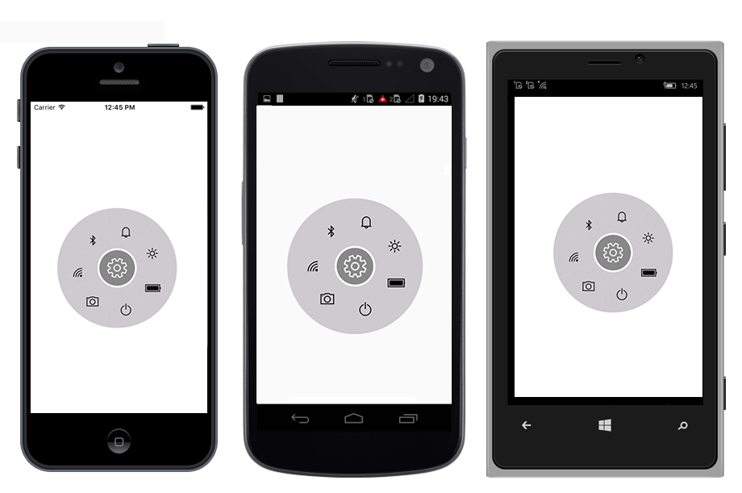
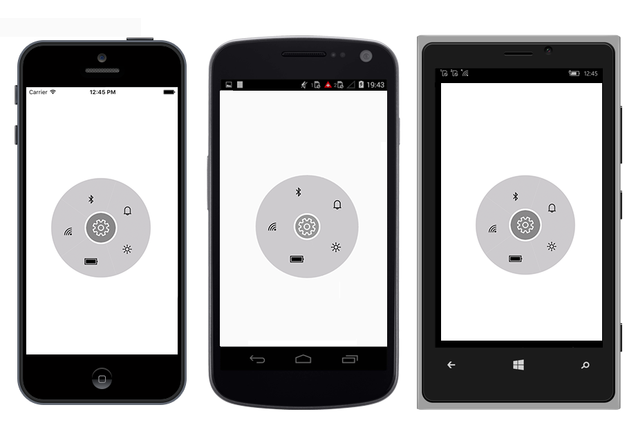
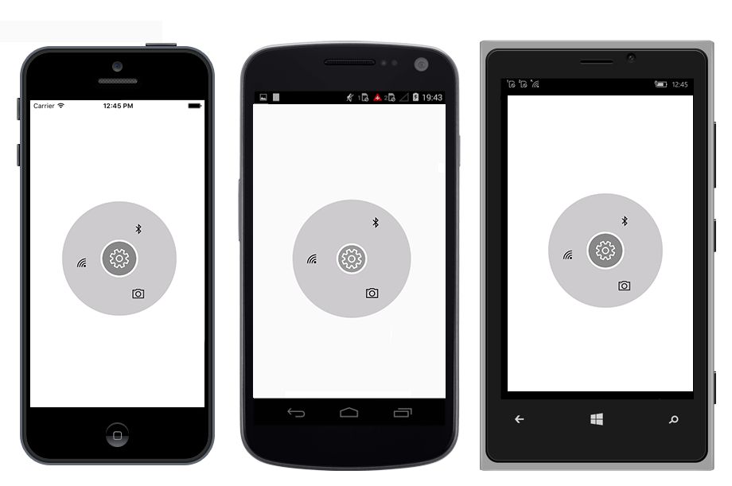

# Layout Types

There are two different layout types available for SfRadialMenu.

* Default
* Custom

Both the layout types divide the available space equally among all the children in the circular panel.

## Default

Number of segments in the panel is determined by children count in the level. Hence segment count in each hierarchical level differs. RadialMenuItem is arranged in the sequential order as added in the RadialMenu.

## Custom

Number of segments in the panel is determined by `VisibleSegmentsCount` property. Hence segment count in all the hierarchical levels are same. RadialMenuItem is arranged in any order based on the `SegmentIndex` property.

### VisibleSegmentsCount

`VisibleSegmentsCount` property is used to specify the number of segments available in circular panel. When children count is greater than the value given in VisibleSegmentsCount property then overflowing children are not arranged in the panel. When children count is lesser than VisibleSegmentsCount property then remaining segments are left free.

If Number of item count is higher than VisibleItemCount means excessive items will not be shown.




<?xml version="1.0" encoding="UTF-8"?>
<ContentPage xmlns="http://xamarin.com/schemas/2014/forms" BackgroundColor="White"
 xmlns:x="http://schemas.microsoft.com/winfx/2009/xaml" x:Class="RadialMenuGettingStarted.RadialMenuPage"
 xmlns:radialMenu="clr-namespace:Syncfusion.SfRadialMenu.XForms;assembly=Syncfusion.SfRadialMenu.XForms">
<ContentPage.Content>
		<radialMenu:SfRadialMenu x:Name="radial_Menu" CenterButtonText="" LayoutType="Custom" VisibleSegmentsCount="5"  CenterButtonFontFamily="Segoe MDL2 Assets.ttf" CenterButtonRadius="30" RimColor="#FFCDCBCE" RimRadius="100" CenterButtonFontSize="34" SelectionColor="#FFDDCBFE" CenterButtonTextColor="White"
			CenterButtonBackgroundColor="#FF898889" CenterButtonBorderColor="White" CenterButtonBorderThickness="3">
			<radialMenu:SfRadialMenu.Items>
				<radialMenu:SfRadialMenuItem FontIconText="" TextColor="White" FontAttributes="None" IconFontSize="20" IconFontFamily="Segoe MDL2 Assets.ttf" ItemHeight="40" ItemWidth="30">
				</radialMenu:SfRadialMenuItem>
				<radialMenu:SfRadialMenuItem FontIconText="" TextColor="White" FontAttributes="None" IconFontSize="20" IconFontFamily="Segoe MDL2 Assets.ttf" ItemHeight="40" ItemWidth="30">
				</radialMenu:SfRadialMenuItem>
				<radialMenu:SfRadialMenuItem FontIconText="" TextColor="White" FontAttributes="None" IconFontSize="20" IconFontFamily="Segoe MDL2 Assets.ttf" ItemHeight="40" ItemWidth="30">
				</radialMenu:SfRadialMenuItem>
				<radialMenu:SfRadialMenuItem FontIconText="" TextColor="White" FontAttributes="None" IconFontSize="20" IconFontFamily="Segoe MDL2 Assets.ttf" ItemHeight="40" ItemWidth="30">
				</radialMenu:SfRadialMenuItem>
				<radialMenu:SfRadialMenuItem FontIconText="" TextColor="White" FontAttributes="None" IconFontSize="20" IconFontFamily="Segoe MDL2 Assets.ttf" ItemHeight="40" ItemWidth="30">
				</radialMenu:SfRadialMenuItem>
				<radialMenu:SfRadialMenuItem FontIconText="" TextColor="White" FontAttributes="None" IconFontSize="20" IconFontFamily="Segoe MDL2 Assets.ttf" ItemHeight="40" ItemWidth="30">
				</radialMenu:SfRadialMenuItem>
				<radialMenu:SfRadialMenuItem FontIconText="" TextColor="White" FontAttributes="None" IconFontSize="20" IconFontFamily="Segoe MDL2 Assets.ttf" ItemHeight="40" ItemWidth="30">
				</radialMenu:SfRadialMenuItem>
			</radialMenu:SfRadialMenu.Items>
		</radialMenu:SfRadialMenu>
	</ContentPage.Content>
</ContentPage> 




using Syncfusion.XForms.SfRadialMenu;
using Xamarin.Forms;

public class App : Application
    {
        public App()
        {
            MainPage = new RadialMenuPage ();
        }

    }
Public class RadialMenuPage : ContentPage
{
   
	public RadialMenuPage ()
	{
		InitializeComponent();
			//Creating instance for RadialMenu
			SfRadialMenu radialMenu = new SfRadialMenu();

			//Initializing RadialMenu's properties
			radialMenu.CenterButtonText = "\uE713";
			radialMenu.LayoutType = LayoutType.Custom;
			radialMenu.VisibleSegmentsCount = 5;
			radialMenu.CenterButtonFontFamily = "Segoe MDL2 Assets.ttf";
			radialMenu.CenterButtonRadius = 26;
			radialMenu.CenterButtonBorderColor = Color.White;

			//Adding Mainmenu Items

			string[] menuItems = new string[] { "\uE701", "\uE702", "\uEA8F", "\uE706", "\uEBAA", "\uE7E8","\uE114" };

			for (int i = 0; i < 7; i++)
			{
				SfRadialMenuItem mainMenuItems = new SfRadialMenuItem();
				mainMenuItems.IconFontSize = 20;
				mainMenuItems.FontIconText = menuItems[i];
				mainMenuItems.ItemHeight = 30;
				mainMenuItems.ItemWidth = 40;
				mainMenuItems.TextColor = Color.White;
				mainMenuItems.IconFontFamily = "Segoe MDL2 Assets.ttf";
				radialMenu.Items.Add(mainMenuItems);
			}

			this.Content = radialMenu;
	}
}



### SegmentIndex

`SegmentIndex` property is used to specify the index of the SfRadialMenuItem in circular panel. Based on the index, the RadialMenuItems are inserted in the segment. When SegmentIndex is not specified for a RadialMenuItem then the menu item is arranged in the next available free segment.




<?xml version="1.0" encoding="UTF-8"?>
<ContentPage xmlns="http://xamarin.com/schemas/2014/forms" BackgroundColor="White"
 xmlns:x="http://schemas.microsoft.com/winfx/2009/xaml" x:Class="RadialMenuGettingStarted.RadialMenuPage"
 xmlns:radialMenu="clr-namespace:Syncfusion.SfRadialMenu.XForms;assembly=Syncfusion.SfRadialMenu.XForms">
<ContentPage.Content>
		<radialMenu:SfRadialMenu x:Name="radial_Menu" CenterButtonText="" LayoutType="Custom" VisibleSegmentsCount="12" CenterButtonFontFamily="Segoe MDL2 Assets.ttf" CenterButtonRadius="30" RimColor="#FFCDCBCE" RimRadius="100" CenterButtonFontSize="34" SelectionColor="#FFDDCBFE"
			CenterButtonTextColor="White" CenterButtonBackgroundColor="#FF898889" CenterButtonBorderColor="White" CenterButtonBorderThickness="3">
			<radialMenu:SfRadialMenu.Items>
				<radialMenu:SfRadialMenuItem FontIconText="" TextColor="White" SegmentIndex="0" IconFontSize="20" IconFontFamily="Segoe MDL2 Assets.ttf" ItemHeight="40" ItemWidth="30">
				</radialMenu:SfRadialMenuItem>
				<radialMenu:SfRadialMenuItem FontIconText="" TextColor="White" SegmentIndex="4" IconFontSize="20" IconFontFamily="Segoe MDL2 Assets.ttf" ItemHeight="40" ItemWidth="30">
				</radialMenu:SfRadialMenuItem>
				<radialMenu:SfRadialMenuItem FontIconText="" TextColor="White" SegmentIndex="8" IconFontSize="20" IconFontFamily="Segoe MDL2 Assets.ttf" ItemHeight="40" ItemWidth="30">
				</radialMenu:SfRadialMenuItem>
			</radialMenu:SfRadialMenu.Items>
		</radialMenu:SfRadialMenu>
	</ContentPage.Content>
</ContentPage> 




using Syncfusion.XForms.SfRadialMenu;
using Xamarin.Forms;

public class App : Application
    {
        public App()
        {
            MainPage = new RadialMenuPage ();
        }

    }
Public class RadialMenuPage : ContentPage
{
   
	public RadialMenuPage ()
	{
		InitializeComponent();
			//Creating instance for RadialMenu
			SfRadialMenu radialMenu = new SfRadialMenu();

			//Initializing RadialMenu's properties
			radialMenu.CenterButtonText = "\uE713";
			radialMenu.LayoutType = LayoutType.Custom;
			radialMenu.VisibleSegmentsCount = 12;
			radialMenu.CenterButtonFontFamily = "Segoe MDL2 Assets.ttf";
			radialMenu.CenterButtonRadius = 26;
			radialMenu.CenterButtonBorderColor = Color.White;

			//Adding Mainmenu Items

			string[] menuItems = new string[] { "\uE701", "\uE702","\uE114" };
			int[] index = new int[] { 0, 4, 8 };

			for (int i = 0; i < 3; i++)
			{
				SfRadialMenuItem mainMenuItems = new SfRadialMenuItem();
				mainMenuItems.IconFontSize = 20;
				mainMenuItems.FontIconText = menuItems[i];
				mainMenuItems.ItemHeight = 30;
				mainMenuItems.ItemWidth = 40;
				mainMenuItems.TextColor = Color.White;
				mainMenuItems.IconFontFamily = "Segoe MDL2 Assets.ttf";
				mainMenuItems.SegmentIndex = index[i];
				radialMenu.Items.Add(mainMenuItems);
			}

			this.Content = radialMenu;
	}
}



