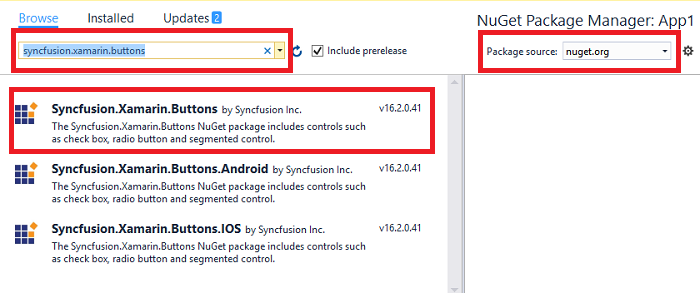
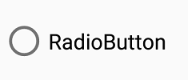
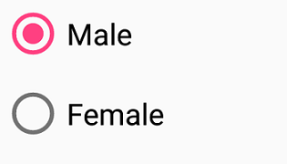

# Getting Started
This section explains the steps required to configure the `SfRadioButton` control in a real-time scenario and provides a walk-through on some of the customization features available in `SfRadioButton` control.

## Add SfRadioButton reference
Syncfusion Xamarin components are available in [nuget.org](https://www.nuget.org/). To add radio button to your project, open the NuGet package manager in Visual Studio, and search for "[syncfusion.xamarin.buttons](https://www.nuget.org/packages/Syncfusion.Xamarin.Buttons)", and then install it. 

 

N>Starting with v16.2.0.x, if you reference Syncfusion assemblies from trial setup or from the NuGet feed, you also have to include a license key in your projects. Please refer to this [link](https://help.syncfusion.com/common/essential-studio/licensing/license-key) to know about registering Syncfusion license key in your Xamarin application to use our components.

After adding the assembly reference, an additional step is required for iOS and UWP projects. 

### Additional step for iOS
To launch `SfRadioButton` in iOS, call the `SfRadioButtonRenderer.Init()` in `FinishedLaunching` overridden method of `AppDelegate` class in iOS Project, as demonstrated in the following code example.



public override bool FinishedLaunching(UIApplication app, NSDictionary options)
{
    global::Xamarin.Forms.Forms.Init();
    LoadApplication(new App());
    SfRadioButtonRenderer.Init();
    return base.FinishedLaunching(app, options);
}



### Additional step for UWP
This step is required only if the application is deployed in Release mode with .NET native tool chain enabled. It is for resolving the known Framework issue “Custom controls not rendering in Release mode” in UWP platform. Initializing the `SfRadioButton` assembly at `OnLaunched` overridden method of the `App` class in UWP project is the suggested work around, as demonstrated in the following code example.



protected override void OnLaunched(LaunchActivatedEventArgs e)
{
    ..... 
    rootFrame.NavigationFailed += OnNavigationFailed;
    // Add `using System.Reflection;` 
    List<Assembly> assembliesToInclude = new List<Assembly>();
    //Now, add all the assemblies that your app uses 
    assembliesToInclude.Add(typeof(SfRadioButtonRenderer).GetTypeInfo().Assembly);
    // replaces Xamarin.Forms.Forms.Init(e);
    Xamarin.Forms.Forms.Init(e, assembliesToInclude);
    ..... 
}



## Create a Simple SfRadioButton
The `SfRadioButton` control is configured entirely in C# code or by using XAML markup. The following steps explain how to create a `SfRadioButton` and configure its elements.

### Add namespace for referred assemblies



xmlns:syncfusion="clr-namespace:Syncfusion.XForms.Buttons;assembly=Syncfusion.Buttons.XForms"


using Syncfusion.XForms.Buttons;



### Refer SfRadioButton control with declared suffix name for Namespace



<?xml version="1.0" encoding="utf-8">
<ContentPage xmlns="http://xamarin.com/schemas/2014/forms"
             xmlns:x="http://schemas.microsoft.com/winfx/2009/xaml"
             xmlns:local="clr-namespace:GettingStarted"
	     xmlns:syncfusion="clr-namespace:Syncfusion.XForms.Buttons;assembly=Syncfusion.Buttons.XForms" 
	     x:Class="GettingStarted.MainPage">
<ContentPage.Content>
  <StackLayout>
     <syncfusion:SfRadioButton x:Name="radioButton"/>        
</StackLayout>
</ContentPage.Content>
</ContentPage>



using Syncfusion.XForms.Buttons;
using Xamarin.Forms;
namespace GettingStarted
{
    public partial class MainPage : ContentPage
    {
        public MainPage()
        {
            InitializeComponent();
            StackLayout stackLayout = new StackLayout();
            SfRadioButton radioButton = new SfRadioButton();
            stackLayout.Children.Add(radioButton);
            this.Content = stackLayout;
        }
    }
}



## Setting caption

The radio button caption can be defined using the `Text` property of `SfRadioButton`. This caption normally describes the meaning of the radio button and it displays next to radio button.
 


<syncfusion:SfRadioButton x:Name="radioButton" Text="RadioButton"/>


SfRadioButton radioButton = new SfRadioButton();
radioButton.Text = "RadioButton";



This demo can be downloaded from this [link](http://files2.syncfusion.com/Xamarin.Forms/Samples/RadioButton_GettingStarted.zip).

## Change the radio button state

The two different visual states of the `SfRadioButton` are:

* Checked
* Unchecked

You can change the state of the radio button using the `IsChecked` property of `SfRadioButton`. In the checked state, an inner circle is added to the visualization of radio button.
The radio buttons are used when there is a list of two or more options or group that are mutually exclusive and the user must select exactly one choice, such as “Select Gender” or “Choose the best option!”.



<syncfusion:SfRadioGroup x:Name="radioGroup">
     <syncfusion:SfRadioButton x:Name="male" Text="Male" IsChecked="True"/>
     <syncfusion:SfRadioButton x:Name="female" Text="Female"/>
</syncfusion:SfRadioGroup>


SfRadioGroup radioGroup = new SfRadioGroup();
SfRadioButton male = new SfRadioButton();
male.IsChecked = true;
male.Text = "Male";
SfRadioButton female = new SfRadioButton();
female.Text = "Female";
radioGroup.Children.Add(male);
radioGroup.Children.Add(female);



N>`SfRadioButtons` are mutually exclusive among them when they are defined within `SfRadioGroup`.

This demo can be downloaded from this [link](http://files2.syncfusion.com/Xamarin.Forms/Samples/RadioButton_StateChanging.zip).
