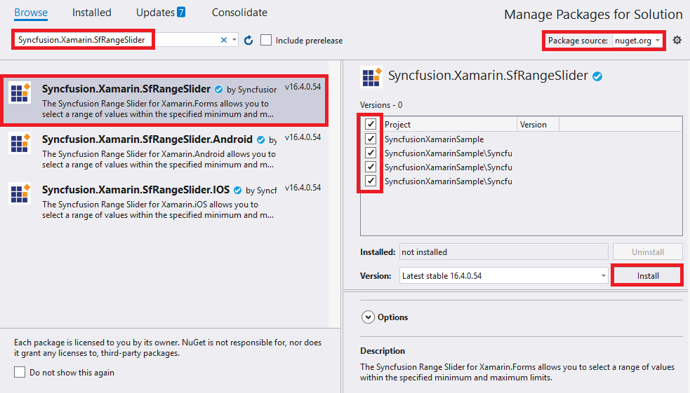

# Getting Started

This section explains you the steps to configure a SfRangeSlider control in a real-time scenario and also provides a walk-through on some of the customization features available in SfRangeSlider control.

## Adding SfRangeSlider reference

You can add SfRangeSlider reference using one of the following methods:

**Method 1: Adding SfRangeSlider reference from nuget.org**

Syncfusion Xamarin components are available in [nuget.org](https://www.nuget.org/). To add SfRangeSlider to your project, open the NuGet package manager in Visual Studio, search for [Syncfusion.Xamarin.SfRangeSlider](https://www.nuget.org/packages/Syncfusion.Xamarin.SfRangeSlider), and then install it.

N> Install the same version of SfRangeSlider NuGet in all the projects.

**Method 2: Adding SfRangeSlider reference from toolbox**

Syncfusion also provides Xamarin Toolbox. Using this toolbox, you can drag the SfRangeSlider control to the XAML page. It will automatically install the required NuGet packages and add the namespace to the page. To install Syncfusion Xamarin Toolbox, refer to [Toolbox](https://help.syncfusion.com/xamarin/utility#toolbox).

**Method 3: Adding SfRangeSlider assemblies manually from the installed location**

If you prefer to manually reference the assemblies instead referencing from NuGet, add the following assemblies in respective projects.

Location: {Installed location}/{version}/Xamarin/lib

<table>
<tr>
<td>PCL</td>
<td>Syncfusion.SfRangeSlider.XForms.dll Syncfusion.Core.XForms.dll Syncfusion.Licensing.dll </td>
</tr>
<tr>
<td>Android</td>
<td>Syncfusion.SfRangeSlider.Android.dll Syncfusion.SfRangeSlider.XForms.Android.dll Syncfusion.SfRangeSlider.XForms.dll Syncfusion.Core.XForms.dll Syncfusion.Core.XForms.Android.dll Syncfusion.Licensing.dll </td>
</tr>
<tr>
<td>iOS</td>
<td>Syncfusion.SfRangeSlider.iOS.dll Syncfusion.SfRangeSlider.XForms.iOS.dll Syncfusion.SfRangeSlider.XForms.dll Syncfusion.Core.XForms.dll Syncfusion.Core.XForms.iOS.dll Syncfusion.Licensing.dll </td>
</tr>
<tr>
<td>UWP</td>
<td>Syncfusion.SfInput.UWP.dll Syncfusion.SfShared.UWP.dll Syncfusion.SfRangeSlider.XForms.UWP.dll Syncfusion.SfRangeSlider.XForms.dll Syncfusion.Core.XForms.dll Syncfusion.Core.XForms.UWP.dll Syncfusion.Licensing.dll </td>
</tr>
</table>

N> To know more about obtaining our components, refer to these links for [Mac](https://help.syncfusion.com/xamarin/introduction/download-and-installation/mac/) and [Windows](https://help.syncfusion.com/xamarin/introduction/download-and-installation/windows/).

I> Starting with v16.2.0.x, if you reference Syncfusion assemblies from the trial setup or from the NuGet feed, you also have to include a license key in your projects. Please refer to [Syncfusion license key](https://help.syncfusion.com/common/essential-studio/licensing/license-key/) to know about registering Syncfusion license key in your Xamarin application to use our components.

N> Currently an additional step is required for iOS project. You need to create an instance of RangeSlider custom renderer. If you are adding the references from toolbox, this step is not needed.

Create an instance of SfRangeSliderRenderer in the FinishedLaunching overridden method of AppDelegate class in the iOS Project as shown below.





public override bool FinishedLaunching(UIApplication app, NSDictionary options)
{
    new SfRangeSliderRenderer ();
}	
 



## Additional step for UWP 

This step is required only if the application is deployed in release mode with .NET native tool chain enabled. It is needed for resolving the known Framework issue “Custom controls not rendering in Release mode” in UWP platform. Initializing the `SfRangeSlider` assembly at the `OnLaunched` overridden method of the `App` class in UWP project is the suggested workaround. The following code example demonstrates how to initialize the `SfRangeSlider` assembly.





// In App.xaml.cs

protected override void OnLaunched(LaunchActivatedEventArgs e)
{
	…

	rootFrame.NavigationFailed += OnNavigationFailed;
		
	// you'll need to add `using System.Reflection;`
	List<Assembly> assembliesToInclude = new List<Assembly>();

	//Now, add all the assemblies your app uses
	assembliesToInclude.Add(typeof(SfRangeSliderRenderer).GetTypeInfo().Assembly);

	// replaces Xamarin.Forms.Forms.Init(e);        
	Xamarin.Forms.Forms.Init(e, assembliesToInclude);
	…     
}




* Adding namespace for the added assemblies. 





	<xmlns:range="clr-namespace:Syncfusion.SfRangeSlider.XForms;assembly=Syncfusion.SfRangeSlider.XForms"/>
	




	using Syncfusion.SfRangeSlider.XForms;





* Now instantiate and add the SfRangeSlider control with a required optimal name.





	<range:SfRangeSlider x:Name="rangeSlider"/>
	




	SfRangeSlider rangeSlider=new SfRangeSlider();
	this.Content = rangeSlider;
	




## Set Range

SfRangeSlider provides option to set single thumb and double thumb. While setting the double thumb, each thumb value can be set using `RangeStart` and `RangeEnd` properties.

N> The `ShowRange` property is used to switch between a single thumb and double thumb. 





	<range:SfRangeSlider x:Name="rangeslider" RangeEnd="20" RangeStart="4"  ShowRange="true"/>
	




SfRangeSlider rangeSlider=new SfRangeSlider();
	rangeSlider.RangeEnd=20; 
	rangeSlider.RangeStart=4;
	rangeSlider.ShowRange=true; 
	this.Content = rangeSlider;





## Restricting Values

SfRangeSlider provides option to restrict slider range between minimum and maximum values. Following code explains how to set the range using `Minimum` and `Maximum` properties in the SfRangeSlider.





	<range:SfRangeSlider x:Name="rangeslider" Minimum="0" Maximum="24"/>
	




SfRangeSlider rangeSlider=new SfRangeSlider();
	rangeSlider.RangeEnd=20; 
	rangeSlider.RangeStart=4;
	rangeSlider.ShowRange=true; 
	rangeSlider.Minimum=0; 
	rangeSlider.Maximum=24; 
	this.Content = rangeSlider;




## Adding Snapping Mode

The movement of the thumb can be varied in different ways. This is achieved by setting the `SnapsTo` property.





	<range:SfRangeSlider x:Name="rangeslider" SnapsTo="Ticks" StepFrequency="6"/>
	




SfRangeSlider rangeSlider=new SfRangeSlider();
	rangeSlider.RangeEnd=20; 
	rangeSlider.RangeStart=4;
	rangeSlider.ShowRange=true; 
	rangeSlider.Minimum=0; 
	rangeSlider.Maximum=24; 
	rangeSlider.SnapsTo=SnapsTo.Ticks; 
	rangeSlider.StepFrequency=6;
	this.Content = rangeSlider;



  
                                    
The complete Getting Started sample is available in [this](http://www.syncfusion.com/downloads/support/directtrac/general/ze/RangeSliderSample1051483242.zip) link.