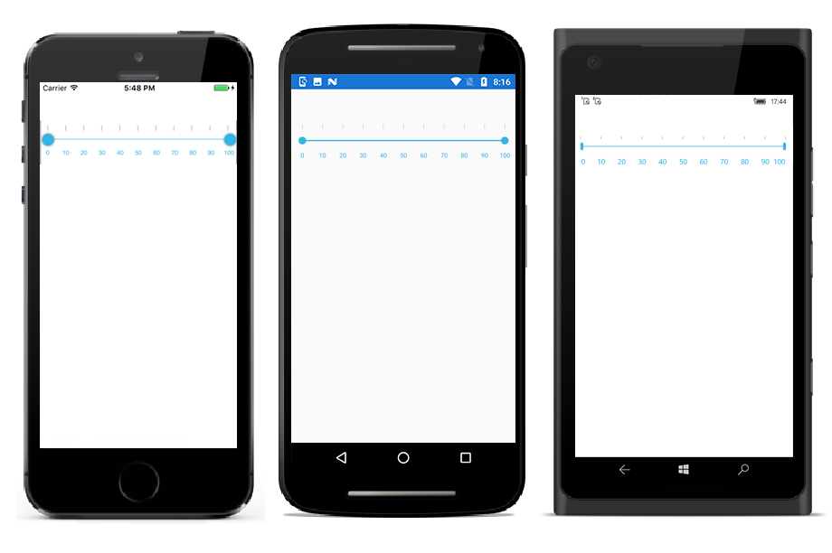

# Orientation

SfRangeSlider provides options to display values and slider either horizontally or vertically.

N> The default option is Vertical.

## Horizontal





<ContentPage xmlns="http://xamarin.com/schemas/2014/forms"
xmlns:x="http://schemas.microsoft.com/winfx/2009/xaml" 
xmlns:Range="clr-namespace:Syncfusion.SfRangeSlider.XForms;assembly=Syncfusion.SfRangeSlider.XForms"
xmlns:Local="clr-namespace:GettingStarted;assembly=GettingStarted"
x:Class="GettingStarted.RangeSliderSample">
	<ContentPage.Content>
		<Range:SfRangeSlider  Orientation="Horizontal"/>
	</Range:SfRangeSlider>
	</ContentPage.Content>
</ContentPage>





using System.Collections.ObjectModel;
using Syncfusion.XForms.SfRangeSlider;
using Xamarin.Forms;
namespace GettingStarted
{
	/// 

    /// Range slider sample.
    /// 

    public partial class RangeSliderSample : ContentPage
    {
        public RangeSliderSample()
        {
            InitializeComponent();
			SfRangeSlider rangeSlider = new SfRangeSlider();
			rangeSlider.Orientation=Orientation.Horizontal;
            this.Content = rangeSlider;
        }
    }
}	





## Vertical





<ContentPage xmlns="http://xamarin.com/schemas/2014/forms"
xmlns:x="http://schemas.microsoft.com/winfx/2009/xaml" 
xmlns:Range="clr-namespace:Syncfusion.SfRangeSlider.XForms;assembly=Syncfusion.SfRangeSlider.XForms"
xmlns:Local="clr-namespace:GettingStarted;assembly=GettingStarted"
x:Class="GettingStarted.RangeSliderSample">
	<ContentPage.Content>
		<Range:SfRangeSlider  Orientation="Vertical"/>
	</Range:SfRangeSlider>
	</ContentPage.Content>
</ContentPage>





using System.Collections.ObjectModel;
using Syncfusion.XForms.SfRangeSlider;
using Xamarin.Forms;
namespace GettingStarted
{
	/// 

    /// Range slider sample.
    /// 

    public partial class RangeSliderSample : ContentPage
    {
        public RangeSliderSample()
        {
            InitializeComponent();
			SfRangeSlider rangeSlider = new SfRangeSlider();
			rangeSlider.Orientation=Orientation.Vertical;
            this.Content = rangeSlider;
        }
    }
}	





